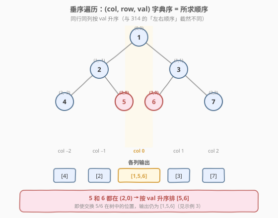
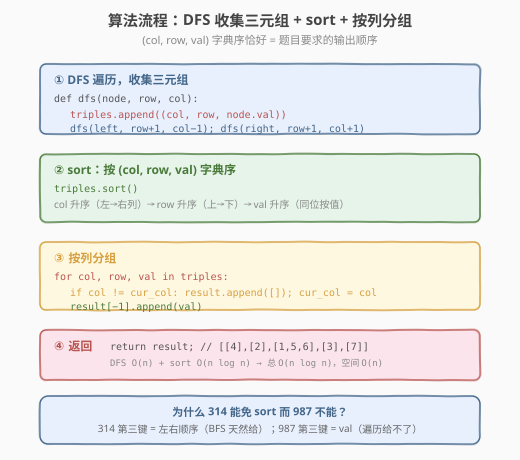
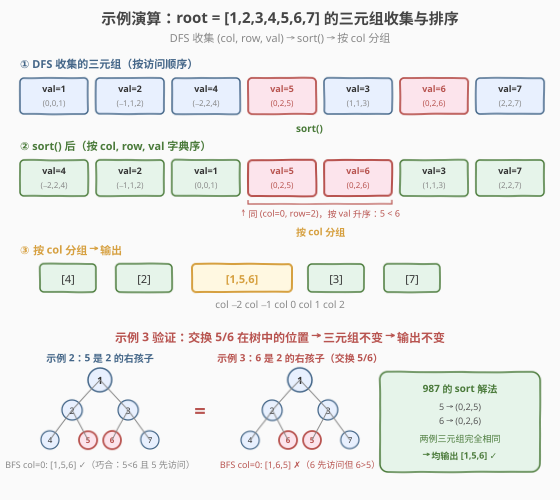

# LeetCode 二叉树的垂序遍历 题解

## 1. 题目概述

- **标题 / 题号**：二叉树的垂序遍历（#987，hard）
- **链接**：https://leetcode.cn/problems/vertical-order-traversal-of-a-binary-tree/
- **难度**：困难
- **标签**：树、二叉树、深度优先搜索（DFS）、哈希表、排序

**题意**：给定二叉树的根节点 `root`，返回其节点值的**垂序遍历**序列。

把根节点视作坐标 `(row=0, col=0)`，对每个节点 `node`：
- 左孩子位于 `(row + 1, col - 1)`
- 右孩子位于 `(row + 1, col + 1)`

垂序遍历从**最左列到最右列**逐列输出；同一列内按 **`row` 从小到大**（上→下）排列；若多个节点处于**同一行同一列**，则按**节点值从小到大**排列。

**示例 1**：

```text
输入：root = [3,9,20,null,null,15,7]
        3
       / \
      9  20
         / \
        15  7
输出：[[9],[3,15],[20],[7]]
解释：列 −1=[9]，列 0=[3,15]（3 在上、15 在下），列 1=[20]，列 2=[7]
```

**示例 2**：

```text
输入：root = [1,2,3,4,5,6,7]
        1
       / \
      2   3
     / \ / \
    4  5 6  7
输出：[[4],[2],[1,5,6],[3],[7]]
解释：列 0 中，1 在 (0,0) 最上；5 和 6 都在 (2,0)，按值升序 → [1,5,6]
```

**示例 3**：

```text
输入：root = [1,2,3,4,6,5,7]
        1
       / \
      2   3
     / \ / \
    4  6 5  7
输出：[[4],[2],[1,5,6],[3],[7]]
解释：与示例 2 仅交换了 5/6 在树中的位置，但二者仍在同一 (2,0)，
      按值排序仍为 [5,6]，输出不变
```

**约束**：

- 树中节点数目在范围 `[1, 1000]` 内
- `0 <= Node.val <= 1000`

> 💡 本题与 [314. 二叉树的垂直序遍历](../0301-0400/314_二叉树的垂直序遍历.md) 题面几乎一致，唯一差异在「同行同列时如何排」：314 按**左右顺序**（BFS 天然满足，$O(n)$ 免 sort）；987 按**节点值升序**（必须显式 sort，$O(n \log n)$）。示例 3 是区分二者的「试金石」——交换 5/6 位置后 BFS 会给出不同结果，但 987 的答案不变。

## 2. 解题思路

### 2.1 暴力思路：照搬 314 的 BFS 分桶

最直觉的「借鉴」是直接套用 [314](../0301-0400/314_二叉树的垂直序遍历.md) 的 BFS + 列号分桶：把 `(node, col)` 一起入队，按 BFS 顺序把 `val` 追加到 `col_to_nodes[col]`，最后按列号输出。

这个做法在示例 1、2 上**恰好通过**：

- 示例 1 没有同行同列的节点，BFS 顺序天然正确。
- 示例 2 中 5 和 6 都在 `(2,0)`，BFS 先访问 5（2 的右孩子）再访问 6（3 的左孩子），恰好 `5 < 6`，巧合正确。

但**示例 3 立即露馅**：交换 5/6 位置后，BFS 先访问 6（2 的右孩子）再访问 5（3 的左孩子），桶内得到 `[1, 6, 5]`——而期望输出是 `[1, 5, 6]`。

> ⚠️ **BFS 的左右顺序与节点值大小无关**。314 的排序第三键是「左右顺序」，BFS 天然满足；987 的排序第三键是 `val`，BFS 给不了。照搬 314 的 BFS 在 987 上是**系统性错误**，不是偶发 bug——只要同行同列的两个节点值大小与 BFS 访问顺序不一致就会出错。

### 2.2 核心观察：(col, row, val) 三元组字典序 = 所求顺序



把题目对排序的三级要求与三元组 `(col, row, val)` 的字典序逐级对齐：

| 排序级别 | 题目要求 | 三元组分量 | 字典序对应 |
|----------|----------|-----------|-----------|
| 第一级 | 列号 `col` 升序（左→右） | `col` | 元组第一位 |
| 第二级 | 行号 `row` 升序（上→下） | `row` | 元组第二位 |
| 第三级 | 节点值 `val` 升序（同位按值） | `val` | 元组第三位 |

**关键洞察**：三级排序要求恰好与 `(col, row, val)` 元组的**字典序**完全一致。因此只需一次 DFS 收集所有节点的 `(col, row, val)` 三元组，调用一次 `sort()`——Python 元组比较和 C++ `tuple` 比较都按字典序进行——然后按 `col` 分组输出即可。

> 💡 **为什么不能把 `val` 放到元组第二位**（即 `(col, val, row)`）？因为题目要求「先按 `row` 再按 `val`」——同一列中，上面的节点（`row` 小）必须排在前面，**即使它的值更大**。例如示例 2 列 0 中，`1` 在 `(0,0)` 排在 `5` 和 `6`（`(2,0)`）前面，尽管 `1 < 5 < 6` 恰好也成立——但如果根节点值是 `9` 而非 `1`，`9` 仍应排在 `5`、`6` 前面（因为 `row=0 < row=2`）。`row` 必须优先于 `val`。

### 2.3 算法流程图



主流程分四步：

1. **DFS 收集**：遍历整棵树，对每个节点记录三元组 `(col, row, val)`。DFS 或 BFS 均可——收集阶段不关心顺序，顺序由后续 sort 保证。
2. **排序**：对三元组数组调用 `sort()`，按 `(col, row, val)` 字典序排列。
3. **按列分组**：遍历排序后的数组，`col` 变化时新建一组，把 `val` 追加到当前组。
4. **返回**：分组结果即为垂序遍历序列。

> 💡 DFS 比 BFS 更常用，因为 DFS 递归写法更简洁（无需队列 + `(node, row, col)` 三元组入队）。但二者复杂度相同，面试中用哪种都行。

### 2.4 示例演算

以示例 2 `root = [1,2,3,4,5,6,7]` 为例：



**第一步：DFS 收集三元组**（按 DFS 访问顺序）：

| DFS 序 | 节点 | col | row | val | 三元组 |
|--------|------|-----|-----|-----|--------|
| 1 | 1 | 0 | 0 | 1 | `(0, 0, 1)` |
| 2 | 2 | −1 | 1 | 2 | `(−1, 1, 2)` |
| 3 | 4 | −2 | 2 | 4 | `(−2, 2, 4)` |
| 4 | 5 | 0 | 2 | 5 | `(0, 2, 5)` |
| 5 | 3 | 1 | 1 | 3 | `(1, 1, 3)` |
| 6 | 6 | 0 | 2 | 6 | `(0, 2, 6)` |
| 7 | 7 | 2 | 2 | 7 | `(2, 2, 7)` |

**第二步：`sort()` 后**（按 `(col, row, val)` 字典序）：

| 序 | 三元组 | 说明 |
|----|--------|------|
| 1 | `(−2, 2, 4)` | col=−2 最左 |
| 2 | `(−1, 1, 2)` | col=−1 |
| 3 | `(0, 0, 1)` | col=0, row=0 最上 |
| 4 | `(0, 2, 5)` | col=0, row=2, val=5 |
| 5 | `(0, 2, 6)` | col=0, row=2, val=6（同位按值升序） |
| 6 | `(1, 1, 3)` | col=1 |
| 7 | `(2, 2, 7)` | col=2 最右 |

**第三步：按 `col` 分组**：

| col | 值 | 分组结果 |
|-----|----|---------|
| −2 | 4 | `[4]` |
| −1 | 2 | `[2]` |
| 0 | 1, 5, 6 | `[1, 5, 6]` |
| 1 | 3 | `[3]` |
| 2 | 7 | `[7]` |

输出 `[[4],[2],[1,5,6],[3],[7]]` $\checkmark$

> 💡 **示例 3 的不变性**：交换 5/6 在树中的位置后，DFS 收集的三元组**完全相同**——因为 `(col, row, val)` 只依赖坐标和值，与树中的左右位置无关。5 仍是 `(0, 2, 5)`，6 仍是 `(0, 2, 6)`，sort 后顺序不变，输出仍为 `[[4],[2],[1,5,6],[3],[7]]`。这正是 987 与 314 的本质区别：314 的排序键包含「左右顺序」（与树位置有关），987 的排序键只有 `(col, row, val)`（与树位置无关）。

## 3. 参考代码

### C++

```cpp
// 二叉树的垂序遍历.cpp —— DFS 收集三元组 + sort + 按列分组
// 编译: g++ -O2 -std=c++17 二叉树的垂序遍历.cpp -o vtrav
#include <vector>
#include <tuple>
#include <algorithm>
using namespace std;

struct TreeNode {
    int val;
    TreeNode* left;
    TreeNode* right;
    TreeNode() : val(0), left(nullptr), right(nullptr) {}
    TreeNode(int x) : val(x), left(nullptr), right(nullptr) {}
    TreeNode(int x, TreeNode* l, TreeNode* r) : val(x, left(l), right(r) {}
};

class Solution {
    vector<tuple<int, int, int>> triples;           // (col, row, val)

    void dfs(TreeNode* node, int row, int col) {
        if (!node) return;
        triples.emplace_back(col, row, node->val);
        dfs(node->left,  row + 1, col - 1);
        dfs(node->right, row + 1, col + 1);
    }
  public:
    vector<vector<int>> verticalTraversal(TreeNode* root) {
        triples.clear();
        dfs(root, 0, 0);
        sort(triples.begin(), triples.end());        // (col, row, val) 字典序

        vector<vector<int>> result;
        result.push_back({});
        int cur_col = get<0>(triples[0]);
        for (auto& [col, row, val] : triples) {
            if (col != cur_col) {
                result.push_back({});
                cur_col = col;
            }
            result.back().push_back(val);
        }
        return result;
    }
};
```

### Python

```python
class Solution:
    def verticalTraversal(self, root: TreeNode | None) -> list[list[int]]:
        triples: list[tuple[int, int, int]] = []    # (col, row, val)

        def dfs(node: TreeNode | None, row: int, col: int) -> None:
            if not node:
                return
            triples.append((col, row, node.val))
            dfs(node.left,  row + 1, col - 1)
            dfs(node.right, row + 1, col + 1)

        dfs(root, 0, 0)
        triples.sort()                              # (col, row, val) 字典序

        result: list[list[int]] = []
        cur_col = None
        for col, row, val in triples:
            if col != cur_col:
                result.append([])
                cur_col = col
            result[-1].append(val)
        return result
```

> 💡 两种写法几乎一一对应。Python 元组原生支持字典序比较，`triples.sort()` 直接按 `(col, row, val)` 排序；C++ 的 `std::tuple` 同理，`std::sort` 默认按字典序。分组逻辑：`col` 变化时新建一组，否则追加到当前组——因为排序后相同 `col` 的节点已连续排列。题目保证至少 1 个节点，所以 `triples[0]` 不会越界。

## 4. 复杂度分析

| 维度 | 复杂度 | 说明 |
|------|--------|------|
| **时间复杂度** | $O(n \log n)$ | DFS 遍历 $O(n)$；排序主导 $O(n \log n)$；分组遍历 $O(n)$。总计 $O(n \log n)$ |
| **空间复杂度** | $O(n)$ | 三元组数组 $n$ 个元素；递归栈最坏 $O(h)$（链状树 $h=n$，平衡树 $h=\log n$）；结果数组 $n$ 个值 |

> ⚠️ 与 314 的对比：314 利用 BFS 天然顺序免去排序，时间 $O(n)$；987 因第三排序键是 `val`（与遍历顺序无关），无法免排序，必须 $O(n \log n)$。这是「排序约束能否被遍历顺序天然满足」的分水岭。

## 5. 扩展：与 314 的对比与「何时能免 sort」

314 与 987 题面几乎一致，唯一差异是「同行同列时如何排」：

| 题目 | 同行同列排序依据 | 是否可用 BFS 免 sort | 推荐解法 | 时间 |
|------|------------------|----------------------|----------|------|
| **314** | **左右顺序**（左先于右） | ✅ BFS 天然满足 | BFS + 列号分桶 | $O(n)$ |
| **987** | **节点值升序** | ❌ BFS 左右与 `val` 无关 | DFS 收集 `(col, row, val)` + sort | $O(n \log n)$ |

**判据**：排序键里是否包含「遍历顺序能天然给出的量」之外的维度？

- 314 的排序键是 `(col, row, 左右顺序)`——三者都能被 BFS 的「层 + 入队次序」表达，所以免 sort。
- 987 的排序键是 `(col, row, val)`——`val` 与遍历顺序无关，必须 sort。

> 💡 这一判据同样适用于其他「按某种坐标遍历」的题。面试中被问到 314 vs 987 的区别时，能说出这句判据即表明你理解了本质，而非死记了两套模板。

## 6. 面试要点

1. **987 和 314 的核心区别是什么？**

   - 314 要求「同行同列按**左右顺序**」，可被 BFS 天然满足（同层先左后右），$O(n)$ 免 sort。987 要求「按**节点值升序**」，BFS 的左右顺序与 `val` 大小无关，必须显式 sort，$O(n \log n)$。示例 3 是区分二者的试金石：交换 5/6 位置后 BFS 结果变化，但 987 结果不变。

2. **为什么用 `(col, row, val)` 而不是 `(col, val, row)` 作为排序键？**

   - 题目要求「同列内先按 `row`（上→下）再按 `val`（同位按值）」——`row` 优先级高于 `val`。若把 `val` 放第二位，同列中值大的上层节点会被排到值小的下层节点之后，违反「上→下」规则。

3. **DFS 和 BFS 在收集阶段有区别吗？**

   - 没有。收集阶段不关心顺序——所有顺序由后续 `sort()` 保证。DFS 递归写法更简洁（无需队列管理），BFS 需要把 `(node, row, col)` 三元组入队。两者复杂度相同，面试中任选其一即可。

4. **为什么不能用哈希表 `col → list` 直接分桶（像 314 那样）？**

   - 314 分桶时按 BFS 顺序追加，桶内顺序天然正确。987 若直接分桶，同桶内需要按 `(row, val)` 排序——等价于「先分桶再桶内 sort」，总复杂度仍 $O(n \log n)$，但代码比「全局 sort 一次 + 分组」更繁琐。全局 sort + 分组是更简洁的写法。

5. **如果树退化为链（全左子或全右子），复杂度会退化吗？**

   - 时间不变 $O(n \log n)$（排序主导）。空间上递归栈深 $O(n)$（链状树高度 $n$），三元组数组 $O(n)$，总计 $O(n)$。C++ 递归栈在 $n = 1000$ 时安全；Python 默认递归限制 1000，链状树恰好触及上限，可改用迭代 DFS 或提高 `sys.setrecursionlimit` 规避。

> 💡 **一句话总结**：987 的灵魂是「**(col, row, val) 字典序 = 所求顺序**」——DFS 收集三元组、一次 sort、按列分组，三步搞定。能想清楚「为什么 314 免 sort 而 987 不能」，这道题就吃透了。

## 同类练习题

| # | 题目 | 与本题的关联 |
|---|------|-------------|
| 314 | [二叉树的垂直序遍历](https://leetcode.cn/problems/binary-tree-vertical-order-traversal/)（[题解](../0301-0400/314_二叉树的垂直序遍历.md)） | 题面几乎一致，但同行同列按左右顺序，BFS 天然满足免 sort；对比理解「何时能免 sort」 |
| 102 | [二叉树的层序遍历](https://leetcode.cn/problems/binary-tree-level-order-traversal/)（[题解](../0101-0200/102_二叉树的层序遍历.md)） | BFS 层序模板母题，314 在其骨架上多记一个 `col`，987 则用 DFS + sort |
| 103 | [二叉树的锯齿形层序遍历](https://leetcode.cn/problems/binary-tree-zigzag-level-order-traversal/)（[题解](../0101-0200/103_二叉树的锯齿形层序遍历.md)） | BFS 模板的另一变体，对比「方向标志」与「坐标排序」两种对遍历的扩展 |
| 662 | [二叉树最大宽度](https://leetcode.cn/problems/maximum-width-of-binary-tree/)（[题解](../0601-0700/662_二叉树最大宽度.md)） | 同样给每个节点编号（`col`），BFS 逐层算首尾编号差，与本题共用「节点带坐标」的思路 |
| 199 | [二叉树的右视图](https://leetcode.cn/problems/binary-tree-right-side-view/) | BFS 每层只取最右节点，仍是同一骨架的「按层筛选」变体 |
