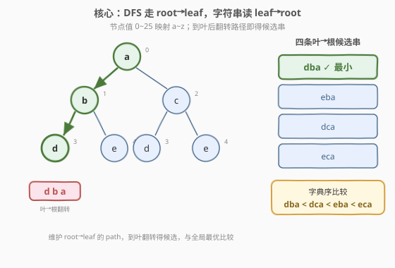
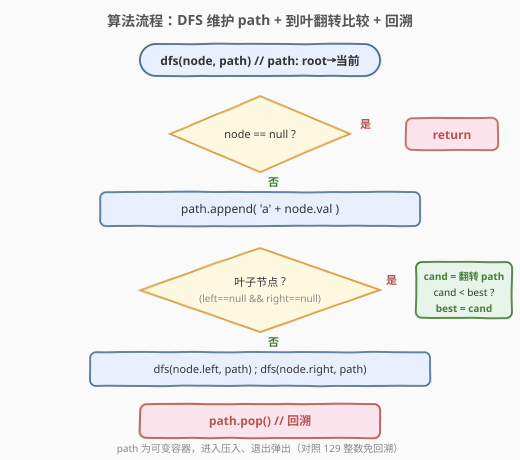
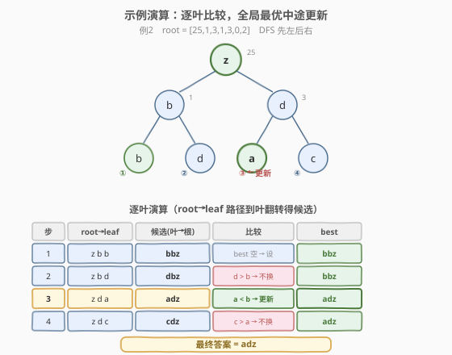

# 从叶结点开始的最小字符串

- **题目名称**：从叶结点开始的最小字符串
- **链接**：[988. 从叶结点开始的最小字符串](https://leetcode.cn/problems/smallest-string-starting-from-leaf/)
- **难度**：中等
- **标签**：树、深度优先搜索、二叉树、字符串

## 1. 题目概述

给定一棵二叉树的根节点 `root`，树上每个节点存一个 `0`~`25` 的整数，分别对应小写字母 `'a'`~`'z'`（`0` → `'a'`，`25` → `'z'`）。一条「从根节点到叶子节点」的路径上，**按从叶到根的顺序**把各节点对应的字母拼成一个字符串。求所有根到叶路径产生的字符串中**字典序最小**的那一个。

> 💡 **叶子节点**：没有左右孩子的节点。注意字符串方向是**叶→根**（与 DFS 自顶向下的行进方向相反），这是本题的关键陷阱。

**示例 1**：

```text
输入：root = [0,1,2,3,4,3,4]
输出："dba"
解释：四条叶→根字符串：
  d→b→a = "dba"   e→b→a = "eba"   d→c→a = "dca"   e→c→a = "eca"
  字典序最小为 "dba"。

        0(a)
       /     \
     1(b)    2(c)
    /   \    /   \
  3(d) 4(e) 3(d) 4(e)
```

**示例 2**：

```text
输入：root = [25,1,3,1,3,0,2]
输出："adz"
解释：四条叶→根字符串：
  b→b→z = "bbz"   d→b→z = "dbz"   a→d→z = "adz"   c→d→z = "cdz"
  字典序最小为 "adz"。

        25(z)
       /      \
     1(b)    3(d)
    /   \    /   \
  1(b) 3(d) 0(a) 2(c)
```

**示例 3**：

```text
输入：root = [2,2,1,null,1,0,null,0]
输出："abc"
解释：两条叶→根字符串：
  a→b→c = "abc"   a→b→c→c = "abcc"
  "abc" 是 "abcc" 的前缀，前缀更短 → 字典序更小，答案 "abc"。

        2(c)
       /     \
     2(c)    1(b)
       \     /
       1(b) 0(a)
       /
      0(a)
```

**约束条件**：

- 树中节点数目在范围 `[1, 8500]` 内
- `0 <= Node.val <= 25`
- 树的深度不超过 `100`

> 💡 本题是 [129. 求根节点到叶节点数字之和](../0101-0200/129_求根节点到叶节点数字之和.md) 的「字符串版」变体：129 把根到叶路径按位拼数再求和，988 把叶到根路径拼成字符串再取最小。二者共享「DFS 前缀累积」骨架，区别只在「累积运算」从 `cur × 10 + val`（末尾追加）换成 `char + s`（**串首追加**，天然得叶→根序），以及「汇总方式」从 `+` 求和换成「字典序取最小」。

---

## 2. 解题思路

### 2.1 暴力思路

枚举每一条「根到叶」路径，把路径上节点值按**叶→根**顺序拼成字符串，最后在所有字符串里取字典序最小。问题归结为两点：

1. **方向翻转**：DFS 自顶向下走的是 root→leaf，但字符串要 leaf→root；
2. **维护「当前已拼出的字符串」**，避免每条路径都从头拼接。

### 2.2 核心观察：前缀累积 —— 往串首追加，天然得叶→根序



关键观察是**字符串拼接的方向选择**。DFS 自顶向下访问节点（root→leaf），若每次把当前节点的字母**追加到末尾**，则到叶时得到的是 root→leaf 序，还需翻转才得候选；但若每次把当前字母**拼到串首**，则到叶时 `s` 天然就是 leaf→root 序——无需翻转。

具体地，递归函数 `dfs(node, s)` 中 `s` 表示「从当前节点到根的路径所对应的字符串」：

- 进入根节点时，`s` 从 `""` 开始，变为 `char('a' + root.val) + ""`；
- 每往子节点走一层，把子节点字母拼到 `s` **串首**：`s = char('a' + child.val) + s`；
- **走到叶子时**，`s` 就是这条叶→根路径的完整字符串，与全局最优 `best` 比较取小。

> 💡 **为什么不需要回溯？** 因为 `s` 是**按值传递**的不可变字符串（C++ 的 `string` 按值传参会拷贝、Python 的 `str` 本身不可变）。每次递归调用 `dfs(child, char + s)` 时，新调用拿到的是一份**新字符串**，调用返回后当前层的 `s` 不受影响——天然就是「向下传副本」，省去了手动「撤销选择」的步骤。这与 [129](../0101-0200/129_求根节点到叶节点数字之和.md) 的整数 `cur` 按值传递免回溯完全同构。

> ⚠️ **方向陷阱**：若误把字母追加到末尾（`s = s + char`），到叶时得到 root→leaf 序，还需额外翻转一次。虽然结果正确，但多一步操作且偏离「前缀累积」的优雅骨架。本题的「反直觉」之处正是字符串方向与 DFS 行进方向相反——用「串首追加」一步到位化解。

### 2.3 算法流程图



**DFS 递归逻辑**：

| 情况 | 处理 |
|------|------|
| `node == null` | 直接返回（空子树不贡献字符串） |
| 先累积前缀 | `s = char('a' + node.val) + s`（串首追加，得 leaf→root 序） |
| 叶子（左右都空） | 若 `best` 为空或 `s < best`，则 `best = s`；返回 |
| 否则（内部节点） | `dfs(left, s)`；`dfs(right, s)`（两分支都走，不能短路） |

> ⚠️ **必须判叶子**：比较只能发生在**叶子节点**。若在内部节点就比较，会把「未走到叶的半截路径」也计入——例如根 `a` 有孩子 `b`，若根处就用 `"a"` 去更新 `best`，则引入了不合法的候选。判叶子即 `node.left == null && node.right == null`。

> 💡 **取最小 vs 求和**：和 [129](../0101-0200/129_求根节点到叶节点数字之和.md) 的 `+` 求和不同，本题是**取最小**——每条到叶路径都要比较，但只保留最小的那个。递归式是「两分支都走 + 叶子处更新全局 `best`」，而非把返回值相加。这是「最值优化问题」需全搜、不能短路的体现。

### 2.4 示例演算

以示例 2（`root = [25,1,3,1,3,0,2]`）为例，DFS 先左后右遍历，逐叶比较：



| 步 | 到达叶子 | root→leaf | 候选(叶→根) | 比较 | best |
|----|----------|-----------|------------|------|------|
| 1 | b（左左） | z b b | `bbz` | best 空 → 设为 `bbz` | `bbz` |
| 2 | d（左右） | z b d | `dbz` | `d > b` → 不换 | `bbz` |
| 3 | a（右左） | z d a | `adz` | `a < b` → **更新** | `adz` |
| 4 | c（右右） | z d c | `cdz` | `c > a` → 不换 | `adz` |

四条路径走完后，最小字符串为 `"adz"`。

> 💡 注意第 3 步：前两步的最优是 `bbz`（首字母 `b`），第 3 步的候选 `adz` 首字母 `a < b`，直接更新。这说明**不能只取第一条路径**，也不能根据首字母提前剪枝——后续路径随时可能更小。必须遍历**全部叶子**逐一比较。

> 💡 **前缀更短则更小**（示例 3）：若一个字符串是另一个的前缀（如 `"abc"` vs `"abcc"`），标准字典序规定**更短的前缀更小**。C++ `std::string::operator<` 与 Python `str < str` 都遵循此规则，无需特殊处理。

---

## 3. 参考代码

### C++

```cpp
// 从叶结点开始的最小字符串.cpp —— DFS 前缀累积（串首追加）+ 叶子取最小
// 编译: g++ -O2 -std=c++17 从叶结点开始的最小字符串.cpp -o smallest
#include <string>
using namespace std;

struct TreeNode {
    int val;
    TreeNode* left;
    TreeNode* right;
    TreeNode() : val(0), left(nullptr), right(nullptr) {
    }
    TreeNode(int x) : val(x), left(nullptr), right(nullptr) {
    }
    TreeNode(int x, TreeNode* l, TreeNode* r) : val(x), left(l), right(r) {
    }
};

class Solution {
    string best;
    void dfs(TreeNode* node, string s) {                // s 按值传递：天然免回溯
        if (node == nullptr) return;
        s = char('a' + node->val) + s;                   // 串首追加 → leaf→root 序
        if (node->left == nullptr && node->right == nullptr) {  // 叶子：比较取小
            if (best.empty() || s < best) best = s;
            return;
        }
        dfs(node->left, s);                              // 两分支都走，不能短路
        dfs(node->right, s);
    }
  public:
    string smallestFromLeaf(TreeNode* root) {
        best.clear();
        dfs(root, "");
        return best;
    }
};
```

### Python

```python
from typing import Optional


class Solution:
    def smallestFromLeaf(self, root: Optional[TreeNode]) -> str:
        best = None

        def dfs(node: Optional[TreeNode], s: str) -> None:       # str 不可变：天然免回溯
            if node is None:
                return
            s = chr(ord('a') + node.val) + s                     # 串首追加 → leaf→root 序
            if node.left is None and node.right is None:         # 叶子：比较取小
                nonlocal best
                if best is None or s < best:
                    best = s
                return
            dfs(node.left, s)                                    # 两分支都走，不能短路
            dfs(node.right, s)

        dfs(root, "")
        return best
```

> 💡 **串首追加的开销**：`s = char + s`（C++）或 `s = chr(...) + s`（Python）每次创建新字符串，单次 $O(|s|)$。整树 $n$ 个节点各做一次，总时间 $O(n \cdot h)$，其中 $h$ 为树高。本题 $n \le 8500$、$h \le 100$，总量 $\le 8.5 \times 10^5$，完全可接受。若追求极致常数，可用第 5 节的 path 列表 + 翻转写法。

---

## 4. 复杂度分析

| 维度 | 复杂度 | 说明 |
|------|--------|------|
| **时间复杂度** | $O(n \cdot h)$ | 每个节点做一次 $O(|s|) = O(h)$ 的字符串构造（串首追加）；$n$ 个节点总计 $O(n \cdot h)$。叶子处比较 `s < best` 也是 $O(h)$。本题 $h \le 100$，总量很小 |
| **空间复杂度** | $O(h)$ | 递归调用栈深度 = 树高 $h$；每层持有一个长度 $O(h)$ 的字符串副本。平衡树 $h = O(\log n)$；链状树 $h = O(n)$，但本题保证 $h \le 100$ |

> ⚠️ **不要写成 $O(n)$**。虽然每个节点只访问一次，但「串首追加」这一步本身是 $O(|s|)$ 而非 $O(1)$（不同于 [129](../0101-0200/129_求根节点到叶节点数字之和.md) 的整数乘加 `cur × 10 + val` 是 $O(1)$）。严格上界是 $O(n \cdot h)$。若用 path 列表 + `append`/`pop`（$O(1)$ 摊还）维护路径、仅在叶子处翻转比较，可把均摊时间降到 $O(n + L \cdot h)$（$L$ 为叶子数），但常数差异在本题规模下可忽略。

---

## 5. 扩展：path 列表 + 翻转 + 回溯

串首追加写法虽然简洁，但每步创建新字符串有 $O(h)$ 拷贝。若追求更优常数，可改用**共享 path 列表 + 回溯**——与 [257. 二叉树的所有路径](../0201-0300/257_二叉树的所有路径.md)、[113. 路径总和 II](../0101-0200/113_路径总和II.md) 同一套回溯模板：

```python
class Solution:
    def smallestFromLeaf(self, root: Optional[TreeNode]) -> str:
        best = None
        path = []

        def dfs(node: Optional[TreeNode]) -> None:
            if node is None:
                return
            path.append(chr(ord('a') + node.val))          # 进入：压入（root→leaf 序）
            if node.left is None and node.right is None:    # 叶子：翻转 path 得 leaf→root
                nonlocal best
                cand = ''.join(reversed(path))
                if best is None or cand < best:
                    best = cand
            else:
                dfs(node.left)
                dfs(node.right)
            path.pop()                                      # 退出：弹出（回溯）

        dfs(root)
        return best
```

> 💡 **两种写法的对照**：
>
> | 维度 | 串首追加（主解） | path 列表 + 回溯（扩展） |
> |------|------------------|--------------------------|
> | 方向处理 | 拼到串首，天然 leaf→root | path 是 root→leaf，叶子处翻转 |
> | 回溯 | **不需要**（字符串不可变，按值传） | **需要**（`append`/`pop` 配对） |
> | 单步开销 | $O(h)$（创建新串） | $O(1)$（列表尾插/尾删） |
> | 平行题 | [129](../0101-0200/129_求根节点到叶节点数字之和.md)（整数免回溯） | [257](../0201-0300/257_二叉树的所有路径.md) / [113](../0101-0200/113_路径总和II.md)（列表回溯） |
>
> 面试中两种都能写、讲清 trade-off 即可。主解更贴合「前缀累积」骨架、代码更短；扩展版更通用（path 可复用于其他路径问题）。

---

## 6. 面试要点

1. **为什么用「串首追加」而不是「末尾追加 + 翻转」？**

   - 两者结果等价。串首追加 `s = char + s` 让字符串在累积过程中**天然保持 leaf→root 序**，到叶时无需翻转，代码最简。末尾追加则到叶时得 root→leaf 序，还需额外 `reverse` 一步。更重要的是，串首追加与 [129](https://leetcode.cn/problems/sum-root-to-leaf-numbers/) 的 `cur × 10 + val` 同属「前缀累积 + 不可变值免回溯」范式，思维连贯。

2. **为什么不需要回溯？和 113/257 有什么区别？**

   - `s` 是按值传递的不可变字符串（C++ `string` 按值传参会拷贝、Python `str` 不可变）。每次 `dfs(child, char + s)` 传的是新串，当前层的 `s` 不被子调用影响，调用返回后继续用原值处理另一个孩子——天然隔离。[113](https://leetcode.cn/problems/path-sum-ii/) / [257](https://leetcode.cn/problems/binary-tree-paths/) 维护的是**可变** `path` 列表，子调用会修改同一对象，必须 `append`/`pop` 配对回溯。这是「不可变值传参」与「可变容器 + 回溯」的本质分野。

3. **字典序比较时，长度不同怎么处理？**

   - 标准字典序规定：若字符串 A 是 B 的前缀，则 A < B（更短的前缀更小）。例如 `"abc" < "abcc"`。C++ `std::string::operator<` 与 Python `str < str` 都遵循此规则，直接用 `<` 即可，无需手动处理长度。这正是示例 3 的考点。

4. **能根据首字母提前剪枝吗？**

   - **不能**。即使当前 `best` 首字母很小（如 `'a'`），后续路径仍可能产生更短的串或更优的前缀（示例 3 中 `"abc"` 凭更短击败 `"abcc"`）。最坏情况下最优解出现在最后一条路径，必须遍历全部叶子。这是「最值优化」与「存在性判定」（如 [112](https://leetcode.cn/problems/path-sum/) 可短路）的区别。

5. **时间复杂度为什么是 $O(n \cdot h)$ 而不是 $O(n)$？**

   - 串首追加 `s = char + s` 需要把原串整体后移、拷贝，单次 $O(|s|) = O(h)$，而非 $O(1)$。[129](https://leetcode.cn/problems/sum-root-to-leaf-numbers/) 的整数乘加 `cur × 10 + val` 是 $O(1)$ 所以是 $O(n)$；本题字符串拷贝使上界升到 $O(n \cdot h)$。用 path 列表 + `append`/`pop`（$O(1)$ 摊还）可把路径维护降到 $O(n)$，但叶子处翻转 + 比较仍 $O(h)$，总计 $O(n + L \cdot h)$。

> 💡 **一句话总结**：988 是 [129](../0101-0200/129_求根节点到叶节点数字之和.md) 的字符串镜像——「`char + s` 串首累积 + 叶子取最小 + 不可变值免回溯」三件套。掌握「前缀累积」范式后，把累积运算从 `×10+val` 换成 `char+s`、把汇总从求和换成取最小，就是本题。

---

## 7. 同类练习题

- [129. 求根节点到叶节点数字之和](https://leetcode.cn/problems/sum-root-to-leaf-numbers/)（[题解](../0101-0200/129_求根节点到叶节点数字之和.md)）：根到叶路径按位拼数求和；988 把「拼数」换成「拼字符」、把「求和」换成「取最小」，共享前缀累积免回溯骨架
- [257. 二叉树的所有路径](https://leetcode.cn/problems/binary-tree-paths/)（[题解](../0201-0300/257_二叉树的所有路径.md)）：收集所有根到叶路径的字符串；988 的扩展版 path 列表 + 回溯即沿用此模板
- [113. 路径总和 II](https://leetcode.cn/problems/path-sum-ii/)（[题解](../0101-0200/113_路径总和II.md)）：收集满足条件的所有路径；可变 `path` 列表 + 手动回溯的母题，对照 988 主解的不可变字符串免回溯
- [112. 路径总和](https://leetcode.cn/problems/path-sum/)（[题解](../0101-0200/112_路径总和.md)）：路径判定问题，`||` 可短路；对比 988 的「取最小」需全搜不能短路，区分存在性判定与最值优化
