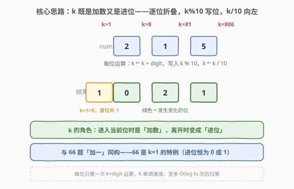
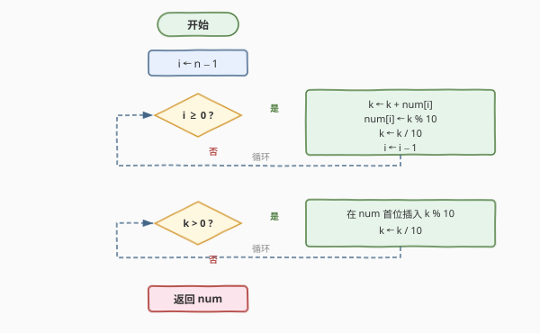

# LeetCode 数组形式的整数加法 题解

## 1. 题目概述

- **标题 / 题号**：数组形式的整数加法（#989，easy）
- **链接**：https://leetcode.cn/problems/add-to-array-form-of-integer/
- **难度**：简单
- **标签**：数组、数学、模拟

**题意**：非负整数 `X` 的**数组形式**（array-form）是将其各位数字按从左到右（高位到低位）顺序排列而成的数组。例如 `X = 1231`，其数组形式为 `[1,2,3,1]`。

给定一个非负整数 `num` 的数组形式和一个整数 `k`，返回 `num + k` 的**数组形式**。

**示例 1**：

```text
输入：num = [1,2,0,0], k = 34
输出：[1,2,3,4]
解释：num 表示 1200，1200 + 34 = 1234。
```

**示例 2**：

```text
输入：num = [2,7,4], k = 181
输出：[4,5,5]
解释：num 表示 274，274 + 181 = 455。
```

**示例 3**：

```text
输入：num = [2,1,5], k = 806
输出：[1,0,2,1]
解释：num 表示 215，215 + 806 = 1021。
```

**约束**：

- $1 \le \text{num.length} \le 10^4$
- $0 \le \text{num[i]} \le 9$
- `num` 不包含任何前导零（除了数字 `0` 本身）
- $1 \le k \le 10^4$

> 💡 `num` 的长度可达 $10^4$，意味着它表示的整数可达 $10^{10000}$，远超 64 位整型（约 20 位）能容纳的范围。因此**不能**把数组拼成整数再 `+k`——会溢出；必须像手算加法那样**逐位模拟**。但与 [415. 字符串相加](https://leetcode.cn/problems/add-strings/) 不同的是，这里的另一个加数 `k` 是一个普通 `int`（$\le 10^4$），完全放得进一个变量。这种「一个大数 + 一个小数」的不对称结构，让做法可以比双大数加法更简洁。

## 2. 解题思路

### 2.1 暴力思路：拼整数再相加

最直觉的做法是把 `num` 拼成整数 `X`，执行 `X + k`，再拆回数组。但当 `num` 长度达到 $10^4$ 时，`X` 高达 $10^{10000}$，任何内置整型都会**溢出**。即便用大整数库（Python 原生支持），也违背了「逐位模拟」的考察意图，且构造大整数对象本身就有开销。

因此必须回到**小学竖式加法**的思路：从最低位（数组末尾）起，把 `k` 加到当前位上，满十进一，逐位向左传播。

### 2.2 核心观察：k 既是加数又是进位



关键观察：由于 `k` 一开始就放在一个 `int` 变量里，它完全可以**同时扮演「加数」和「进位」两个角色**——不必像双大数加法那样分别维护两个指针和单独的 carry。

具体地，从数组末尾（最低位）向左扫描，每一位做三件事：

1. **把当前位折进 `k`**：`k += num[i]`。此刻 `k` 就是「需要加到这一位上的总量」（含来自低位的进位）。
2. **写位**：`num[i] = k % 10`，即总量的个位留在当前位。
3. **进位**：`k /= 10`，即总量的十位及以上成为新的 `k`，向更高位传递。

走完整个数组后，若 `k` 仍非零（说明和比原数多几位），就把 `k` 剩余的每一位**从低位到高位**依次**前插**到数组头部。

> 💡 **为什么这样做是对的？** 把 `num` 表示的整数记为 $N$。初始 `k` 就是要加的数。第一步 `k += num[i]` 后，`k` 等于「低位已处理完、本位及更高位的待加量」；`num[i] = k % 10` 把本位定下来，`k /= 10` 把待加量右移一位（等价于「进位向更高位走」）。循环结束时，原数组的每一位都被正确更新，而残留的 `k` 恰好是「溢出到原数最高位之外的部分」——逐位前插即得最终结果的更高位。

> ⚠️ **与 [66. 加一](https://leetcode.cn/problems/plus-one/) 的关系**：66 题是 `k = 1` 的特例。当 `k = 1` 时，`k + num[i]` 最多是 $9 + 1 = 10$，`k / 10` 后 `k` 恒为 `0` 或 `1`——这正是 66 题里「遇 9 置 0 进位、遇非 9 即停」的本质。本题把 `k` 从 `1` 推广到任意 `int`，进位可以是多位数，因此用 `k % 10` / `k / 10` 取代 66 题的特判，结构完全同构。

### 2.3 算法流程图



流程分两段：

- **主循环**：`i` 从 `n-1` 到 `0`，每轮 `k += num[i]`、`num[i] = k % 10`、`k /= 10`、`i--`。等价于把 `k` 沿着数组从右向左「摊平」。
- **前插循环**：主循环结束后若 `k > 0`，说明结果比原数多几位，把 `k` 的每一位（从低位到高位，即 `k % 10` 后 `k /= 10`）依次插到数组头部。

### 2.4 示例演算

以 `num = [2, 1, 5]`、`k = 806`（示例 3）为例，逐位折叠过程如下：

![示例演算：[2,1,5] + 806，逐位折叠并末尾补位得到 [1,0,2,1]](../images/add2array_example_walkthrough.svg)

| 步骤 | 下标 i | k(入) | num[i] | k + num[i] | 写入 | k(出) |
|------|--------|-------|--------|------------|------|-------|
| 1 | 2 | 806 | 5 | $806+5=811$ | `1` | 81 |
| 2 | 1 | 81 | 1 | $81+1=82$ | `2` | 8 |
| 3 | 0 | 8 | 2 | $8+2=10$ | `0` | 1 |
| 补位 | — | 1 | — | — | `1`（首位前插） | 0 |

主循环三轮后 `i < 0` 但 `k = 1`，进入前插循环：在数组头部插入 `1`，得 `[1, 0, 2, 1]`，与 $215 + 806 = 1021$ 一致。

> ⚠️ 注意第 3 步：`k = 8` 进入最高位，`8 + 2 = 10`，写 `0`、`k` 变 `1`。这个 `1` 无法在原数组范围内消化，必须靠前插循环补出新的最高位。这正是「结果可能比原数多一位」的来源——与 66 题全 9 时首位补 1 同理，只是这里残留 `k` 可能多于一位。

## 3. 参考代码

### C++

```cpp
class Solution {
  public:
    vector<int> addToArrayForm(vector<int>& num, int k) {
        for (int i = num.size() - 1; i >= 0; i--) {
            k += num[i];
            num[i] = k % 10;
            k /= 10;
        }
        while (k) {
            num.insert(num.begin(), k % 10);
            k /= 10;
        }
        return num;
    }
};
```

### Python

```python
class Solution:
    def addToArrayForm(self, num: List[int], k: int) -> List[int]:
        for i in range(len(num) - 1, -1, -1):
            k += num[i]
            num[i] = k % 10
            k //= 10
        while k:
            num = [k % 10] + num
            k //= 10
        return num
```

> 💡 **写法要点**：全篇没有显式的 `carry` 变量——它被 `k` 一人分饰两角。`k` 进入循环时是「加数」，每轮 `k /= 10` 后它就变成了「向更高位的进位」。这种把加数与进位合并成一个变量的写法，是本题相较 [415. 字符串相加](https://leetcode.cn/problems/add-strings/) 双指针模板更简洁的根源：当且仅当其中一个加数能放进 `int` 时才能这么写。

> ⚠️ **前插的写法差异**：C++ 用 `num.insert(num.begin(), k % 10)`，每次头部插入是 $O(n)$；Python 用 `[k % 10] + num`，同样需新建列表。由于 $k \le 10^4$，前插循环至多跑 $\lfloor \log_{10} 10^4 \rfloor + 1 = 5$ 次，整体仍是 $O(n)$。若追求极致常数，可先把残留 `k` 的各位收进临时数组再一次性前插（见第 5 节）。

## 4. 复杂度分析

| 维度 | 复杂度 | 说明 |
|------|--------|------|
| 时间复杂度 | $O(n)$ | 主循环遍历 `num` 全部 $n$ 位，每轮 $O(1)$；前插循环受 $k \le 10^4$ 约束至多 $5$ 次，每次 $O(n)$，合计 $O(n)$ |
| 空间复杂度 | $O(1)$ | 原地修改 `num`，仅用 `i`、`k` 等常数变量；前插产生的元素属于输出本身，不计入额外空间 |

> 💡 严格地说，前插循环每次 $O(n)$ 的搬移共约 $O(n \log k)$ 次，但 $\log_{10} k \le 5$ 为常数，故整体仍记 $O(n)$。若不修改输入（拷贝一份再操作），额外空间为 $O(n)$。

## 5. 扩展：提前终止与一次性前插

### 5.1 进位链提前终止

观察主循环：一旦某轮后 `k == 0`，意味着更高位不再受影响，剩余高位**原样保留**即可。可加一个提前跳出：

```cpp
for (int i = num.size() - 1; i >= 0; i--) {
    k += num[i];
    num[i] = k % 10;
    k /= 10;
    if (k == 0) break;          // 进位归零，更高位不变
}
```

这与 66 题「遇到非 9 即停」一脉相承——平均情况下 `k` 很快归零，循环次数远小于 $n$。最坏情况（如 `num = [9,9,9,9]`、`k = 9999`）仍需遍历全数组，故最坏复杂度不变。

### 5.2 一次性前插

为避免多次 $O(n)$ 的头部插入，可把残留 `k` 的各位先收集到临时数组，再一次性拼到前面：

```python
def addToArrayForm(self, num: List[int], k: int) -> List[int]:
    for i in range(len(num) - 1, -1, -1):
        k += num[i]
        num[i] = k % 10
        k //= 10
    head = []
    while k:
        head.append(k % 10)
        k //= 10
    return head[::-1] + num      # 残留 k 的高位在前，故反转
```

`head` 收集顺序是「低位在前」，反转后与 `num` 拼接，仅一次列表构造。当 `k` 较大（不受 $10^4$ 上界约束的变体题）时，这能省下多次前插的常数开销。

### 5.3 与双大数加法的统一

若把 `k` 也拆成数组形式，本题就退化成 [415. 字符串相加](https://leetcode.cn/problems/add-strings/) 的「双大数加法」模板：双指针从右扫、`sum = d1 + d2 + carry`、`sum % 10` 写入、`sum / 10` 进位。本题之所以能省掉一个指针，仅仅是因为 `k` 能装进 `int`。掌握了「逐位 + 进位」这一核心，从 [66. 加一](https://leetcode.cn/problems/plus-one/)（`k=1`）→ 本题（`k` 为 int）→ [415. 字符串相加](https://leetcode.cn/problems/add-strings/)（两个大数），是同一条套路的三个粒度。

## 6. 面试要点

1. **为什么不能直接把数组转成整数加 k 再转回？**

   - `num` 长度可达 $10^4$，表示的整数可达 $10^{10000}$，远超 64 位整型上界（约 $2 \times 10^{19}$），直接转换会溢出。即便语言支持大整数（如 Python），逐位模拟在面试中更能体现对「进位」机制的理解，且避免构造大整数对象的开销。

2. **为什么 `k` 可以同时充当加数和进位，而不需要单独的 `carry`？**

   - 因为 `k` 一开始就完整地放在一个 `int` 里。每轮 `k += num[i]` 把当前位折进 `k`，`k % 10` 写位、`k /= 10` 把余下部分作为进位向更高位传。加数与进位天然合并进同一个变量——这是「一个大数 + 一个小数」场景独有的简化，[415. 字符串相加](https://leetcode.cn/problems/add-strings/) 两个大数时无法这么做。

3. **主循环结束后 `k` 还可能非零，意味着什么？**

   - 意味着和的位数比原 `num` 更多，溢出的部分都在残留 `k` 里。例如 `[2,1,5] + 806` 走完三位后 `k = 1`，需在头部补 `1` 得 `[1,0,2,1]`。这对应 66 题全 9 时首位补 1 的情形，只是残留 `k` 可能不止一位，故用 `while (k)` 逐位前插。

4. **`k + num[i]` 最大是多少，会溢出 int 吗？**

   - `k` 初始 $\le 10^4$，每轮 `k /= 10` 后单调递减；`num[i]` 最大 $9$。故单步和最大约 $10^4 + 9 = 10009$，远在 `int` 范围内。即使 `k` 上界放宽到 $10^9$，单步和仍 $\le 10^9 + 9$，32 位 `int` 安全。

5. **能否做到 $O(1)$ 额外空间？**

   - 可以。代码原地修改 `num`，仅用 `i`、`k` 常数变量。前插产生的新元素属于输出本身，不算额外空间。若要求不修改输入，则需 $O(n)$ 拷贝一份再操作。

## 同类练习题

| # | 题目 | 与本题的关联 |
|---|------|-------------|
| 66 | [加一](https://leetcode.cn/problems/plus-one/)（[题解](../0001-0100/66_加一.md)） | digit 数组 `+1`，是本题 `k = 1` 的特例，进位恒为 0 或 1，可直接用「遇 9 置 0、遇非 9 即停」特判 |
| 415 | [字符串相加](https://leetcode.cn/problems/add-strings/)（[题解](../0401-0500/415_字符串相加.md)） | 两个大数字符串相加，双指针从右逐位 + 显式 carry，是本题「单大数 + int」推广到「双大数」的母模板 |
| 67 | [二进制求和](https://leetcode.cn/problems/add-binary/) | 二进制字符串相加，进位基数为 2，把 `% 10` / `/ 10` 换成 `& 1` / `>> 1`，结构一致 |
| 2 | [两数相加](https://leetcode.cn/problems/add-two-numbers/)（[题解](../0001-0100/2_两数相加.md)） | 链表逆序存储的加法模拟，与本题同为「逐位运算 + 进位」核心套路 |
| 369 | [给单链表加一](https://leetcode.cn/problems/plus-one-linked-list/) | 链表版「加一」，思路与 66 题一致——从末位进位、首位补 1，考察链表逆序处理 |
