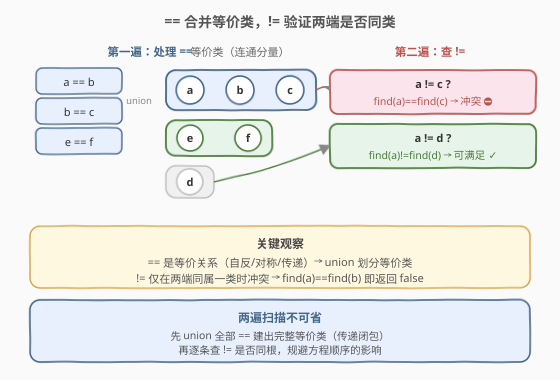
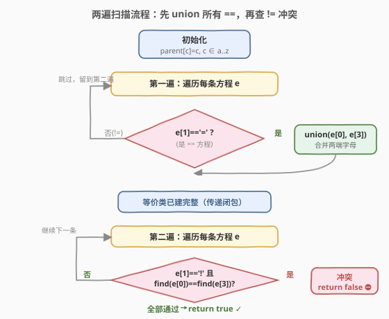
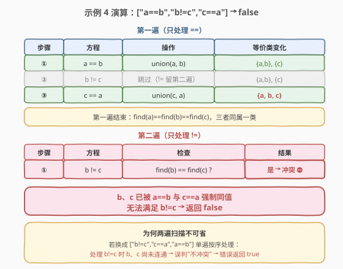

# 等式方程的可满足性

- **题目名称**：等式方程的可满足性
- **链接**：[990. 等式方程的可满足性](https://leetcode.cn/problems/satisfiability-of-equality-equations/)
- **难度**：中等
- **标签**：并查集、图

## 1. 题目概述

给定一个由表示变量之间关系的字符串方程组成的数组，每个字符串方程 `equations[i]` 的长度为 4，并采用两种不同的形式之一：`"a==b"` 或 `"a!=b"`。这里 `a` 和 `b` 是小写字母（不一定不同），表示单字母变量名。

只有当可以将整数分配给变量名，以便满足所有给定的方程时才返回 `true`，否则返回 `false`。

> 💡 本题的核心是**等价类的传递性**——`==` 关系把变量划入同一等价类，`!=` 关系要求两端分属不同类。这是并查集"动态连通性 + 冲突检测"的招牌应用，与 [547. 省份数量](../0501-0600/547_省份数量.md)（数连通分量）、[684. 冗余连接](../0601-0700/684_冗余连接.md)（加边判环）同属一个模板家族，只是这里多了一步"反向验证"。

**示例 1**：

```text
输入：["a==b","b!=a"]
输出：false
解释：a = 1 且 b = 1 可满足第一个方程，但无法满足第二个。无法同时满足。
```

**示例 2**：

```text
输入：["b==a","a==b"]
输出：true
解释：可指定 a = 1 且 b = 1，两个方程都满足。
```

**示例 3**：

```text
输入：["a==b","b==c","a==c"]
输出：true
解释：a = b = c = 1，三个等式都成立（第三个 a==c 是冗余的，由前两个传递可得）。
```

**示例 4**：

```text
输入：["a==b","b!=c","c==a"]
输出：false
解释：a==b 与 c==a 传递出 a、b、c 同值，但 b!=c 与之冲突。
```

**示例 5**：

```text
输入：["c==c","b==d","x!=z"]
输出：true
解释：c==c 平凡成立；b、d 同值；x、z 无 == 约束，可取不同值满足 x!=z。
```

**约束条件**：

- `1 <= equations.length <= 500`
- `equations[i].length == 4`
- `equations[i][0]` 和 `equations[i][3]` 是小写字母
- `equations[i][1]` 要么是 `'='`，要么是 `'!'`
- `equations[i][2]` 是 `'='`

---

## 2. 解题思路

### 2.1 暴力思路

把每个变量看作图节点，`==` 是无向边。对每个 `!=` 方程 `a!=b`，用 BFS/DFS 判断 `a`、`b` 是否在 `==` 图中连通：若连通则冲突返回 `false`。每次查询 $O(V+E)$，共 $m$ 个 `!=` 方程，总复杂度 $O(m \cdot (V+E))$，`m ≤ 500`、变量至多 26 个虽能过，但**重复查询同两点连通性**做了大量冗余工作，且每加一条 `==` 边都要重新考虑。

> ⚠️ 更隐蔽的陷阱：若**边是逐条混合给出**（`==` 与 `!=` 交错），朴素 BFS 在处理到 `!=` 时只能用到此刻已出现的 `==` 边，遗漏后续才加入的 `==` 约束。例如 `["b!=c","c==a","a==b"]`，处理 `b!=c` 时 `b`、`c` 尚不连通，单看此刻会误判为"不冲突"，但后续 `c==a`、`a==b` 把三者并入一类，`b!=c` 其实冲突。**必须先处理完所有 `==`，再查所有 `!=`**——这正是两遍扫描的核心动机。

### 2.2 核心观察：并查集——等式合并、不等式验冲突



关键观察分两点：

**第一点：`==` 关系是等价关系（自反、对称、传递）。** `a==b` 且 `b==c` 必有 `a==c`。等价关系把变量划分成若干**等价类**（连通分量），同一类内的变量必须取相同值。并查集的 `union` 恰好维护这种传递闭包——每来一条 `a==b`，就把 `a`、`b` 所在集合合并。

**第二点：`!=` 方程只在"两端同属一类"时才冲突。** `a!=b` 要求 `a`、`b` 取不同值，这只有当 `find(a) == find(b)`（已被某条 `==` 链强制同值）时才无法满足。若 `find(a) != find(b)`，它们分属不同等价类，总能选不同的整数，`!=` 自然成立。

> 💡 由此得到算法骨架——**两遍扫描**：
> 1. **第一遍**：处理所有 `==` 方程，`union` 两端变量，建出完整的等价类。
> 2. **第二遍**：处理所有 `!=` 方程，对每条 `a!=b` 检查 `find(a) == find(b)`，命中即返回 `false`。
> 3. 全部通过则返回 `true`。
>
> 顺序至关重要：必须先把等价类"合并完整"，再用它去验证所有不等式，否则会像 2.1 陷阱那样漏判。

### 2.3 算法流程图



```
1. 初始化并查集 parent[c] = c（c ∈ a..z，共 26 个变量）
2. 第一遍扫描 equations：
     对每条形如 "a==b" 的方程 → union(a, b)
3. 第二遍扫描 equations：
     对每条形如 "a!=b" 的方程：
        若 find(a) == find(b) → 返回 false（冲突）
4. 返回 true
```

> ⚠️ 变量只有 26 个小写字母，可直接用长度 26 的数组存 `parent`，下标 `c - 'a'`。无需哈希表，实现更轻量。判定方程类型只需看 `equations[i][1]`：`'='` 表示 `==`，`'!'` 表示 `!=`。

### 2.4 示例演算



以示例 4 `["a==b","b!=c","c==a"]` 为例：

**第一遍（只处理 `==`）**：

| 步骤 | 方程 | 操作 | 等价类变化 |
|------|------|------|-----------|
| ① | `a==b` | `union(a, b)` | {a, b}, {c} |
| ② | `b!=c` | 跳过（`!=` 留到第二遍） | {a, b}, {c} |
| ③ | `c==a` | `union(c, a)` | {a, b, c} |

第一遍结束后：`a`、`b`、`c` **同属一个等价类**（`find(a) == find(b) == find(c)`）。

**第二遍（只处理 `!=`）**：

| 步骤 | 方程 | 检查 | 结果 |
|------|------|------|------|
| ① | `b!=c` | `find(b) == find(c)` ? | **是 → 冲突，返回 false** ⛔ |

`b`、`c` 已被 `a==b` 与 `c==a` 强制同值，无法满足 `b!=c`，整体不可满足 → **返回 `false`** ✅

> 💡 若把方程顺序换成 `["b!=c","c==a","a==b"]`，朴素单遍扫描会在第一步 `b!=c` 时因 `b`、`c` 尚未连通而误判"不冲突"。两遍扫描彻底规避了这种顺序依赖——这正是该解法的关键设计。

---

## 3. 参考代码

### C++

```cpp
// 等式方程的可满足性.cpp —— 并查集 + 两遍扫描
#include <vector>
#include <string>
using namespace std;

class Solution {
    int parent[26];

    int find(int x) {
        if (parent[x] != x) parent[x] = find(parent[x]);   // 路径压缩
        return parent[x];
    }

    void unite(int x, int y) {
        parent[find(x)] = find(y);                          // 合并两等价类
    }

public:
    bool equationsPossible(vector<string>& equations) {
        for (int i = 0; i < 26; i++) parent[i] = i;         // 初始化：每个字母自成一集合
        // 第一遍：合并所有 ==
        for (const string& e : equations)
            if (e[1] == '=') unite(e[0] - 'a', e[3] - 'a');
        // 第二遍：检查所有 != 是否冲突
        for (const string& e : equations)
            if (e[1] == '!' && find(e[0] - 'a') == find(e[3] - 'a'))
                return false;
        return true;
    }
};
```

### Python

```python
class Solution:
    def equationsPossible(self, equations: list[str]) -> bool:
        parent = list(range(26))

        def find(x: int) -> int:
            while parent[x] != x:
                parent[x] = parent[parent[x]]               # 路径压缩（隔代压缩）
                x = parent[x]
            return x

        def union(x: int, y: int) -> None:
            parent[find(x)] = find(y)

        for e in equations:                                 # 第一遍：合并所有 ==
            if e[1] == '=':
                union(ord(e[0]) - 97, ord(e[3]) - 97)
        for e in equations:                                 # 第二遍：检查所有 !=
            if e[1] == '!' and find(ord(e[0]) - 97) == find(ord(e[3]) - 97):
                return False
        return True
```

> 💡 代码用长度 26 的数组存 `parent`，下标 `c - 'a'`（Python 用 `ord(c) - 97`）。判定方程类型只看 `e[1]`：`'='` 是 `==`、`'!'` 是 `!=`（`e[2]` 恒为 `'='`，无需判断）。两遍扫描把"建类"与"验冲突"彻底分离，规避了方程顺序的影响。

---

## 4. 复杂度分析

| 维度 | 复杂度 | 说明 |
|------|--------|------|
| **时间复杂度** | $O(n + m \, \alpha(|\Sigma|))$ | 第一遍 $n$ 条 `==` 各一次 `union`（两次 `find`），第二遍 $m$ 条 `!=` 各一次 `find` 比较并查集操作均摊 $O(\alpha(|\Sigma|))$；字母表 $|\Sigma|=26$ 极小，$\alpha(26) \le 5$ 视作常数，整体 $O(n + m) = O(L)$，$L$ 为方程总数 |
| **空间复杂度** | $O(|\Sigma|)$ | `parent` 数组长度 26，与方程数无关 |

> 💡 字母表规模固定为 26，并查集操作实际是 $O(1)$。瓶颈在扫描方程本身，整体线性。即便题目扩展为大写字母或更多字符，只需调大数组或改用哈希表，算法骨架不变。

---

## 5. 扩展：为何两遍扫描不可省

设想方程**单遍按序处理**（见到 `==` 就 union，见到 `!=` 就当场查 `find`）。对于 `["b!=c","c==a","a==b"]`：

- 处理 `b!=c`：此刻 `b`、`c` 各自成集合，`find(b) != find(c)` → 误判"不冲突"。
- 后续 `c==a`、`a==b` 才把三者并入一类——但 `b!=c` 已被放过，最终错误返回 `true`。

问题根源：`!=` 的合法性**依赖于所有 `==` 建出的完整等价类**，而单遍扫描在遇到 `!=` 时只能看到"此刻已合并"的部分。两遍扫描的等价表述是——**先求传递闭包，再验证约束**，这是处理"正负约束混合"问题的通用范式：

- 正约束（`==`、连通、同类）先全部施加，得到闭包；
- 负约束（`!=`、不连通、异类）再在闭包上逐一验证。

> ⚠️ 如果方程全是 `==` 或全是 `!=`，单遍也能正确；但当 `==` 出现在某 `!=` 之后时，单遍必错。两遍扫描用 $O(L)$ 的常数倍代价换来了对任意顺序的正确性，性价比极高。

---

## 6. 面试要点

1. **为什么必须先处理所有 `==`，再处理所有 `!=`？**

   - `!=` 是否冲突取决于"两端是否被 `==` 链强制同值"，而这需要所有 `==` 合并完毕后的完整等价类。若单遍按序处理，遇到出现在 `==` 之前的 `!=` 时只能用到部分等价类，会漏判。两遍扫描先建闭包再验约束，规避顺序依赖。

2. **如何判定一条方程是 `==` 还是 `!=`？**

   - 看第 2 个字符 `equations[i][1]`：`'='` 表示 `==`，`'!'` 表示 `!=`。第 3 个字符 `equations[i][2]` 恒为 `'='`，无需判断。两端变量分别是 `equations[i][0]` 和 `equations[i][3]`。

3. **为什么用长度 26 的数组而不是哈希表？**

   - 变量仅为小写字母，规模固定 26。数组下标 `c - 'a'` 直接索引，$O(1)$ 访问且无哈希开销，实现更简洁。若变量扩展到任意字符串，则改用 `unordered_map` / `dict`（参考 [947. 移除最多的同行或同列石头](../0901-1000/947_移除最多的同行或同列石头.md) 的哈希表写法）。

4. **`c==c` 这种自反方程怎么处理？**

   - `union(c, c)` 中 `find(c) == find(c)`，不改变任何集合，自然无害。无需特判，并查集对自环合并天然幂等。

5. **并查集的两个优化在本题有必要吗？**

   - 变量仅 26 个，树高最多 26，朴素 `find` 也极快。但路径压缩是"免费"的工程习惯，写上无成本、可复用到大规模场景；按秩合并在本题收益微乎其微，可省略以保持代码简洁。面试中写路径压缩即可。

> 💡 **一句话总结**：把 `==` 看作等价关系的合并操作、`!=` 看作对等价类的冲突检测，两遍扫描（先 union 全部 `==`，再逐条查 `!=` 是否同根）即可判定可满足性。这是并查集"建连通性 + 反向验证"用法的招牌题。

---

## 7. 同类练习题

- [547. 省份数量](https://leetcode.cn/problems/number-of-provinces/)（[题解](../0501-0600/547_省份数量.md)）：同一并查集模板数连通分量，是本题的模板来源
- [684. 冗余连接](https://leetcode.cn/problems/redundant-connection/)（[题解](../0601-0700/684_冗余连接.md)）：同一并查集模板判环，加边时两端已同根即冗余
- [947. 移除最多的同行或同列石头](https://leetcode.cn/problems/most-stones-removed-with-same-row-or-column/)（[题解](../0901-1000/947_移除最多的同行或同列石头.md)）：并查集 + 哈希表键的进阶写法，数连通分量求最值
- [721. 账户合并](https://leetcode.cn/problems/accounts-merge/)：并查集合并字符串键（邮箱），模板进阶到"哈希映射 + 并查集"
- [1319. 连通网络的操作次数](https://leetcode.cn/problems/number-of-operations-to-make-network-connected/)：并查集统计连通分量，求最少接线数，与本题"数分量"思路同源
