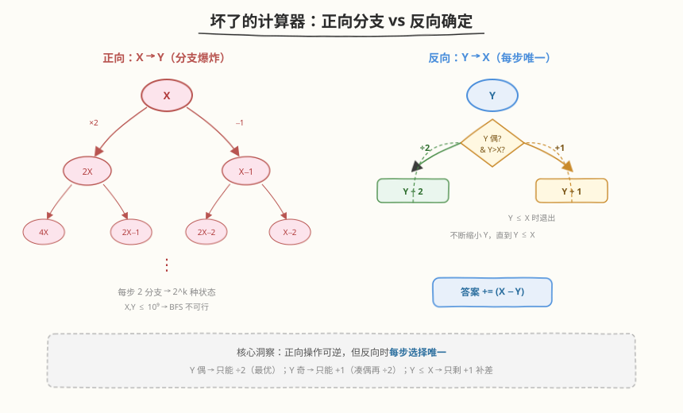
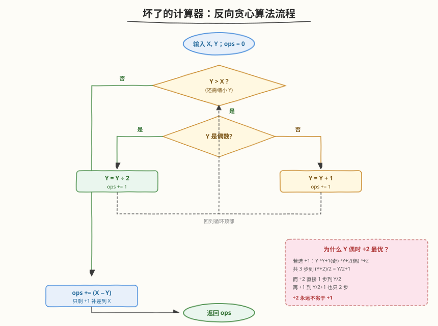
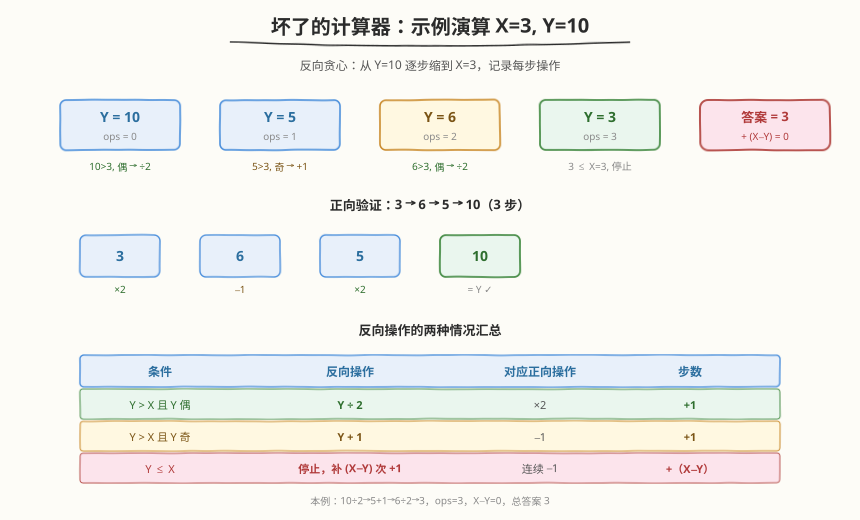

# 坏了的计算器

- **题目名称**：坏了的计算器
- **链接**：[991. 坏了的计算器](https://leetcode.cn/problems/broken-calculator/)
- **难度**：中等
- **标签**：贪心、数学

## 1. 题目概述

有一个坏掉的计算器，屏幕上显示数字 `X`。可以对它执行两种操作：

- **乘以 2**：将屏幕上的数字乘 2；
- **减 1**：将屏幕上的数字减 1。

初始时显示 `X`，返回使其显示 `Y` 的**最少操作次数**。

**示例 1**：

```text
输入：X = 2, Y = 3
输出：2
解释：2 → 4（×2）→ 3（−1），共 2 步。
```

**示例 2**：

```text
输入：X = 5, Y = 8
输出：2
解释：5 → 4（−1）→ 8（×2），共 2 步。
```

**示例 3**：

```text
输入：X = 3, Y = 10
输出：3
解释：3 → 6（×2）→ 5（−1）→ 10（×2），共 3 步。
```

**约束条件**：

- `1 <= X, Y <= 10^9`

---

## 2. 解题思路

### 2.1 暴力思路（正向 BFS）

从 `X` 出发正向搜索：每个状态可转移到 `2X` 或 `X−1`，用 BFS 求到 `Y` 的最短步数。但每步产生 2 个分支，搜索树深度可达 $\log Y$ 级别，状态数指数膨胀——`X, Y ≤ 10^9` 下 BFS 完全不可行。

> ⚠️ 正向的困难在于**每步都有两种选择**（乘 2 或减 1），且减 1 后再乘 2 与先乘 2 再减 1 的效果不同，无法用简单贪心直接判定方向。

### 2.2 核心观察：反向贪心（从 Y 倒推回 X）



关键洞察：**把操作反过来做**。正向操作的逆操作为：

| 正向操作 | 反向操作 | 适用条件 |
|----------|----------|----------|
| `X × 2` | `Y ÷ 2` | `Y` 为偶数 |
| `X − 1` | `Y + 1` | 任意（总是可行） |

反向的优势在于**每步的选择基本唯一**：

- **`Y > X` 且 `Y` 为偶数**：直接 `Y ÷ 2`。这是最优选择（见下方证明）。
- **`Y > X` 且 `Y` 为奇数**：只能 `Y + 1`（因为奇数不能整除，必须先加 1 凑成偶数）。
- **`Y ≤ X`**：此时无法再用 `÷ 2`（只会让 `Y` 更小、离 `X` 更远），只能连续 `+1` 补到 `X`，即还需要 `X − Y` 步。

> 💡 **为什么 `Y` 偶时 `÷2` 一定不劣于 `+1`？** 假设 `Y` 为偶数且选择 `+1`：则 `Y → Y+1`（奇）`→ Y+2`（偶）`→ (Y+2)/2`，共 3 步到达 $Y/2 + 1$。而选择 `÷2`：`Y → Y/2` 仅 1 步，再 `+1` 到 $Y/2 + 1$ 也只 2 步。即对任意目标，`÷2` 路径永远 ≤ `+1` 路径的步数。形式化地：两个连续 `+1` 夹在两次 `÷2` 之间，可以把它们「挪到」`÷2` 之后变成一次 `+2`——步数减半。因此**偶数时优先 `÷2` 是无损的贪心**。

### 2.3 算法流程图



1. 初始化 `ops = 0`。
2. 当 `Y > X` 时循环：
   - 若 `Y` 为偶数：`Y = Y / 2`，`ops += 1`。
   - 若 `Y` 为奇数：`Y = Y + 1`，`ops += 1`。
3. 循环结束后 `Y ≤ X`，补齐差值：`ops += (X − Y)`。
4. 返回 `ops`。

### 2.4 示例演算



以 `X = 3, Y = 10` 为例，反向贪心执行过程：

| 步数 | 当前 Y | 判定 | 操作 | 操作后 Y |
|------|--------|------|------|----------|
| 0 | 10 | 10 > 3，偶 | ÷2 | 5 |
| 1 | 5 | 5 > 3，奇 | +1 | 6 |
| 2 | 6 | 6 > 3，偶 | ÷2 | 3 |
| 3 | 3 | 3 ≤ 3，停止 | — | — |

循环结束后 `Y = 3 ≤ X = 3`，补 `X − Y = 0` 步。总答案 `ops = 3`。

正向验证：`3 → 6`（×2）`→ 5`（−1）`→ 10`（×2），确实 3 步。

再看示例 2 `X = 5, Y = 8`：

| 步数 | 当前 Y | 判定 | 操作 | 操作后 Y |
|------|--------|------|------|----------|
| 0 | 8 | 8 > 5，偶 | ÷2 | 4 |
| 1 | 4 | 4 ≤ 5，停止 | — | — |

循环结束，补 `X − Y = 5 − 4 = 1` 步。总答案 `ops = 1 + 1 = 2`。正向验证：`5 → 4`（−1）`→ 8`（×2）。

---

## 3. 参考代码

### C++

```cpp
class Solution {
  public:
    int brokenCalc(int X, int Y) {
        int ops = 0;
        while (Y > X) {
            if (Y % 2 == 0)
                Y /= 2;
            else
                Y += 1;
            ops++;
        }
        return ops + (X - Y);
    }
};
```

### Python

```python
class Solution:
    def brokenCalc(self, X: int, Y: int) -> int:
        ops = 0
        while Y > X:
            if Y % 2 == 0:
                Y //= 2
            else:
                Y += 1
            ops += 1
        return ops + (X - Y)
```

> 💡 也可以写成更紧凑的递推：每次循环里 `Y` 偶则除 2、奇则加 1，循环外补差。注意 Python 用 `//=` 保证整数除法。`Y ≤ X` 后 `X − Y` 一定非负，无需额外判断。

---

## 4. 复杂度分析

| 维度 | 复杂度 | 说明 |
|------|--------|------|
| 时间复杂度 | $O(\log Y)$ | 每次循环 `Y` 至少减半（偶数直接除 2；奇数加 1 变偶后下一步除 2，两步合起来近似减半），循环次数 $O(\log Y)$ |
| 空间复杂度 | $O(1)$ | 只用常数个变量 |

$Y \le 10^9$ 时 $\log_2 Y \approx 30$，循环最多约 60 次，远低于时限。

---

## 5. 扩展：正向贪心为什么不可行？

正向思考时，站在 `X` 面临「乘 2 还是减 1」的二选一，似乎无法局部判定哪个更优。但若把视角放到**整个操作序列的结构**上：

设最优正向序列中所有 `×2` 操作把值放大了 $2^k$ 倍（共 $k$ 次乘法），两次 `×2` 之间的 `−1` 操作数为 $a_0, a_1, \dots, a_k$（前后各一段）。则最终值：

$$Y = 2^k X - \sum_{i=0}^{k} a_i \cdot 2^{k-i}$$

总操作数 $= k + \sum a_i$。要让 $\sum a_i \cdot 2^{k-i} = 2^k(X - Y/\text{...})$... 这个方向推导复杂。而**反向贪心正是这个结构的最优解码**：每次 `÷2` 对应剥掉一层 `×2`，`+1` 对应「填回」被 `−1` 减掉的值——因为减法发生在乘法之前会被放大，反向时必须先 `÷2` 再 `+1` 才能正确还原。

> 💡 **通用技巧**：当正向操作有分支而反向操作确定时，优先考虑反向求解。这类「正难则反」的贪心在 [392. 判断子序列](../0301-0400/392_判断子序列.md)（双指针贪心匹配）、[739. 每日温度](../0701-0800/739_每日温度.md)（单调栈反向维护）等题中也有体现。

---

## 6. 面试要点

1. **为什么选择反向而不是正向？**

   - 正向每个状态有两种转移（`×2` 或 `−1`），搜索空间指数膨胀，BFS 在 $10^9$ 规模下不可行。
   - 反向时操作基本唯一：`Y` 偶只能 `÷2`（最优），`Y` 奇只能 `+1`（凑偶），`Y ≤ X` 只能连续 `+1`。每步无分支，贪心直接得解。

2. **`Y` 为偶数时为什么 `÷2` 一定不劣于 `+1`？**

   - 选 `+1` 路径：`Y→Y+1→Y+2→(Y+2)/2`，3 步到 $Y/2+1$。
   - 选 `÷2` 路径：`Y→Y/2`，1 步到 $Y/2$，再 `+1` 到 $Y/2+1$ 共 2 步。
   - 对任意后续目标，`÷2` 路径步数 ≤ `+1` 路径。本质是「夹在两次 `÷2` 间的两个 `+1` 可以挪到 `÷2` 之后合并成一次 `+2`」，步数减半。

3. **`Y ≤ X` 时为什么直接补 `X − Y`？**

   - 此时 `÷2` 只会让 `Y` 更小、离 `X` 更远，毫无意义。
   - 唯一能缩小差距的是 `+1`（对应正向的 `−1`），需要恰好 `X − Y` 次，贪心无选择余地。

4. **时间复杂度为什么是 $O(\log Y)$？**

   - 偶数一步除 2；奇数加 1 变偶，下一步除 2——两步合起来让 `Y` 近似减半。
   - 因此循环次数上界约 $2 \log_2 Y \approx 60$（$Y = 10^9$），是 $O(\log Y)$。

5. **这题和 [392. 判断子序列](../0301-0400/392_判断子序列.md) 有何共性？**

   - 都是「正向难、反向易」的贪心：子序列匹配正向双指针看似简单，但批量查询时反向预处理（对 `t` 建每个字符的位置表 + 二分）才高效；本题正向 BFS 不可行，反向贪心每步唯一。核心是**识别哪一方向具有确定性**。

---

## 7. 同类练习题

- [392. 判断子序列](https://leetcode.cn/problems/is-subsequence/)（[题解](../0301-0400/392_判断子序列.md)）：正向贪心匹配 / 反向预处理批量查询，与本题同为「正难则反」贪心范式
- [739. 每日温度](https://leetcode.cn/problems/daily-temperatures/)（[题解](../0701-0800/739_每日温度.md)）：单调栈反向维护「下一个更大元素」，与本题反向缩 `Y` 同为逆向视角求解
- [29. 两数相除](https://leetcode.cn/problems/divide-two-integers/)（[题解](../0001-0100/29_两数相除.md)）：位运算翻倍减法模拟除法，与本题 `÷2` 缩小 `Y` 的减半思想同源
- [45. 跳跃游戏 II](https://leetcode.cn/problems/jump-game-ii/)（[题解](../0001-0100/45_跳跃游戏%20II.md)）：贪心维护边界求最少步数，与本题「每步最优选择直接得全局最优」的贪心直觉一致
