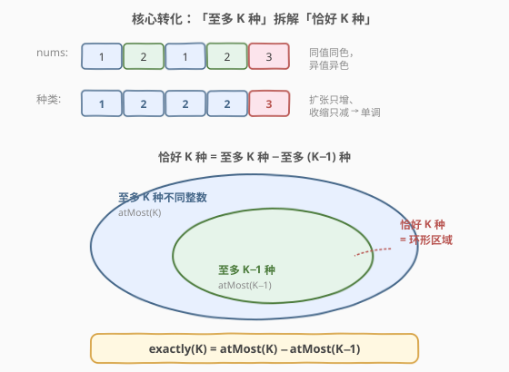
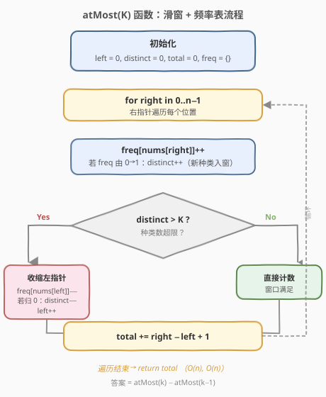
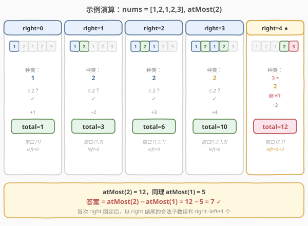

# LeetCode K 个不同整数的子数组 题解

## 1. 题目概述

- **标题 / 题号**：K 个不同整数的子数组（#992，hard）
- **链接**：https://leetcode.cn/problems/subarrays-with-k-different-integers/
- **难度**：困难
- **标签**：数组、哈希表、滑动窗口、计数

**题意**：给定一个正整数数组 `nums` 和一个整数 `k`。如果 `nums` 的某个**连续子数组**中恰好有 `k` 个**不同整数**，则称其为「好子数组」。请返回好子数组的**数目**。

**示例 1**：

```text
输入：nums = [1,2,1,2,3], k = 2
输出：7
解释：恰好含 2 个不同整数的好子数组有 7 个：
      [1,2]、[2,1]、[1,2]、[2,3]、[1,2,1]、[2,1,2]、[1,2,1,2]。
```

**示例 2**：

```text
输入：nums = [1,2,1,3,4], k = 3
输出：3
解释：恰好含 3 个不同整数的好子数组有 3 个：[1,2,1]、[2,1,3]、[1,3,4]。
```

**约束**：

- `1 <= nums.length <= 20000`
- `1 <= nums[i] <= nums.length`
- `1 <= k <= nums.length`

> 💡 **与 1248 的同构关系**：[1248. 统计「优美子数组」](../1201-1300/1248_统计优美子数组.md) 统计「恰好含 `k` 个奇数」的子数组，本题统计「恰好含 `k` 个**不同整数**」的子数组。两者都把「恰好 K」转化为「至多 K」之差，差别只在窗口内维护的量是「奇数个数」还是「不同整数种类数」。

## 2. 解题思路

### 2.1 暴力思路

枚举所有子数组 `[i, j]`，用集合统计其中不同整数个数，判断是否等于 `k`。两重循环 + 集合判定共 $O(n^2)$，在 $n = 20000$ 时达到 $4 \times 10^8$ 量级，超时。

### 2.2 核心观察：「至多 K」转化



直接用滑动窗口求「恰好 K 种」很难——窗口内种类数恰好为 K 时，既无法确定该扩还是该缩（扩可能变 K+1，缩可能仍为 K）。但「**至多 K 种**」可以用标准滑窗轻松求出，于是：

$$
\text{exactly}(K) = \text{atMost}(K) - \text{atMost}(K-1)
$$

`atMost(K)` 统计**不同整数种类数 ≤ K** 的子数组数：用双指针维护窗口，对每个 `right`，加入 `nums[right]` 后若窗口内种类数 `> K` 就收缩 `left`，然后累加 `right - left + 1`（以 `right` 结尾的合法子数组数）。

> ⚠️ **为什么需要频率表而不是「最新下标」？** 本题允许同一整数出现多次（如 `[1,2,1,2]` 中 `1` 出现两次）。仅靠「最新下标」无法判断「踢掉一个元素后种类数是否减少」——必须用频率表计数，直到某整数 `freq` 归 0 才确认该种类被彻底移出窗口。这一点与 [904. 水果成篮](../0901-1000/904_水果成篮.md) 完全一致。

### 2.3 算法流程图



`atMost(K)` 的流程：

1. 初始化 `left = 0, distinct = 0, total = 0, freq = {}`
2. 遍历 `right` 从 `0` 到 `n-1`：
   - `freq[nums[right]]++`；若 `freq` 由 `0 → 1`，则 `distinct++`（新种类入窗）
   - **当** `distinct > K`：`freq[nums[left]]--`，若归 `0` 则 `distinct--`，`left++`
   - `total += right - left + 1`
3. 返回 `total`

最终答案为 `atMost(k) - atMost(k - 1)`。

> 💡 **`right - left + 1` 的含义**：当窗口 `[left, right]` 内种类数 ≤ K 时，以 `right` 结尾的合法子数组有 `right - left + 1` 个（起点可取 `left` 到 `right` 的任意位置，因为去掉窗口左端元素不会增加种类数）。这一步是 $O(1)$ 计数的关键。

### 2.4 示例演算

以 `nums = [1,2,1,2,3], k = 2` 为例，展示 `atMost(2)` 的过程：



| right | nums[right] | distinct | left | 窗口 | += right−left+1 | total |
|-------|-------------|----------|------|------|-----------------|-------|
| 0 | 1 | 1 | 0 | [1] | 1 | 1 |
| 1 | 2 | 2 | 0 | [1,2] | 2 | 3 |
| 2 | 1 | 2 | 0 | [1,2,1] | 3 | 6 |
| 3 | 2 | 2 | 0 | [1,2,1,2] | 4 | 10 |
| 4 | 3 | 3→2 | 0→3 | [2,3] | 2 | 12 |

> 💡 第 5 步 `right=4` 时，加入 `3` 后 `distinct=3 > 2`，需收缩：依次移走 `left=0` 处的 `1`（freq{1:1}，未归 0）、`left=1` 处的 `2`（freq{2:1}，未归 0）、`left=2` 处的 `1`（freq{1:0}，`distinct` 减到 2），`left` 移到 3。此时窗口 `[2,3]` 恰好 2 种，累加 `4-3+1=2`。

同理计算 `atMost(1) = 5`，最终答案：

$$
\text{ans} = \text{atMost}(2) - \text{atMost}(1) = 12 - 5 = 7 \quad \checkmark
$$

## 3. 参考代码

### C++（滑动窗口「至多 K」）

```cpp
class Solution {
  public:
    int subarraysWithKDistinct(vector<int>& nums, int k) {
        return atMost(nums, k) - atMost(nums, k - 1);
    }
  private:
    int atMost(vector<int>& nums, int K) {
        if (K < 0) return 0;
        unordered_map<int, int> freq; // 整数 -> 窗口内出现次数
        int left = 0, distinct = 0, total = 0;
        for (int right = 0; right < nums.size(); right++) {
            if (freq[nums[right]]++ == 0) { // 新种类入窗
                distinct++;
            }
            while (distinct > K) {          // 种类超限，收缩 left
                if (--freq[nums[left++]] == 0) { // 该种类频率归 0
                    distinct--;
                }
            }
            total += right - left + 1;
        }
        return total;
    }
};
```

### Python

```python
class Solution:
    def subarraysWithKDistinct(self, nums: List[int], k: int) -> int:
        def atMost(K: int) -> int:
            if K < 0:
                return 0
            freq = {}
            left = distinct = total = 0
            for right, x in enumerate(nums):
                freq[x] = freq.get(x, 0) + 1
                if freq[x] == 1:          # 新种类入窗
                    distinct += 1
                while distinct > K:       # 种类超限，收缩 left
                    d = nums[left]
                    freq[d] -= 1
                    if freq[d] == 0:      # 该种类频率归 0
                        distinct -= 1
                    left += 1
                total += right - left + 1
            return total
        return atMost(k) - atMost(k - 1)
```

> ⚠️ **易错点**：`distinct` 的增减必须与 `freq` 归 0 严格绑定——`freq[x]` 从 `0→1` 时 `distinct++`，从 `1→0` 时 `distinct--`。C++ 中 `if (freq[nums[right]]++ == 0)` 利用自增返回旧值的特性，简洁地判定「入窗前为 0」；Python 中需显式 `if freq[x] == 1`（在自增之后判断）。

## 4. 复杂度分析

| 维度 | 复杂度 | 说明 |
|------|--------|------|
| 时间复杂度 | $O(n)$ | 调用两次 `atMost`，每次 `left`、`right` 各至多遍历一次，哈希表操作均摊 $O(1)$ |
| 空间复杂度 | $O(n)$ | 哈希表最多存不同整数种类数；由约束 `nums[i] <= nums.length` 故最坏 $O(n)$ |

> 💡 两次 `atMost` 调用串行执行，总时间仍为 $O(n)$（常数倍增大但不改变量级）。空间可复用同一哈希表，但每次调用需清空，故仍记 $O(n)$。

## 5. 扩展：数组代替哈希表

由于约束 `1 <= nums[i] <= nums.length`，整数取值在 `[1, n]` 内，可用定长数组代替哈希表，常数更小：

```cpp
class Solution {
  public:
    int subarraysWithKDistinct(vector<int>& nums, int k) {
        return atMost(nums, k) - atMost(nums, k - 1);
    }
  private:
    int atMost(vector<int>& nums, int K) {
        if (K < 0) return 0;
        int n = nums.size();
        vector<int> freq(n + 1, 0); // nums[i] ∈ [1, n]
        int left = 0, distinct = 0, total = 0;
        for (int right = 0; right < n; right++) {
            if (freq[nums[right]]++ == 0) distinct++;
            while (distinct > K) {
                if (--freq[nums[left++]] == 0) distinct--;
            }
            total += right - left + 1;
        }
        return total;
    }
};
```

> ⚠️ 此方案空间为 $O(n)$（需开 `n+1` 大小的数组）。与哈希表方案渐近相同，但数组访问比哈希表快、无哈希冲突，实测常数更优。注意下标从 `1` 开始，故数组大小取 `n + 1`。

## 6. 面试要点

1. **为什么不能直接用滑动窗口求「恰好 K 种」？**

   - 滑动窗口的核心是「不满足时扩张，满足时记录并尝试收缩」。但「恰好 K 种」时收缩可能丢失合法解（收缩后仍恰好 K 种，但窗口起点变了会产生新的合法子数组），扩张也可能越过合法解（变成 K+1 种）。窗口无法确定移动方向，因此转化为「至多 K 种」之差。

2. **`right - left + 1` 为什么就是以 `right` 结尾的合法子数组数？**

   - 当窗口 `[left, right]` 内种类数 ≤ K 时，以 `right` 为右端点、起点取 `left, left+1, ..., right` 的所有子数组都满足条件（因为去掉窗口左端元素不会增加种类数）。共 `right - left + 1` 个，$O(1)$ 搞定。

3. **`atMost(K - 1)` 当 `K = 0` 时怎么办？**

   - `atMost(-1)` 应返回 0（种类数不可能 ≤ −1）。代码中加 `if (K < 0) return 0` 特判即可。本题约束 `k >= 1`，故 `atMost(k - 1)` 最小调到 `atMost(0)`，统计「至多 0 种」即空集，结果为 0。

4. **本题与 [1248. 统计「优美子数组」](../1201-1300/1248_统计优美子数组.md) 的区别？**

   - 1248 维护的窗口量是「奇数个数」，每个元素贡献 0 或 1，单调性天然成立；本题维护的窗口量是「不同整数种类数」，需用频率表计数，直到某种类 `freq` 归 0 才减 `distinct`。两者骨架完全一致，差别只在窗口量的维护方式。

5. **为什么用频率表而不是像第 3 题那样记录「最新下标」直接跳？**

   - 第 3 题约束「无重复字符」——窗口内每种字符最多出现 1 次，遇到重复可精准定位旧位置并跳跃。本题允许同种整数出现多次，仅靠「最新下标」无法判断「踢掉一个元素后种类数是否减少」——必须用频率表计数，直到某整数 `freq` 归 0 才确认该种类被彻底移出窗口。这与 [904. 水果成篮](../0901-1000/904_水果成篮.md) 的理由完全相同。

## 同类练习题

| # | 题目 | 与本题的关联 |
|---|------|-------------|
| 1248 | [统计「优美子数组」](https://leetcode.cn/problems/count-number-of-nice-subarrays/)（[题解](../1201-1300/1248_统计优美子数组.md)） | 同套路母题，把「不同整数种类数」换成「奇数个数」，骨架完全一致 |
| 904 | [水果成篮](https://leetcode.cn/problems/fruit-into-baskets/)（[题解](../0901-1000/904_水果成篮.md)） | 至多 2 种的滑窗 + 频率表，是本题 `atMost` 函数的「求最长」对照版 |
| 930 | [和相同的二元子数组](https://leetcode.cn/problems/binary-subarrays-with-sum/) | 0/1 数组版「和为 goal 的子数组数」，同样适用「至多 K」转化 |
| 713 | [乘积小于 K 的子数组](https://leetcode.cn/problems/subarray-product-less-than-k/) | 同为「至多」类滑窗计数，对比 `right-left+1` 技巧 |
| 1358 | [包含所有三种字符的子字符串数目](https://leetcode.cn/problems/number-of-substrings-containing-all-three-characters/) | 变体——求「至少含 3 种字符」，可用类似转化 |
