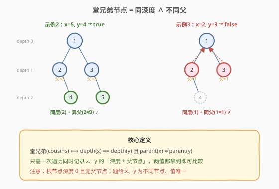
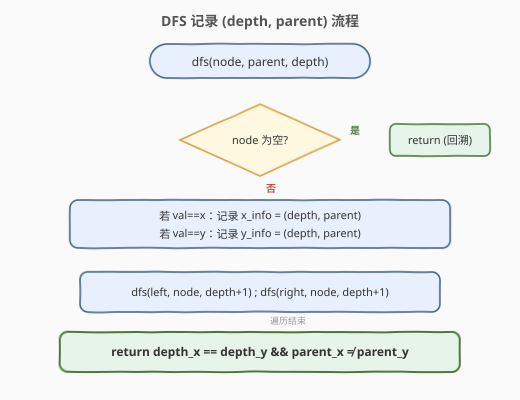
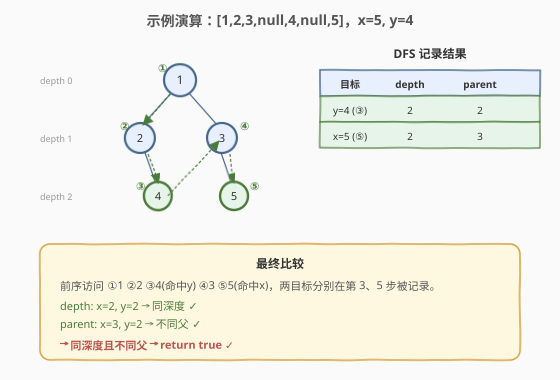

# LeetCode 二叉树的堂兄弟节点 题解

## 1. 题目概述

- **标题 / 题号**：二叉树的堂兄弟节点（#993，easy）
- **链接**：https://leetcode.cn/problems/cousins-in-binary-tree/
- **难度**：简单
- **标签**：树、二叉树、深度优先搜索、广度优先搜索

**题意**：在二叉树中，根节点位于深度 0 处，每个深度为 $k$ 的节点的子节点位于深度 $k+1$ 处。如果二叉树的两个节点**深度相同**但**父节点不同**，则它们是一对**堂兄弟节点**。

给定具有**唯一值**的二叉树根节点 `root`，以及树中两个不同节点的值 `x` 和 `y`。只有与 `x`、`y` 对应的节点是堂兄弟节点时才返回 `true`，否则返回 `false`。

**示例 1**：

```text
输入：root = [1,2,3,4], x = 4, y = 3
输出：false

        1
       / \
      2   3
     /
    4
```

`x=4` 在深度 2、`y=3` 在深度 1，深度不同 → 非堂兄弟。

**示例 2**：

```text
输入：root = [1,2,3,null,4,null,5], x = 5, y = 4
输出：true

        1
       / \
      2   3
       \   \
        4   5
```

`x=5` 与 `y=4` 同在深度 2，父节点分别为 3 和 2（不同）→ 堂兄弟。

**示例 3**：

```text
输入：root = [1,2,3,null,4], x = 2, y = 3
输出：false

        1
       / \
      2   3
       \
        4
```

`x=2` 与 `y=3` 同在深度 1，但父节点都是 1（相同）→ 非堂兄弟。

**约束**：

- 树中节点数目在范围 $[2, 100]$ 内。
- 每个节点的值都是唯一的、范围为 $[1, 100]$ 的整数。

> 💡 本题是树形「**定位 + 比对**」的入门题：堂兄弟的两个判据——**同深度**与**不同父**——都需要知道每个目标节点的「深度 + 父节点」。一次 DFS（或 BFS）同时记录这两个信息即可，是 [236 最近公共祖先](../0201-0300/236_二叉树的最近公共祖先.md) 中「记录父节点/路径」套路的简化版。

## 2. 解题思路

### 2.1 暴力思路：两次遍历分别定位

最直观的做法：写一个 `find(node, target)` 函数返回目标节点的 `(depth, parent)`，对 `x` 和 `y` 各调用一次，再比较两个结果。

```python
def find(root, target):
    stack = [(root, None, 0)]
    while stack:
        node, parent, depth = stack.pop()
        if node.val == target:
            return (depth, parent)
        if node.left:  stack.append((node.left,  node, depth + 1))
        if node.right: stack.append((node.right, node, depth + 1))
    return None

dx, px = find(root, x)
dy, py = find(root, y)
return dx == dy and px != py
```

时间 $O(2n) = O(n)$，能过。但有两个浪费：

1. **遍历两遍**：树的结构信息在两次遍历间重复读取，而 `x`、`y` 完全可以在一次遍历中同时捕获；
2. **无法提前终止**：即便两个目标都已找到，仍需走完整棵树（除非手动加终止判断，让代码变复杂）。

### 2.2 核心观察：一次遍历同时记录 (depth, parent)



**关键洞察**：堂兄弟的判定只依赖两个量——`depth` 和 `parent`。这两个量在任意一次遍历（DFS/BFS）中都能顺带记录，**无需为 `x`、`y` 各跑一趟**。

> 堂兄弟 ⟺ `depth(x) == depth(y)` 且 `parent(x) != parent(y)`

只需做一次 DFS，参数携带 `(node, parent, depth)`：

- 遇到 `node.val == x` → 记录 `x_info = (depth, parent)`；
- 遇到 `node.val == y` → 记录 `y_info = (depth, parent)`；
- 遍历结束后比较 `x_info` 与 `y_info`。

> 💡 **为什么 `parent` 要作为参数传下来？** 每个节点只持有孩子指针，不持有父指针。在自顶向下的 DFS 中，把「当前父节点」作为递归参数下传，是树形题获取父信息的标准手法——与 [236 最近公共祖先](../0201-0300/236_二叉树的最近公共祖先.md) 的「记录父映射后向上回溯」同源，只是本题只需记录、不需回溯。

### 2.3 算法流程图



**DFS 完整步骤**（函数 `dfs(node, parent, depth)`）：

1. **空节点**：直接 `return`（回溯）；
2. **命中目标**：若 `node.val == x`，记录 `x_info = (depth, parent)`；若 `node.val == y`，记录 `y_info = (depth, parent)`；
3. **递归孩子**：`dfs(node.left, node, depth+1)` 与 `dfs(node.right, node, depth+1)`——注意把 `node` 作为孩子的新 `parent` 下传。

遍历结束后：`return x_info.depth == y_info.depth && x_info.parent != y_info.parent`。

> ⚠️ 值的唯一性保证了 `x`、`y` 互斥（`node.val` 不可能同时等于 `x` 和 `y`），故用 `if/elif` 即可。题面保证 `x`、`y` 必在树中，无需处理「找不到」的兜底。

### 2.4 示例演算

以示例 2 `root = [1,2,3,null,4,null,5]`、`x=5`、`y=4` 为例，前序 DFS 访问过程：



| 前序访问 | 节点值 | 命中? | 记录 |
|---------|--------|-------|------|
| ① 根 | 1 | — | — |
| ② 左子 | 2 | — | — |
| ③ 左右叶 | 4 | `y` | `y_info = (2, parent=2)` |
| ④ 右子 | 3 | — | — |
| ⑤ 右右叶 | 5 | `x` | `x_info = (2, parent=3)` |

遍历结束：`depth_x=2 == depth_y=2`（同深度）且 `parent_x=3 ≠ parent_y=2`（不同父）→ 返回 `true` ✓。

> 💡 **对照示例 3**：`x=2`、`y=3`，DFS 第 ②、④ 步分别命中，记录得 `x_info=(1, parent=1)`、`y_info=(1, parent=1)`——同深度但**同父** → 返回 `false`。差别全在「父节点是否相同」。

## 3. 参考代码

### C++

```cpp
class Solution {
    int xDepth = -1, yDepth = -1;
    TreeNode *xParent = nullptr, *yParent = nullptr;

  public:
    bool isCousins(TreeNode* root, int x, int y) {
        dfs(root, nullptr, 0, x, y);
        return xDepth == yDepth && xParent != yParent;
    }

  private:
    void dfs(TreeNode* node, TreeNode* parent, int depth, int x, int y) {
        if (!node) return;                       // 空节点：回溯
        if (node->val == x) {                    // 命中 x：记录深度+父
            xDepth = depth;
            xParent = parent;
        } else if (node->val == y) {             // 命中 y：记录深度+父
            yDepth = depth;
            yParent = parent;
        }
        dfs(node->left, node, depth + 1, x, y);  // node 作为孩子的新 parent
        dfs(node->right, node, depth + 1, x, y);
    }
};
```

### Python

```python
class Solution:
    def isCousins(self, root: Optional[TreeNode], x: int, y: int) -> bool:
        x_info = None  # (depth, parent)
        y_info = None

        def dfs(node: Optional[TreeNode], parent, depth: int) -> None:
            nonlocal x_info, y_info
            if not node:
                return                              # 空节点：回溯
            if node.val == x:                       # 命中 x：记录深度+父
                x_info = (depth, parent)
            elif node.val == y:                     # 命中 y：记录深度+父
                y_info = (depth, parent)
            dfs(node.left, node, depth + 1)         # node 作为孩子的新 parent
            dfs(node.right, node, depth + 1)

        dfs(root, None, 0)
        return x_info[0] == y_info[0] and x_info[1] != y_info[1]
```

> 💡 两版等价。Python 用闭包 `nonlocal` 写入外层 `x_info`/`y_info`；C++ 用成员变量暂存。`parent` 在入口对根节点传 `None`/`nullptr`——根无父，但 `x`、`y` 必不为根（题给不同节点，且若其一为根则深度必为 0 而另一节点深度 ≥ 1，深度不等直接判否），故 `None` 不影响最终比较。

## 4. 复杂度分析

| 维度 | 复杂度 | 说明 |
|------|--------|------|
| 时间复杂度 | $O(n)$ | 最坏情况遍历全部 $n$ 个节点（两目标都在最后访问的位置） |
| 空间复杂度 | $O(h)$ | 递归栈深度 = 树高 $h$；平衡树 $O(\log n)$，退化链状 $O(n)$ |
| 最坏情况 | $O(n)$ 时间 / 空间 | 树退化为单侧链且两目标在链末端时，递归深度与遍历数均达 $n$ |

> ⚠️ 暴力两次遍历法时间也是 $O(n)$，但常数翻倍（遍历两遍）。一次遍历法把常数减半，且代码更紧凑——是「同复杂度阶下的工程改进」。

## 5. 扩展：BFS 按层判定

DFS 不是唯一选择。BFS 按层处理时，「同深度」天然对应「同一层」，只需在每层结束时检查 `x`、`y` 是否都出现，并排除「同父」即可：

```python
from collections import deque

class Solution:
    def isCousins(self, root: Optional[TreeNode], x: int, y: int) -> bool:
        q = deque([root])
        while q:
            size = len(q)
            x_found = y_found = False
            for _ in range(size):
                node = q.popleft()
                if node.val == x:
                    x_found = True
                elif node.val == y:
                    y_found = True
                # 同父否决：x、y 是同一节点的左右孩子 → 非堂兄弟
                if node.left and node.right:
                    child_vals = {node.left.val, node.right.val}
                    if x in child_vals and y in child_vals:
                        return False
                if node.left:
                    q.append(node.left)
                if node.right:
                    q.append(node.right)
            # 一层结束：两者都在本层 → 同深度且已排除同父 → 堂兄弟
            if x_found and y_found:
                return True
            # 仅一个在本层 → 深度不同 → 非堂兄弟
            if x_found or y_found:
                return False
        return False
```

> 💡 **BFS 的巧妙之处**：把「同深度」判断交给层序结构（同一层 = 同深度），把「不同父」判断简化为「同一节点的两个孩子是否恰好是 `x`、`y`」——只需在入队孩子时顺手检查。每层结束看 `x_found`、`y_found` 的组合：两者皆 `True` → 同层且异父 → `true`；只有一个 `True` → 深度不同 → `false`。时间 $O(n)$，空间 $O(w)$（$w$ 为树最大宽度，最坏 $O(n)$）。

> ⚠️ **DFS vs BFS 该选哪个？** 两者时间都是 $O(n)$。DFS 空间 $O(h)$（递归栈），BFS 空间 $O(w)$（队列宽度）——**宽矮树** DFS 更省，**深窄树** BFS 更稳。面试中 $n \le 100$，DFS 递归最简洁，推荐首选；被追问「栈溢出」或「同层判定更直观」时再上 BFS。

## 6. 面试要点

1. **堂兄弟的定义是什么？**

   > 两个节点**深度相同**且**父节点不同**。注意三个易混概念：**兄弟**（同父，深度自然相同）、**堂兄弟**（同深度不同父）、**同层**（只看深度，不管父）。堂兄弟比兄弟多一个「不同父」约束，比同层多一个「不同父」约束。

2. **为什么把 `parent` 作为递归参数下传？**

   > 二叉树节点只持有孩子指针，没有父指针。自顶向下的 DFS 中，每个节点天然知道自己的父——就是调用它的那一层。把 `parent` 作为参数传下来，是最直接的获取父信息的方式。这与 [236 最近公共祖先](../0201-0300/236_二叉树的最近公共祖先.md) 的「先建父映射再回溯」同源，但本题只需记录、不需回溯，更简单。

3. **能否在两个目标都找到后提前终止遍历？**

   > 可以。在 DFS 中加一个 `if x_info and y_info: return` 的剪枝（放在递归入口后），两目标都命中即停止后续递归。最好情况 $O(1)$（根的左右子就命中），最坏仍 $O(n)$。但 $n \le 100$ 时收益有限，代码反而变复杂——**面试中保持简洁、不剪枝即可**，被追问时再提这个优化。

4. **`if/elif` 和两个 `if` 有区别吗？**

   > 本题中无区别。题面保证值唯一且 `x != y`，故 `node.val` 不可能同时等于 `x` 和 `y`，`if/elif` 与两个 `if` 等价。用 `elif` 是为了显式表达「互斥」语义，可读性更好；用两个 `if` 也不出错。

5. **BFS 解法里「同父否决」为什么要在入队时检查？**

   > BFS 按层处理，丢失了「谁是谁的父」这一信息——同一层的节点之间看不出父子关系。要排除「同父」，必须在**生成下一层**时（即处理当前节点、访问其孩子时）顺手检查：若某节点的两个孩子恰好是 `x`、`y`，则同父，直接否决。这个检查放在层内循环中、入队孩子前最自然。

> 💡 **一句话总结**：993 的灵魂是「**一次遍历记录 (depth, parent)，两目标都拿到即比较**」——把堂兄弟的两个判据拆成两个可并行记录的量，DFS 顺带捕获，无需分两次定位。是树形「定位 + 比对」的最简入门形态。

## 同类练习题

| # | 题目 | 与本题的关联 |
|---|------|-------------|
| 236 | [二叉树的最近公共祖先](https://leetcode.cn/problems/lowest-common-ancestor-of-a-binary-tree/)（[题解](../0201-0300/236_二叉树的最近公共祖先.md)） | 同样需要「记录父节点信息」，本题是其简化版——只记录不回溯，LCA 需记录父映射后向上回溯找交汇点 |
| 102 | [二叉树的层序遍历](https://leetcode.cn/problems/binary-tree-level-order-traversal/)（[题解](../0101-0200/102_二叉树的层序遍历.md)） | BFS `while + for(size)` 模板的母题，本题 BFS 解法的骨架来源，「同层」即「同深度」 |
| 104 | [二叉树的最大深度](https://leetcode.cn/problems/maximum-depth-of-binary-tree/)（[题解](../0101-0200/104_二叉树的最大深度.md)） | DFS 携带 `depth` 参数的入门题，本题复用「自顶向下传 depth」的骨架 |
| 111 | [二叉树的最小深度](https://leetcode.cn/problems/minimum-depth-of-binary-tree/) | DFS/BFS 记录深度的另一变体，BFS 找最近叶子的「提前终止」思路可对照本题 BFS 的「层结束判定」 |
