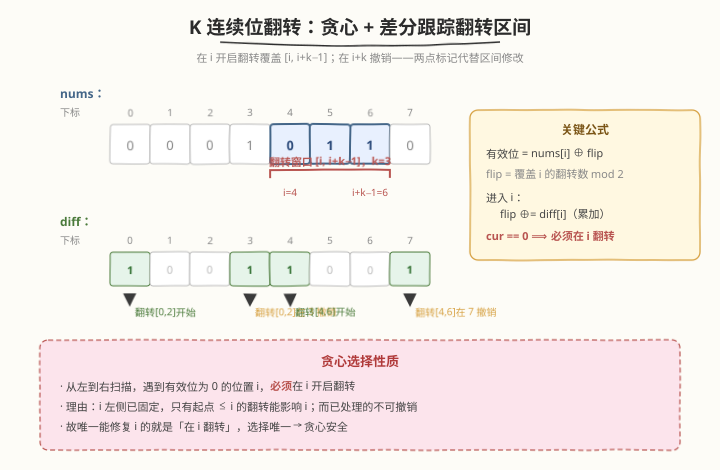
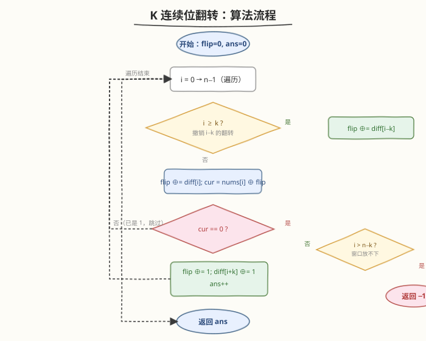
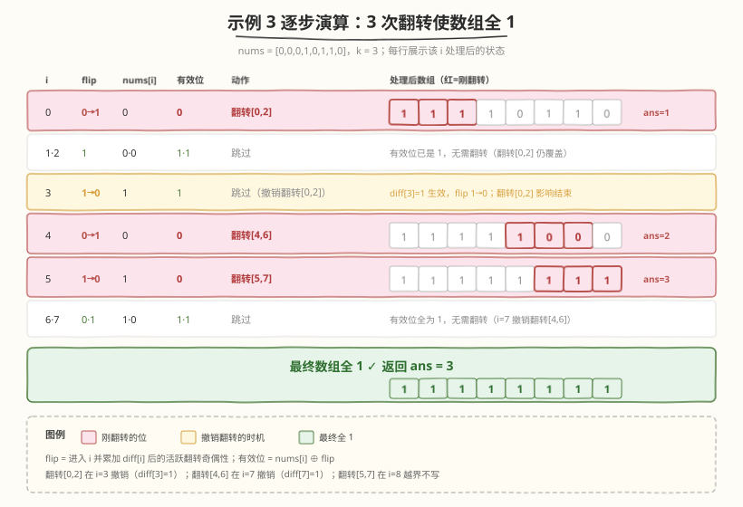

# LeetCode K 连续位的最小翻转次数 题解

## 1. 题目概述

- **标题 / 题号**：K 连续位的最小翻转次数（#995，hard）
- **链接**：https://leetcode.cn/problems/minimum-number-of-k-consecutive-bit-flips/
- **难度**：困难
- **标签**：贪心、滑动窗口、差分数组、队列

**题意**：给定一个二进制数组 `nums` 和一个整数 `k`。**k 位翻转**指从 `nums` 中选择一个长度为 `k` 的**连续子数组**，把其中的每个 `0` 改成 `1`、每个 `1` 改成 `0`。返回使数组中**不存在 `0`**（即全 `1`）所需的最小翻转次数；若不可能，返回 `-1`。

**示例 1**：

```text
输入：nums = [0,1,0], k = 1
输出：2
解释：翻转 nums[0] → [1,1,0]，再翻转 nums[2] → [1,1,1]。
```

**示例 2**：

```text
输入：nums = [1,1,0], k = 2
输出：-1
解释：只能翻转长度 2 的子数组。翻转 [0,1] 得 [0,0,0]；翻转 [1,2] 得 [1,0,1]——末位始终会被某个翻转影响奇数次或偶数次，无法保证全 1。
```

**示例 3**：

```text
输入：nums = [0,0,0,1,0,1,1,0], k = 3
输出：3
解释：
翻转 [0,1,2]: [1,1,1,1,0,1,1,0]
翻转 [4,5,6]: [1,1,1,1,1,0,0,0]
翻转 [5,6,7]: [1,1,1,1,1,1,1,1]
```

**约束**：

- $1 \le \text{nums.length} \le 10^5$
- $1 \le k \le \text{nums.length}$
- `nums[i]` 为 `0` 或 `1`

## 2. 解题思路

### 2.1 暴力思路

每次扫描数组，找到第一个 `0`，从它开始翻转长度为 `k` 的窗口，重复直到没有 `0` 或无法再翻转。每次翻转修改 $O(k)$ 个元素，最坏翻转 $O(n)$ 次，总复杂度 $O(n \cdot k)$，在 $n = 10^5$ 时超时。

> 💡 优化关键：**不需要真的修改数组**，只需跟踪「每个位置当前被翻转了几次」。翻转的累积效果可以用**差分数组**以 $O(1)$ 增量维护。

### 2.2 核心观察：贪心 + 差分跟踪翻转奇偶性



**贪心依据**：从左到右扫描，遇到第一个需要变成 `1` 的位置 `i`（即当前有效位为 `0`），**必须**在 `i` 处开启一次翻转——因为 `i` 左侧的位置已经处理完毕，只有从 `i` 起的窗口能覆盖 `i`；若不在 `i` 翻转，`i` 永远无法变 `1`。这是「贪心选择性质」：每个 `0` 的修复时机唯一确定。

**有效位**：位置 `i` 的实际值不是 `nums[i]` 本身，而是 `nums[i] ^ (覆盖 i 的翻转次数 mod 2)`。因为每被覆盖一次就翻转一次，奇数次翻转取反、偶数次不变。

**差分跟踪**：一次在 `i` 开启的翻转覆盖区间 $[i, i+k-1]$。用辅助数组 `diff`，在 `diff[i]` 标记「翻转开始」，在 `diff[i+k]` 标记「翻转结束」（即翻转影响消失）。维护一个滚动变量 `flip`（当前活跃翻转数的奇偶性）：

- 进入 `i` 时：`flip ^= diff[i]`（累加在 `i` 开始的翻转）
- 离开 `i`（即到 `i+k`）时：`flip ^= diff[i+k]`（撤销在 `i` 开始的翻转，因为它只覆盖到 `i+k-1`）

> ⚠️ 这正是 [差分数组](https://leetcode.cn/problems/range-addition/) 的思想：区间加法转两点增量，把 $O(k)$ 的区间修改降为 $O(1)$。本题只需关心奇偶性（XOR），比通用差分更轻量。

### 2.3 算法流程



1. 初始化 `flip = 0`（当前活跃翻转奇偶性），`ans = 0`，差分数组 `diff` 全 0（长度 `n+1`）
2. 从 `i = 0` 到 `n-1`：
   - `flip ^= diff[i]`（累加在 `i` 开始的翻转）
   - 计算有效位 `cur = nums[i] ^ flip`
   - 若 `cur == 0`（需要变成 1）：
     - 若 `i > n - k`（剩余长度不足 `k`，无法翻转）：返回 `-1`
     - 否则：`diff[i] ^= 1`（标记翻转开始）、`diff[i+k] ^= 1`（标记翻转结束，若 `i+k < n`）、`flip ^= 1`（立即生效）、`ans++`
3. 返回 `ans`

> 💡 `diff[i+k]` 用 XOR 而非加法：只需奇偶性。`i+k == n` 时越界，可不写（超出数组范围自然不读取）。

### 2.4 示例演算

以示例 3：`nums = [0,0,0,1,0,1,1,0]`，`k = 3`，`n = 8`：



逐步演算（`flip` 为进入 `i` 并累加 `diff[i]` 后的活跃翻转奇偶性）：

- `i=0`：`diff[0]=0` → `flip=0`。`cur=0^0=0` → 翻转[0,2]：`diff[0]^=1`→1，`diff[3]^=1`→1，`flip^=1`→1，`ans=1`
- `i=1`：`diff[1]=0` → `flip=1`。`cur=0^1=1` → 跳过
- `i=2`：`diff[2]=0` → `flip=1`。`cur=0^1=1` → 跳过
- `i=3`：`diff[3]=1` → `flip=0`（撤销翻转[0,2]）。`cur=1^0=1` → 跳过
- `i=4`：`diff[4]=0` → `flip=0`。`cur=0^0=0` → 翻转[4,6]：`diff[4]^=1`→1，`diff[7]^=1`→1，`flip^=1`→1，`ans=2`
- `i=5`：`diff[5]=0` → `flip=1`。`cur=1^1=0` → 翻转[5,7]：`diff[5]^=1`→1，`i+k=8`越界不写，`flip^=1`→0，`ans=3`
- `i=6`：`diff[6]=0` → `flip=0`。`cur=1^0=1` → 跳过
- `i=7`：`diff[7]=1` → `flip=1`（撤销翻转[4,6]）。`cur=0^1=1` → 跳过

最终 `ans = 3` ✓。汇总表：

| i | diff[i] 生效后 flip | nums[i] | 有效位 | 动作 | ans |
|---|--------------------|---------|--------|------|-----|
| 0 | 1（开启翻转[0,2]） | 0 | 0 | 翻转 | 1 |
| 1 | 1 | 0 | 1 | 跳过 | 1 |
| 2 | 1 | 0 | 1 | 跳过 | 1 |
| 3 | 0（diff[3] 撤销翻转[0,2]） | 1 | 1 | 跳过 | 1 |
| 4 | 1（开启翻转[4,6]） | 0 | 0 | 翻转 | 2 |
| 5 | 0（开启翻转[5,7]，flip 1→0） | 1 | 0 | 翻转 | 3 |
| 6 | 0 | 1 | 1 | 跳过 | 3 |
| 7 | 1（diff[7] 撤销翻转[4,6]） | 0 | 1 | 跳过 | 3 |

## 3. 参考代码

### C++（差分数组版，O(n) / O(n)）

```cpp
class Solution {
public:
    int minKBitFlips(vector<int>& nums, int k) {
        int n = nums.size();
        vector<int> diff(n + 1, 0);   // diff[i+k] 标记翻转结束
        int flip = 0, ans = 0;
        for (int i = 0; i < n; i++) {
            flip ^= diff[i];          // 累加在 i 开始/结束的翻转
            int cur = nums[i] ^ flip; // 当前有效位
            if (cur == 0) {           // 需要变 1
                if (i > n - k) return -1;  // 剩余不足 k，无法翻转
                flip ^= 1;            // 立即生效
                diff[i] ^= 1;         // 标记开始（可省，仅用于对称）
                if (i + k < n) diff[i + k] ^= 1;  // 标记结束
                ans++;
            }
        }
        return ans;
    }
};
```

### Python（队列版，O(n) / O(k)）

用队列记录「活跃翻转的起始下标」，进入 `i` 时弹出已过期的翻转（起始 + k <= i），空间降到 $O(k)$：

```python
class Solution:
    def minKBitFlips(self, nums: List[int], k: int) -> int:
        n = len(nums)
        flip_starts = collections.deque()  # 活跃翻转的起始下标
        ans = 0
        for i in range(n):
            # 弹出已过期的翻转（覆盖到 i-1 为止）
            while flip_starts and flip_starts[0] + k <= i:
                flip_starts.popleft()
            flip = len(flip_starts) & 1     # 活跃翻转数奇偶性
            cur = nums[i] ^ flip
            if cur == 0:
                if i > n - k:               # 剩余不足 k
                    return -1
                flip_starts.append(i)
                ans += 1
        return ans
```

> 💡 **两种实现等价**：差分数组版在 `diff[i+k]` 标记撤销；队列版在 `i` 处弹出 `start + k <= i` 的翻转。队列版空间 $O(k)$（活跃翻转数不超过 $\lceil n/k \rceil$），差分数组版空间 $O(n)$ 但常数更小。

## 4. 复杂度分析

| 维度 | 复杂度 | 说明 |
|------|--------|------|
| 时间复杂度 | $O(n)$ | 每个位置至多处理一次；队列版每个翻转进出队各一次，摊还 $O(1)$ |
| 空间复杂度（差分版） | $O(n)$ | 差分数组长度 $n+1$ |
| 空间复杂度（队列版） | $O(k)$ | 队列最多存 $\lceil n/k \rceil$ 个活跃翻转，不超过 $k$ |

## 5. 扩展：贪心正确性证明与「不可能」判定

**贪心选择性质**：设最优解中位置 `i` 当前有效位为 `0` 但未在 `i` 翻转，而在某个 `j > i` 翻转且该翻转覆盖 `i`（即 $j \le i \le j+k-1$，故 $j \le i$）。矛盾，故 `j == i`。即任何最优解都必须在 `i` 翻转，贪心选择安全。

**不可能的判定**：当 `i > n - k`（即 $i + k - 1 > n - 1$）且仍需翻转时，无法放下长度 `k` 的窗口，返回 `-1`。这是唯一的失败情形——前 $n-k+1$ 个位置都可能成为翻转起点，若它们都无法修复某个尾部 `0`，则无解。

> 💡 等价理解：例 2 中 `n=3, k=2`，翻转起点只能是 `i ∈ {0,1}`（$i \le n-k = 1$）。位置 2 的最终值 = `nums[2] ^ (翻转[0] + 翻转[1])`。`nums[2]=0`，而翻转[0]覆盖[0,1]、翻转[1]覆盖[1,2]，故位置 2 只受翻转[1]影响。若翻转[1]使位置1变1，则位置2=0^1=1，但位置1原本=1，翻转[1]后=0，又需翻转[0]……死循环，无解。

## 6. 面试要点

1. **为什么贪心从左到右是对的？**

   - 位置 `i` 的有效位为 `0` 时，只有起点 $\le i$ 的翻转能影响它；而 $\le i$ 的翻转要么在 `i` 之前已固定（不可撤销），要么恰在 `i`。故唯一能修复 `i` 的就是「在 `i` 开启翻转」，选择唯一 → 贪心安全。

2. **为什么用差分/队列而不是真翻转数组？**

   - 真翻转每次 $O(k)$，最坏 $O(nk)$ 超时。差分把区间翻转降为两点 $O(1)$ 增量，总 $O(n)$。奇偶性用 XOR 更轻量。

3. **`flip ^= diff[i]` 和 `diff[i+k] ^= 1` 各起什么作用？**

   - `diff[i] ^= 1`：在 `i` 开启翻转（标记起点）；`diff[i+k] ^= 1`：在 `i+k` 撤销该翻转（标记终点）。`flip` 进入 `i` 时累加 `diff[i]`，得到覆盖 `i` 的活跃翻转奇偶性。

4. **什么时候返回 -1？**

   - 当 `i > n - k` 且 `cur == 0`：剩余元素不足 `k` 个，无法放下翻转窗口。这是唯一无解情形。

5. **队列版和差分版有什么区别？**

   - 差分版：数组随机访问，空间 $O(n)$，常数小；队列版：只存活跃翻转起点，空间 $O(k)$，适合 `k << n`。两者时间都是 $O(n)$。

## 同类练习题

| # | 题目 | 与本题的关联 |
|---|------|-------------|
| 3229 | [使数组等于目标数组所需的最少操作次数 II](https://leetcode.cn/problems/minimum-operations-to-make-array-equal-to-target-ii/) | 差分数组维护区间加法，贪心对齐目标 |
| 370 | [区间加法](https://leetcode.cn/problems/range-addition/) | 差分数组母题，区间增量两点标记 |
| 1109 | [航班预订统计](https://leetcode.cn/problems/corporate-flight-bookings/) | 差分数组求前缀和还原各点累计值 |
| 239 | [滑动窗口最大值](https://leetcode.cn/problems/sliding-window-maximum/) | 滑动窗口 + 单调队列，本题队列版同属窗口滑动思想 |
