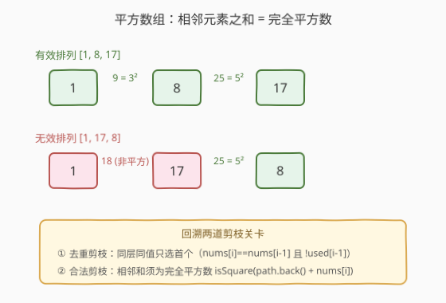
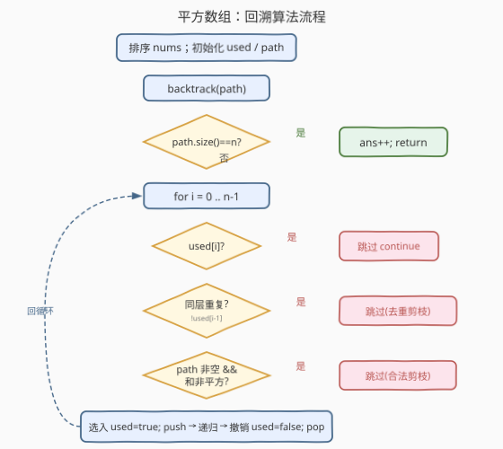

# LeetCode 平方数组的数目 题解

## 1. 题目概述

- **标题 / 题号**：平方数组的数目（#996，hard）
- **链接**：https://leetcode.cn/problems/number-of-squareful-arrays/
- **难度**：困难
- **标签**：回溯、排列、排序、数学

**题意**：如果一个数组的**任意两个相邻元素之和都是完全平方数**，则该数组称为**平方数组**。给定一个整数数组 `nums`，返回所有属于平方数组的 `nums` 的**排列数量**。如果存在某个索引 `i` 使得 `perm1[i] != perm2[i]`，则认为两个排列不同。

**示例 1**：

```text
输入：nums = [1,17,8]
输出：2
解释：[1,8,17] 和 [17,8,1] 是有效的排列。
      1+8=9=3²，8+17=25=5²，相邻和均为完全平方数。
```

**示例 2**：

```text
输入：nums = [2,2,2]
输出：1
解释：[2,2,2] 是唯一有效的排列（2+2=4=2²）。
      虽有 3!=6 种排列，但值全相同，去重后只算 1 个。
```

**约束**：

- `1 <= nums.length <= 12`
- `0 <= nums[i] <= 10^9`

## 2. 解题思路

### 2.1 暴力思路：枚举全排列 + 逐个验证

调用 `next_permutation` 或回溯生成所有 $n!$ 个排列，对每个排列检查所有相邻对之和是否为完全平方数。时间复杂度 $O(n! \cdot n)$，对 $n=12$ 约为 $5\times10^8$ 次操作，且无法在生成阶段跳过非法分支，效率低。

> ⚠️ 这题的核心难点有二：① 含重复元素时排列去重；② 相邻和为完全平方数的约束。前者正是 [47. 全排列 II](../0001-0100/47_全排列II.md) 的套路，后者只需加一道剪枝关卡。两者叠加即得最优解。

### 2.2 核心观察：回溯 + 双重剪枝



关键洞察：把「相邻和为完全平方数」的约束**前移到搜索阶段**作为剪枝条件，配合 [47 题](../0001-0100/47_全排列II.md) 的同层去重剪枝，在回溯过程中同时过滤两类无效分支：

1. **去重剪枝**（继承 47 题）：排序后，同一层中值相同的元素只选第一个。条件 `i > 0 && nums[i] == nums[i-1] && !used[i-1]` 时跳过——前一个同值元素已回溯撤销，再选只会产生重复排列。
2. **合法剪枝**（本题新增）：当 `path` 非空时，候选 `nums[i]` 与 `path` 末元素之和必须是完全平方数，否则跳过。条件 `!isSquare(path.back() + nums[i])` 时跳过。

> 💡 **为什么剪枝能前移？** 因为平方数约束是**局部**的——只取决于当前末元素与新选元素之和。一旦某步不满足，以该步为前缀的所有排列必然都不满足，整棵子树可安全剪掉。这是「约束局部性 → 剪枝可前移」的典型范式，与 [79. 单词搜索](../0001-0100/79_单词搜索.md) 的越界/已访问剪枝同构。

### 2.3 算法流程图



整体流程与 47 题的回溯模板一致，区别仅在于 `used[i]` 检查之后**多了两道剪枝关卡**（去重 + 合法）。三步模板（选 → 递归 → 撤销）完全不变。

### 2.4 示例演算

![回溯搜索树：nums=[1,8,17]](../images/squareful_search_tree.svg)

以 `nums=[1,17,8]`（排序后 `[1,8,17]`）为例。先预判平方对：$1+8=9=3^2$ ✓，$1+17=18$ ✗，$8+17=25=5^2$ ✓。

| 步骤 | path | 尝试候选 | 判定 | 动作 |
|------|------|----------|------|------|
| 1 | `[]` | `1` | 首位无约束 | 选入 |
| 2 | `[1]` | `8` | $1+8=9$ ✓ | 选入 |
| 3 | `[1,8]` | `17` | $8+17=25$ ✓ | 选入 → `[1,8,17]` **ans=1** |
| 4 | `[1]` | `17` | $1+17=18$ ✗ | 合法剪枝 |
| 5 | `[]` | `8` | 首位无约束 | 选入 |
| 6 | `[8]` | `1` | $8+1=9$ ✓ | 选入 |
| 7 | `[8,1]` | `17` | $1+17=18$ ✗ | 合法剪枝 |
| 8 | `[8]` | `17` | $8+17=25$ ✓ | 选入 |
| 9 | `[8,17]` | `1` | $17+1=18$ ✗ | 合法剪枝 |
| 10 | `[]` | `17` | 首位无约束 | 选入 |
| 11 | `[17]` | `1` | $17+1=18$ ✗ | 合法剪枝 |
| 12 | `[17]` | `8` | $17+8=25$ ✓ | 选入 |
| 13 | `[17,8]` | `1` | $8+1=9$ ✓ | 选入 → `[17,8,1]` **ans=2** |

最终答案 `2`，与示例一致。注意本例元素互异，去重剪枝未触发；对含重复元素的 `[2,2,2]`，去重剪枝会把同层第 2、3 个 `2` 全部跳过，直接得到唯一的 `[2,2,2]`。

## 3. 参考代码

### C++

```cpp
class Solution {
  public:
    int numSquarefulPerms(vector<int>& nums) {
        sort(nums.begin(), nums.end()); // ① 排序：让相同元素相邻
        vector<bool> used(nums.size(), false);
        vector<int> path;
        int ans = 0;
        backtrack(nums, used, path, ans);
        return ans;
    }

  private:
    void backtrack(vector<int>& nums, vector<bool>& used,
                   vector<int>& path, int& ans) {
        if (path.size() == nums.size()) {
            ans++;
            return;
        }
        for (int i = 0; i < (int)nums.size(); i++) {
            if (used[i]) continue;
            // ② 去重剪枝：同值元素且前一个未使用（已回溯），跳过
            if (i > 0 && nums[i] == nums[i - 1] && !used[i - 1]) continue;
            // ③ 合法剪枝：相邻和须为完全平方数
            if (!path.empty() && !isSquare((long long)path.back() + nums[i])) continue;
            // 选 → 递归 → 撤销
            used[i] = true;
            path.push_back(nums[i]);
            backtrack(nums, used, path, ans);
            path.pop_back();
            used[i] = false;
        }
    }

    bool isSquare(long long x) {
        long long r = (long long)round(sqrt((double)x));
        return r * r == x;
    }
};
```

### Python

```python
class Solution:
    def numSquarefulPerms(self, nums: List[int]) -> int:
        nums.sort()  # ① 排序：让相同元素相邻
        n = len(nums)
        used = [False] * n
        path = []
        self.ans = 0

        def is_square(x: int) -> bool:
            r = math.isqrt(x)
            return r * r == x

        def backtrack() -> None:
            if len(path) == n:
                self.ans += 1
                return
            for i in range(n):
                if used[i]:
                    continue
                # ② 去重剪枝：同值元素且前一个未使用（已回溯），跳过
                if i > 0 and nums[i] == nums[i - 1] and not used[i - 1]:
                    continue
                # ③ 合法剪枝：相邻和须为完全平方数
                if path and not is_square(path[-1] + nums[i]):
                    continue
                # 选 → 递归 → 撤销
                used[i] = True
                path.append(nums[i])
                backtrack()
                path.pop()
                used[i] = False

        backtrack()
        return self.ans
```

> ⚠️ **溢出提醒**：`nums[i]` 最大 $10^9$，两数之和最大 $2\times10^9$，恰好不超 32 位有符号整型上界（$2^{31}-1 \approx 2.1\times10^9$）。C++ 中 `path.back() + nums[i]` 若为 `int` 可能溢出，故显式转 `long long`；Python 无此问题。`math.isqrt` 返回整数平方根的向下取整，`r*r == x` 即可精确判定完全平方数。

## 4. 复杂度分析

| 维度 | 复杂度 | 说明 |
|------|--------|------|
| 时间复杂度 | $O(n!)$ 最坏 | 无任何剪枝时与全排列相同；去重 + 合法剪枝使实际搜索量远小于此 |
| 空间复杂度 | $O(n)$ | 递归栈深 $n$ + `path` / `used` 各 $O(n)$（不计结果） |

> 💡 排序的 $O(n\log n)$ 相比 $O(n!)$ 可忽略。当平方对稀疏时（大多数和不平方），合法剪枝在第 2 层就砍掉绝大部分分支，实际极快；最坏情况是所有元素相同且 $a+a$ 为完全平方数（如 `[2,2,2,2]`），此时去重剪枝把 $4!=24$ 压缩为 $1$，仍然极快。

## 5. 扩展：状态压缩 DP

当 $n$ 更大或需要严格多项式复杂度时，可把问题建模为**图上的哈密顿路径计数**：以每个元素为节点，相邻和为完全平方数的两节点连边，求经过所有节点的路径数。

定义 $dp[\text{mask}][i]$ 为已访问节点集合为 $\text{mask}$、路径终点为 $i$ 的方案数：

$$dp[\text{mask} \cup \{j\}][j] \mathrel{+}= dp[\text{mask}][i], \quad \text{若 } adj[i][j] \text{ 且 } j \notin \text{mask}$$

去重处理：排序后，转移到 $j$ 时若 `nums[j]==nums[j-1]` 且 $j-1$ 未在 mask 中则跳过（只允许先访问更靠前的同值元素）。

```cpp
int numSquarefulPerms(vector<int>& nums) {
    sort(nums.begin(), nums.end());
    int n = nums.size();
    vector<vector<int>> adj(n, vector<int>(n, 0));
    for (int i = 0; i < n; i++)
        for (int j = 0; j < n; j++)
            if (i != j) {
                long long s = (long long)nums[i] + nums[j];
                long long r = (long long)round(sqrt((double)s));
                adj[i][j] = (r * r == s);
            }
    vector<vector<int>> dp(1 << n, vector<int>(n, 0));
    for (int i = 0; i < n; i++)
        if (i == 0 || nums[i] != nums[i - 1])
            dp[1 << i][i] = 1;
    for (int mask = 0; mask < (1 << n); mask++)
        for (int i = 0; i < n; i++)
            if (dp[mask][i])
                for (int j = 0; j < n; j++) {
                    if ((mask >> j) & 1) continue;
                    if (!adj[i][j]) continue;
                    if (j > 0 && nums[j] == nums[j - 1] && !((mask >> (j - 1)) & 1)) continue;
                    dp[mask | (1 << j)][j] += dp[mask][i];
                }
    int ans = 0;
    for (int i = 0; i < n; i++)
        ans += dp[(1 << n) - 1][i];
    return ans;
}
```

时间 $O(2^n \cdot n^2)$，空间 $O(2^n \cdot n)$。对 $n=12$ 约 $6\times10^5$ 次运算，远快于回溯的最坏情况，且复杂度严格可控。这是 [526. 优美的排列](https://leetcode.cn/problems/beautiful-arrangement/) 的同款套路。

## 6. 面试要点

1. **这题和 47 题的关系是什么？**

   - 47 题是「含重复元素的全排列去重」，本题在此基础上加了一道「相邻和为完全平方数」的合法剪枝。回溯三步模板（选-递归-撤销）完全不变，只是多两个 `continue` 条件。

2. **为什么合法剪枝可以前移到搜索阶段？**

   - 平方数约束是局部的：只取决于当前末元素与新选元素之和。一旦某步不满足，以该步为前缀的所有排列必然都不满足，整棵子树可安全剪掉。约束的局部性是剪枝可前移的充要条件。

3. **去重剪枝条件为什么是 `!used[i-1]`？**

   - `!used[i-1]` 为真说明前一个同值元素已回溯撤销（同层已探索完毕），再选同值的 `nums[i]` 只会重复。这与 47 题完全一致，详见 [47 题解的扩展章节](../0001-0100/47_全排列II.md)。

4. **如何判断一个数是完全平方数？**

   - C++：`r = round(sqrt(x)); return r*r == x`，注意转 `long long` 防溢出。
   - Python：`r = math.isqrt(x); return r*r == x`，`isqrt` 返回精确整数平方根，无浮点误差。
   - 两数之和最大 $2\times10^9$，$\sqrt{} \approx 44721$，double 精度（52 位尾数）足够精确。

5. **回溯和状态压缩 DP 怎么选？**

   - $n \le 12$ 时两者都能过。回溯写法简单、面试友好、有重复元素时剪枝效果极好；DP 复杂度严格 $O(2^n n^2)$、可应对更密集的平方图。面试中先写回溯，被追问「能不能更优」再引出 DP。

## 同类练习题

| # | 题目 | 与本题的关联 |
|---|------|-------------|
| 47 | [全排列 II](https://leetcode.cn/problems/permutations-ii/)（[题解](../0001-0100/47_全排列II.md)） | 含重复元素的排列去重，本题去重剪枝的直接来源 |
| 46 | [全排列](https://leetcode.cn/problems/permutations/)（[题解](../0001-0100/46_全排列.md)） | 无重复元素的全排列回溯模板，本题的基础框架 |
| 526 | [优美的排列](https://leetcode.cn/problems/beautiful-arrangement/) | 带约束的排列计数，状态压缩 DP 的招牌题，对应本文第 5 节扩展 |
