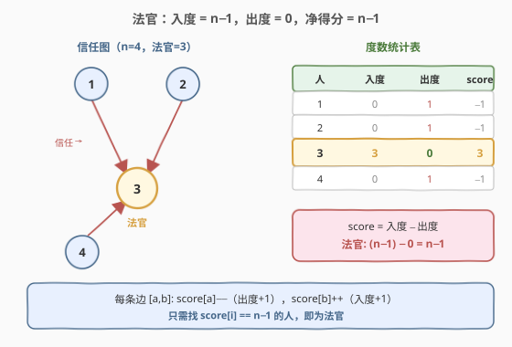
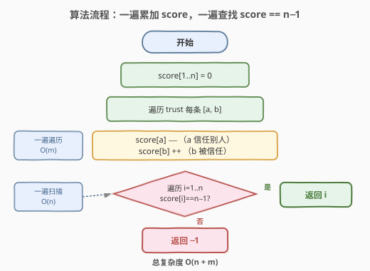
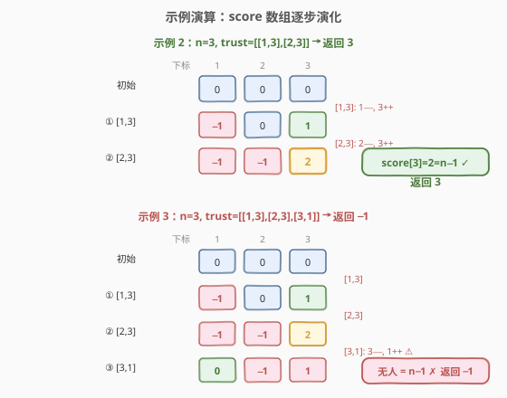

# LeetCode 找到小镇的法官 题解

## 1. 题目概述

- **标题 / 题号**：找到小镇的法官（#997，easy）
- **链接**：https://leetcode.cn/problems/find-the-town-judge/
- **难度**：简单
- **标签**：图、数组、计数

**题意**：小镇里有 `n` 个人，按 `1` 到 `n` 编号。传言其中有一个人是小镇法官。法官若存在，需同时满足：

1. 法官**不信任任何人**（出度为 0）。
2. **每个人（除法官自己）都信任法官**（入度为 $n-1$）。
3. 只有一个人同时满足上述两条。

给定数组 `trust`，`trust[i] = [ai, bi]` 表示 `ai` 信任 `bi`。若法官存在且能确定身份，返回其编号；否则返回 `-1`。

> 💡 本题本质是一张**有向图**的度数统计题——把每个人看作节点，`a 信任 b` 看作一条 `a → b` 的有向边。法官就是那个**入度 $= n-1$ 且出度 $= 0$** 的唯一节点。这与 [277. 搜寻名人](../0201-0300/277_搜寻名人.md) 的「排除 + 验证」范式是同一类「在人群中找特殊节点」的问题，只是本题用度数即可直接定位。

**示例 1**：

```text
输入：n = 2, trust = [[1,2]]
输出：2
解释：1 信任 2，2 不信任任何人。2 的入度=1=n-1，出度=0，是法官。
```

**示例 2**：

```text
输入：n = 3, trust = [[1,3],[2,3]]
输出：3
解释：1、2 都信任 3，3 不信任任何人。3 的入度=2=n-1，出度=0，是法官。
```

**示例 3**：

```text
输入：n = 3, trust = [[1,3],[2,3],[3,1]]
输出：-1
解释：3 信任 1 → 3 出度=1≠0，不满足法官条件 1；1 出度=1≠0。无人满足。
```

**约束**：

- $1 \le n \le 1000$
- $0 \le \text{trust.length} \le 10^4$
- `trust[i].length == 2`
- `trust` 中所有 `[ai, bi]` **互不相同**
- $a_i \ne b_i$
- $1 \le a_i, b_i \le n$

## 2. 解题思路

### 2.1 暴力思路

对每个人 `i`（$1 \le i \le n$），遍历整个 `trust` 数组统计：有多少条边指向 `i`（入度），有多少条边从 `i` 发出（出度）。若找到入度 $= n-1$ 且出度 $= 0$ 的人即为法官。

每统计一人需 $O(m)$（$m$ 为 `trust` 长度），共 $n$ 人，总复杂度 $O(n \cdot m)$。`n ≤ 1000`、`m ≤ 10^4` 时最坏 $10^7$ 次比较，虽能通过但存在大量重复扫描——同一条边 `[a, b]` 会被 $n$ 个人各检查一次。可以一次遍历 `trust` 统计所有人的度数，再一遍扫描找法官，降到 $O(n + m)$。

### 2.2 核心观察：入度 − 出度 = n−1 唯一标识法官



把每条信任边 `a → b` 看作有向边，定义每个人的**净信任得分**：

$$\text{score}[i] = \text{入度}[i] - \text{出度}[i]$$

- 被信任一次 → `score[i]++`（入度 +1）；
- 信任别人一次 → `score[i]--`（出度 +1）。

法官的得分：

$$\text{score}[\text{judge}] = (n-1) - 0 = n-1$$

> 💡 **关键推论：只有法官的净得分能恰好等于 $n-1$。** 对任意非法官 $j$：
> - 法官不信任任何人，所以法官不会信任 $j$，$j$ 的入度至多 $n-2$（除自己和法官外的 $n-2$ 人）；
> - $j$ 的出度 $\ge 0$；
> - 故 $\text{score}[j] \le (n-2) - 0 = n-2 < n-1$。
>
> 因此**只需一遍扫 `trust` 累加 `score`，再一遍扫 $1..n$ 找 `score == n-1` 的人**。无需开两个数组分别记入度出度，单数组即可——这是本题最优雅的简化。

> ⚠️ **唯一性证明**：是否存在两个人同时得分 $n-1$？若 $X$ 入度为 $n-1$（所有人都信任 $X$），则 $Y$ 也信任 $X$，$Y$ 出度 $\ge 1$，$Y$ 得分 $\le (n-1)-1 = n-2 < n-1$，矛盾。故至多一人得分 $n-1$，无需额外去重。

### 2.3 算法流程图



```
1. 初始化 score[1..n] = 0
2. 遍历 trust 中每条 [a, b]：
      score[a]--    （a 信任别人 → 出度 +1 → 得分 -1）
      score[b]++    （b 被信任     → 入度 +1 → 得分 +1）
3. 遍历 i = 1..n：
      若 score[i] == n-1 → 返回 i
4. 返回 -1（无人满足）
```

> 💡 两个方向相反的更新恰好把「入度 − 出度」压缩进单数组，省掉一半空间且逻辑更清晰。第 3 步只需找到第一个满足者即可返回——由 2.2 的唯一性证明，至多一人满足。

### 2.4 示例演算



**示例 2**（`n=3, trust=[[1,3],[2,3]]`）：

| 步骤 | 边 [a,b] | score[a] 变化 | score[b] 变化 | score 数组（下标 1/2/3） |
|------|----------|---------------|---------------|------------------------|
| 初始 | — | — | — | `[0, 0, 0]` |
| ① | [1,3] | score[1]−− → −1 | score[3]++ → 1 | `[-1, 0, 1]` |
| ② | [2,3] | score[2]−− → −1 | score[3]++ → 2 | `[-1, -1, 2]` |

扫描 `i=1..3`：`score[1]=−1≠2`，`score[2]=−1≠2`，`score[3]=2=n−1` ✅ → **返回 3**。

**示例 3**（`n=3, trust=[[1,3],[2,3],[3,1]]`）：

| 步骤 | 边 [a,b] | score 数组（下标 1/2/3） |
|------|----------|------------------------|
| 初始 | — | `[0, 0, 0]` |
| ① | [1,3] | `[-1, 0, 1]` |
| ② | [2,3] | `[-1, -1, 2]` |
| ③ | [3,1] | `[0, -1, 1]` |

扫描 `i=1..3`：`score[1]=0≠2`，`score[2]=−1≠2`，`score[3]=1≠2` → 无人满足 → **返回 −1** ⛔

> ⚠️ 示例 3 中第 ③ 步 `[3,1]` 使 `score[3]` 从 2 跌回 1——3 信任了 1，出度从 0 变 1，不再满足「法官不信任任何人」。这正是「出度必须为 0」的直观体现：单数组把这一约束自动编码进 `score` 的回退中。

## 3. 参考代码

### C++

```cpp
// 找到小镇的法官.cpp —— 单数组净得分（入度−出度）
#include <vector>
using namespace std;

class Solution {
public:
    int findJudge(int n, vector<vector<int>>& trust) {
        vector<int> score(n + 1, 0);                 // 下标 1..n
        for (const auto& t : trust) {
            score[t[0]]--;                           // a 信任别人 → 出度 +1
            score[t[1]]++;                           // b 被信任     → 入度 +1
        }
        for (int i = 1; i <= n; i++)
            if (score[i] == n - 1)                   // 入度 n-1 且出度 0
                return i;
        return -1;
    }
};
```

### Python

```python
class Solution:
    def findJudge(self, n: int, trust: list[list[int]]) -> int:
        score = [0] * (n + 1)                        # 下标 1..n
        for a, b in trust:
            score[a] -= 1                            # a 信任别人 → 出度 +1
            score[b] += 1                            # b 被信任     → 入度 +1
        for i in range(1, n + 1):
            if score[i] == n - 1:                    # 入度 n-1 且出度 0
                return i
        return -1
```

> 💡 **实现细节**：
> 1. **数组下标从 1 开始**：题目编号为 $1..n$，开 `n+1` 长度省去下标偏移，`score[0]` 闲置。
> 2. **一次遍历同时更新两端**：每条 `[a, b]` 让 `a` 减 1、`b` 加 1，等价于同时累加出度和入度，但压缩进一个数组。
> 3. **无需特判 `trust` 为空**：当 `trust=[]` 时所有 `score` 恒为 0。若 `n=1`，则 `n-1=0`，`score[1]=0` 满足条件返回 1（唯一的人天然是法官，无人需信任也无人可信任，入度 0 = n−1）；若 `n>1` 则无人得分 $n-1$，返回 −1，逻辑自洽。

## 4. 复杂度分析

| 维度 | 复杂度 | 说明 |
|------|--------|------|
| **时间复杂度** | $O(n + m)$ | 一遍遍历 `trust`（$m$ 条边）累加 `score`，一遍扫描 $1..n$ 查找，合计 $O(n + m)$ |
| **空间复杂度** | $O(n)$ | `score` 数组长度 $n+1$，与边数无关 |

> 💡 相比 2.1 暴力的 $O(n \cdot m)$，本解法把「每人重扫全图」改为「一遍扫图统计所有人度数」，复杂度从乘积降为线性之和。当 $n=1000$、$m=10^4$ 时，从 $10^7$ 降到 $1.1 \times 10^4$，提升近三个数量级。

## 5. 扩展：从两数组到单数组的等价压缩

最直观的写法是开两个数组分别记入度和出度：

```python
in_deg = [0] * (n + 1)
out_deg = [0] * (n + 1)
for a, b in trust:
    out_deg[a] += 1
    in_deg[b] += 1
for i in range(1, n + 1):
    if in_deg[i] == n - 1 and out_deg[i] == 0:
        return i
return -1
```

这能正确求解，但可观察到判定条件 `in_deg[i] == n-1 and out_deg[i] == 0` 等价于 `in_deg[i] - out_deg[i] == n-1`。于是令 `score = in_deg - out_deg`，两数组合一：

| 写法 | 数组数 | 判定条件 | 空间 |
|------|--------|----------|------|
| 两数组 | 2 | `in[i]==n-1 and out[i]==0` | $O(n)$ ×2 |
| 单数组 | 1 | `score[i]==n-1` | $O(n)$ |

> 💡 这种「两个相关计数器合并为差值」的技巧在图论题中常见——只要判定条件能写成两计数的**固定差值**，就能压缩成单数组。关键是确认该差值能**唯一标识**目标（本题由 2.2 的唯一性证明保证）。

## 6. 面试要点

1. **法官的两个条件如何转化为图论概念？**

   - 「法官不信任任何人」= 出度为 0；「除法官外所有人都信任法官」= 入度为 $n-1$。于是法官是图中唯一满足入度 $n-1$ 且出度 0 的节点。

2. **为什么用 `score = 入度 − 出度` 单数组就能定位法官？**

   - 法官得分 $= (n-1) - 0 = n-1$。任意非法官入度至多 $n-2$（法官不信任任何人，不会贡献入度），出度 $\ge 0$，得分 $\le n-2 < n-1$。故 `score == n-1` 唯一标识法官，无需两个数组。

3. **`trust` 为空时怎么处理？**

   - 所有 `score` 恒为 0。`n=1` 时 `n-1=0`，`score[1]=0` 满足返回 1（唯一的人是法官）；`n>1` 时无人得分 $n-1$，返回 −1。无需特判，代码自然适配。

4. **是否存在两个人同时满足法官条件？**

   - 不可能。若 $X$ 入度为 $n-1$（所有人都信任 $X$），则 $Y$ 也信任 $X$，$Y$ 出度 $\ge 1$，不满足「出度为 0」。故至多一人满足，扫描时找到第一个即可返回。

5. **题目保证 `trust` 中边互不重复，这有什么用？**

   - 保证同一条 `a → b` 不会被重复计数，`score` 的累加不会因重复边而失真。若允许重复边，本解法依然正确（重复边只是让 `score` 多加减几次，但法官的入度仍需 $n-1$ 个不同的人信任，重复边不增加新的信任者），不过题目的互异保证让度数语义更干净。

> 💡 **一句话总结**：把信任关系建模为有向边，法官就是入度 $n-1$ 且出度 0 的唯一节点。用 `score = 入度 − 出度` 单数组一遍累加、一遍查找 `score == n-1`，$O(n+m)$ 一次过。

## 同类练习题

| # | 题目 | 与本题的关联 |
|---|------|-------------|
| 277 | [搜寻名人](https://leetcode.cn/problems/find-the-celebrity/)（[题解](../0201-0300/277_搜寻名人.md)） | 同一「在人群中找特殊节点」主题，名人是「所有人都认识他、他不认识任何人」，本题的图论度数版，277 用排除 + 验证 |
| 1791 | [找出星型图的中心节点](https://leetcode.cn/problems/find-center-of-star-graph/) | 中心节点出现在每条边中（度 $= n-1$），无向图版「找特殊节点」，比本题更简单 |
| 1557 | [可以到达所有点的最少点数目](https://leetcode.cn/problems/minimum-number-of-vertices-to-reach-all-points/) | 找入度为 0 的节点集合，与本题「找特殊度数节点」同源，只是目标变为入度 0 而非入度 $n-1$ |
| 886 | [可能的二分法](https://leetcode.cn/problems/possible-bipartition/) | 把「不喜欢」关系建模为图并判定二分图，同样是「关系数组 → 图建模」的套路 |
