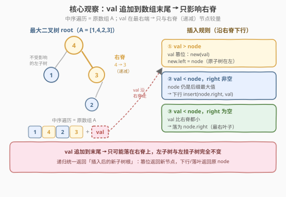
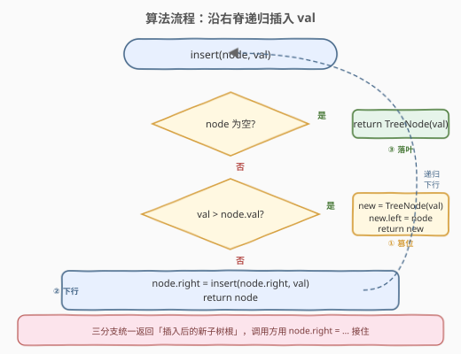
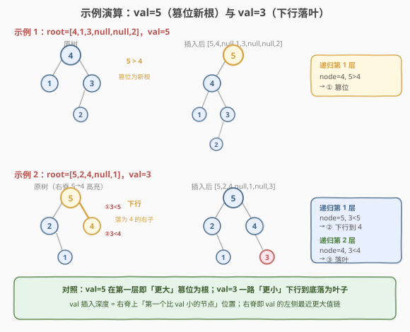

# LeetCode 最大二叉树 II 题解

## 1. 题目概述

- **标题 / 题号**：最大二叉树 II（#998，medium）
- **链接**：https://leetcode.cn/problems/maximum-binary-tree-ii/
- **难度**：中等
- **标签**：树、二叉树、递归

**题意**：最大二叉树（[654. 最大二叉树](../0601-0700/654_最大二叉树.md)）由数组 `A` 按如下规则递归构造：

1. 根 = `A` 中最大值；
2. 左子树 = 最大值**左侧**前缀构造的最大二叉树；
3. 右子树 = 最大值**右侧**后缀构造的最大二叉树。

本题给定一棵**已构造好的**最大二叉树 `root`（它由某个未知数组 `A` 构造）和一个整数 `val`。将 `val` **追加到 `A` 的末尾**得到 `A'`，返回 `A'` 对应的最大二叉树。

> ⚠️ 注意：你**不知道** `A` 的具体内容，只拿到它构造出的树 `root`。但题目保证 `root` 是某数组 `A` 的最大二叉树，且 `A` 中元素**互不相同**。

**示例 1**：

```text
输入：root = [4,1,3,null,null,2], val = 5
输出：[5,4,null,1,3,null,null,2]

  原树 (A=[1,4,2,3]):        插入 5 后 (A'=[1,4,2,3,5]):
        4                          5
       / \                        /
      1   3                      4
         /                      / \
        2                      1   3
                               /
                              2
```

`val=5` 是 `A'` 中最大值，成为新根，原树整体作为 `5` 的左子树。

**示例 2**：

```text
输入：root = [5,2,4,null,1], val = 3
输出：[5,2,4,null,1,null,3]

  原树 (A=[2,1,5,4]):         插入 3 后 (A'=[2,1,5,4,3]):
        5                          5
       / \                        / \
      2   4                      2   4
       \                          \   \
        1                          1   3
```

`val=3` 小于 `5`、小于 `4`，而 `4` 无右子，故 `3` 成为 `4` 的右孩子（最右叶子）。

**约束**：

- 树中节点数 `[1, 100]`
- `1 <= Node.val <= 100`
- `A` 中所有值互不相同
- `1 <= val <= 100`

> 💡 本题是 [654. 最大二叉树](../0601-0700/654_最大二叉树.md) 的「**增量版**」——654 从数组**一次性**构造，998 在已构造的树上**追加一个元素**。抓住「`val` 追加到末尾」这一约束，就能把看似要重建整棵树的问题缩小到**右脊**上的一条路径。

## 2. 解题思路

### 2.1 暴力思路：还原数组 + 重建整棵树

既然 `root` 是某数组 `A` 的最大二叉树，最稳妥的暴力做法是「**还原 `A`，再重建**」：

1. **还原数组**：对 `root` 做一次**中序遍历**，得到 `A`——因为最大二叉树的中序遍历恰是原数组的顺序（根是区间最大值，左子树 = 左侧前缀，右子树 = 右侧后缀，中序「左→根→右」恰好还原原顺序）；
2. **追加**：`A.append(val)`；
3. **重建**：用 654 的分治算法（或单调栈）从 `A'` 重建最大二叉树。

```text
A = inorder(root)          # O(n)
A.append(val)              # O(1)
return buildMaxBT(A)       # O(n^2) 朴素 / O(n) 单调栈
```

时间 $O(n^2)$（朴素重建）或 $O(n)$（单调栈），空间 $O(n)$。能过，但**做了大量无用功**——`val` 只追加了一个元素，原树中绝大多数父子关系根本没变，却被拆掉重建了一遍。

> ⚠️ 暴力法的浪费在于「**全量重建**」：它把「在末尾追加一个元素」这个**局部变动**当成了「重新构造」的全局问题。但 `val` 在数组末尾，它只可能影响树的**右侧**，左子树和大部分右子树都原封不动。我们需要找到这个「局部」的精确边界。

### 2.2 核心观察：val 追加到末尾 → 只影响右脊



**关键洞察**：`val` 被追加到 `A` 的**末尾**，意味着在数组中 `val` 位于所有原有元素之**右**。而最大二叉树中，**右脊**（从根一路沿 `right` 指针向下的路径）恰好对应数组**后缀的递减最大值序列**：

> 右脊上的每个节点，都是「从它到数组末尾」这一后缀的最大值；右脊从上到下严格递减。

因此 `val` 作为末尾元素，只可能与右脊上的节点发生「谁更大」的较量，**左子树和右脊节点的左子树完全不受影响**。插入逻辑化为沿右脊的一次下行：

| 情况 | 条件 | 动作 | 直觉 |
|------|------|------|------|
| **① val 更大** | `val > node.val` | 新建 `new(val)`，`new.left = node`，返回 `new` | `val` 是「`node` 对应后缀 + val」的最大值，取代 `node` 位置；原 `node` 子树都在 `val` 左侧 → 作 `val` 的左子树 |
| **② 下行** | `val < node.val` 且 `node.right` 非空 | `node.right = insert(node.right, val)`，返回 `node` | `node` 仍是此后缀的最大值，`val` 继续往更小的右脊节点比 |
| **③ 落叶** | `val < node.val` 且 `node.right` 为空 | `node.right = TreeNode(val)` | `val` 比右脊所有节点都小，成为最右叶子 |

> 💡 **为什么情况 ① 里旧 `node` 一定挂到 `val` 的**左**子树而非右子树？** 因为 `val` 在数组中位于 `node` 及其整棵子树对应区间之**右**（`val` 是末尾元素）。最大二叉树中，「数组中靠右的元素」只能出现在「靠左元素」的**右**侧路径上——所以 `node`（靠左）成为 `val`（靠右）的**左**孩子。这正是「追加到末尾」这一约束的几何体现。

### 2.3 算法流程图



**递归函数** `insert(node, val)`：

1. **空节点**：`node == null` → 返回 `TreeNode(val)`（情况 ③ 的递归基，`val` 成为叶子）。
2. **val 更大**：`val > node.val` → 新建 `new(val)`；`new.left = node`；返回 `new`（情况 ①）。
3. **val 更小**：`val < node.val` → `node.right = insert(node.right, val)`；返回 `node`（情况 ②，递归下行）。

> ⚠️ 三条分支的返回值都是「**插入后该位置的新子树根**」——情况 ① 返回新节点 `new`（根变了），情况 ②③ 返回原 `node`（根没变，只是右子树更新了）。调用方用 `node.right = insert(node.right, val)` 接住返回值，自然处理了「根变 / 根不变」两种情形。这正是递归「统一返回新子树根」范式的优雅之处。

### 2.4 示例演算

以两个示例对照「右脊下行」的全过程：



**示例 1**：`root = [4,1,3,null,null,2]`、`val = 5`，右脊 `4 → 3`：

| 递归层 | node | node.val | 比较 | 命中情况 | 动作 |
|--------|------|----------|------|----------|------|
| 1 | 4 | 4 | `5 > 4` | ① val 更大 | `new(5)`，`new.left = 树(4)`，返回 `new(5)` |

仅一层递归：`5 > 4` 直接命中情况 ①，`5` 成为新根，原树挂为左子树。结果 `[5,4,null,1,3,null,null,2]` ✓。

**示例 2**：`root = [5,2,4,null,1]`、`val = 3`，右脊 `5 → 4`：

| 递归层 | node | node.val | 比较 | node.right | 命中情况 | 动作 |
|--------|------|----------|------|------------|----------|------|
| 1 | 5 | 5 | `3 < 5` | 4（非空） | ② 下行 | `5.right = insert(4, 3)`，返回 5 |
| 2 | 4 | 4 | `3 < 4` | null | ③ 落叶 | `4.right = TreeNode(3)`，返回 4 |

两层递归：`3` 沿右脊 `5 → 4` 下行，到 `4` 时右子为空，落为 `4` 的右孩子。结果 `[5,2,4,null,1,null,3]` ✓。

> 💡 **对照两个示例**：`val=5` 在第一层就因「更大」截断下行，直接篡位为根；`val=3` 一路「更小」下行到底，落为叶子。`val` 最终插入的深度，取决于它在右脊递减序列中「第一个比它小的节点」的位置——这与 [654 单调栈解法](../0601-0700/654_最大二叉树.md) 中「右侧最近更大值」的思想同源：右脊正是 `val` 的「左侧最近更大值」链。

## 3. 参考代码

### C++

```cpp
// 最大二叉树II.cpp —— 沿右脊递归插入
// 编译: g++ -O2 -std=c++17 最大二叉树II.cpp -o maxbt2
struct TreeNode {
    int val;
    TreeNode* left;
    TreeNode* right;
    TreeNode() : val(0), left(nullptr), right(nullptr) {}
    TreeNode(int x) : val(x), left(nullptr), right(nullptr) {}
    TreeNode(int x, TreeNode* l, TreeNode* r) : val(x), left(l), right(r) {}
};

class Solution {
public:
    TreeNode* insertIntoMaxTree(TreeNode* root, int val) {
        if (!root) return new TreeNode(val);                 // 空节点 → val 落叶
        if (val > root->val) {                               // val 更大 → 取代当前根
            TreeNode* node = new TreeNode(val);
            node->left = root;                               // 原子树在 val 左侧 → 作左子树
            return node;
        }
        root->right = insertIntoMaxTree(root->right, val);   // val 更小 → 下行
        return root;
    }
};
```

### Python

```python
class Solution:
    def insertIntoMaxTree(self, root: Optional[TreeNode], val: int) -> Optional[TreeNode]:
        if not root:
            return TreeNode(val)                             # 空节点 → val 落叶
        if val > root.val:                                   # val 更大 → 取代当前根
            node = TreeNode(val)
            node.left = root                                 # 原子树在 val 左侧 → 作左子树
            return node
        root.right = self.insertIntoMaxTree(root.right, val)  # val 更小 → 下行
        return root
```

> 💡 递归体极简：三个 `if` 对应三种情况，返回值统一为「插入后的新子树根」。`val > root.val` 分支里 `node->left = root` 一句同时完成「篡位 + 接管原子树」，是全题最精妙的一笔——原子树作为左子树而非右子树，根源在于 `val` 在数组末尾（所有原子树元素都在 `val` 左侧）。

## 4. 复杂度分析

| 维度 | 复杂度 | 说明 |
|------|--------|------|
| 时间复杂度 | $O(h)$ | $h$ = 右脊长度；`val` 沿右脊下行，每层 $O(1)$，最多走完整条右脊 |
| 空间复杂度 | $O(h)$ | 递归栈深度 = 右脊长度；最坏（右脊退化成链）$O(n)$，平均 $O(\log n)$ |
| 最坏情况 | $O(n)$ 时间 / 空间 | 数组已降序时（如 `[5,4,3,2,1]`），最大二叉树退化为右倾链，右脊长 $n$，`val` 需走到底 |

> ⚠️ 注意 $h$ 是**右脊长度**而非树高。最大二叉树的右脊长度 = 数组后缀的递减段长度。最坏情况（数组降序）右脊长 $n$；但绝大多数情况下右脊远短于 $n$。对比暴力法 $O(n)$（单调栈）/ $O(n^2)$（朴素），本解法在「单次插入」场景下常数更小、且**不破坏原树中无关的部分**。

## 5. 扩展：迭代写法与单调栈视角

### 5.1 迭代写法

递归本质是沿右脊下行，可改成等价的迭代——用 `cur` 走右脊，找到 `val` 的篡位点：

```python
class Solution:
    def insertIntoMaxTree(self, root: Optional[TreeNode], val: int) -> Optional[TreeNode]:
        node = TreeNode(val)
        if not root or val > root.val:              # val 直接成为新根
            node.left = root
            return node
        cur = root
        while cur.right and cur.right.val > val:    # 沿右脊下行直到遇到比 val 小的
            cur = cur.right
        node.left = cur.right                       # 比 val 小的子树挂为 val 的左子树
        cur.right = node                            # val 取代 cur.right 的位置
        return root
```

迭代版把「下行」与「篡位」合并：沿右脊走到**第一个 `right.val < val`**（或 `right` 为空）的节点 `cur`，让 `val` 取代 `cur.right`，原 `cur.right` 子树挂为 `val` 的左子树。逻辑与递归版完全等价，只是把「下行找位」显式化。

### 5.2 与 654 单调栈解法的同源

[654 单调栈解法](../0601-0700/654_最大二叉树.md)的核心结论是：元素 `nums[i]` 的父节点 = **左右最近更大值中较小者**。本题中 `val` 追加到末尾，它**没有右侧元素**，故：

- `val` 的「右侧最近更大值」不存在（$+\infty$）；
- `val` 的「左侧最近更大值」= 右脊上第一个比 `val` 大的节点（即递归中「`val < node.val` 下行」最终停下的那个 `node`）。

由 $\min(L, +\infty) = L$，`val` 的父就是右脊上第一个比它大的节点；若 `val` 比所有右脊节点都大（无左侧更大值），`val` 就是新根。这与递归逻辑**完全同构**——递归的「下行」就是单调栈的「找左侧最近更大值」。理解这一点，998 即是 654 单调栈解法在「增量插入」场景下的特化。

## 6. 面试要点

1. **为什么最大二叉树的中序遍历等于原数组？**

   > 最大二叉树中，根 = 区间最大值，左子树管辖左侧前缀、右子树管辖右侧后缀。中序遍历「左子树 → 根 → 右子树」的访问顺序，恰好把「左侧前缀 → 最大值 → 右侧后缀」按原数组顺序还原。这是暴力法「还原数组」的理论依据。

2. **「val 追加到末尾」这个条件为什么重要？**

   > 它把 `val` 锁定在数组最右端，使 `val` 只可能与**右脊**（后缀递减最大值链）交互。若题目改成「在数组中间插入 `val`」，左右子树都可能受影响，必须全量重建——本题的优雅全靠「末尾」这个约束。面试时务必强调这一前提。

3. **情况 ① 里原子树为什么挂到 `val` 的**左**子树？**

   > `val` 在数组末尾，原 `node` 子树对应的所有元素都在 `val` **左侧**。最大二叉树中，靠左的元素只能出现在靠右元素的**左**子树（沿 `left` 指针）。所以 `node`（靠左）成为 `val`（靠右）的左孩子。方向不能搞反，搞反就破坏了「右脊对应右侧后缀」的结构。

4. **递归返回值为什么能统一处理「根变 / 根不变」？**

   > 三种情况都返回「插入后该位置的新子树根」：情况 ① 返回新节点（根变了），情况 ②③ 返回原 `node`（根没变）。调用方 `node.right = insert(node.right, val)` 用赋值接住返回值，无需区分两种情形。这是树形递归「统一返回新子树根」的标准范式，与 [450 删除 BST 节点](../0401-0500/450_删除二叉搜索树中的节点.md) 同构。

5. **最坏时间复杂度何时出现？空间呢？**

   > 数组**降序**时（如 `[5,4,3,2,1]`），最大二叉树退化为右倾链，右脊长 $n$。若 `val` 是最小值，需走完整条右脊才落叶，时间空间均 $O(n)$。但这是「单次插入」的代价；若需**批量**插入多个元素，每次 $O(n)$ 累加可能不如一次性单调栈重建 $O(n)$ 划算——面试被追问时可提此权衡。

> 💡 **一句话总结**：998 的灵魂是「**末尾追加 → 局限于右脊**」——`val` 沿右脊递减链下行，遇到第一个比自己小的节点就篡位（原子树作左子树），否则落为最右叶子。三条分支、统一返回新子树根，递归体极简，与 654 单调栈「左侧最近更大值」思想同源。

## 同类练习题

| # | 题目 | 与本题的关联 |
|---|------|-------------|
| 654 | [最大二叉树](https://leetcode.cn/problems/maximum-binary-tree/)（[题解](../0601-0700/654_最大二叉树.md)） | 本题的前作，从数组**一次性**构造最大二叉树；998 是其增量插入版，单调栈「左右最近更大值」思想同源 |
| 623 | [在二叉树中增加一行](https://leetcode.cn/problems/add-one-row-to-binary-tree/)（[题解](../0601-0700/623_在二叉树中增加一行.md)） | 同为「按规则在指定深度插入节点」，对照「整行插入」与「单点沿脊插入」 |
| 450 | [删除二叉搜索树中的节点](https://leetcode.cn/problems/delete-node-in-a-bst/)（[题解](../0401-0500/450_删除二叉搜索树中的节点.md)） | 同为树形「递归返回新子树根」范式，插入与删除的镜像对照 |
| 108 | [将有序数组转换为二叉搜索树](https://leetcode.cn/problems/convert-sorted-array-to-binary-search-tree/)（[题解](../0101-0200/108_将有序数组转换为二叉搜索树.md)） | 另一类「数组 → 树」的构造，中点切分 vs 最大值切分，对照不同树形的构造不变式 |
