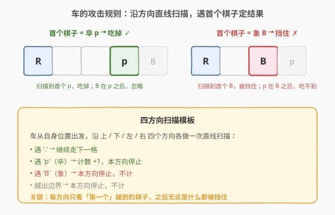
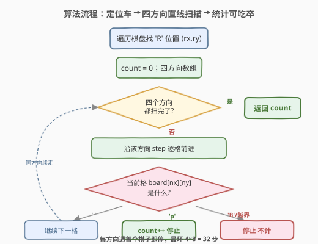
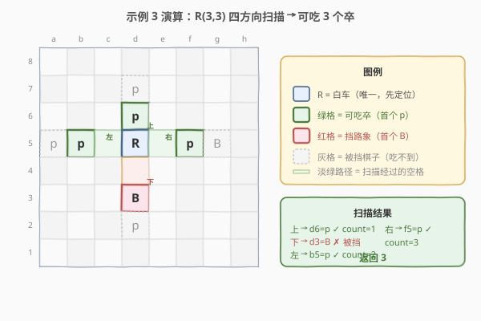

# 可以被一步捕获的棋子数

- **题目名称**：可以被一步捕获的棋子数
- **链接**：[999. 可以被一步捕获的棋子数](https://leetcode.cn/problems/available-captures-for-rook/)
- **难度**：简单
- **标签**：数组、矩阵、模拟

## 1. 题目概述

给定一个 $8 \times 8$ 的棋盘，棋盘上恰好有**一个白色车** `'R'`，可能存在**白色的象** `'B'` 与**黑色的卒** `'p'`，空格用 `'.'` 表示。车可以沿**水平或竖直**方向（上、下、左、右）移动任意格，直到遇到另一个棋子或棋盘边界。若它能在一次移动中到达某棋子所在格，则能**吃掉**该棋子。

> ⚠️ **关键约束**：车**不能穿过其它棋子**——无论象还是卒都会挡住去路。因此每个方向上**只有第一个碰到的棋子**可能被吃，其后的棋子全部被挡住。返回白车一步能吃掉的**黑卒数量**。

**示例 1**：

```text
输入：board =
[[".",".",".",".",".",".",".","."],
 [".",".",".","p",".",".",".","."],
 [".",".",".","R",".",".",".","p"],
 [".",".",".",".",".",".",".","."],
 [".",".",".",".",".",".",".","."],
 [".",".",".","p",".",".",".","."],
 [".",".",".",".",".",".",".","."],
 [".",".",".",".",".",".",".","."]]
输出：3
解释：车在 (2,3)，四个方向的首个棋子都是卒 → 上 (1,3)、下 (5,3)、右 (2,7) 各吃一个，左侧空到边界。
```

**示例 2**：

```text
输入：board =
[[".",".",".",".",".",".",".","."],
 [".","p","p","p","p","p",".","."],
 [".","p","p","B","p","p",".","."],
 [".","p","B","R","B","p",".","."],
 [".","p","p","B","p","p",".","."],
 [".","p","p","p","p","p",".","."],
 [".",".",".",".",".",".",".","."],
 [".",".",".",".",".",".",".","."]]
输出：0
解释：车在 (3,3)，四个方向第一个碰到的都是象 'B'，全部被挡 → 一个卒也吃不到。
```

**示例 3**：

```text
输入：board =
[[".",".",".",".",".",".",".","."],
 [".",".",".","p",".",".",".","."],
 [".",".",".","p",".",".",".","."],
 ["p","p",".","R",".","p","B","."],
 [".",".",".",".",".",".",".","."],
 [".",".",".","B",".",".",".","."],
 [".",".",".","p",".",".",".","."],
 [".",".",".",".",".",".",".","."]]
输出：3
解释：车在 (3,3)，可吃位置 b5、d6、f5 的卒。向下的首个棋子是象（d3），被挡住；其后的卒吃不到。
```

**约束条件**：

- `board.length == 8`
- `board[i].length == 8`
- `board[i][j]` 仅取 `'R'`、`'.'`、`'B'`、`'p'`
- **只有一个格子**为 `'R'`

> 💡 本题是一道纯模拟题：先定位车，再沿四个方向各做一次直线扫描，根据「第一个遇到的棋子」决定是否计数。与 [54 螺旋矩阵](../0001-0100/54_螺旋矩阵.md) 的「按方向逐格推进」同属矩阵扫描家族，只是这里方向固定为车所在的四条直线、且每方向遇阻即停。

---

## 2. 解题思路

### 2.1 暴力思路：对每个卒判断是否可达

最直观的做法：枚举棋盘上每一个卒 `'p'`，对每个卒检查它与车之间是否「同行或同列且中间无其它棋子」：

- 若卒与车**同行**，检查两者之间这一行段上是否全为 `'.'`；
- 若卒与车**同列**，检查两者之间这一列段上是否全为 `'.'`；
- 否则不可达。

每个卒需 $O(8)$ 扫描中间格，最坏 $64$ 个卒共 $O(64 \times 8) = O(512)$。能过，但存在大量重复——**同一条扫描线上多个卒时，车从自身出发只会撞到最近的一个**，远处的卒根本不必单独判断。从车的视角出发「主动扫描四方向」天然避免这种浪费。

### 2.2 核心观察：四方向直线扫描，遇首个棋子定结果



把车的攻击范围看成从车所在格发出的**四条射线**（上、下、左、右）。每条射线沿直线前进，遇到的第一种情形决定本方向的结局：

| 碰到的第一格内容 | 处理 | 计数 |
|----------------|------|------|
| `'.'`（空） | 继续向下一格 | 不计 |
| `'p'`（卒） | 吃掉，本方向停止 | `+1` |
| `'B'`（象） | 被挡住，本方向停止 | 不计 |
| 越出边界 | 本方向停止 | 不计 |

> 💡 **关键洞察**：每个方向**只需关心第一个遇到的棋子**——是 `'p'` 就计数，是 `'B'` 或边界就不计；其后无论有多少棋子都被这个「首个棋子」挡住，完全无需查看。于是每个方向是一个**带提前终止的线性扫描**，最多走 7 格。

> ⚠️ **常见误区**：误以为「卒不挡路」或「象可被越过」。题面明确——**车不能穿过任何棋子**，卒和象都会阻挡。示例 3 向下方向正是被象 `'B'` 挡住，其后的卒虽近在咫尺却吃不到。

### 2.3 算法流程图



```
1. 遍历 8×8 棋盘，找到 'R' 的位置 (rx, ry)
2. count = 0；方向数组 dirs = [(-1,0),(1,0),(0,-1),(0,1)]  // 上/下/左/右
3. 对每个方向 (dx, dy)：
       nx, ny = rx + dx, ry + dy
       while 0 <= nx < 8 且 0 <= ny < 8：        // 未越界
           if board[nx][ny] == 'p'：
               count++                            // 吃到卒
               break                              // 本方向停止
           if board[nx][ny] == 'B'：
               break                              // 被象挡住，本方向停止
           nx += dx; ny += dy                     // 空格，继续走
4. 返回 count
```

> 💡 方向数组 `dirs` 是矩阵四向扫描的通用模板（与 [200 岛屿数量](../0101-0200/200_岛屿数量.md) 的 DFS 四向扩展同源）。`while` 循环内**先判 `'p'` 再判 `'B'`**：虽然一格里不可能同时是两者，但把「吃到」放前更贴合语义——若格子非空非 `'p'`，则只能是 `'B'`，直接 `break`。

### 2.4 示例演算

以**示例 3** 演算（车在 `(3,3)`，最能体现「首个棋子定结果」与「被挡」两种情形）：



| 方向 | 扫描路径（从车出发） | 首个棋子 | 结果 |
|------|----------------------|----------|------|
| **上**（行减） | `(2,3)` | `'p'`（d6） | ✅ `count=1` |
| **下**（行增） | `(4,3)` → `(5,3)` | `'B'`（d3） | ⛔ 被挡 |
| **左**（列减） | `(3,2)` → `(3,1)` | `'p'`（b5） | ✅ `count=2` |
| **右**（列增） | `(3,4)` → `(3,5)` | `'p'`（f5） | ✅ `count=3` |

最终 `count = 3` ✓。

> ⚠️ **注意被挡的棋子**：
> - 向上 `(1,3)` 的卒在 `(2,3)` 卒**之后**，被首个卒挡住，吃不到；
> - 向下 `(6,3)` 的卒在 `(5,3)` 象**之后**，被象挡住，吃不到；
> - 向左 `(3,0)` 的卒在 `(3,1)` 卒**之后**，被挡住；
> - 向右 `(3,6)` 的象在 `(3,5)` 卒**之后**——但本方向在 `(3,5)` 吃到卒后已 `break`，无需再看。
>
> 这正是「每方向只看第一个棋子」的威力：4 条射线各最多走到首个棋子，无需关心其后。

---

## 3. 参考代码

### C++

```cpp
// 可以被一步捕获的棋子数.cpp —— 四方向直线扫描
#include <vector>
#include <string>
using namespace std;

class Solution {
public:
    int numRookCaptures(vector<vector<char>>& board) {
        int rx = -1, ry = -1;
        for (int i = 0; i < 8 && rx == -1; i++) {
            for (int j = 0; j < 8; j++) {
                if (board[i][j] == 'R') { rx = i; ry = j; break; }
            }
        }
        int dirs[4][2] = {{-1,0},{1,0},{0,-1},{0,1}};   // 上/下/左/右
        int count = 0;
        for (auto& d : dirs) {
            int nx = rx + d[0], ny = ry + d[1];
            while (nx >= 0 && nx < 8 && ny >= 0 && ny < 8) {
                if (board[nx][ny] == 'p') { count++; break; }   // 吃到卒
                if (board[nx][ny] == 'B') break;                // 被象挡住
                nx += d[0]; ny += d[1];                         // 空格，继续
            }
        }
        return count;
    }
};
```

### Python

```python
class Solution:
    def numRookCaptures(self, board: list[list[str]]) -> int:
        # 1. 定位车
        rx = ry = -1
        for i in range(8):
            for j in range(8):
                if board[i][j] == 'R':
                    rx, ry = i, j
                    break
            if rx != -1:
                break
        # 2. 四方向直线扫描
        count = 0
        for dx, dy in [(-1, 0), (1, 0), (0, -1), (0, 1)]:  # 上/下/左/右
            nx, ny = rx + dx, ry + dy
            while 0 <= nx < 8 and 0 <= ny < 8:
                if board[nx][ny] == 'p':                    # 吃到卒
                    count += 1
                    break
                if board[nx][ny] == 'B':                    # 被象挡住
                    break
                nx += dx
                ny += dy                                    # 空格，继续
        return count
```

> 💡 **实现细节**：
> 1. **定位车可提前终止**：找到 `'R'` 即 `break` 双层循环（C++ 用 `rx == -1` 作外层条件，Python 用 `if rx != -1: break`）。题目保证恰好一个 `'R'`，无需处理找不到的情况。
> 2. **方向数组顺序无关**：四个方向彼此独立，先后扫描不影响结果。写法上按「上/下/左/右」便于与题面对照。
> 3. **`while` 条件即越界检查**：把 `0 <= nx < 8 and 0 <= ny < 8` 放在循环条件里，越界时自然退出，无需额外 `break`。
> 4. **先判 `'p'` 再判 `'B'`**：二者互斥（一格只放一个棋子），但顺序写明语义更清晰——先看能否吃到，再看是否被挡。

---

## 4. 复杂度分析

| 维度 | 复杂度 | 说明 |
|------|--------|------|
| **时间复杂度** | $O(1)$ | 棋盘固定 $8 \times 8$。定位车最多 $64$ 格，四方向扫描各最多 $7$ 格共 $28$ 格，合计不超过 $92$ 次常数级操作 |
| **空间复杂度** | $O(1)$ | 仅用 `rx, ry, count` 及固定方向数组，无额外数据结构 |

> 💡 若把棋盘规模推广到 $n \times n$，则定位车 $O(n^2)$、四方向扫描 $O(n)$，总计 $O(n^2)$。本题 $n=8$ 为常数，故严格意义上是 $O(1)$。面试中可主动说明「常数源于固定 $8 \times 8$ 棋盘」，体现对复杂度阶的把握。

---

## 5. 扩展：从「枚举卒」到「车主动扫描」的视角转换

2.1 的暴力法从**卒**视角出发——「我能否被车吃到？」；最优解从**车**视角出发——「我能吃到哪些卒？」。这两种视角的差异在矩阵扫描题中很常见：

| 视角 | 主体 | 做法 | 本题复杂度 |
|------|------|------|-----------|
| 卒视角（被动） | 每个卒 | 逐个检查与车之间是否清空 | $O(\text{卒数} \times 8)$，含大量无效检查 |
| 车视角（主动） | 车 | 四方向各扫到首个棋子即停 | $O(28)$，无冗余 |

> 💡 **「主动扫描」更优的本质**：车的攻击范围是**四条射线**，每条射线上的棋子有天然的「先后次序」——只有第一个有意义。从车出发顺射线走，遇到第一个棋子即可定论；从卒出发则要反向验证「我和车之间是否清空」，对每个卒重复扫描同一段路径。**当问题存在天然的「遮挡/先后」关系时，从源头（攻击者）出发扫描通常比从目标逐一验证更高效**。这与 [739 每日温度](../0701-0800/739_每日温度.md) 中「单调栈一次扫完」优于「对每天向后线性找」是同一种视角转换。

---

## 6. 面试要点

1. **车不能穿过哪些棋子？**

   > 任何棋子——卒 `'p'` 和象 `'B'` 都会挡住车。常见误区是以为只有象挡路、卒不挡；题面明确「车不能穿过其它棋子，比如象和卒」。示例 3 向上方向首个碰到的是卒，吃到后其后的卒就被这个卒挡住。

2. **为什么每个方向只需看第一个棋子？**

   > 车沿直线移动遇阻即停。第一个碰到的棋子若是 `'p'` 就吃掉并停止，其后的棋子全部不可达；若是 `'B'` 或边界则直接停止。故每方向至多扫描到第一个棋子，无需关心其后。

3. **方向数组怎么定义？为什么用 `while` 而不是固定步长？**

   > `dirs = [(-1,0),(1,0),(0,-1),(0,1)]` 对应上/下/左/右。车的移动距离不固定（1 到 7 格），需用 `while` 持续前进直到遇棋子或越界；若用固定步长就无法表达「任意格」。`while` 条件同时完成越界检查，简洁高效。

4. **`'p'` 和 `'B'` 的判断顺序重要吗？**

   > 不影响正确性（一格只放一个棋子，互斥），但语义上「先判能否吃到（`'p'`）再判是否被挡（`'B'`）」更清晰。若把 `'B'` 判断放前，逻辑同样正确——因为遇到 `'B'` 必然不是 `'p'`，`break` 退出。可读性上推荐先 `'p'` 后 `'B'`。

5. **棋盘固定 $8 \times 8$，复杂度到底算 $O(1)$ 还是 $O(n)$？**

   > 严格说是 $O(1)$——所有循环上限都是常数 8，操作次数不超过约 92 次。但若推广为 $n \times n$ 棋盘，则为 $O(n^2)$（定位车）+ $O(n)$（扫描）= $O(n^2)$。面试回答时先说 $O(1)$ 并点明「源于固定棋盘」，再补充「推广为 $n$ 则 $O(n^2)$」，体现分层思考。

> 💡 **一句话总结**：定位车 → 四方向各做带提前终止的直线扫描 → 首个 `'p'` 计数、首个 `'B'` 或边界即停。$O(1)$ 时间 $O(1)$ 空间，纯模拟一次过。

---

## 7. 同类练习题

- [54. 螺旋矩阵](https://leetcode.cn/problems/spiral-matrix/)（[题解](../0001-0100/54_螺旋矩阵.md)）：同为「方向数组 + 按方向逐格推进」的矩阵扫描家族，本题是固定四向直线、54 是螺旋转向
- [200. 岛屿数量](https://leetcode.cn/problems/number-of-islands/)（[题解](../0101-0200/200_岛屿数量.md)）：四方向扩展的母题，方向数组 `dirs` 模板的来源，DFS/BFS 四向扩散
- [739. 每日温度](https://leetcode.cn/problems/daily-temperatures/)（[题解](../0701-0800/739_每日温度.md)）：同样体现「从源头主动扫描」优于「逐目标反向验证」的视角转换，单调栈一次扫完
- [885. 螺旋矩阵 III](https://leetcode.cn/problems/spiral-matrix-iii/)：方向数组 + 步长递增的矩阵遍历变体，对照本题固定方向直线扫描
