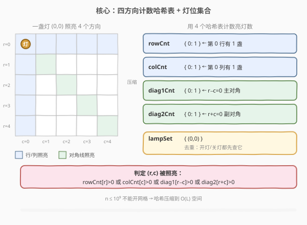
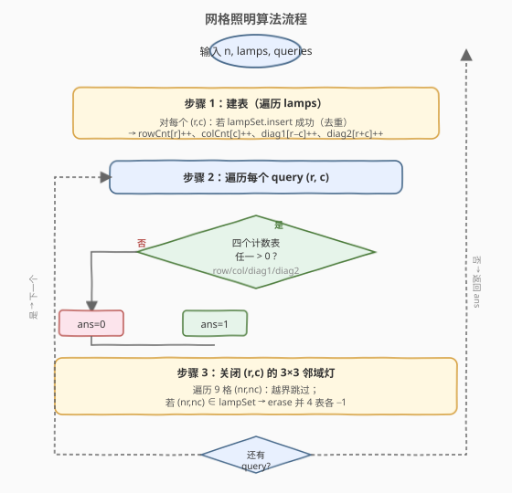

# 网格照明

- **题目名称**：网格照明
- **链接**：[1001. 网格照明](https://leetcode.cn/problems/grid-illumination/)
- **难度**：困难
- **标签**：哈希表、模拟、几何

## 1. 题目概述

在 $n \times n$ 的网格上，每个单元格都有一盏灯，初始全部**关闭**。给定灯的位置数组 `lamps`（`lamps[i] = [rowi, coli]`），打开这些位置的灯；同一盏灯可能在 `lamps` 中重复列出，但只算一盏。

一盏灯**打开**后，会照亮：

- **自身所在单元格**；
- 同一**行**的所有单元格；
- 同一**列**的所有单元格；
- 两条**对角线**（主对角线方向 $r-c$ 相同、副对角线方向 $r+c$ 相同）上的所有单元格。

再给定查询数组 `queries`（`queries[j] = [rowj, colj]`）。对第 $j$ 个查询：

1. 若 `[rowj, colj]` 被照亮，则 `ans[j] = 1`，否则为 `0`；
2. **查询完成后**，关闭 `[rowj, colj]` 及其**相邻 8 个方向**（共享边或角，即 $3 \times 3$ 邻域）上的所有灯。

返回答案数组 `ans`。

**示例 1**：

```text
输入：n = 5, lamps = [[0,0],[4,4]], queries = [[1,1],[1,0]]
输出：[1,0]
解释：打开 [0,0] 与 [4,4] 两盏灯。
     第 0 次查询 [1,1]：被 [0,0] 的副对角线(r+c=2)照亮 → ans[0]=1。
       随后关闭 [1,1] 的 3×3 邻域，[0,0] 落在其中被关闭。
     第 1 次查询 [1,0]：[4,4] 无法照亮 [1,0] → ans[1]=0。
```

**示例 2**：

```text
输入：n = 5, lamps = [[0,0],[4,4]], queries = [[1,1],[1,1]]
输出：[1,1]
解释：第 0 次查询后 [0,0] 被关闭，但 [4,4] 仍在，其主对角线(r-c=0)穿过 [1,1] → ans[1]=1。
```

**示例 3**：

```text
输入：n = 5, lamps = [[0,0],[0,4]], queries = [[0,4],[0,1],[1,4]]
输出：[1,1,0]
```

**约束条件**：

- $1 \leq n \leq 10^9$
- $0 \leq \text{lamps.length} \leq 20000$
- $0 \leq \text{queries.length} \leq 20000$
- $0 \leq \text{row}_i, \text{col}_i < n$

> ⚠️ **关键约束**：$n$ 高达 $10^9$，**绝不能开 $n \times n$ 的网格数组**——光存储就爆内存。但灯和查询的数量都只有 $2 \times 10^4$ 级，必须用**哈希表压缩存储**。

---

## 2. 解题思路

### 2.1 暴力思路：开网格模拟

最直白的做法：开一个 $n \times n$ 的 `grid` 数组记录每格的灯状态，再开一个 $n \times n$ 的 `lit` 数组记录每格被几盏灯照亮。开灯时把同行、同列、同两条对角线的格子照亮计数 `+1`；查询时读 `lit[r][c]` 是否 `>0`；关灯时把对应格子计数 `−1`。

但 $n = 10^9$ 时，$n^2 = 10^{18}$，连 `bool` 数组都需要 $10^{18}$ 字节，**完全不可行**。问题出在「照亮范围太大但实际点灯数极少」——绝大多数格子根本没灯也没被照亮。

### 2.2 核心观察：四方向计数 + 灯位去重集合



突破口是：**一个格子是否被照亮，只取决于「它所在的行 / 列 / 主对角线 / 副对角线上是否还有至少一盏灯」**，而不需要知道具体是哪盏灯。

于是用 **4 个哈希表**分别记录「每条行 / 列 / 主对角线 / 副对角线上点亮的灯数」：

| 哈希表 | 键 | 含义 |
|--------|----|------|
| `rowCnt` | $r$ | 第 $r$ 行亮灯数 |
| `colCnt` | $c$ | 第 $c$ 列亮灯数 |
| `diag1Cnt` | $r - c$ | 主对角线（同 $r-c$）亮灯数 |
| `diag2Cnt` | $r + c$ | 副对角线（同 $r+c$）亮灯数 |

判定格子 $(r, c)$ 被照亮：

$$
\text{lit}(r, c) = \big(\text{rowCnt}[r] > 0\big) \;\lor\; \big(\text{colCnt}[c] > 0\big) \;\lor\; \big(\text{diag1Cnt}[r-c] > 0\big) \;\lor\; \big(\text{diag2Cnt}[r+c] > 0\big)
$$

> 💡 **为什么对角线键是 $r-c$ 和 $r+c$？** 主对角线方向上所有格子的 $r-c$ 为定值（向右下走，$r$、$c$ 同步加 1，差不变）；副对角线方向上 $r+c$ 为定值（向左下走，$r$ 加 1、$c$ 减 1，和不变）。这是棋盘类题目的通用编码，和 [N 皇后](https://leetcode.cn/problems/n-queens/) 判重完全一致。

**关灯的难点**：查询后要关闭 $3 \times 3$ 邻域内的灯。问题是——「关掉一盏灯」需要同时把 4 个计数表对应键各 `−1`。如果一盏灯被重复关（比如它在多个查询的邻域里），就会把计数减成负数，误判为「不亮」。所以需要：

- 用一个**灯位集合 `lampSet`**记录当前还亮着的灯的坐标，**先查集合再减计数**，保证每盏灯只被关一次；
- 开灯时也要靠 `lampSet` 去重（`lamps` 中可能重复列出同一盏灯），只对首次出现的灯做计数 `+1`。

> ⚠️ **易错点**：开灯去重和关灯去重都用同一个 `lampSet`。开灯时 `insert` 返回 `true`（新灯）才加计数；关灯时在 `lampSet` 中找到才减计数并 `erase`。漏掉任一处去重都会让计数失真。

### 2.3 算法流程图



**第一步：建表**。遍历 `lamps`，对每个 `(r, c)` 尝试加入 `lampSet`；若成功（去重通过），则 4 个计数表对应键各 `+1`。

**第二步：处理查询**。对每个 `(r, c)`：

1. 查 4 个计数表，任一 `>0` 则 `ans[j]=1`，否则 `0`；
2. 遍历 $3 \times 3$ 邻域（自身 + 8 邻居）共 9 格 `(nr, nc)`：越界跳过；若 `(nr, nc)` 在 `lampSet` 中，则 `erase` 并把 4 个计数表对应键各 `−1`。

> 💡 **关灯顺序无关紧要**：查询的「判定照亮」发生在「关灯」**之前**，所以本查询用的是关灯前的计数；关灯影响的是后续查询。这与题目「查询之后关闭」的语义一致。

### 2.4 示例演算

![示例演算：n=5, lamps=[[0,0],[4,4]]](../images/grid_illumination_walkthrough.svg)

以示例 2（`n=5, lamps=[[0,0],[4,4]], queries=[[1,1],[1,1]]`）为例：

**建表**：

| 灯 | rowCnt | colCnt | diag1Cnt(r−c) | diag2Cnt(r+c) |
|----|--------|--------|---------------|---------------|
| (0,0) | rowCnt[0]=1 | colCnt[0]=1 | diag1[0]=1 | diag2[0]=1 |
| (4,4) | rowCnt[4]=1 | colCnt[4]=1 | diag1[0]=2 | diag2[8]=1 |

`lampSet = {(0,0), (4,4)}`。

**第 0 次查询 (1,1)**：

- 判定：`rowCnt[1]=0`、`colCnt[1]=0`、`diag1Cnt[0]=2>0` → **被照亮**，`ans[0]=1`。
- 关灯 $3 \times 3$ 邻域含 `(0,0)`（在第 0 行第 0 列，邻域 $r\in[0,2],c\in[0,2]$）：
  - `(0,0)` 在集合中 → 删除，`rowCnt[0]=0`、`colCnt[0]=0`、`diag1Cnt[0]=1`、`diag2Cnt[0]=0`。
  - 其余 8 格不在集合。
- 关灯后：`lampSet={(4,4)}`，`diag1Cnt[0]=1`（来自 (4,4)）。

**第 1 次查询 (1,1)**：

- 判定：`rowCnt[1]=0`、`colCnt[1]=0`、`diag1Cnt[0]=1>0`（(4,4) 的主对角线 $r-c=0$ 穿过 (1,1)）→ **被照亮**，`ans[1]=1`。
- 关灯邻域不含 `(4,4)`，无变化。

最终 `ans=[1,1]`。

> 💡 **对照示例 1**：示例 1 第 0 次查询后 (0,0) 被关，(4,4) 虽在但 `diag1Cnt[0]=1`，主对角线只穿过 $(1,1)$ 而不穿过 $(1,0)$（(4,4) 到 (1,0) 的 $r-c$ 分别是 0 和 1，不同对角线），故第 1 次查 (1,0) 为 0。

---

## 3. 参考代码

### C++

```cpp
class Solution {
  public:
    vector<int> gridIllumination(int n, vector<vector<int>>& lamps,
                                 vector<vector<int>>& queries) {
        unordered_map<int, int> rowCnt, colCnt, diag1Cnt, diag2Cnt;
        unordered_set<long long> lampSet;

        auto encode = [](int r, int c) {
            return (static_cast<long long>(r) << 32) | static_cast<unsigned int>(c);
        };

        for (auto& l : lamps) {
            int r = l[0], c = l[1];
            if (lampSet.insert(encode(r, c)).second) {
                rowCnt[r]++;
                colCnt[c]++;
                diag1Cnt[r - c]++;
                diag2Cnt[r + c]++;
            }
        }

        vector<int> ans;
        ans.reserve(queries.size());
        int dirs[9][2] = {{0, 0},   {-1, -1}, {-1, 0}, {-1, 1},
                          {0, -1},  {0, 1},   {1, -1}, {1, 0},
                          {1, 1}};
        for (auto& q : queries) {
            int r = q[0], c = q[1];
            int lit = (rowCnt[r] > 0 || colCnt[c] > 0 ||
                       diag1Cnt[r - c] > 0 || diag2Cnt[r + c] > 0)
                          ? 1
                          : 0;
            ans.push_back(lit);
            for (auto& d : dirs) {
                int nr = r + d[0], nc = c + d[1];
                if (nr < 0 || nr >= n || nc < 0 || nc >= n) continue;
                auto it = lampSet.find(encode(nr, nc));
                if (it != lampSet.end()) {
                    lampSet.erase(it);
                    rowCnt[nr]--;
                    colCnt[nc]--;
                    diag1Cnt[nr - nc]--;
                    diag2Cnt[nr + nc]--;
                }
            }
        }
        return ans;
    }
};
```

### Python

```python
class Solution:
    def gridIllumination(self, n: int, lamps: List[List[int]],
                         queries: List[List[int]]) -> List[int]:
        rowCnt, colCnt = defaultdict(int), defaultdict(int)
        diag1Cnt, diag2Cnt = defaultdict(int), defaultdict(int)
        lampSet = set()

        for r, c in lamps:
            if (r, c) not in lampSet:
                lampSet.add((r, c))
                rowCnt[r] += 1
                colCnt[c] += 1
                diag1Cnt[r - c] += 1
                diag2Cnt[r + c] += 1

        ans = []
        dirs = [(0, 0), (-1, -1), (-1, 0), (-1, 1),
                (0, -1), (0, 1), (1, -1), (1, 0), (1, 1)]
        for r, c in queries:
            lit = 1 if (rowCnt[r] > 0 or colCnt[c] > 0
                        or diag1Cnt[r - c] > 0 or diag2Cnt[r + c] > 0) else 0
            ans.append(lit)
            for dr, dc in dirs:
                nr, nc = r + dr, c + dc
                if 0 <= nr < n and 0 <= nc < n and (nr, nc) in lampSet:
                    lampSet.discard((nr, nc))
                    rowCnt[nr] -= 1
                    colCnt[nc] -= 1
                    diag1Cnt[nr - nc] -= 1
                    diag2Cnt[nr + nc] -= 1
        return ans
```

> ⚠️ **三个易错点**：
> 1. **灯坐标编码不能溢出**：$n \leq 10^9$，`r * n + c` 最大 $10^{18}$，C++ 中需用 `long long`。这里用 `(r << 32) | c` 的位编码更稳妥（$r, c < 2^{32}$），不依赖 $n$。
> 2. **关灯必须先查集合再减计数**：直接遍历 9 格减计数会因「格子上无灯」或「灯已关」而误减。只有 `(nr, nc) in lampSet` 时才减并 `erase`，保证每盏灯只被减一次。
> 3. **开灯也要去重**：`lamps` 中同一盏灯可能列出多次，必须靠 `lampSet.insert().second`（C++）或 `(r,c) not in lampSet`（Python）判重，否则计数被多次累加。

---

## 4. 复杂度分析

| 维度 | 复杂度 | 说明 |
|------|--------|------|
| 时间复杂度 | $O(L + Q)$ | 建表遍历 $L$ 盏灯；每个查询判亮 $O(1)$、关灯扫 $9$ 格各 $O(1)$，共 $Q$ 次查询 |
| 空间复杂度 | $O(L)$ | `lampSet` 与 4 个计数表最多存 $L$ 个键（去重后 $\leq L$） |

> 💡 本题 $L, Q \leq 2 \times 10^4$，总运算量约 $2 \times 10^5$ 级，远低于时限。哈希表单次操作均摊 $O(1)$，常数约为 9（关灯扫 9 格）。

---

## 5. 扩展：为什么「关灯扫 9 格」是对的

题目要求查询后关闭 `[rowj, colj]` 及「相邻 8 个方向上共享边或角的灯」，即 $3 \times 3$ 邻域。为什么是 9 格而非更多？

- **邻域定义**：与中心格共享边（上下左右 4 格）或共享角（四对角 4 格）共 8 格，加自身共 9 格。
- **为何不扩大**：题目明确「关闭 `grid[rowj, colj]` 上及相邻 8 方向」，是固定 $3 \times 3$。若误扩为 $5 \times 5$ 会提前关掉本该照亮的灯，导致后续查询误判为暗。
- **为何不缩小**：若只关中心格，则紧邻的灯（如 `(r-1, c-1)`）会继续照亮查询格的行/列/对角线，让「关闭」形同虚设。

> 💡 **与「照亮范围」的对照**：照亮是「十字 + 两条对角线」的**无限长**射线（受 $n$ 约束）；关灯是「$3 \times 3$」的**局部**操作。这种「影响范围大、操作范围小」的不对称，正是用哈希表压缩照亮信息、用集合精确追踪灯位的动机。

---

## 6. 面试要点

1. **为什么不能开 $n \times n$ 网格？怎么压缩？**

   - $n \leq 10^9$，$n^2$ 达 $10^{18}$，任何数组都爆内存。但灯和查询各只有 $2 \times 10^4$，实际点亮的行/列/对角线极少。用 4 个哈希表分别对行号 $r$、列号 $c$、主对角线 $r-c$、副对角线 $r+c$ 计数，空间降到 $O(L)$。

2. **对角线为什么用 $r-c$ 和 $r+c$ 编码？**

   - 主对角线方向（↘）上 $r$、$c$ 同步增减，$r-c$ 恒定；副对角线方向（↙）上 $r$ 增 $c$ 减，$r+c$ 恒定。用这两个值作哈希键即可把整条对角线的灯聚到一起，和 N 皇后判重同源。

3. **关灯时为什么要先查 `lampSet` 再减计数？**

   - $3 \times 3$ 邻域里 9 格多数没有灯，直接减会把计数减成负数。必须「在集合中找到 → 删除 → 减计数」三步绑定，确保每盏灯只被关一次。开灯同理需去重（`lamps` 可能重复列出同一盏）。

4. **查询的判定和关灯谁先谁后？**

   - 先判定照亮、再关灯。题目说「查询之后关闭」，所以本查询用关灯前的计数；关灯影响的是后续查询。若颠倒顺序，会漏掉本应被当前查询点亮的灯。

5. **坐标编码如何避免溢出？**

   - C++ 中 `r * n + c` 在 $n=10^9$ 时达 $10^{18}$，需 `long long`；更稳妥用 `(long long)r << 32 | (unsigned)c`，因 $r, c < 10^9 < 2^{32}$，位运算不依赖 $n$ 且无溢出风险。Python 整数任意精度，直接用 `(r, c)` 元组即可。

---

## 7. 同类练习题

- [51. N 皇后](https://leetcode.cn/problems/n-queens/)：同样的 $r-c$ / $r+c$ 对角线编码，回溯判重；本题是「动态开关灯」的模拟版
- [200. 岛屿数量](https://leetcode.cn/problems/number-of-islands/)（[题解](../0201-0300/200_岛屿数量.md)）：网格 + 方向数组遍历，对比「全网格」与「哈希压缩」两种网格题范式
- [547. 省份数量](https://leetcode.cn/problems/number-of-provinces/)（[题解](../0501-0600/547_省份数量.md)）：用哈希/并查集压缩稀疏关系，思想类似本题「大网格小数据」的压缩
- [2352. 相等行列对](https://leetcode.cn/problems/equal-row-and-column-pairs/)：行列哈希计数匹配，简化版的「按行/列聚合」思路
