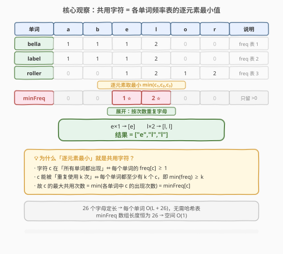
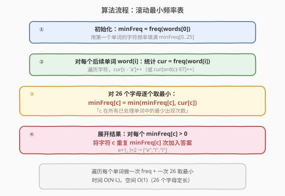
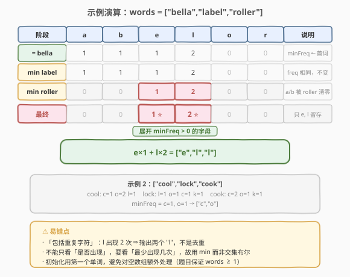

# LeetCode 查找共用字符 题解

## 1. 题目概述

- **标题 / 题号**：查找共用字符（#1002，easy）
- **链接**：https://leetcode.cn/problems/find-common-characters/
- **难度**：简单
- **标签**：数组、哈希表、字符串

**题意**：给你一个字符串数组 `words`，请你找出所有在 `words` 的**每个字符串中都出现**的**共用字符**（**包括重复字符**），并以数组形式返回。答案可以按**任意顺序**返回。

**示例 1**：

```text
输入：words = ["bella","label","roller"]
输出：["e","l","l"]
```

**示例 2**：

```text
输入：words = ["cool","lock","cook"]
输出：["c","o"]
```

**约束**：

- $1 \leq \text{words.length} \leq 100$
- $1 \leq \text{words[i].length} \leq 100$
- `words[i]` 由**小写英文字母**组成

> 💡 关键词「包括重复字符」：示例 1 中 `l` 在三个单词里都至少出现 2 次，因此输出**两个** `l`，而不是去重后的一个。这说明问题不是求「字符集合的交集」，而是求「每个字符在所有单词中的**最少出现次数**」。

## 2. 解题思路

### 2.1 暴力思路：对每个候选字符枚举所有单词

先收集所有出现过的字符作为候选集，对每个候选字符 `c`，遍历所有单词统计 `c` 的出现次数，取最小值 `k`，再把 `c` 重复 `k` 次加入答案。

这个思路本身已经接近正解，但若用哈希集合存候选、再对每个单词反复扫描，常数较大且实现啰嗦。更自然的做法是：**对每个单词维护一个频率表，再把这些频率表「合并」成一个最小频率表**。

### 2.2 核心观察：共用字符 = 各单词频率表的逐元素最小值



由于 `words[i]` 只含 26 个小写字母，每个单词可压缩为一个长度为 26 的**频率数组** `freq[0..25]`，`freq[c]` 表示字符 `c` 在该单词中的出现次数。

> 💡 **为什么「逐元素最小」就是共用字符？**
> - 字符 `c` 在「所有单词中都出现」 $\iff$ 每个单词的 `freq[c] ≥ 1`；
> - `c` 能被「重复使用 `k` 次」 $\iff$ 每个单词都至少含 `k` 个 `c`，即 $\min(\text{freq}[c]) \geq k$；
> - 因此 `c` 的**最大共用次数** $= \min(\text{各单词中 } c \text{ 的出现次数}) = \text{minFreq}[c]$。

定义**滚动最小频率表** `minFreq`：初始为第一个单词的频率，随后每读入一个单词，就把 `minFreq` 与该单词频率**逐元素取最小**。最终 `minFreq[c]` 就是 `c` 在所有单词中的最少出现次数，按次数展开即为答案。

### 2.3 算法流程图



四步走：

1. **初始化**：`minFreq = freq(words[0])`（用第一个单词的频率填满长度 26 的数组）。
2. **统计当前单词**：对每个后续单词 `words[i]`，扫描其字符得到频率 `cur[0..25]`。
3. **滚动取最小**：对 26 个字母逐个执行 `minFreq[c] = min(minFreq[c], cur[c])`。
4. **展开结果**：对每个 `minFreq[c] > 0`，将字符 `c` 重复 `minFreq[c]` 次加入答案。

> ⚠️ 第 3 步只需遍历 26 个字母（定长），**无需遍历整个单词长度**；第 2 步才需要遍历单词字符。两者解耦，常数清晰。

### 2.4 示例演算

以 `words = ["bella","label","roller"]` 为例，只列出相关字母 `a, b, e, l, o, r` 的频率：



| 阶段 | a | b | e | l | o | r | 说明 |
|------|---|---|---|---|---|---|------|
| `= freq(bella)` | 1 | 1 | 1 | 2 | 0 | 0 | `minFreq` 初始化为首词 |
| `min freq(label)` | 1 | 1 | 1 | 2 | 0 | 0 | `label` 频率与 `bella` 相同，逐元素 min 后不变 |
| `min freq(roller)` | 0 | 0 | 1 | 2 | 0 | 0 | `roller` 无 `a/b`，把它们清零；`e,l` 维持 |
| **最终 minFreq** | 0 | 0 | **1** | **2** | 0 | 0 | 只剩 `e, l` 留存 |

展开：`e × 1`、`l × 2` → `["e","l","l"]`。

> 💡 示例 2：`["cool","lock","cook"]`。频率分别为 `cool={c:1,o:2,l:1}`、`lock={l:1,o:1,c:1,k:1}`、`cook={c:2,o:1,k:1}`。逐元素取最小：`c=1, o=1, l=0, k=0` → `["c","o"]`。

## 3. 参考代码

### C++

```cpp
class Solution {
  public:
    vector<string> commonChars(vector<string>& words) {
        int minFreq[26];
        fill(minFreq, minFreq + 26, 0);
        for (char ch : words[0]) minFreq[ch - 'a']++;

        // 滚动逐元素取最小
        int cur[26];
        for (int i = 1; i < (int)words.size(); ++i) {
            fill(cur, cur + 26, 0);
            for (char ch : words[i]) cur[ch - 'a']++;
            for (int c = 0; c < 26; ++c) {
                minFreq[c] = min(minFreq[c], cur[c]);
            }
        }

        // 展开结果
        vector<string> ans;
        for (int c = 0; c < 26; ++c) {
            for (int k = 0; k < minFreq[c]; ++k) {
                ans.emplace_back(1, (char)('a' + c));
            }
        }
        return ans;
    }
};
```

### Python

```python
class Solution:
    def commonChars(self, words: List[str]) -> List[str]:
        # 用第一个单词初始化最小频率表
        min_freq = [0] * 26
        for ch in words[0]:
            min_freq[ord(ch) - 97] += 1

        # 滚动逐元素取最小
        for w in words[1:]:
            cur = [0] * 26
            for ch in w:
                cur[ord(ch) - 97] += 1
            for c in range(26):
                if cur[c] < min_freq[c]:
                    min_freq[c] = cur[c]

        # 展开结果
        ans = []
        for c in range(26):
            ans.extend([chr(c + 97)] * min_freq[c])
        return ans
```

> ⚠️ **易错点**：
> - 「包括重复字符」——`l` 出现 2 次要输出两个 `"l"`，不能去重；因此用 `min` 计数而非布尔交集。
> - 初始化用 `words[0]`，避免对空数组特判（题目保证 `words.length ≥ 1`）。
> - Python 用 `ord(ch) - 97` 比 `ord(ch) - ord('a')` 更短，二者等价。

## 4. 复杂度分析

| 维度 | 复杂度 | 说明 |
|------|--------|------|
| 时间复杂度 | $O(N \cdot L)$ | $N$ 个单词，每个单词扫描一遍长度 $L$ 统计频率；另对每个单词做一次 26 字母取最小（$O(26)$，常数） |
| 空间复杂度 | $O(1)$ | `minFreq` 与 `cur` 均为长度 26 的定长数组，与输入规模无关（输出数组不计入额外空间） |

> 💡 本题 $N \leq 100$、$L \leq 100$，$N \cdot L \leq 10^4$，非常快。26 字母的取最小操作虽在每个单词后执行一次，但常数 $26$ 远小于 $L$，渐近上仍为 $O(N \cdot L)$。

## 5. 扩展：为什么不用哈希表，而用定长数组？

本题字母表只有 26 个小写字母，**定长数组** `int[26]` 相比 `unordered_map<char,int>` 有三点优势：

1. **常数更小**：数组下标访问 $O(1)$ 且无哈希计算/冲突开销，缓存友好。
2. **取最小更简单**：直接 `for c in range(26): min_freq[c] = min(min_freq[c], cur[c])`，无需关心两表键集合不一致（缺失键默认 0）。
3. **空间严格 $O(1)$**：哈希表会随单词中不同字符数动态扩容，最坏 $O(L)$；定长数组恒为 26。

若字母表扩大（如 Unicode 全集），则应改用哈希表，并需额外处理「键只出现在部分单词」的情况——此时 `minFreq` 中缺失的键视为 0，取最小后自动清零。

> 💡 本题与 [242. 有效的字母异位词](../0201-0300/242_有效的字母异位词.md)、[49. 字母异位词分组](../0001-0100/49_字母异位词分组.md) 一样，都是「26 字母频率数组」的经典应用场景。

## 6. 面试要点

1. **「包括重复字符」如何理解？**
   - 字符 `c` 在所有单词中都至少出现 `k` 次，则 `c` 可在答案中重复 `k` 次。最大 `k` 即各单词中 `c` 出现次数的最小值，所以用 `min` 计数而非「是否都出现」的布尔交集。

2. **为什么用「逐元素最小」而不是「集合交集」？**
   - 集合交集只能判定字符是否出现（丢掉次数信息），无法处理重复字符。频率表的逐元素 `min` 保留了「最少出现次数」，展开后自然得到含重复的答案。

3. **初始化为什么用第一个单词？**
   - 题目保证 `words.length ≥ 1`，用 `words[0]` 初始化 `minFreq` 可避免对空输入特判，且后续从 `words[1]` 开始取最小，逻辑统一。若从全 `INF` 初始化，则需额外处理「未覆盖字母」的清零。

4. **能否只遍历一次 26 字母，不扫整个单词？**
   - 不能。统计频率必须扫描单词字符（$O(L)$）；取最小才是 $O(26)$。两者职责不同，分开做更清晰，总复杂度仍为 $O(N \cdot L)$。

5. **如果字母表扩大（含大写、Unicode）怎么办？**
   - 改用哈希表 `dict`，并在取最小时对 `minFreq` 中存在但 `cur` 中缺失的键置 0（或遍历 `minFreq` 的键，对 `cur` 没有的视为 0）。空间退化为 $O(\text{不同字符数})$。

## 同类练习题

| # | 题目 | 与本题的关联 |
|---|------|-------------|
| 242 | [有效的字母异位词](https://leetcode.cn/problems/valid-anagram/)（[题解](../0201-0300/242_有效的字母异位词.md)) | 26 字母频率数组的判定版（两表是否相等），对比本题的「逐元素取最小」 |
| 350 | [两个数组的交集 II](https://leetcode.cn/problems/intersection-of-two-arrays-ii/)（[题解](../0301-0400/350_两个数组的交集II.md)） | 频率计数求交集（含重复），本题的「两数组」退化版，扩展到 N 个字符串 |
| 387 | [字符串中的第一个唯一字符](https://leetcode.cn/problems/first-unique-character-in-a-string/)（[题解](../0301-0400/387_字符串中的第一个唯一字符.md)） | 频率数组定位频次为 1 的字符，对比本题的「取最小频次」 |
| 49 | [字母异位词分组](https://leetcode.cn/problems/group-anagrams/)（[题解](../0001-0100/49_字母异位词分组.md)） | 频率数组作为异位词的规范化键，同源工具的不同应用 |
| 438 | [找到字符串中所有字母异位词](https://leetcode.cn/problems/find-all-anagrams-in-a-string/)（[题解](../0401-0500/438_找到字符串中所有字母异位词.md)） | 滑动窗口 + 频率数组比对，频率数组在窗口场景下的进阶用法 |
