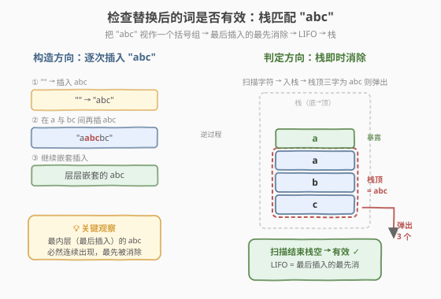
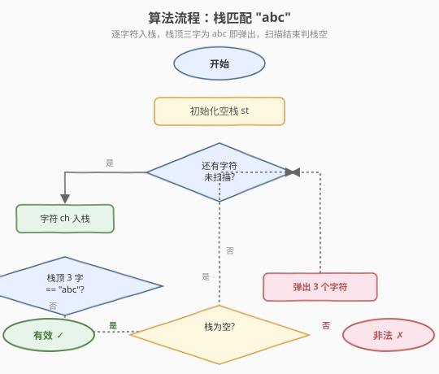
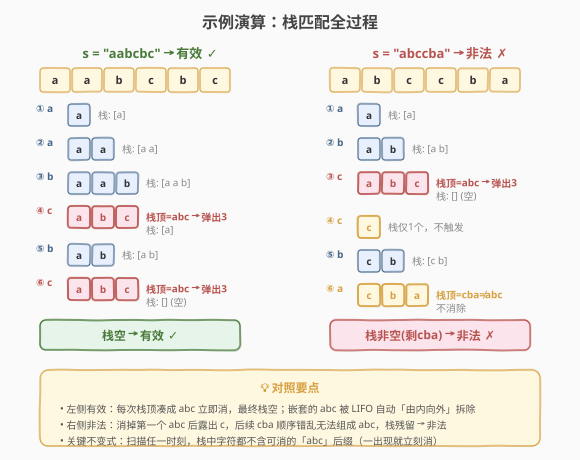

# 检查替换后的词是否有效

- **题目名称**：检查替换后的词是否有效
- **链接**：[1003. 检查替换后的词是否有效](https://leetcode.cn/problems/check-if-word-is-valid-after-substitutions/)
- **难度**：中等
- **标签**：栈、字符串

## 1. 题目概述

给定一个字符串 `s`，判断它是否**有效**。字符串 `s` 有效的定义：从空字符串 `t = ""` 开始，可以执行**任意次**下述操作将 `t` 转换为 `s`：

- 将字符串 `"abc"` 插入到 `t` 中的任意位置。形式上，`t` 变为 `tleft + "abc" + tright`，其中 `t == tleft + tright`，`tleft` 和 `tright` 可能为空。

**示例 1**：

```text
输入：s = "aabcbc"
输出：true
解释："" -> "abc" -> "a" + "abc" + "bc" = "aabcbc"
```

**示例 2**：

```text
输入：s = "abcabcababcc"
输出：true
解释："" -> "abc" -> "abcabc" -> "abcabcabc" -> "abcabcab" + "abc" + "c" = "abcabcababcc"
```

**示例 3**：

```text
输入：s = "abccba"
输出：false
```

**约束条件**：

- $1 \leq \text{s.length} \leq 2 \times 10^4$
- `s` 仅由字母 `'a'`、`'b'`、`'c'` 组成

> 💡 本题与 [20. 有效括号](../0001-0100/20_有效括号.md) 形异神似：把 `"abc"` 视为一个「括号组」——`'a'` 是开括号、`'c'` 是闭括号、`'b'` 是中间连接符。判定 `s` 是否能由嵌套插入 `"abc"` 得到，等价于判定这些「括号组」能否被正确配对消除。

---

## 2. 解题思路

### 2.1 暴力思路：反复删除 "abc"

最直观的做法是**反复扫描**字符串，每次找到一个连续的子串 `"abc"` 就删除，直到某轮无法删除为止。若最终字符串为空则有效。

- 每轮扫描 $O(n)$，每轮至少删掉 3 个字符，最多 $n/3$ 轮，总时间 $O(n^2)$。
- 对 $n = 2 \times 10^4$ 量级，$n^2 = 4 \times 10^8$，效率偏低且有 TLE 风险。

> ⚠️ 更糟的是，字符串删除操作本身是 $O(n)$ 的（需要搬移后续字符），实际开销更大。

### 2.2 核心观察：栈匹配 "abc"



关键观察：**每插入一个 `"abc"`，就在字符串里增加一个完整的「括号组」**。最后插入的 `"abc"`（或被它「包住」的最内层 `"abc"`）必然以连续 `"abc"` 的形态出现在字符串里，可以最先被「消除」。

这正是 **LIFO（后进先出）** 语义：

- `'a'`、`'b'`：相当于「开括号」部分，依次入栈等待配对。
- 读到 `'c'`：检查栈顶是否依次为 `'b'`、`'a'`，若是则这 3 个字符构成一个完整的 `"abc"` 单元，**立即弹出消除**；若不是则非法。

> 💡 **为什么立即消除是安全的？** 栈顶的 `"abc"` 对应最内层（最后插入）的那个 `"abc"` 单元，它迟早要被消掉。立即消掉只会**暴露**更外层的字符，让它们有机会形成新的 `"abc"`；延迟消掉没有任何收益。这与 [20. 有效括号](../0001-0100/20_有效括号.md) 中「遇到匹配的右括号立即弹出」是同一个道理。

**核心策略**：

- 逐字符入栈；
- 每次入栈后检查栈顶 3 个字符是否恰好是 `'a'`、`'b'`、`'c'`，若是则弹出这 3 个；
- 扫描结束后，栈空 → 有效；栈非空 → 非法（有未配对的残余字符）。

### 2.3 算法流程图



```
1. 初始化空栈 st
2. 逐字符 ch 扫描 s：
   a. ch 入栈
   b. 若 st.size() >= 3 且栈顶三个字符依次为 'a','b','c'：
      - 连续弹出 3 次（消除一个 "abc" 单元）
3. 扫描结束：st 为空 → 有效；否则 → 非法
```

> ⚠️ **检查顺序**：必须先入栈再检查栈顶，而不是「读到 `c` 才检查」。因为消除后**新暴露**的栈顶可能与后续字符继续组成 `"abc"`，先入栈再消能保证一轮扫描内处理完所有级联消除。

### 2.4 示例演算

以 `s = "aabcbc"` 为例（对应示例 1）：



| 步骤 | 字符 | 操作 | 栈状态（底→顶） |
|------|------|------|------------------|
| ① | `a` | 入栈 | `a` |
| ② | `a` | 入栈 | `a a` |
| ③ | `b` | 入栈 | `a a b` |
| ④ | `c` | 入栈→栈顶 `abc`→弹出 3 | `a` |
| ⑤ | `b` | 入栈 | `a b` |
| ⑥ | `c` | 入栈→栈顶 `abc`→弹出 3 | ` `（空） |

扫描结束栈空 → **有效** ✓

以 `s = "abccba"` 为例（对应示例 3）：

| 步骤 | 字符 | 操作 | 栈状态（底→顶） |
|------|------|------|------------------|
| ① | `a` | 入栈 | `a` |
| ② | `b` | 入栈 | `a b` |
| ③ | `c` | 入栈→栈顶 `abc`→弹出 3 | ` `（空） |
| ④ | `c` | 入栈（栈仅 1 个，不触发消除） | `c` |
| ⑤ | `b` | 入栈 | `c b` |
| ⑥ | `a` | 入栈→栈顶 `cba`≠`abc`→不消除 | `c b a` |

扫描结束栈非空（剩 `cba`）→ **非法** ✗

---

## 3. 参考代码

### C++

```cpp
class Solution {
public:
    bool isValid(string s) {
        string st;
        for (char ch : s) {
            st.push_back(ch);
            int n = st.size();
            if (n >= 3 && st[n - 3] == 'a' && st[n - 2] == 'b' && st[n - 1] == 'c') {
                st.pop_back();
                st.pop_back();
                st.pop_back();
            }
        }
        return st.empty();
    }
};
```

> 💡 这里用 `string` 模拟栈（`push_back` / `pop_back`），比 `stack<char>` 更方便检查栈顶 3 个字符——直接用下标访问 `st[n-3..n-1]`。

### Python

```python
class Solution:
    def isValid(self, s: str) -> bool:
        st = []
        for ch in s:
            st.append(ch)
            if len(st) >= 3 and st[-3] == 'a' and st[-2] == 'b' and st[-1] == 'c':
                st.pop()
                st.pop()
                st.pop()
        return not st
```

---

## 4. 复杂度分析

| 维度 | 复杂度 | 说明 |
|------|--------|------|
| 时间复杂度 | $O(n)$ | 每个字符最多入栈一次、出栈一次，总计 $2n$ 次栈操作 |
| 空间复杂度 | $O(n)$ | 最坏情况（如全 `'a'`）栈存 $n$ 个字符 |

> 💡 相比暴力法的 $O(n^2)$，栈解法把「反复扫描删除」降为「单遍扫描 + 即时消除」，本质是把嵌套结构交给 LIFO 自动处理。

---

## 5. 扩展：字符串替换解法

某些语言（如 Python）可以直接用 `while "abc" in s: s = s.replace("abc", "")`，最后判断 `s` 是否为空。写法极简：

```python
class Solution:
    def isValid(self, s: str) -> bool:
        while "abc" in s:
            s = s.replace("abc", "")
        return s == ""
```

但需注意：

- `replace` 会**一次性替换所有**出现的 `"abc"`，可能导致跨层级误替换（本题恰好不影响正确性，因为任一 `"abc"` 子串都对应一个合法插入单元，先删哪个都行）。
- 每轮 `replace` 是 $O(n)$，最坏 $O(n/3)$ 轮，总时间 $O(n^2)$，大数据量下比栈解法慢。
- 面试中**推荐栈解法**，体现对 LIFO 嵌套结构的理解。

> ⚠️ 本题能「先删哪个 `"abc"` 都行」的前提是：`s` 中任一连续 `"abc"` 子串都必定对应某次合法插入的完整单元。这是因为 `"abc"` 的三个字符在插入时是连续的，且只有当外层插入把字符「拆开」时才会出现非连续的 `a...b...c`。所以凡是连续出现的 `"abc"`，必然是某个完整单元，删除它不会破坏合法性。

---

## 6. 面试要点

**Q1：为什么用栈而不是反复删除子串？**
> 反复删除每轮 $O(n)$、共 $O(n/3)$ 轮，总 $O(n^2)$；栈解法单遍扫描、每个字符最多入栈出栈各一次，$O(n)$。栈天然契合「最后插入的最先消除」的 LIFO 嵌套结构。

**Q2：为什么「读到字符就入栈」而不是「读到 `c` 才检查」？**
> 先入栈再检查栈顶 3 位，可以保证消除后新暴露的栈顶在同一轮扫描内继续参与后续判断。如果改成「读到 `c` 才回看前两个字符」，逻辑等价但可读性差，且仍需手动处理消除后的级联暴露，不如统一「入栈后查栈顶」简洁。

**Q3：栈非空时为什么一定非法？**
> 栈中残余字符无法组成完整的 `"abc"` 单元。由于每个合法 `"abc"` 单元都会在读到其 `c` 时被消除，残余意味着存在「开了没闭合」的单元（如只有 `a`、`ab`，或顺序错乱如 `cba`），无法通过后续插入补全——因为后续字符已经全部处理完毕。

**Q4：与 20 题（有效括号）的异同？**
> **同**：都是栈匹配 + 即时弹出，都是 LIFO 嵌套结构，都是 $O(n)$ 单遍扫描。**异**：20 题是「左括号入栈、右括号触发匹配」，单字符配对；本题是「三字符为一组」整体入栈再整体消除，每次检查栈顶 3 位是否为 `"abc"`。可视为「多字符括号组」的匹配。

**Q5：`s` 只含 `a/b/c`，如果含其他字符怎么办？**
> 题目约束保证只含 `'a'`、`'b'`、`'c'`。若放宽，可在入栈前先校验字符集，遇到非法字符直接返回 `false`。

---

## 7. 同类练习题

- [20. 有效的括号](https://leetcode.cn/problems/valid-parentheses/)（[题解](../0001-0100/20_有效括号.md)）：栈匹配的母题，单字符括号配对，对比本题的「三字符一组」匹配
- [946. 验证栈序列](https://leetcode.cn/problems/validate-stack-sequences/)（[题解](../0901-1000/946_验证栈序列.md)）：栈模拟判定，给定 pushed/popped 判断是否合法，同属「栈模拟」家族
- [1249. 移除无效的括号](https://leetcode.cn/problems/minimum-remove-to-make-valid-parentheses/)：栈匹配 + 标记删除，让括号串变合法的「修复」版
- [1021. 删除最外层的括号](https://leetcode.cn/problems/remove-outermost-parentheses/)：括号原语分解，栈计数判定层级边界
- [678. 有效的括号字符串](https://leetcode.cn/problems/valid-parenthesis-string/)：含通配符 `*` 的括号匹配，栈/贪心双解，难度升级
