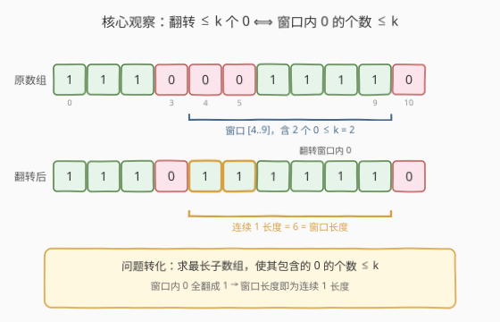
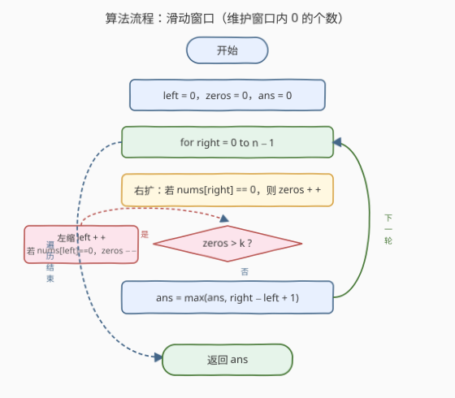
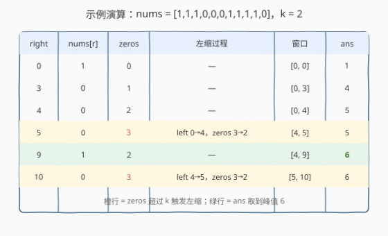

# LeetCode 最大连续1的个数III 题解

## 1. 题目概述

- **标题 / 题号**：最大连续1的个数III（#1004，medium）
- **链接**：https://leetcode.cn/problems/max-consecutive-ones-iii/
- **难度**：中等
- **标签**：数组、滑动窗口、双指针

**题意**：给定一个二进制数组 `nums` 和一个非负整数 `k`，**最多可以翻转 `k` 个 `0` 为 `1`**，求翻转后数组中**连续 `1` 的最大长度**。

**示例 1**：

```text
输入：nums = [1,1,1,0,0,0,1,1,1,1,0], k = 2
输出：6
解释：翻转下标 4 和 5 的两个 0，数组变为 [1,1,1,0,1,1,1,1,1,1,0]，
      从下标 4 到 9 的六位连续为 1，长度为 6。
```

**示例 2**：

```text
输入：nums = [0,0,1,1,0,0,1,1,1,0,1,1,0,0,0,1,1,1,1], k = 3
输出：10
解释：翻转下标 4、5、9 的三个 0，可得长度为 10 的连续 1 段。
```

**约束**：

- $1 \leq \text{nums.length} \leq 10^5$
- `nums[i]` 为 `0` 或 `1`
- $0 \leq k \leq \text{nums.length}$

> 💡 **直觉转化**：「翻转至多 `k` 个 `0`」等价于「**选一段连续子数组，其中 `0` 的个数不超过 `k`**」——把这些 `0` 全翻成 `1`，整段就全是 `1`，段长即为答案。于是问题归约为：**求包含 `0` 的个数 $\leq k$ 的最长子数组**。

## 2. 解题思路

### 2.1 暴力思路

枚举所有子数组 `[i, j]`，统计其中 `0` 的个数，若 $\leq k$ 则用其长度更新答案。两重循环加内部计数，最坏 $O(n^2)$，在 $n = 10^5$ 时超时。

> 💡 暴力的浪费在于：相邻子数组的 `0` 计数高度重叠，每次重新扫描。其实只需维护一个**滑动窗口**内的 `0` 个数，右扩 / 左缩各 $O(1)$ 增量更新即可。

### 2.2 核心观察：至多 K 型滑动窗口



关键转化：**翻转窗口内的 `0` ⟺ 窗口内 `0` 的个数 $\leq k$**。

- 维护一个窗口 `[left, right]`，用 `zeros` 记录其中 `0` 的个数。
- **右扩** `right`：若 `nums[right] == 0`，`zeros += 1`。
- 当 `zeros > k` 时，窗口非法，必须**左缩** `left` 直至 `zeros <= k` 重新成立（移出的位置若是 `0` 则 `zeros -= 1`）。
- 每次窗口合法时，用 `right - left + 1` 更新答案。

**为什么指针不回退？** `left` 只随 `right` 的推进单调右移，永不回退——因为一旦某个 `left` 使窗口合法，`right` 继续右扩后即便再次非法，新的合法 `left` 也**不会小于**旧的 `left`（窗口内的 `0` 只增不减，要重新降到 `k` 至少要从当前 `left` 起继续右移）。于是两指针各走 $n$ 步，总扫描 $O(n)$。

> ⚠️ **与 [209. 长度最小的子数组](../0201-0300/209_长度最小的子数组.md) 的镜像关系**：209 是「和 $\geq$ target 的**最短**窗口」（满足即左缩），1004 是「`0` 数 $\leq k$ 的**最长**窗口」（不满足才左缩）。两者都是「右扩 + 条件左缩」的同骨架，区别仅在判据方向与缩放时机：求最长时**尽量不缩**，求最短时**满足就缩**。

### 2.3 算法流程图



维护变量：

- `left`：窗口左端点，初始 `0`；
- `zeros`：当前窗口 `[left, right]` 内 `0` 的个数，初始 `0`；
- `ans`：已找到的最长长度，初始 `0`。

**主循环**（`right` 从 `0` 到 `n-1`）：

1. 右扩：若 `nums[right] == 0`，`zeros += 1`。
2. **当** `zeros > k` 时（窗口非法）：
   - 若 `nums[left] == 0`，`zeros -= 1`；
   - `left += 1`；
   - 重复本步直到 `zeros <= k`。
3. 更新 `ans = max(ans, right - left + 1)`。

循环结束返回 `ans`。

> ⚠️ **注意是 `while` 不是 `if`**：一次右扩可能让 `zeros` 远超 `k`（比如连续遇到多个 `0`），需要连续左缩多次才能让窗口重新合法。

### 2.4 示例演算

以 `nums = [1,1,1,0,0,0,1,1,1,1,0], k = 2` 为例，下表给出关键步（省略中间未触发左缩的步）：



| right | nums[r] | zeros（入窗后） | 左缩过程 | 窗口 | ans |
|-------|---------|-----------------|----------|------|-----|
| 0 | 1 | 0 | — | [0, 0] | 1 |
| 3 | 0 | 1 | — | [0, 3] | 4 |
| 4 | 0 | 2 | — | [0, 4] | 5 |
| 5 | 0 | 3 | left 0→4，zeros 3→2 | [4, 5] | 5 |
| 9 | 1 | 2 | — | [4, 9] | 6 |
| 10 | 0 | 3 | left 4→5，zeros 3→2 | [5, 10] | 6 |

注意 `right = 5` 时窗口内已有 `3` 个 `0`（下标 3、4、5），超过 `k = 2`，于是 `left` 一路右移到 `4`，把下标 `3` 的 `0` 移出窗口，`zeros` 降回 `2`，窗口跳到 `[4, 5]`。`right = 9` 时窗口 `[4, 9]` 内恰有 `2` 个 `0`、长度 `6`，`ans` 取到峰值。`right = 10` 再次触发左缩，窗口滑到 `[5, 10]`，长度仍为 `6`。最终返回 `6`。

> 💡 **窗口「跳跃」是正常的**：`right = 5` 后 `left` 从 `0` 直接跳到 `4`，跳过了 `1, 2, 3`。因为这些位置作为左端点时窗口必然含 `3` 个 `0`（下标 3、4、5），都不合法，没必要逐一试探——这正是滑动窗口 $O(n)$ 的根源。

## 3. 参考代码

### C++

```cpp
class Solution {
  public:
    int longestOnes(vector<int>& nums, int k) {
        int n = nums.size();
        int left = 0, zeros = 0, ans = 0;
        for (int right = 0; right < n; ++right) {
            if (nums[right] == 0) ++zeros;          // 右扩
            while (zeros > k) {                      // 非法就左缩
                if (nums[left] == 0) --zeros;
                ++left;
            }
            ans = max(ans, right - left + 1);        // 合法即更新
        }
        return ans;
    }
};
```

### Python

```python
class Solution:
    def longestOnes(self, nums: List[int], k: int) -> int:
        left = zeros = ans = 0
        for right, x in enumerate(nums):
            if x == 0:
                zeros += 1                       # 右扩
            while zeros > k:                     # 非法就左缩
                if nums[left] == 0:
                    zeros -= 1
                left += 1
            ans = max(ans, right - left + 1)     # 合法即更新
        return ans
```

> 💡 **不缩到「恰好合法」也行**：本题只求最长长度，左缩到 `zeros == k` 即停；若写成「缩到窗口内全为 `1`」（即 `zeros == 0`）会丢解。判据是 `zeros > k`，**不是** `zeros > 0`。

## 4. 复杂度分析

| 维度 | 复杂度 | 说明 |
|------|--------|------|
| 时间复杂度 | $O(n)$ | `right` 走 $n$ 步，`left` 累计也最多走 $n$ 步（单调不回退），总操作 $2n$ |
| 空间复杂度 | $O(1)$ | 仅用 `left`/`zeros`/`ans` 三个变量，与输入规模无关 |

> ⚠️ 内层 `while` 嵌在 `for` 中看似 $O(n^2)$，但**均摊分析**：`left` 全程只从 `0` 单调右移到 `n`，`while` 的累计左缩次数 $\leq n$，故总时间仍为 $O(n)$。

## 5. 扩展：前缀和（零的个数）+ 二分

若不依赖滑动窗口的单调性直觉，可用「前缀和 + 二分」求解。令 `pref[i]` 为 `nums[0..i-1]` 中 `0` 的个数，则 `pref` **单调不降**。对每个左端点 `i`，二分找**最远**的 `j` 满足 `pref[j+1] - pref[i] <= k`（即子数组 `[i, j]` 内 `0` 数 $\leq k$），用 `j - i + 1` 更新答案。

```cpp
int longestOnes(vector<int>& nums, int k) {
    int n = nums.size(), ans = 0;
    vector<int> pref(n + 1, 0);                 // pref[0]=0
    for (int i = 0; i < n; ++i)
        pref[i + 1] = pref[i] + (nums[i] == 0);
    for (int i = 0; i < n; ++i) {
        // 找最远 j 使 pref[j+1] - pref[i] <= k，即 pref[j+1] <= pref[i] + k
        int need = pref[i] + k;
        int j = upper_bound(pref.begin() + i + 1, pref.end(), need) - pref.begin() - 1;
        ans = max(ans, j - i + 1);
    }
    return ans;
}
```

> 💡 该解法时间为 $O(n \log n)$、空间 $O(n)$，劣于滑动窗口。但它不要求「指针不回退」的直觉，`pref` 单调即可二分；当问题变形为「窗口判定函数更复杂、不易 $O(1)$ 增量维护」时，这套「前缀计数 + 二分」依然适用。

### 「至多 K」模板家族

1004 是「**至多 K 型最长窗口**」的典型——窗口合法条件是「某计数 $\leq k$」，求最长。同族题目共享「右扩 + 条件左缩 + 合法即更新长度」的骨架，只是被计数的对象不同：

| 计数对象 | 合法条件 | 题目 |
|----------|----------|------|
| 窗口内 `0` 的个数 | $\leq k$ | 1004（本题） |
| 窗口内不同字符数 | $\leq k$ | [340. 至多包含 K 个不同字符的最长子串](https://leetcode.cn/problems/longest-substring-with-at-most-k-distinct-characters/) |
| 窗口内不同整数数 | $\leq k$ | [992. K 个不同整数的子数组](../0901-1000/992_K个不同整数的子数组.md)（恰好 $k$ = 至多 $k$ − 至多 $k-1$） |

> ⚠️ 992 / [1248](../1201-1300/1248_统计优美子数组.md) 求「**恰好** $k$」时，不能直接套「至多 $k$ 最长」，而要用计数公式 `exactly(k) = atMost(k) - atMost(k-1)`（计子数组个数，非求最长）。1004 是「至多 + 最长」，直接维护窗口即可，无需做差。

## 6. 面试要点

1. **为什么「翻转至多 k 个 0」等价于「窗口内 0 的个数 ≤ k」？**
   - 翻转只能把 `0` 变 `1`，不能变 `1` 为 `0`。一段子数组若含 $c$ 个 `0` 且 $c \leq k$，把这 $c$ 个 `0` 全翻成 `1`，整段就全是 `1`，长度即段长；若 $c > k$ 则翻不完，必留 `0`，无法整段连续。故「能翻成全 1 的最长段」=「`0` 数 $\leq k$ 的最长子数组」。

2. **为什么内层是 `while` 而非 `if`？**
   - 一次右扩可能让 `zeros` 一次超过 `k` 多个（连续遇到多个 `0`），需连续左缩多次才能把多余的 `0` 移出窗口；若只缩一次会留下非法窗口，可能高估答案。

3. **如何证明时间复杂度是 $O(n)$ 而非 $O(n^2)$？**
   - **平摊分析**：`left` 全程从 `0` 单调右移到至多 `n`，`while` 的累计左缩次数 $\leq n$；`right` 走 $n$ 步。两指针都不回退，总操作 $2n$，故 $O(n)$。

4. **和 [487. 最大连续1的个数 II](../0401-0500/487_最大连续1的个数II.md)（k=1）的解法为何不同？**
   - 487 的 $k=1$ 是常数，窗口至多一个 `0`，可退化为「两段 `1` 拼一个 `0`」的 `prev/cur` 状态机，$O(1)$ 状态无需显式窗口。1004 的 $k$ 可任意大，`prev/cur` 不再够用，必须回到完整的「滑动窗口 + `zeros` 计数」模板。

5. **如果把题意改成「恰好翻转 k 个 0」怎么做？**
   - 「恰好 $k$」=「至多 $k$」−「至多 $k-1$」，但本题求的是**最长长度**而非**子数组个数**，做差无意义。处理方式：在至多 $k$ 的基础上，更新答案时加一个判定 `zeros == k`（要求当前窗口恰好含 $k$ 个 `0` 才更新），其余流程不变。

6. **`k >= nums.length` 时会怎样？**
   - 全数组 `0` 的个数 $\leq n \leq k$，窗口永不非法，`ans` 取到 `n`，即整个数组都可翻成 `1`。代码无需特判，自然返回 `n`。

## 同类练习题

| # | 题目 | 与本题的关联 |
|---|------|-------------|
| 485 | [最大连续1的个数](https://leetcode.cn/problems/max-consecutive-ones/)（[题解](../0401-0500/485_最大连续1的个数.md)） | $k=0$ 的退化版，直接扫最长全 `1` 段，作为本题的基线 |
| 487 | [最大连续1的个数 II](https://leetcode.cn/problems/max-consecutive-ones-ii/)（[题解](../0401-0500/487_最大连续1的个数II.md)） | $k=1$ 的特例，可用 `prev/cur` 状态机 $O(1)$ 空间，对照本题为何需完整滑动窗口 |
| 992 | [K 个不同整数的子数组](https://leetcode.cn/problems/subarrays-with-k-different-integers/)（[题解](../0901-1000/992_K个不同整数的子数组.md)） | 同属「至多 K」家族，但求「恰好 $k$ 的子数组个数」，需 `atMost(k) - atMost(k-1)` 做差 |
| 1248 | [统计「优美子数组」](https://leetcode.cn/problems/count-number-of-nice-subarrays/)（[题解](../1201-1300/1248_统计优美子数组.md)） | 恰好 $k$ 个奇数的子数组计数，同为「恰好 = 至多 − 至多」模板 |
| 209 | [长度最小的子数组](https://leetcode.cn/problems/minimum-size-subarray-sum/)（[题解](../0201-0300/209_长度最小的子数组.md)） | 同骨架滑动窗口，但求「最短」且满足即左缩，与本题求「最长」且不满足才左缩形成镜像 |
