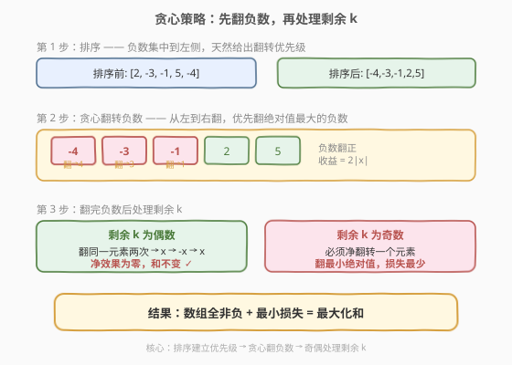
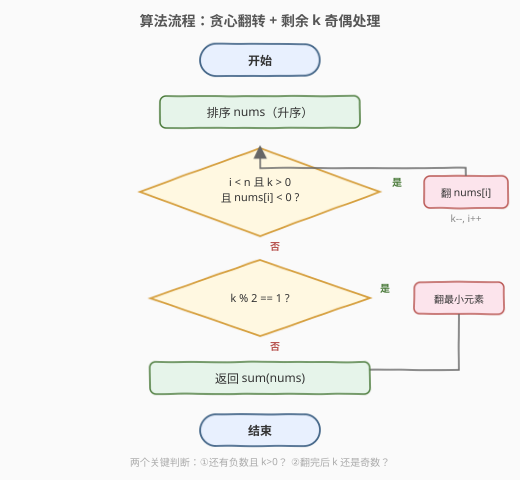
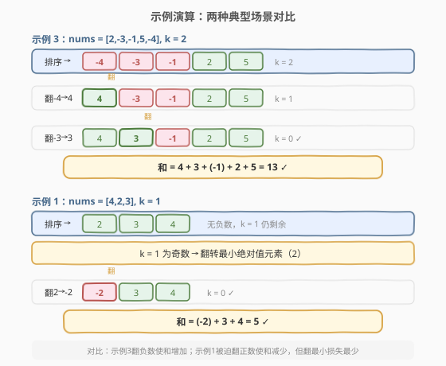

# K 次取反后最大化的数组和

- **题目名称**：K 次取反后最大化的数组和
- **链接**：[1005. K 次取反后最大化的数组和](https://leetcode.cn/problems/maximize-sum-of-array-after-k-negations/)
- **难度**：简单
- **标签**：贪心、数组、排序

## 1. 题目概述

给定一个整数数组 `nums` 和一个整数 `k`。每次操作可以**任选一个下标** `i`，将 `nums[i]` 替换为 `-nums[i]`（即取反）。你必须执行**恰好** `k` 次操作，返回操作后数组元素之和的**最大可能值**。

**示例 1**：

```text
输入：nums = [4,2,3], k = 1
输出：5
解释：选择下标 0，nums 变为 [-4,2,3]，和 = 5。
     若选下标 2，nums 变为 [4,2,-3]，和 = 3。最大为 5。
```

**示例 2**：

```text
输入：nums = [3,-1,0,2], k = 1
输出：6
解释：选择下标 1（值为 -1），nums 变为 [3,1,0,2]，和 = 6。
```

**示例 3**：

```text
输入：nums = [2,-3,-1,5,-4], k = 2
输出：13
解释：翻转 -3 和 -4，nums 变为 [2,3,-1,5,4]，和 = 13。
```

**约束条件**：

- $1 \leq \text{nums.length} \leq 10^4$
- $-100 \leq \text{nums[i]} \leq 100$
- $1 \leq k \leq 10^4$

> 💡 关键约束是「恰好 `k` 次」——不能少做也不能多做。这意味着剩余的 `k` 即使「看起来不需要翻转」也必须消耗掉，需要巧妙处理。

---

## 2. 解题思路

### 2.1 暴力思路：枚举翻转方案

每次从 $n$ 个元素中选一个翻转，共 $k$ 步，方案数为 $n^k$。$n = 10^4$、$k = 10^4$ 时完全不可行。

退一步，用记忆化搜索：状态是「数组的多重集合 + 剩余翻转次数」，但数组状态空间极大，无法有效记忆。

### 2.2 核心观察：贪心——先翻负数，再处理剩余 k



要最大化数组和，直觉是**把负数翻成正数**（每次翻转使和增加 $2|nums[i]|$），且**优先翻绝对值最大的负数**（收益最大）。

具体分三步：

**第 1 步：排序**。排序后负数集中在左侧（从最负到最不负），正数/零在右侧。这天然给出了「翻转优先级」——从左到右依次翻。

**第 2 步：贪心翻转负数**。从左到右扫描，遇到负数就翻转（`k--`），直到没有负数或 `k` 耗尽。

**第 3 步：处理剩余 k**。若翻完所有负数后 `k` 仍有剩余：

- **剩余 `k` 为偶数**：对任意元素翻转偶数次，一正一负相互抵消，**净效果为零**。数组和不变。
- **剩余 `k` 为奇数**：必须翻转奇数次，最终必有**一个元素被翻为相反数**。为了最小化损失，翻转**绝对值最小的元素**——若数组中有 `0`，翻转 `0` 损失为零；否则翻转最小的正数。

> 💡 **为什么偶数次翻转可以「免费」消耗？** 对同一元素连续翻转两次：$x \to -x \to x$，回到原值。所以偶数次翻转可以全部「浪费」在同一个元素上，对和没有任何影响。

> ⚠️ **关键易错点**：翻完负数后，剩余 `k` 为奇数时，要翻转的是**当前数组中绝对值最小的元素**，而非原始数组中的。不过翻完所有负数后，数组中已无负数（非负），此时**最小值 = 最小绝对值**，可直接用 `min_element`。

### 2.3 算法流程图



流程核心是两个判断：
1. **还有负数且 `k > 0`？** → 翻转当前负数，`k--`，继续。
2. **翻完后 `k` 还是奇数？** → 翻转最小元素（最小损失）。

### 2.4 示例演算



**示例 3**：`nums = [2,-3,-1,5,-4]`，`k = 2`

| 步骤 | 数组状态 | 操作 | k | 说明 |
|------|----------|------|---|------|
| 排序 | `[-4,-3,-1,2,5]` | sort | 2 | 负数集中到左侧 |
| 翻转 1 | `[4,-3,-1,2,5]` | 翻 -4 | 1 | 最负的先翻，收益 +8 |
| 翻转 2 | `[4,3,-1,2,5]` | 翻 -3 | 0 | 收益 +6 |
| 完成 | `[4,3,-1,2,5]` | — | 0 | k=0，无需处理剩余 |

和 $= 4+3+(-1)+2+5 = 13$。✓

**示例 1**：`nums = [4,2,3]`，`k = 1`

| 步骤 | 数组状态 | 操作 | k | 说明 |
|------|----------|------|---|------|
| 排序 | `[2,3,4]` | sort | 1 | 无负数 |
| 剩余 k | `[2,3,4]` | — | 1 | k=1 为奇数 |
| 翻最小 | `[-2,3,4]` | 翻 2 | 0 | 最小绝对值元素 |

和 $= -2+3+4 = 5$。✓

> 💡 **对比两个示例**：示例 3 有负数可翻，每次翻转都**增加**和；示例 1 无负数，被迫翻转正数导致**减少**和，但翻最小的损失最少。

---

## 3. 参考代码

### C++

```cpp
class Solution {
  public:
    int largestSumAfterKNegations(vector<int>& nums, int k) {
        sort(nums.begin(), nums.end());
        int n = nums.size();
        for (int i = 0; i < n && k > 0; ++i) {
            if (nums[i] < 0) {
                nums[i] = -nums[i];
                --k;
            }
        }
        if (k % 2 == 1) {
            auto it = min_element(nums.begin(), nums.end());
            *it = -*it;
        }
        return accumulate(nums.begin(), nums.end(), 0);
    }
};
```

### Python

```python
class Solution:
    def largestSumAfterKNegations(self, nums: List[int], k: int) -> int:
        nums.sort()
        n = len(nums)
        for i in range(n):
            if k == 0:
                break
            if nums[i] < 0:
                nums[i] = -nums[i]
                k -= 1
        if k % 2 == 1:
            idx = nums.index(min(nums))
            nums[idx] = -nums[idx]
        return sum(nums)
```

> ⚠️ **三个易错点**：
> 1. **必须恰好 k 次**：不能在「看起来已经最优」时提前停止。剩余 `k` 为偶数时可以免费消耗，但奇数时必须再翻一次。
> 2. **翻完负数后才能用 `min_element`**：若还有负数未翻（`k` 已耗尽），直接求和即可，不需要处理剩余 `k`。只有 `k > 0`（即所有负数已翻完）时才检查奇偶，此时数组全非负，`min_element` 即最小绝对值。
> 3. **排序后翻转不保持有序**：翻转后数组可能不再有序（如 `[-5,1]` → `[5,1]`），但无所谓——后续只需求和与找最小值，不依赖有序性。

---

## 4. 复杂度分析

| 维度 | 复杂度 | 说明 |
|------|--------|------|
| 时间复杂度 | $O(n \log n)$ | 排序 $O(n \log n)$；单次扫描翻转 $O(n)$；`min_element` $O(n)$；求和 $O(n)$。排序为主导 |
| 空间复杂度 | $O(\log n)$ | 排序的递归栈空间（C++ `sort` 为内省排序） |

> 💡 本题 $n \leq 10^4$、$\text{nums[i]} \in [-100, 100]$，排序后一切操作均为线性，总运算量约 $10^4$ 级别，远低于时限。

---

## 5. 扩展：贪心正确性证明

**命题**：上述贪心策略得到的数组和是所有合法方案中的最大值。

**证明思路**（交换论证）：

1. **翻负数优于翻正数**：翻转 $x < 0$ 使和增加 $2|x|$，翻转 $x > 0$ 使和减少 $2x$。故在 `k` 次翻转中，应尽可能多地把翻转次数用在负数上。

2. **翻绝对值大的负数优于翻绝对值小的**：设两个负数 $a < b < 0$（$|a| > |b|$），翻 $a$ 的收益 $2|a| > 2|b|$。故按绝对值从大到小翻转负数是最优的——排序后即从左到右。

3. **剩余 `k` 的最优处理**：所有负数翻完后，数组全非负。若剩余 `k` 为偶数，可两两抵消（净效果为零），无需翻转任何元素。若剩余 `k` 为奇数，必须净翻转一个元素一次，翻转 $x \geq 0$ 损失 $2x$，故选最小的 $x$（即 `min_element`）损失最少。

> 💡 **为什么偶数次翻转可以「浪费」在同一元素上？** 设翻转某元素 $x$ 两次：$x \to -x \to x$。值不变。推广到任意偶数次：$x \to -x \to x \to -x \to \cdots \to x$（偶数次后回到 $x$）。因此偶数个剩余翻转可以全部消耗在同一个元素上，不影响和。

---

## 6. 面试要点

1. **为什么先排序再贪心翻转？**

   - 排序后负数按绝对值从大到小排列（最负在最左），天然给出了翻转优先级。从左到右翻负数等价于「优先翻绝对值最大的负数」，每次翻转收益最大。

2. **剩余 `k` 为偶数时为什么可以直接忽略？**

   - 偶数次翻转可以全部消耗在同一个元素上（翻一次变负、再翻一次回正），净效果为零。因此偶数个剩余操作对数组和没有影响。

3. **剩余 `k` 为奇数时为什么要翻最小元素？**

   - 奇数次翻转的净效果是翻转某个元素一次。翻完所有负数后数组全非负，翻转 $x \geq 0$ 会减少和 $2x$。选最小的 $x$ 损失最少，从而最大化最终和。若数组含 `0`，翻转 `0` 损失为零（$2 \times 0 = 0$）。

4. **如果 `k` 远大于 `n` 怎么办？**

   - 不影响。先翻完所有负数（至多 $n$ 次），剩余 $k - n_{\text{neg}}$ 次按奇偶处理。偶数则免费消耗，奇数则翻一次最小元素。时间复杂度不变。

5. **为什么翻完负数后可以直接用 `min_element` 而非找最小绝对值？**

   - 进入剩余 `k` 处理分支的前提是 `k > 0`，即循环走完了所有元素且还有剩余——所有负数都已被翻为正数。此时数组全非负，最小值即最小绝对值，`min_element` 直接适用。

---

## 7. 同类练习题

- [455. 分发饼干](https://leetcode.cn/problems/assign-cookies/)（[题解](../0401-0500/455_分发饼干.md)）：贪心 + 排序的经典入门题，排序后双指针匹配，体会「排序建立贪心优先级」的范式
- [406. 根据身高重建队列](https://leetcode.cn/problems/queue-reconstruction-by-height/)（[题解](../0401-0500/406_根据身高重建队列.md)）：贪心 + 排序，按多维度排序后贪心插入，对比本题的「排序后线性扫描」
- [409. 最长回文串](https://leetcode.cn/problems/longest-palindrome/)（[题解](../0401-0500/409_最长回文串.md)）：贪心 + 计数，用字符频率贪心构造最长回文，对比本题的「贪心 + 符号翻转」
- [995. K 连续位的最小翻转次数](https://leetcode.cn/problems/minimum-number-of-flips-to-make-binary-string-consecutive/)（[题解](../0901-1000/995_K连续位的最小翻转次数.md)）：同样是「K 次翻转」主题，但要求连续 K 位的翻转使全为 1，用差分跟踪翻转区间，对比本题的「自由选下标翻转」
- [1046. 最后一块石头的重量](https://leetcode.cn/problems/last-stone-weight/)：贪心 + 大顶堆，每次选最大的两块相撞，对比本题的「贪心 + 排序选最值」
