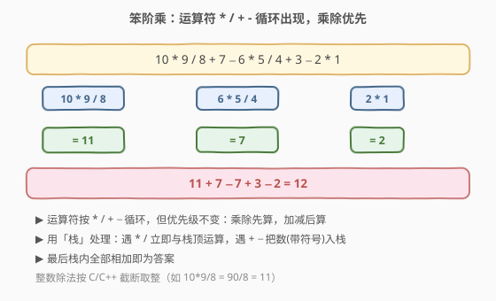
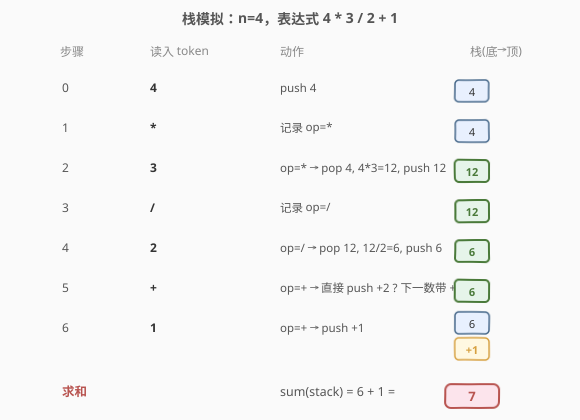
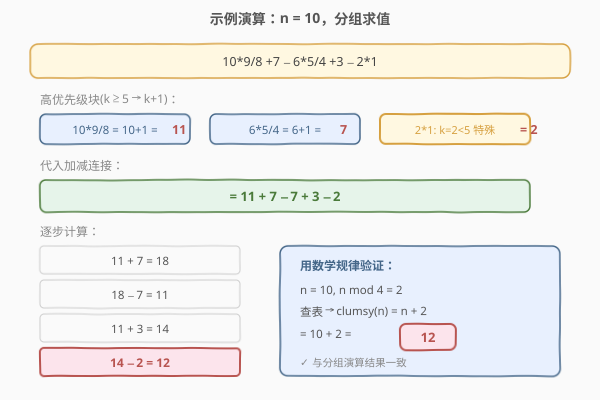
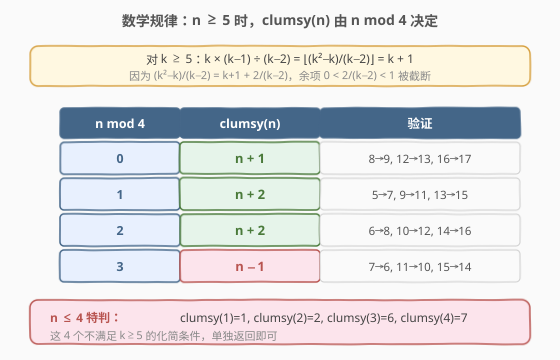

# 笨阶乘

- **题目名称**：笨阶乘
- **链接**：[1006. 笨阶乘](https://leetcode.cn/problems/clumsy-factorial/)
- **难度**：中等
- **标签**：数学、栈、模拟

## 1. 题目概述

通常，正整数 `n` 的阶乘是所有小于等于 `n` 的正整数的乘积。例如 `factorial(10) = 10 * 9 * 8 * 7 * 6 * 5 * 4 * 3 * 2 * 1`。

现在我们设计一个**笨阶乘** `clumsy(n)`：仍然按递减顺序使用 `n` 到 `1` 的所有整数，但运算符按 `*`、`/`、`+`、`-` 循环轮换（而非全用乘法）。运算仍遵循通常的算术优先级：**乘除先于加减**，整数除法按截断取整（向零取整）。

**示例 1**：

```text
输入：4
输出：7
解释：7 = 4 * 3 / 2 + 1
```

**示例 2**：

```text
输入：10
输出：12
解释：12 = 10 * 9 / 8 + 7 - 6 * 5 / 4 + 3 - 2 * 1
```

**约束条件**：

- `1 <= n <= 10000`

---

## 2. 解题思路

### 2.1 暴力思路：直接模拟表达式求值

最直观的思路是把 `n` 到 `1` 的整数按递减顺序排列，运算符按 `*`、`/`、`+`、`-` 循环填入，得到一个含四则运算的表达式字符串，然后求值。

但这样要处理两件事：

1. **运算符优先级**：`*` 和 `/` 优先级高于 `+` 和 `-`，不能从左到右无脑算。
2. **整数除法截断**：题目要求向零取整（如 `10 * 9 / 8 = 90 / 8 = 11`，不是 `11.25`）。

处理优先级最自然的工具就是**栈**——这正是「基本计算器」类问题的通用套路。

### 2.2 核心观察：用栈处理乘除优先级



上图展示了关键直觉：

- 表达式 `10 * 9 / 8 + 7 - 6 * 5 / 4 + 3 - 2 * 1` 中，`*` 和 `/` 把相邻数字「黏」成一个个**高优先级块**（如 `10*9/8`、`6*5/4`、`2*1`）。
- 块与块之间用 `+` 和 `-` 连接，只要把每个块算成一个值，剩下的就是一串加减。
- **栈的职责**：遇到 `*` / `/` 就立即与栈顶运算（把高优先级「就地消化」）；遇到 `+` / `-` 就把下一个数（带符号）压入栈中（推迟到末尾统一求和）。

> 💡 这和 [224. 基本计算器](../0201-0300/224_基本计算器.md) 用栈处理 `+`/`-`、[227. 基本计算器 II](https://leetcode.cn/problems/basic-calculator-ii/) 用栈处理 `*`/`/` 优先级是**同一套模板**。区别只是本题的运算符是固定循环的，不需要解析字符串。

**栈模拟过程**（以 `n=4` 为例，表达式 `4 * 3 / 2 + 1`）：



要点：

1. 先把第一个数 `n` 压入栈。
2. 之后每读一个运算符 `op` 和一个数 `num`：
   - `op == '*'`：弹出栈顶 `t`，压入 `t * num`。
   - `op == '/'`：弹出栈顶 `t`，压入 `⌊t / num⌋`（向零取整）。
   - `op == '+'`：压入 `+num`。
   - `op == '-'`：压入 `-num`。
3. 最后把栈里所有数求和，即为答案。

> ⚠️ 整数除法方向：C++/Java 的 `/` 对正数即向零取整，符合题意；Python 的 `//` 是向下取整，对正数也一致，但**负数**行为不同。本题 `n` 与各操作数恒为正，故无需特殊处理；若推广到含负数，需用 `int(t / num)` 显式向零取整。

### 2.3 算法流程图

```text
┌──────────────────────────────┐
│  初始化：stack = [n]          │
│  运算符序列 ops = [*,/,+,-]   │
│  当前数 cur = n-1, opIdx = 0  │
└──────────────┬───────────────┘
               ▼
       ┌──────────────┐
       │  cur >= 1 ?  │──否──▶ 求 sum(stack) 返回
       └──────┬───────┘
              │是
              ▼
     op = ops[opIdx % 4]
              │
   ┌──────────┴──────────┐
   ▼                     ▼
 op ∈ {*, /}         op ∈ {+, -}
 弹出 t              push (op==+? +cur : -cur)
 push t (*或/) cur    opIdx++, cur--
 opIdx++, cur--            │
   │                       │
   └─────────┬─────────────┘
             ▼
        回到「cur >= 1 ?」
```

### 2.4 示例演算：n = 10



对 `n=10`，表达式按高优先级块分组为 `(10*9/8) + 7 - (6*5/4) + 3 - (2*1)`：

- `10*9/8 = 90/8 = 11`
- `6*5/4 = 30/4 = 7`
- `2*1 = 2`

代入加减连接：`11 + 7 - 7 + 3 - 2 = 12`。

---

## 3. 参考代码

### C++

#### 解法一：栈模拟

```cpp
class Solution {
public:
    int clumsy(int n) {
        vector<int> stack;
        stack.push_back(n);
        char ops[4] = {'*', '/', '+', '-'};
        int cur = n - 1, opIdx = 0;
        while (cur >= 1) {
            char op = ops[opIdx % 4];
            if (op == '*') {
                stack.back() *= cur;
            } else if (op == '/') {
                stack.back() /= cur;          // 向零取整
            } else if (op == '+') {
                stack.push_back(cur);
            } else {
                stack.push_back(-cur);
            }
            opIdx++;
            cur--;
        }
        int ans = 0;
        for (int x : stack) ans += x;
        return ans;
    }
};
```

#### 解法二：数学规律 O(1)

先观察一个关键化简：对任意 $k \geq 5$，

$$
k \times (k-1) \div (k-2) = \left\lfloor \frac{k^2 - k}{k-2} \right\rfloor = \left\lfloor k + 1 + \frac{2}{k-2} \right\rfloor = k + 1
$$

因为 $k \geq 5$ 时 $0 < \frac{2}{k-2} < 1$，余项被截断。于是每个「高优先级块」$k*(k-1)/(k-2)$ 都化简为 $k+1$，表达式退化为常数级的加减，可推出闭式规律：



```cpp
class Solution {
public:
    int clumsy(int n) {
        if (n == 1) return 1;
        if (n == 2) return 2;
        if (n == 3) return 6;
        if (n == 4) return 7;
        switch (n % 4) {
            case 0: return n + 1;
            case 1: return n + 2;
            case 2: return n + 2;
            default: return n - 1;   // n % 4 == 3
        }
    }
};
```

### Python

#### 解法一：栈模拟

```python
class Solution:
    def clumsy(self, n: int) -> int:
        stack = [n]
        ops = ['*', '/', '+', '-']
        cur, op_idx = n - 1, 0
        while cur >= 1:
            op = ops[op_idx % 4]
            if op == '*':
                stack[-1] *= cur
            elif op == '/':
                stack[-1] = int(stack[-1] / cur)   # 向零取整
            elif op == '+':
                stack.append(cur)
            else:
                stack.append(-cur)
            op_idx += 1
            cur -= 1
        return sum(stack)
```

#### 解法二：数学规律 O(1)

```python
class Solution:
    def clumsy(self, n: int) -> int:
        if n <= 4:
            return [1, 2, 6, 7][n - 1]
        r = n % 4
        if r == 0:
            return n + 1
        elif r in (1, 2):
            return n + 2
        else:  # r == 3
            return n - 1
```

---

## 4. 复杂度分析

| 维度 | 方法 | 复杂度 | 说明 |
|------|------|--------|------|
| 时间复杂度 | 栈模拟 | $O(n)$ | 从 `n` 递减到 `1`，每个数一次入栈/运算 |
| 空间复杂度 | 栈模拟 | $O(n)$ | `+`/`-` 操作把数压栈，最坏约 `n/2` 个元素 |
| 时间复杂度 | 数学规律 | $O(1)$ | 仅按 `n % 4` 查表返回 |
| 空间复杂度 | 数学规律 | $O(1)$ | 只用常数变量 |

> 💡 **面试首选**：先讲栈模拟（思路清晰、易推广到通用表达式求值），再推导数学规律作为「进阶优化」。$n \leq 10000$ 时两种方法都能 AC，但数学规律体现了「先观察再优化」的思维深度。

---

## 5. 扩展：数学规律的推导细节

以 $n \geq 5$ 为前提，表达式按高优先级块分组为：

$$
\underbrace{(n \cdot \tfrac{n-1}{n-2})}_{=n+1} + (n-3) \;-\; \underbrace{((n-4) \cdot \tfrac{n-5}{n-6})}_{=n-3} + (n-7) \;-\; \cdots
$$

每个「块 + 后随单数」的单元（块起点 $k \geq 5$）贡献：

$$
-((k+1)) + (k-3) = -4
$$

于是答案 = 首单元 $(n+1)+(n-3)=2n-2$，减去若干个 $-4$ 单元，再拼上尾部余项（由 $n \bmod 4$ 决定的最后 1–3 个数）。按余数分四种情形化简，恰好得到上表的 $n+1$ / $n+2$ / $n+2$ / $n-1$。其中 $n \bmod 4 = 0$ 时尾部最后一个块起点为 $4$（不满足 $k \geq 5$），$4 \cdot 3 / 2 = 6 = 4+2$ 而非 $4+1$，这一项的偏差正是该分支结果为 $n+1$ 而非 $n+2$ 的根源。

---

## 6. 面试要点

1. **为什么要用栈？不能直接从左到右算吗？**
   - 运算符有优先级，`*`/`/` 必须先于 `+`/`-` 结算。从左到右扫到 `+`/`-` 时，还不知道右侧是否有更高优先级的 `*`/`/` 待算；栈把已结算的高优先级块暂存，把 `+`/`-` 的数推迟到末尾统一求和。

2. **栈里存的是什么？为什么 `+`/`-` 把带符号的数压栈，而 `*`/`/` 直接改栈顶？**
   - 栈存的是「待累加的项」。`*`/`/` 优先级高，必须立刻和前一个项合并（改栈顶）；`+`/`-` 优先级低，把新数作为一个独立项（带正负号）入栈即可，最终求和自然处理了加减。

3. **整数除法为什么要注意向零取整？**
   - 题目要求截断取整（向零）。C++/Java 对正整数 `/` 天然向零取整；Python 的 `//` 对正数也一致，但对**负数**是向下取整（如 `-3 // 2 == -2`，而向零应为 `-1`）。本题操作数恒正，故无影响；若推广到含负数的表达式求值，Python 需用 `int(a / b)`。

4. **数学规律是怎么想到的？**
   - 关键观察：$k \geq 5$ 时 $k \cdot (k-1) / (k-2) = k+1$（多项式除法 + 截断）。这把每个高优先级块化简为常数式，使整个表达式退化为可闭式求解的加减序列。属于「算几个小例子 → 找余数周期 → 证明化简」的典型数学题套路。

5. **和「基本计算器」系列的关系？**
   - 本题栈解法是 [224. 基本计算器](../0201-0300/224_基本计算器.md)（仅 `+`/`-`）、[227. 基本计算器 II](https://leetcode.cn/problems/basic-calculator-ii/)（含 `*`/`/`）的**同模板特例**：运算符固定循环，省去了字符串解析。掌握了这套栈模板，通用表达式求值（含括号、含优先级）都能套用。

---

## 7. 同类练习题

- [227. 基本计算器 II](https://leetcode.cn/problems/basic-calculator-ii/)：含 `+ - * /` 的通用表达式求值，本题栈解法的「母题」，模板完全一致
- [224. 基本计算器](../0201-0300/224_基本计算器.md)：含括号与一元符号的计算器，栈处理括号是本题栈思路的进阶
- [150. 逆波兰表达式求值](../0001-0100/150_逆波兰表达式求值.md)：后缀表达式直接用栈求值，与本题「栈存待累加项」同源
- [29. 两数相除](../0001-0100/29_两数相除.md)：位运算模拟除法 + 截断取整边界，与本题整数除法语义相关
- [877. 石子游戏](https://leetcode.cn/problems/stone-game/)：另一道「表面模拟、实则数学规律 O(1)」的中等题，思维路径相似
