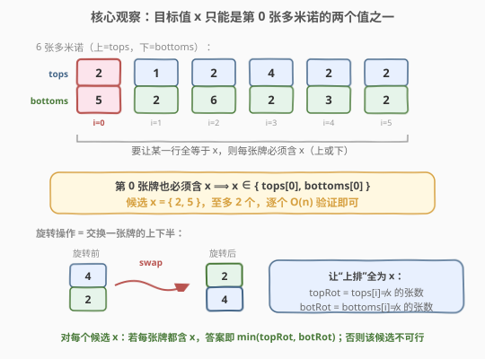
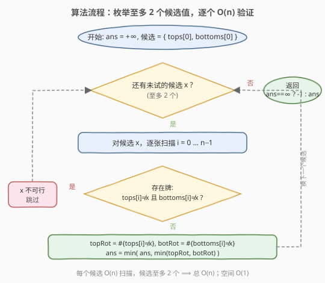
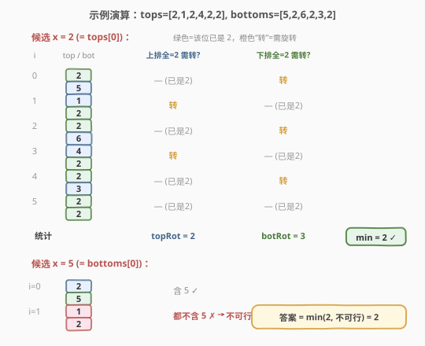

# 行相等的最少多米诺旋转

- **题目名称**：行相等的最少多米诺旋转
- **链接**：[1007. 行相等的最少多米诺旋转](https://leetcode.cn/problems/minimum-domino-rotations-for-equal-row/)
- **难度**：中等
- **标签**：贪心、数组

## 1. 题目概述

一排 `n` 张多米诺骨牌，`tops[i]` 和 `bottoms[i]` 分别表示第 `i` 张牌的上半部分和下半部分的数字（每个数字都在 `1~6` 之间）。一次「旋转」操作可交换第 `i` 张牌的 `tops[i]` 与 `bottoms[i]`。

返回**最小旋转次数**，使得**上排所有值相同**或者**下排所有值相同**。若不可能，返回 `-1`。

**示例 1**：

```text
输入：tops = [2,1,2,4,2,2], bottoms = [5,2,6,2,3,2]
输出：2
解释：旋转第 1、3 张牌（下标从 0 计），上排变为 [2,2,2,2,2,2]，全为 2。
```

**示例 2**：

```text
输入：tops = [3,5,1,2,3], bottoms = [3,6,3,3,4]
输出：-1
解释：没有任何值能同时出现在所有牌上，不可能使任一行全等。
```

**约束条件**：

- `2 <= n == tops.length == bottoms.length <= 2 * 10^4`
- `1 <= tops[i], bottoms[i] <= 6`

---

## 2. 解题思路

### 2.1 暴力思路

枚举目标值 `x ∈ {1,2,3,4,5,6}` 共 6 个候选；对每个 `x` 扫一遍所有牌：

- 若某张牌 `tops[i] != x` 且 `bottoms[i] != x`，则 `x` 无法让任一行全等，跳过；
- 否则统计「让上排全 `x`」需旋转的张数 `topRot`（即 `tops[i] != x` 的牌数），以及「让下排全 `x`」需旋转的张数 `botRot`（即 `bottoms[i] != x` 的牌数），取 `min(topRot, botRot)`。

取所有可行候选中的最小值。整体 `O(6 * n) = O(n)`，已经足够。但候选其实可以再压缩——见下文。

### 2.2 核心观察：候选值只有至多 2 个



关键直觉：**目标值 `x` 必须出现在每一张多米诺上**（要么在上、要么在下，否则这张牌无论怎么转都无法贡献 `x` 给目标行）。

于是第 `0` 张牌也必须含 `x`，即 `x` 只能是 `tops[0]` 或 `bottoms[0]`：

$$
x \in \{\,\text{tops}[0],\ \text{bottoms}[0]\,\}
$$

- 若 `tops[0] == bottoms[0]`，候选只有 1 个；
- 否则候选至多 2 个。

对每个候选 `x` 仍做一次 `O(n)` 扫描验证：

- **可行性**：存在 `i` 使 `tops[i] != x` 且 `bottoms[i] != x` → 该候选不可行；
- **代价**：可行时，`topRot = #{i : tops[i] != x}`，`botRot = #{i : bottoms[i] != x}`，该候选贡献 `min(topRot, botRot)`。

> 💡 **为什么 `topRot` 这样数就够？** 若 `x` 可行，则对每个 `tops[i] != x` 的牌，必有 `bottoms[i] == x`，旋转一次即可把 `x` 放到上排；`tops[i] == x` 的牌无需动。故「让上排全 `x`」的最少旋转数恰为 `tops[i] != x` 的张数。下排同理。

> ⚠️ **勿忘「上下皆等于 `x`」的牌**：此时 `tops[i] == x` 且 `bottoms[i] == x`，对 `topRot`、`botRot` 都不增计数——它无论朝向都已是 `x`，无需旋转。这正是 `topRot = #{tops[i] != x}`（而非 `#{bottoms[i] == x}`）写法的稳健之处：两者在可行前提下数值相等，但前者直接表达「需要转的牌」。

### 2.3 算法流程图



### 2.4 示例演算



以示例 1 `tops = [2,1,2,4,2,2]`、`bottoms = [5,2,6,2,3,2]` 为例，候选集 `{tops[0], bottoms[0]} = {2, 5}`：

- **候选 `x = 2`**：逐张扫描，每张牌都含 `2` ✓。统计 `topRot = 2`（`i=1,3` 需把 `2` 转到上排）、`botRot = 3`（`i=0,2,4` 需把 `2` 转到下排），贡献 `min(2,3) = 2`。
- **候选 `x = 5`**：`i=0` 含 `5`，但 `i=1` 为 `(1,2)` 都不含 `5` → 不可行，跳过。

最终 `ans = min(2, 不可行) = 2`。

---

## 3. 参考代码

### C++

```cpp
class Solution {
  public:
    int minDominoRotations(vector<int>& tops, vector<int>& bottoms) {
        int ans = INT_MAX;
        // 候选值：第 0 张牌的上、下两个值
        for (int x : {tops[0], bottoms[0]}) {
            int topRot = 0, botRot = 0;
            bool ok = true;
            for (int i = 0; i < (int)tops.size(); ++i) {
                if (tops[i] != x && bottoms[i] != x) { // 该牌不含 x，候选不可行
                    ok = false;
                    break;
                }
                if (tops[i] != x) ++topRot;     // 让上排全 x 需转此牌
                if (bottoms[i] != x) ++botRot;  // 让下排全 x 需转此牌
            }
            if (ok) ans = min(ans, min(topRot, botRot));
        }
        return ans == INT_MAX ? -1 : ans;
    }
};
```

### Python

```python
class Solution:
    def minDominoRotations(self, tops: List[int], bottoms: List[int]) -> int:
        ans = float('inf')
        for x in (tops[0], bottoms[0]):       # 至多 2 个候选
            top_rot = bot_rot = 0
            ok = True
            for t, b in zip(tops, bottoms):
                if t != x and b != x:         # 该牌不含 x，候选不可行
                    ok = False
                    break
                if t != x:
                    top_rot += 1              # 让上排全 x 需转此牌
                if b != x:
                    bot_rot += 1             # 让下排全 x 需转此牌
            if ok:
                ans = min(ans, top_rot, bot_rot)
        return -1 if ans == float('inf') else ans
```

> ⚠️ **两个易错点**：
> 1. **候选只看第 0 张牌**：不要枚举 `1~6`。即使 `tops[0] == bottoms[0]`，用集合/去重也能自然处理（两次枚举同一值只是多扫一遍，不影响正确性）。
> 2. **不可行要返回 `-1`**：两个候选都不可行时 `ans` 仍为初值，需显式判断。例如示例 2 中没有任何值能覆盖所有牌。

---

## 4. 复杂度分析

| 维度 | 复杂度 | 说明 |
|------|--------|------|
| 时间复杂度 | O(n) | 候选至多 2 个，每个扫一遍 `O(n)`；总计 `O(2n) = O(n)` |
| 空间复杂度 | O(1) | 仅用常数个计数变量 |

> 💡 `n <= 2 * 10^4` 且值域仅 `1~6`，`O(n)` 极其宽裕。即便退化为枚举 6 个值也是 `O(6n)`，同样通过。

---

## 5. 扩展：为什么候选只需第 0 张牌？——反证法

假设存在某个可行目标 `x`，且 `x != tops[0]` 且 `x != bottoms[0]`。那么第 `0` 张牌的两个值都不是 `x`，无论是否旋转，第 `0` 张牌都无法在某一行呈现 `x`，故 `x` 不可能让任一行全等，与「可行」矛盾。

因此可行目标必在 `{tops[0], bottoms[0]}` 中，候选压缩到至多 2 个是**严格正确**的，不是启发式。

> 💡 这与 [169. 多数元素](../0101-0200/169_多数元素.md) 的 Boyer-Moore「候选消除」、[229. 多数元素 II](../0201-0300/229_多数元素II.md) 同属一类思想：**用一道约束把候选空间砍到常数大小，再做常数次验证**。本题的约束是「第 0 张牌必须含 `x`」。

---

## 6. 面试要点

1. **为什么候选只有至多 2 个？**

   - 目标 `x` 必须出现在每张牌上，故第 `0` 张牌必含 `x`，即 `x ∈ {tops[0], bottoms[0]}`。这是反证法得出的硬约束，不是猜测。

2. **`topRot` 和 `botRot` 分别怎么数？为什么这么数对？**

   - `topRot = #{i : tops[i] != x}`：要让上排全 `x`，凡是上排不是 `x` 的牌都得转一次（可行性保证转后上排即为 `x`）。`botRot` 同理对下排。两者都已在「`x` 可行」前提下计算。

3. **「上排全 `x`」和「下排全 `x`」为什么取 `min` 而不是分别取最小再合并？**

   - 题目允许「上排或下排任一全等」，对同一候选 `x`，两个方案互斥（选其一），故取较小者。再对所有候选取最小即为全局答案。

4. **如果 `tops[0] == bottoms[0]` 怎么办？**

   - 候选集退化到 1 个值，代码中两次枚举同一值只是多扫一遍，结果不变；也可用集合去重，但无必要。

5. **什么时候返回 `-1`？**

   - 两个候选都不可行时，即没有任何值能覆盖所有牌。典型如示例 2：每张牌的并集虽大，但没有一个值同时出现在所有牌上。

---

## 7. 同类练习题

- [169. 多数元素](https://leetcode.cn/problems/majority-element/)：用一道约束把候选砍到常数个再验证，同「候选压缩」范式（Boyer-Moore）
- [229. 多数元素 II](https://leetcode.cn/problems/majority-element-ii/)：扩展到 ⌊n/3⌋ 众数，候选至多 2 个，仍是「先定候选再计数验证」
- [914. 卡牌分组](https://leetcode.cn/problems/x-of-a-kind-in-a-deck-of-cards/)：统计每种数字出现的牌数，求公约数 ≥ 2，同样是值域 1~1000 的计数扫描
- [789. 逃脱阻碍者](https://leetcode.cn/problems/escape-the-ghosts/)：贪心 + 曼哈顿距离比较，无需模拟每步，体现「抓住不变量简化判断」的同类直觉
