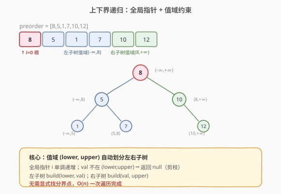
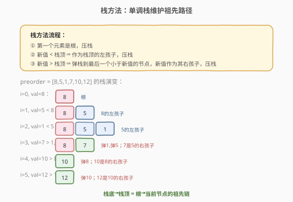
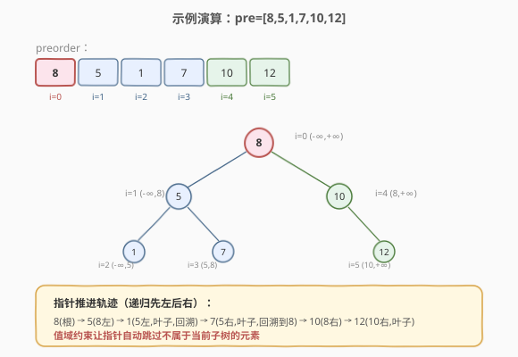

# LeetCode 前序遍历构造二叉搜索树 题解

## 1. 题目概述

- **标题 / 题号**：前序遍历构造二叉搜索树（#1008，medium）
- **链接**：https://leetcode.cn/problems/construct-binary-search-tree-from-preorder-traversal/
- **难度**：中等
- **标签**：树、BST、栈、分治

**题意**：给定一个整数数组 `preorder`，它是某棵**二叉搜索树（BST）**的前序遍历结果，请构造这棵树并返回其根节点。题目保证 `preorder` 是合法 BST 的前序遍历。

**示例 1**：

```text
输入：preorder = [8,5,1,7,10,12]
输出：[8,5,10,1,7,null,12]
```

**示例 2**：

```text
输入：preorder = [1,3]
输出：[1,null,3]
```

**约束**：

- `1 <= preorder.length <= 100`
- `1 <= preorder[i] <= 10^8`
- `preorder` 中的值互不相同
- 保证 `preorder` 是某棵 BST 的前序遍历

## 2. 解题思路

### 2.1 暴力思路：分治 + 线性扫描分界

前序第一个是根。BST 性质保证：左子树所有值 < 根，右子树所有值 > 根。线性扫描找到第一个大于根的位置即可划分左右，再递归构造。每层 `O(n)`，总 `O(n^2)`。

### 2.2 核心观察：上下界递归（最优）



BST 的前序遍历顺序是「根-左-右」，而左子树值都在 `(lower, rootVal)`，右子树值都在 `(rootVal, upper)`。用一个**全局前序指针** `i` 从左到右取值，配合**上下界**递归：

1. 若 `i >= n` 或 `preorder[i]` 不在 `(lower, upper)` 内，返回 `null`（当前区间无节点）。
2. 否则取 `rootVal = preorder[i++]` 建根。
3. `root.left = build(lower, rootVal)`：左子树值域 `(lower, rootVal)`。
4. `root.right = build(rootVal, upper)`：右子树值域 `(rootVal, upper)`。

> 💡 上下界天然「吃掉」了属于当前子树的连续前序片段。指针 `i` 会自动跳过不属于当前值域的元素，无需显式找分界点。这是最优雅的 `O(n)` 解法。

### 2.3 算法流程图（栈方法对比）



> 💡 **栈方法**同样 `O(n)`：维护从根到当前节点路径的单调栈。新值比栈顶小则作为左孩子压栈；比栈顶大则不断弹栈，最后一个弹出的是父节点，新值作为其右孩子。

### 2.4 示例演算



以 `preorder = [8,5,1,7,10,12]` 为例，上下界递归过程：

| 步骤 | 指针 i | 取值 | 上下界 (lower, upper) | 动作 |
|------|--------|------|----------------------|------|
| 1    | 0      | 8    | (-∞, +∞)             | 建根 8 |
| 2    | 1      | 5    | (-∞, 8)              | 8 的左孩子 |
| 3    | 2      | 1    | (-∞, 5)              | 5 的左孩子（叶子） |
| 4    | 3      | 7    | (5, 8)               | 5 的右孩子（叶子） |
| 5    | 4      | 10   | (8, +∞)              | 8 的右孩子 |
| 6    | 5      | 12   | (10, +∞)             | 10 的右孩子（叶子） |

最终树：`8` 左 `5` 右 `10`；`5` 左 `1` 右 `7`；`10` 右 `12`。

## 3. 参考代码

### C++

```cpp
class Solution {
  public:
    TreeNode* bstFromPreorder(vector<int>& preorder) {
        int i = 0;                                  // 全局前序指针
        return build(preorder, i, INT_MIN, INT_MAX);
    }

  private:
    TreeNode* build(vector<int>& preorder, int& i, long lower, long upper) {
        if (i >= (int)preorder.size()) return nullptr;
        int val = preorder[i];
        if (val <= lower || val >= upper) return nullptr;   // 不在当前值域
        ++i;
        TreeNode* root = new TreeNode(val);
        root->left  = build(preorder, i, lower, val);       // 左子树值域 (lower, val)
        root->right = build(preorder, i, val, upper);       // 右子树值域 (val, upper)
        return root;
    }
};
```

### Python

```python
class Solution:
    def bstFromPreorder(self, preorder: List[int]) -> Optional[TreeNode]:
        i = 0
        n = len(preorder)

        def build(lower: float, upper: float) -> Optional[TreeNode]:
            nonlocal i
            if i >= n:
                return None
            val = preorder[i]
            if val <= lower or val >= upper:        # 不在当前值域
                return None
            i += 1
            root = TreeNode(val)
            root.left = build(lower, val)           # 左子树值域 (lower, val)
            root.right = build(val, upper)          # 右子树值域 (val, upper)
            return root

        return build(float('-inf'), float('inf'))
```

> 💡 上下界用 `long`（C++）或 `float('inf')`（Python）避免边界溢出。由于值域 `(lower, upper)` 是开区间，`val <= lower || val >= upper` 判断元素是否属于当前子树。

**栈方法参考实现（C++）**：

```cpp
TreeNode* bstFromPreorder(vector<int>& preorder) {
    if (preorder.empty()) return nullptr;
    TreeNode* root = new TreeNode(preorder[0]);
    stack<TreeNode*> st;
    st.push(root);
    for (int i = 1; i < (int)preorder.size(); ++i) {
        TreeNode* node = new TreeNode(preorder[i]);
        TreeNode* parent = nullptr;
        while (!st.empty() && preorder[i] > st.top()->val) {
            parent = st.top(); st.pop();            // 找到右孩子的父节点
        }
        if (parent) parent->right = node;           // 作为右孩子
        else        st.top()->left = node;          // 作为左孩子
        st.push(node);
    }
    return root;
}
```

## 4. 复杂度分析

| 维度 | 复杂度 | 说明 |
|------|--------|------|
| 时间复杂度 | O(n) | 上下界法/栈法每个节点访问一次，指针单调推进 |
| 空间复杂度 | O(n) | 递归栈最坏 O(n)（链状树）；栈法显式栈 O(n) |

## 5. 扩展：三种解法对比

| 解法 | 时间 | 空间 | 思路 |
|------|------|------|------|
| 分治 + 线性扫描 | O(n^2) | O(n) | 每层线性找分界点 |
| 分治 + 二分找分界 | O(n log n) | O(n) | 利用「左子树全小于根」二分 |
| **上下界递归** | **O(n)** | O(n) | 全局指针 + 值域约束，最优 |
| 栈方法 | O(n) | O(n) | 单调栈维护路径 |

> ⚠️ 上下界递归与栈法都是 `O(n)`，但前者代码更短、更易理解，是面试首选。栈法的优势在于天然支持迭代、不依赖递归栈。

## 6. 面试要点

1. **为什么上下界递归是 O(n)？**
   - 全局指针 `i` 只增不减，每个元素恰好被消费一次。虽然递归调用看起来像分治，但「不在值域就返回」的剪枝让指针不会回退，总访问次数为 `n` 加上常数倍的失败探测。

2. **上下界是开区间还是闭区间？**
   - 开区间 `(lower, upper)`。因为 BST 左子树严格小于根、右子树严格大于根（本题值互不相同）。判断 `val <= lower || val >= upper` 表示不属于当前子树。

3. **栈方法中弹栈的含义是什么？**
   - 栈维护从根到当前节点路径上的祖先。新值比栈顶大，说明它属于栈顶节点的右子树（或更高祖先的右子树）。不断弹栈直到栈顶大于新值，最后一个弹出的就是新值作为右孩子的父节点。

4. **为什么 BST 的前序能唯一确定树？**
   - BST 的中序是排序后的序列（固定），因此「前序 + BST 性质」等价于「前序 + 中序」，而前者能唯一构造树。这与普通二叉树不同（普通树需前序+中序两序列）。

5. **如果 preorder 不合法怎么办？**
   - 上下界递归会在某处指针无法推进或最终 `i != n`，可据此检测非法输入。本题保证合法，无需处理。

## 同类练习题

| # | 题目 | 与本题的关联 |
|---|------|-------------|
| 108 | [将有序数组转换为二叉搜索树](https://leetcode.cn/problems/convert-sorted-array-to-binary-search-tree/)（[题解](../0101-0200/108_将有序数组转换为二叉搜索树.md)） | 中序（升序数组）构造平衡 BST |
| 98 | [验证二叉搜索树](https://leetcode.cn/problems/validate-binary-search-tree/)（[题解](../0001-0100/98_验证二叉搜索树.md)） | 上下界验证的逆向应用 |
| 94 | [二叉树的中序遍历](https://leetcode.cn/problems/binary-tree-inorder-traversal/)（[题解](../0001-0100/94_二叉树的中序遍历.md)） | BST 中序升序的性质 |
| 255 | [验证前序遍历序列二叉搜索树](https://leetcode.cn/problems/verify-preorder-sequence-in-binary-search-tree/) | 栈方法判断合法性 |
