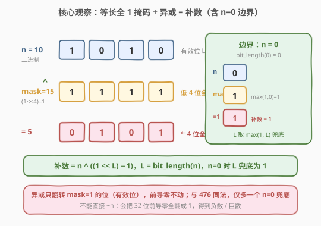
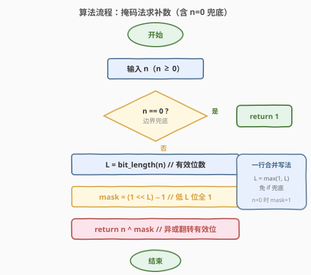
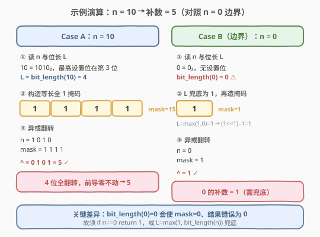

# 十进制整数的补数

- **题目名称**：十进制整数的补数
- **链接**：[1009. 十进制整数的补数](https://leetcode.cn/problems/complement-of-base-10-integer/)
- **难度**：简单
- **标签**：位运算

## 1. 题目概述

给定一个**非负整数** `n`，返回它的**补数**（complement）。补数的定义是：将 `n` 的二进制表示**逐位翻转**（`0` ↔ `1`），且**只翻转从最高有效位到最低位**的范围，前导零不参与翻转。

> 💡 **与「按位取反 `~n`」的区别**：`~n` 会翻转全部 32 位（含前导零），在 C++/Java 中得到一个负数、在 Python 中得到一个巨大数，均非本题所求。本题只翻转**有效位**（最高设置位及以下）。

**示例 1**：

```text
输入：n = 5
输出：2
解释：5 的二进制为 101，有效位数 L = 3。
逐位翻转得 010，即十进制 2。
```

**示例 2**：

```text
输入：n = 7
输出：0
解释：7 的二进制为 111，有效位数 L = 3。
逐位翻转得 000，即十进制 0。
```

**示例 3**：

```text
输入：n = 10
输出：5
解释：10 的二进制为 1010，有效位数 L = 4。
逐位翻转得 0101，即十进制 5。
```

**约束条件**：

- $0 \leq n < 10^9$

> ⚠️ **关键边界**：本题允许 `n = 0`（与姊妹题 [476. 数字的补数](https://leetcode.cn/problems/number-complement/) 的 `num ≥ 1` 不同）。`0` 的二进制无设置位，`bit_length(0) = 0`，直接套掩码公式会得到错误结果 `0`（正确答案应为 `1`），必须**单独兜底**。这是 1009 相对 476 的唯一新增考点，详见第 2 节。

---

## 2. 解题思路

### 2.1 暴力思路：字符串翻转

最直观的做法是先把 `n` 转成二进制字符串，逐字符翻转 `0`/`1`，再转回十进制：

```python
s = bin(n)[2:]                       # 10 -> '1010'
t = ''.join('1' if c == '0' else '0' for c in s)   # '0101'
return int(t, 2)                     # 5
```

时间 $O(L)$，空间 $O(L)$（字符串长度）。能 AC，但**绕了一圈**——既然翻转二进制位本质是位运算，却借道字符串转换，既多了一次 `int→str` 和一次 `str→int` 的往返，也引入了 $O(L)$ 的额外空间。更糟的是另一种「朴素位运算」写法：直接 `~n`（按位取反），这在 32 位下会把所有前导 `0` 也翻成 `1`，得到一个负数或巨大数——完全错误。

> 💡 转机在于：翻转「有效位」需要先知道**有效位的范围**。只要构造一个**与有效位等长的全 `1` 掩码**，再用异或一次性翻转——掩码为 `1` 的位被翻转，掩码为 `0` 的位（前导零）保持不变。

### 2.2 核心观察：等长全 1 掩码 + 异或（含 n=0 兜底）



关键性质有两点：

1. **异或翻转**：`a ^ 1 = ~a`（`0→1`，`1→0`），`a ^ 0 = a`（保持）。故 `n ^ mask` 中，`mask` 为 `1` 的位翻转 `n` 对应位，`mask` 为 `0` 的位不变。
2. **等长全 1 掩码**：设 `n` 的有效位数为 $L$（即 `bit_length(n)`），则掩码 `mask = (1 << L) - 1` 恰好是低 $L$ 位全 `1`、更高位全 `0`。

| `n` 的位 | `mask` 的位 | `n ^ mask` 的位 |
|-----------|-------------|-------------------|
| 0 | 1 | 1（翻转） |
| 1 | 1 | 0（翻转） |

掩码之外的高位（前导零）对应 `mask = 0`，异或后保持 `0`，天然不被翻转——这正是「只翻转有效位」的语义。

> ⚠️ **`n = 0` 的陷阱**：`bit_length(0) = 0`，于是 `mask = (1 << 0) - 1 = 0`，`0 ^ 0 = 0`。但 `0` 的二进制为 `"0"`，翻转后应为 `"1"` 即 `1`。原因在于 `L = 0` 时掩码退化成空，没有位可翻转。解法有二：
> - **显式兜底**：`if n == 0: return 1`；
> - **位长兜底**：`L = max(1, bit_length(n))`，让 `L` 至少为 `1`，则 `mask = (1 << 1) - 1 = 1`，`0 ^ 1 = 1` ✓。

> 💡 **关键转化**：补数 = $n \oplus ((1 \ll L) - 1)$，其中 $L = \text{bit\_length}(n)$（`n=0` 时兜底为 `1`）。这一步把「逐位翻转有效位」归约为一次异或运算，关键在于如何构造等长掩码并处理 `n=0` 边界。

### 2.3 算法流程图



算法只需四步：

1. **判边界**：若 `n == 0`，直接返回 `1`（或用 `L = max(1, bit_length(n))` 合并此步）。
2. **求位长**：`L = bit_length(n)`，即最高设置位的位置 + 1。
3. **构造掩码**：`mask = (1 << L) - 1`，得到低 $L$ 位全 `1`。
4. **异或翻转**：`return n ^ mask`。

> ⚠️ **正确性**：`mask` 的低 $L$ 位全 `1`、更高位全 `0`，故 `n ^ mask` 仅翻转 `n` 的低 $L$ 位（即有效位），前导零不变。`n = 0` 经兜底后 `L = 1`、`mask = 1`，`0 ^ 1 = 1`，恰为 `0` 的补数。

### 2.4 示例演算

以示例 3 的 `n = 10` 为例，并对照 `n = 0` 边界：



**Case A：`n = 10`**

| 步骤 | 计算 | 结果 |
|------|------|------|
| ① 读位长 | `10 = 1010₂`，最高设置位在第 3 位 | $L = \text{bit\_length}(10) = 4$ |
| ② 造掩码 | `mask = (1 << 4) - 1 = 16 - 1` | `15`（二进制 `1111`） |
| ③ 异或 | `1010 ^ 1111` | `0101` = `5` ✓ |

4 位全翻转，第 4 位及以上的前导零不动，结果 `5`。

**Case B（边界）：`n = 0`**

| 步骤 | 计算 | 结果 |
|------|------|------|
| ① 读位长 | `0 = 0₂`，无设置位 | `bit_length(0) = 0` ⚠ |
| ② 兜底造掩码 | `L = max(1, 0) = 1`，`mask = (1 << 1) - 1` | `1`（二进制 `1`） |
| ③ 异或 | `0 ^ 1` | `1` ✓ |

若不兜底，`L = 0` → `mask = 0` → `0 ^ 0 = 0` ✗。这正是 1009 相对 476 的唯一新增考点。

---

## 3. 参考代码

### C++

```cpp
class Solution {
  public:
    int bitwiseComplement(int n) {
        if (n == 0) return 1;          // n=0 兜底
        int L = 0;
        int temp = n;
        while (temp) {                 // 求 bit_length
            L++;
            temp >>= 1;
        }
        unsigned mask = (1u << L) - 1;
        return n ^ mask;
    }
};
```

也可用位扩散法（不依赖 `bit_length`、天然规避 `1 << 31` 的符号位溢出）：

```cpp
class Solution {
  public:
    int bitwiseComplement(int n) {
        if (n == 0) return 1;          // n=0 兜底
        unsigned mask = n;
        mask |= mask >> 1;             // 位扩散：把最高设置位以下全填 1
        mask |= mask >> 2;
        mask |= mask >> 4;
        mask |= mask >> 8;
        mask |= mask >> 16;
        return n ^ mask;
    }
};
```

> ⚠️ **C++ 类型陷阱**：`1 << 31` 在 `int` 下是未定义行为（符号位溢出）。本题 $n < 10^9 < 2^{30}$，故 $L \leq 30$，`1u << L` 用 `unsigned` 安全；位扩散法只对 `n` 自身移位，更稳妥。

### Python

```python
class Solution:
    def bitwiseComplement(self, n: int) -> int:
        if n == 0:
            return 1                   # n=0 兜底
        L = n.bit_length()
        mask = (1 << L) - 1
        return n ^ mask
```

也可用 `max(1, ...)` 一行合并 `n=0` 兜底，免去 `if`：

```python
class Solution:
    def bitwiseComplement(self, n: int) -> int:
        L = max(1, n.bit_length())     # n=0 时 L 兜底为 1
        return n ^ ((1 << L) - 1)
```

> 💡 Python 整数无限精度，`(1 << L) - 1` 不会溢出，无需类型考量。`int.bit_length()` 直接给出有效位数（不含符号位与前导零），与本题语义完全契合；`bit_length(0) = 0` 是唯一需兜底的点。

---

## 4. 复杂度分析

| 维度 | 复杂度 | 说明 |
|------|--------|------|
| 时间复杂度 | $O(1)$ | `bit_length` 为常数次移位（最坏 30 次）；位扩散法固定 5 次移位；异或与减法各 $O(1)$ |
| 空间复杂度 | $O(1)$ | 仅用 `L` 与 `mask` 两个变量 |

> 💡 与字符串翻转法（$O(L)$ 时间 + $O(L)$ 空间）相比，位运算法无额外空间、常数级操作。由于 $L \leq 30$，两种写法在最坏情况下都是常数级，但位运算法避免了一次 `int→str` 和 `str→int` 的往返，常数更优，且更贴合「位运算」题的考察意图。

---

## 5. 扩展：与 476 的关系及掩码构造法对比

### 5.1 1009 与 476 的异同

[476. 数字的补数](../0401-0500/476_数字的补数.md) 与本题**核心解法完全一致**（等长全 1 掩码 + 异或），差异只在输入范围与边界处理：

| 维度 | 476 数字的补数 | 1009 十进制整数的补数 |
|------|---------------|----------------------|
| 输入范围 | $1 \leq \text{num} < 2^{31}$（正整数） | $0 \leq n < 10^9$（非负整数） |
| `n = 0` | 不会出现 | **会出现，需兜底返回 1** |
| 掩码公式 | `mask = (1 << bit_length) - 1` | 同左，但 `bit_length(0)=0` 需兜底 |
| 位扩散法 | 直接可用 | 直接可用（`n=0` 仍需 `if` 兜底，因扩散后 mask 仍为 0） |

> 💡 **记忆要点**：见到「补数」题，先想「等长全 1 掩码 + 异或」；只要输入可能为 `0`，就加一个 `n == 0` 的兜底（或 `L = max(1, L)`）。476 的题解已详述掩码原理，本题侧重 `n=0` 边界，二者可交叉验证。

### 5.2 构造等长掩码的多种方法

「求 `n` 的等长全 1 掩码」是位运算题的高频子问题，有多种实现：

| 方法 | 写法 | 说明 |
|------|------|------|
| **位长 + 移位** | `L = bit_length(n); mask = (1 << L) - 1` | 最直观，依赖 `bit_length` |
| **位扩散（smear）** | `mask = n; mask \|= mask>>1; ...>>2; ...>>4; ...>>8; ...>>16` | 5 次移位把最高设置位以下全填 1，不依赖 `bit_length` |
| **库函数** | C++: `mask = (1u << (32 - __builtin_clz(n))) - 1` | 用前导零计数反推位长 |

**位扩散法**的原理：从最高设置位开始，每次右移并按位或，把 `1` 向低位「传染」：

```text
num        = 0010 1000  (最高设置位在第 5 位)
num | >>1  = 0011 1100  (第 5 位 1 传染到第 4 位)
num | >>2  = 0011 1111  (再传染到第 3、2 位)
num | >>4  = 0011 1111  (已全 1，后续无变化)
...
最终 mask  = 0011 1111  (第 0..5 位全 1)
```

5 次移位（`>>1, >>2, >>4, >>8, >>16`）保证覆盖 32 位整数。该法不用 `bit_length`，在无该内置函数的语言中是标准技巧。注意 `n=0` 时扩散后 `mask` 仍为 `0`，故仍需 `if n == 0` 兜底——这是位扩散法在本题相对 476 的唯一额外注意点。

---

## 6. 面试要点

1. **为什么不能直接用 `~n`？**

   - `~` 是对**所有位**取反。在 32 位下，`~5 = ~...00000101 = ...11111010`，前导 `0` 全被翻成 `1`，结果是一个负数（C++/Java 的有符号 `int`）或巨大数（Python 无限精度）。补数的定义只翻转**有效位**（最高设置位及以下），故必须先用掩码限定范围，再异或翻转。

2. **掩码 `(1 << L) - 1` 为什么是低 L 位全 1？**

   - `1 << L` 是第 $L$ 位为 `1`、低 $L$ 位全 `0` 的数（即 $2^L$）。减 1 后，第 $L$ 位借位变 `0`，低 $L$ 位全变 `1`，更高位仍为 `0`。例如 $L = 4$：`1 << 4 = 10000`，`10000 - 1 = 01111`。

3. **`n = 0` 时为什么结果不是 0 而是 1？如何处理？**

   - `0` 的二进制为 `"0"`，翻转后为 `"1"` 即 `1`。但 `bit_length(0) = 0` → `mask = (1 << 0) - 1 = 0` → `0 ^ 0 = 0`，掩码退化为空导致无位可翻。处理方式二选一：`if n == 0: return 1`，或 `L = max(1, bit_length(n))` 让位长至少为 1。这是 1009 相对 476（`num ≥ 1`）的唯一新增考点。

4. **位扩散法和位长法各有什么优劣？**

   - 位长法 `mask = (1 << bit_length) - 1` 直观易读，一行搞定，但依赖语言提供 `bit_length` / `__builtin_clz`。位扩散法 `mask |= mask >> 1; ...` 不依赖内置函数，5 次固定移位即可，在嵌入式或无库函数场景更通用，且天然规避 `1 << 31` 的符号位溢出。但两者对 `n=0` 都需额外兜底（扩散后 `mask` 仍为 `0`）。

5. **C++ 中 `1 << 31` 为什么有坑？**

   - `1` 是 `int` 类型，`1 << 31` 把符号位置 1，在 C++ 中是**未定义行为**（有符号溢出）。本题 $n < 10^9 < 2^{30}$，$L \leq 30$，不会触发，但写工业代码时应用 `unsigned`：`1u << L`，或改用位扩散法。Python 无此问题（整数无限精度）。

---

## 7. 同类练习题

- [476. 数字的补数](https://leetcode.cn/problems/number-complement/)（[题解](../0401-0500/476_数字的补数.md)）：与本题几乎同题（输入恒为正整数，无 `n=0` 边界），解法完全一致，可交叉验证掩码构造
- [191. 位 1 的个数](https://leetcode.cn/problems/number-of-1-bits/)（[题解](../0001-0100/191_位1的个数.md)）：位运算入门母题，`n & (n-1)` 技巧的源头，本题位运算的基础
- [461. 汉明距离](https://leetcode.cn/problems/hamming-distance/)（[题解](../0401-0500/461_汉明距离.md)）：异或把差异编码为 1，与本题「异或翻转有效位」共用异或语义
- [190. 颠倒二进制位](https://leetcode.cn/problems/reverse-bits/)：32 位逐位处理，与本题「仅有效位处理」对照（190 是全 32 位，1009 是仅有效位）
- [231. 2 的幂](https://leetcode.cn/problems/power-of-two/)：`n & (n-1) == 0` 判定，位运算基础练习，承接掩码构造中的最高位提取
