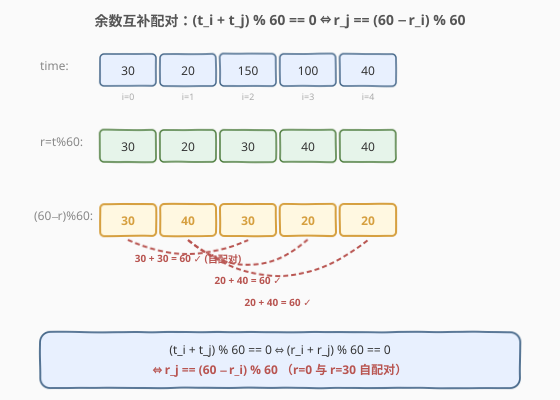
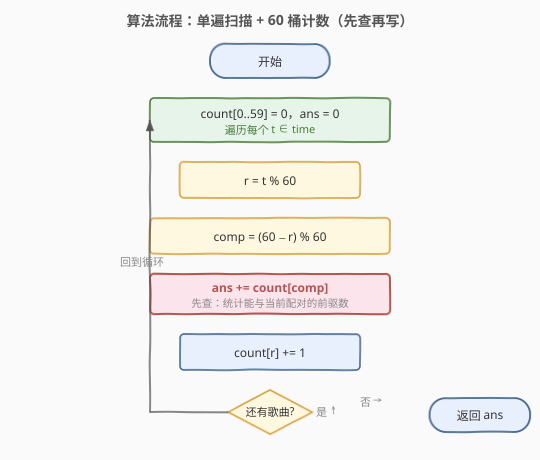
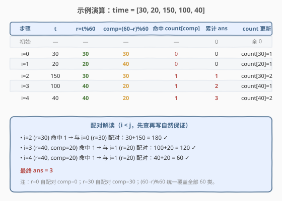

# LeetCode 总持续时间可被 60 整除的歌曲对 题解

## 1. 题目概述

- **标题 / 题号**：总持续时间可被 60 整除的歌曲对（#1010，medium）
- **链接**：https://leetcode.cn/problems/pairs-of-songs-with-total-durations-divisible-by-60/
- **难度**：中等
- **标签**：数组、哈希表、计数、数学

**题意**：在歌曲列表中，第 `i` 首歌曲的持续时间为 `time[i]` 秒。返回其**总持续时间（以秒为单位）可被 `60` 整除**的歌曲对的数量。形式化地，求满足 `i < j` 且 `(time[i] + time[j]) % 60 == 0` 的下标对 `(i, j)` 的数目。

**示例 1**：

```text
输入：time = [30,20,150,100,40]
输出：3
解释：三对歌曲的总持续时间分别是 60、120、180，均能被 60 整除：
      (20,100) → 120，(20,40) → 60，(30,150) → 180。
```

**示例 2**：

```text
输入：time = [60,60,60]
输出：3
解释：任意两首歌曲的总持续时间都是 120，可被 60 整除，共 C(3,2)=3 对。
```

**约束**：

- `1 <= time.length <= 6 * 10^4`
- `1 <= time[i] <= 500`

> 💡 注意：要求的是**无序对** `i < j`，且同一首歌不能与自己配对。这与 [1. 两数之和](../0001-0100/1_两数之和.md) 的「找一对下标」属同一框架，只是目标和从「等于 target」推广为「被 60 整除」。

## 2. 解题思路

### 2.1 暴力思路

枚举所有下标对 `(i, j)`（`i < j`），逐个判断 `(time[i] + time[j]) % 60 == 0`。两重循环共 `O(n^2)`，而 `n` 可达 `6 * 10^4`，约 `1.8 * 10^9` 次运算，必然超时。

### 2.2 核心观察：余数互补配对



关键在于**只关心每首歌时长对 60 的余数**，而非时长本身。令 $r = t \bmod 60$，则：

$$
(t_i + t_j) \bmod 60 = (r_i + r_j) \bmod 60
$$

要让它等于 `0`，只需 $r_i + r_j$ 是 `60` 的倍数。由于 $r_i, r_j \in [0, 59]$，它们的和落在 `[0, 118]`，能被 `60` 整除只有两种情况：

- $r_i + r_j = 0$：即 $r_i = r_j = 0$；
- $r_i + r_j = 60$：即 $r_j = 60 - r_i$。

两者可统一写成 **互补余数公式**：

$$
r_j = (60 - r_i) \bmod 60
$$

> 💡 这个 `(60 - r) % 60` 优雅地覆盖了所有 60 类：`r=0` 时互补数仍是 `0`（自配对），`r=30` 时互补数仍是 `30`（自配对），其余 `r` 与 `60-r` 互为对偶。和 [1. 两数之和](../0001-0100/1_两数之和.md) 的「查 `target - x`」完全同构——把「差等于 target」换成「和被 60 整除」，把目标值换成「互补余数」。

于是问题转化为：**对每首歌，统计之前有多少首歌的余数等于它的互补余数**。用大小为 60 的计数数组即可 `O(1)` 查询。

### 2.3 哈希表优化：一次遍历（先查再写）

不必先统计所有余数再两两配对，可以**边走边查**：

1. 维护长度为 60 的数组 `count`，`count[r]` 表示目前遍历到的歌中余数为 `r` 的数量。
2. 对每首歌时长 `t`：
   - 算 `r = t % 60`；
   - 算互补余数 `comp = (60 - r) % 60`；
   - **先查**：`ans += count[comp]`（当前歌与之前所有互补的歌配对）；
   - **再写**：`count[r] += 1`（把当前歌加入计数，供后续歌查询）。

> ⚠️ **「先查再写」的顺序至关重要**：
> - 保证 `i < j`：查询时 `count` 里只有下标更小的歌，天然满足「当前歌作 `j`，已统计的作 `i`」。
> - 避免自配对：若先写再查，`r=0` 或 `r=30` 的歌会把自己也算进互补数，导致与自身配对。先查再写把当前歌排除在外。
>
> 这正是 [1. 两数之和](../0001-0100/1_两数之和.md) 与 [974. 和可被 K 整除的子数组](../0901-1000/974_和可被K整除的子数组.md) 共用的同一条铁律——「查询在写入之前」。

### 2.4 算法流程图



### 2.5 示例演算

以 `time = [30, 20, 150, 100, 40]` 为例：



| 步骤 | t | r=t%60 | comp=(60−r)%60 | 命中 count[comp] | 累计 ans | count 更新 |
|------|----|--------|----------------|------------------|----------|------------|
| 初始 | —  | —      | —              | —                | 0        | 全 0       |
| i=0  | 30 | 30     | 30             | 0                | 0        | count[30]=1 |
| i=1  | 20 | 20     | 40             | 0                | 0        | count[20]=1 |
| i=2  | 150| 30     | 30             | 1                | 1        | count[30]=2 |
| i=3  | 100| 40     | 20             | 1                | 2        | count[40]=1 |
| i=4  | 40 | 40     | 20             | 1                | 3        | count[40]=2 |

最终答案为 `3`：
- `i=2 (r=30)` 与 `i=0 (r=30)` 配对：`150+30 = 180` ✓
- `i=3 (r=40)` 与 `i=1 (r=20)` 配对：`100+20 = 120` ✓
- `i=4 (r=40)` 与 `i=1 (r=20)` 配对：`40+20 = 60` ✓

> 💡 验证示例 2 `[60,60,60]`：三首歌 `r` 均为 `0`，互补数也是 `0`。`i=0` 命中 0、`i=1` 命中 1、`i=2` 命中 2，累计 `0+1+2 = 3 = C(3,2)`。这正是「自配对类」用组合数 `C(k,2)` 计数的体现。

## 3. 参考代码

### C++

```cpp
class Solution {
  public:
    int numPairsDivisibleBy60(vector<int>& time) {
        int count[60] = {0};
        int ans = 0;
        for (int t : time) {
            int r = t % 60;
            int comp = (60 - r) % 60;
            ans += count[comp];
            count[r]++;
        }
        return ans;
    }
};
```

### Python

```python
class Solution:
    def numPairsDivisibleBy60(self, time: List[int]) -> int:
        count = [0] * 60
        ans = 0
        for t in time:
            r = t % 60
            comp = (60 - r) % 60
            ans += count[comp]
            count[r] += 1
        return ans
```

> ⚠️ **三个易错点**：
> 1. **互补余数写成 `(60 - r) % 60` 而非 `60 - r`**：当 `r = 0` 时 `60 - r = 60`，会越界访问 `count[60]`。`(60 - 0) % 60 = 0` 才是正确的自配对下标。这是本题最高频的 bug。
> 2. **先查再写**：必须先 `ans += count[comp]` 再 `count[r]++`。顺序颠倒会让 `r=0` 或 `r=30` 的歌与自身配对，多算一倍。
> 3. **用定长数组而非哈希表**：余数取值固定为 `[0, 59]`，用 `int count[60]` 比 `unordered_map` 更快更省。Python 用 `[0]*60` 列表即可。

## 4. 复杂度分析

| 维度 | 复杂度 | 说明 |
|------|--------|------|
| 时间复杂度 | O(n) | 只遍历数组一次，每步取模与数组读写均为 O(1) |
| 空间复杂度 | O(1) | 计数数组大小恒为 60，与输入规模无关 |

> 💡 由于 `time[i] <= 500`，`t % 60` 是常数开销；`n <= 6 * 10^4` 时总运算量约 `6 * 10^4`，远低于时限。

## 5. 扩展：组合数视角与两遍写法

把所有余数统计出来后，答案也可用组合数一次性算出：

- 余数为 `0` 的歌有 `c[0]` 首，两两配对，贡献 $\binom{c[0]}{2}$；
- 余数为 `30` 的歌有 `c[30]` 首，两两配对，贡献 $\binom{c[30]}{2}$；
- 对 `r ∈ [1, 29]`，余数 `r` 与 `60-r` 互配，为避免重复计数只枚举 `r ∈ [1, 29]`，贡献 $c[r] \times c[60-r]$。

$$
\text{ans} = \binom{c[0]}{2} + \binom{c[30]}{2} + \sum_{r=1}^{29} c[r] \cdot c[60-r]
$$

> 💡 **「先查再写」单遍法 vs 「统计后组合」两遍法**：两者结果一致。单遍法把组合数计算「摊」到每次写入里——写入第 `k` 个余数为 `r` 的歌时，`count[comp]` 恰为 `k-1`，累加起来就是 $\sum_{k=1}^{c[r]} (k-1) = \binom{c[r]}{2}$（自配对类）或 $\sum c[\text{comp 当时}]$（互配类）。两遍法更直观但需写两次循环，单遍法更简洁且只需一次遍历，是面试首选。

> ⚠️ 用两遍法时，互配类**只枚举 `r ∈ [1, 29]`**，否则 `r=20` 与 `r=40` 会被算两遍。自配对类 `0` 和 `30` 单独用组合数处理，不进入乘积项。

## 6. 面试要点

1. **为什么用 `(60 - r) % 60` 而不是 `60 - r`？**

   - `r = 0` 时 `60 - r = 60`，越界访问 `count[60]`。`(60 - 0) % 60 = 0` 才正确——余数为 `0` 的歌互补数仍是 `0`，与同类配对。这一步同时统一了「自配对（`r=0,30`）」和「互配（其余 `r`）」两种情形。

2. **为什么必须先查再写？**

   - 查询时 `count` 里只装了之前遍历过的歌，天然保证 `i < j`。若先写再查，当前歌会被计入 `count[r]`，当 `comp == r`（即 `r=0` 或 `r=30`）时就会与自身配对，多算一次。

3. **与 1. 两数之和的联系与区别？**

   - 框架完全一致：都是「遍历 + 查互补 + 写哈希」。区别在于目标和——1 题查 `target - x`（精确差），本题查 `(60 - r) % 60`（模意义下的互补）。本质都是把「两数满足某关系」转化为「单数查互补数」。

4. **排序 + 双指针能做吗？为什么首选哈希计数？**

   - 能做。配对数关于下标排列是不变的（只数对数、不要求具体下标），排序后用相向双指针数互补对即可，复杂度 `O(n log n)`。但需小心处理重复值（同余数的多个元素）和自配对类（`r=0,30`）的组合数。相比之下，哈希计数法 `O(n)` 单遍、无需排序、无需去重，`60` 个桶固定开销，是本题更优且更不易写错的选择。

5. **答案会溢出吗？**

   - 最坏情况 `n = 6*10^4` 全部 `r=0`，对数为 $\binom{6\times10^4}{2} \approx 1.8 \times 10^9$，逼近 32 位 `int` 上界（约 `2.1*10^9`）。本题数据下 `int` 恰好不溢出，但更稳妥应声明为 `long long` / `long`。Python 整数无界，无此问题。

## 同类练习题

| # | 题目 | 与本题的关联 |
|---|------|-------------|
| 1 | [两数之和](https://leetcode.cn/problems/two-sum/)（[题解](../0001-0100/1_两数之和.md)） | 哈希查互补的母题，「先查再写」铁律的源头 |
| 974 | [和可被 K 整除的子数组](https://leetcode.cn/problems/subarray-sums-divisible-by-k/)（[题解](../0901-1000/974_和可被K整除的子数组.md)） | 同余思想的另一形态，前缀和 + 同余统计子数组数 |
| 454 | [四数相加 II](https://leetcode.cn/problems/4sum-ii/)（[题解](../0401-0500/454_四数相加%20II.md)） | 分组 + 哈希 Meet in the Middle，把「两数互补」推广到「两组互补」 |
| 189 | [轮转数组](https://leetcode.cn/problems/rotate-array/) | 同样用到「下标对 60（或 k）取模」的周期性思维，可作为模运算的对照练习 |
| 760 | [找出变位映射](https://leetcode.cn/problems/find-anagram-mappings/) | 哈希查互补位置的另一计数场景 |
