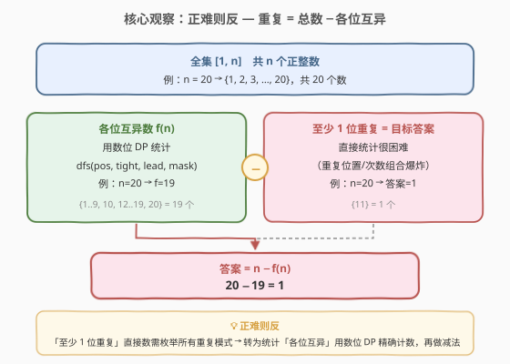
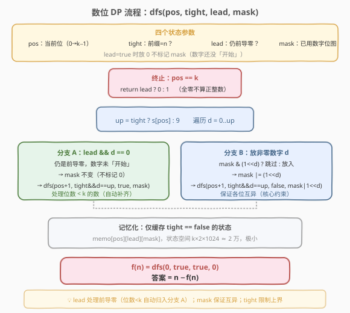
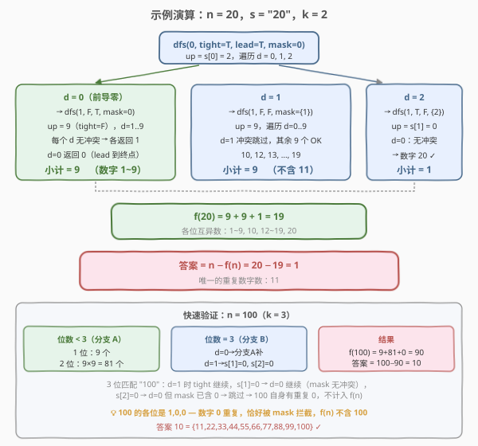

# 至少有 1 位重复的数字

- **题目名称**：至少有 1 位重复的数字
- **链接**：[1012. 至少有 1 位重复的数字](https://leetcode.cn/problems/numbers-with-repeated-digits/)
- **难度**：困难
- **标签**：数学、动态规划、数位 DP

## 1. 题目概述

给定正整数 $n$，返回在 $[1, n]$ 范围内**至少有一位数字重复**的正整数个数。

**示例 1**：

```text
输入：n = 20
输出：1
解释：只有 11 含有重复数字。
```

**示例 2**：

```text
输入：n = 100
输出：10
解释：11, 22, 33, 44, 55, 66, 77, 88, 99, 100 含有重复数字。
```

**示例 3**：

```text
输入：n = 1000
输出：262
```

**约束条件**：

- $1 \le n \le 10^9$

> ⚠️ $n$ 可达 $10^9$（10 位数），逐个枚举 $[1, n]$ 必然超时。直接统计「至少一位重复」需要枚举所有重复模式（哪几位重复、重复几次），组合爆炸。必须换一个视角——**正难则反**：统计「各位互异」的个数 $f(n)$，再用 $n$ 减去。

---

## 2. 解题思路

### 2.1 暴力思路：逐个枚举

最直白的做法：遍历 $[1, n]$ 中每个数 $x$，将其转成字符串，检查是否有重复字符。

```text
ans = 0
for x = 1 .. n:
    if has_repeated_digit(x):
        ans += 1
```

问题：$n \le 10^9$，循环 $10^9$ 次必然超时。且每个数要转字符串再判重，常数开销大。

> 💡 暴力法的浪费在于：它**逐个检查**每个数，丢失了「按数位分层」的结构。当 $n$ 是 10 位数时，$[1, n]$ 中绝大多数数的位数都 $< 10$，而这些数中「各位互异」的个数可以按排列公式直接算出，无需逐个检查。即使位数 $= 10$ 的数，也可逐位用组合计数高效统计。

### 2.2 核心观察：正难则反 + 数位 DP



**正难则反**是本题的灵魂：

- **直接统计「至少一位重复」**——需考虑哪几位重复、重复几次、重复的是哪个数字……情况繁多，难以不重不漏。
- **统计「各位互异」**——只需保证每位填的数字不与之前用过的重复，用**位掩码 mask** 即可精确追踪。这是数位 DP 的经典应用。

于是：

$$\text{答案} = n - f(n)$$

其中 $f(n)$ 是 $[1, n]$ 中**各位数字互不相同**的正整数个数，用数位 DP 统计。

**数位 DP 的四个状态**：

| 状态 | 含义 | 作用 |
|------|------|------|
| `pos` | 当前处理的数位（$0 \to k-1$） | 从高到低逐位填数字 |
| `tight` | 前缀是否与 $n$ 完全相等 | `true` 时当前位上限为 $s[\text{pos}]$，否则为 $9$ |
| `lead` | 是否仍处于前导零 | `true` 时放 $0$ 不标记 mask（数字还没「开始」） |
| `mask` | 已用数字的位图（10 bit，对应 $0$–$9$） | 保证各位互异——已用数字不能再用 |

> 💡 **`lead` 的作用**：处理「位数 $< k$」的数。例如 $n = 100$（$k=3$），数字 $5$ 在三位表示中是 `005`，前两个 $0$ 是前导零，不算「使用了数字 $0$」。`lead=true` 时放 $0$ 表示「数字还没开始」，不更新 `mask`；一旦放了非零数字，`lead` 变 `false`，此后放 $0$ 才真正占用 `mask` 中的 $0$ 位。这与 [902. 最大为 N 的数字组合](../0901-1000/902_最大为N的数字组合.md) 不同——902 的 `digits` 不含 $0$，天然无前导零问题；本题数字可含 $0$，必须显式处理。

> ⚠️ **终止条件 `return lead ? 0 : 1`**：若走完所有 $k$ 位 `lead` 仍为 `true`，说明整数为全零（即 $0$），不是正整数，返回 $0$。否则返回 $1$（一个合法的各位互异正整数）。

### 2.3 算法流程图



**完整步骤**：

1. **预处理**：$s = \text{str}(n)$，$k = \text{len}(s)$。初始化记忆化数组 `memo`。
2. **DFS**：调用 `dfs(0, true, true, 0)`，即从第 0 位开始，前缀与 $n$ 相等（`tight=true`），处于前导零（`lead=true`），未用任何数字（`mask=0`）。
3. **每位遍历** $d = 0 \ldots \text{up}$（`up = tight ? s[pos] : 9`）：
   - **分支 A**（`lead && d == 0`）：仍是前导零，`mask` 不变，递归 `dfs(pos+1, tight&&d==up, true, mask)`。
   - **分支 B**（放实际数字）：若 `mask & (1<<d)` 则跳过（数字已用过）；否则递归 `dfs(pos+1, tight&&d==up, false, mask|(1<<d))`。
4. **记忆化**：仅缓存 `tight == false` 的状态（`tight=true` 的路径唯一，无法复用）。
5. **返回**：$f(n) = \text{dfs}(0, \text{true}, \text{true}, 0)$，最终答案 $= n - f(n)$。

> 💡 **为什么只缓存 `tight=false`？** `tight=true` 的路径只有一条（逐位匹配 $n$ 的前缀），每一步的 `up` 依赖 $n$ 的具体数字，状态不会复用。而 `tight=false` 后，后续完全自由（`up=9`），相同 `(pos, lead, mask)` 的结果与 $n$ 无关，可安全缓存。状态空间 $k \times 2 \times 1024 \approx 2 \times 10^4$，极小。

### 2.4 示例演算



以 $n = 20$ 为例（$s = \text{"20"}$，$k = 2$），调用 `dfs(0, true, true, 0)`：

**第 0 位**：`up = s[0] = 2`，遍历 $d = 0, 1, 2$。

| $d$ | 分支 | 递归调用 | 结果 | 对应数字 |
|-----|------|---------|------|---------|
| 0 | A（前导零） | `dfs(1, false, true, 0)` | 9 | 1–9（一位数） |
| 1 | B | `dfs(1, false, false, {1})` | 9 | 10, 12–19（不含 11） |
| 2 | B | `dfs(1, true, false, {2})` | 1 | 20 |

- **$d=0$**（前导零）：`dfs(1, false, true, 0)`，`up=9`，遍历 $d=1 \ldots 9$，每个无冲突各返回 1，$d=0$ 仍前导零返回 0。小计 $= 9$。
- **$d=1$**：`mask={1}`，`dfs(1, false, false, {1})`，`up=9`，遍历 $d=0 \ldots 9$，$d=1$ 冲突跳过，其余 9 个各返回 1。小计 $= 9$（数字 10, 12, 13, …, 19）。
- **$d=2$**：`mask={2}`，`tight=true`，`dfs(1, true, false, {2})`，`up=s[1]=0`，只能放 $d=0$，无冲突 → 返回 1。小计 $= 1$（数字 20）。

$$f(20) = 9 + 9 + 1 = 19$$

$$\text{答案} = 20 - 19 = 1 \quad \checkmark$$

**再验 $n = 100$**（$k=3$）：

- 位数 $< 3$ 的各位互异数：1 位 $9$ 个 + 2 位 $9 \times 9 = 81$ 个，共 $90$ 个（由分支 A 的前导零自动补齐）。
- 位数 $= 3$ 匹配 "100"：$d=1$（tight 继续）→ $s[1]=0$，$d=0$（mask 无冲突，tight 继续）→ $s[2]=0$，$d=0$ **但 mask 已含 0 → 跳过**。100 自身有重复 0，不计入 $f(n)$。
- $f(100) = 90$，答案 $= 100 - 90 = 10$ $\checkmark$（11, 22, …, 99, 100）。

---

## 3. 参考代码

### C++

```cpp
// 1012.至少有1位重复的数字.cpp —— 正难则反 + 数位 DP
// 编译: g++ -O2 -std=c++17 1012.cpp -o sol
#include <string>
#include <cstring>
using namespace std;

class Solution {
  public:
    int numDupDigitsAtMostN(int n) {
        string s = to_string(n);
        memset(memo, -1, sizeof(memo));
        return n - dfs(s, 0, true, true, 0);
    }

  private:
    int memo[11][2][1024];  // [pos][lead][mask]，仅 tight=false 时缓存

    int dfs(const string& s, int pos, bool tight, bool lead, int mask) {
        if (pos == (int)s.size()) return lead ? 0 : 1;

        if (!tight) {
            int& cached = memo[pos][lead][mask];
            if (cached != -1) return cached;
        }

        int up = tight ? s[pos] - '0' : 9;
        int ans = 0;
        for (int d = 0; d <= up; d++) {
            if (lead && d == 0) {
                // 前导零：数字未「开始」，mask 不变
                ans += dfs(s, pos + 1, tight && d == up, true, mask);
            } else {
                if (mask & (1 << d)) continue;  // 数字已用过，跳过
                ans += dfs(s, pos + 1, tight && d == up, false, mask | (1 << d));
            }
        }

        if (!tight) memo[pos][lead][mask] = ans;
        return ans;
    }
};
```

### Python

```python
from functools import lru_cache

class Solution:
    def numDupDigitsAtMostN(self, n: int) -> int:
        s = str(n)

        @lru_cache(None)
        def dfs(pos: int, tight: bool, lead: bool, mask: int) -> int:
            if pos == len(s):
                return 0 if lead else 1

            up = int(s[pos]) if tight else 9
            ans = 0
            for d in range(up + 1):
                if lead and d == 0:
                    # 前导零：数字未「开始」，mask 不变
                    ans += dfs(pos + 1, tight and d == up, True, mask)
                else:
                    if mask & (1 << d):
                        continue  # 数字已用过，跳过
                    ans += dfs(pos + 1, tight and d == up, False, mask | (1 << d))
            return ans

        return n - dfs(0, True, True, 0)
```

> ⚠️ **三个易错点**：
> 1. **前导零不能标记 mask**：`lead && d == 0` 时，数字 $0$ 是前导零而非有效位，不更新 `mask`。否则 $5$（表示为 `005`）会被误判为「使用了数字 $0$」，导致后续无法再放 $0$。
> 2. **终止条件 `lead ? 0 : 1`**：全零（即 $0$）不是正整数，返回 $0$。若误返回 $1$，则 $f(n)$ 多算 $1$，答案少 $1$。
> 3. **C++ 记忆化只缓存 `tight=false`**：`tight=true` 的路径依赖 $n$ 的具体数字，无法跨不同前缀复用。Python 的 `lru_cache` 直接缓存全部状态（含 `tight`），因为 `tight=True` 的状态只出现一次，不会误命中——但 C++ 手写记忆化必须显式跳过。

---

## 4. 复杂度分析

| 维度 | 复杂度 | 说明 |
|------|--------|------|
| **时间复杂度** | $O(k \cdot 2 \cdot 2^{10})$ | 状态数 $k \times 2 \times 2^{10}$（`tight` 只有 `false` 被缓存），每个状态转移 $O(10)$。$k \le 10$，总计约 $2 \times 10^5$ 次运算 |
| **空间复杂度** | $O(k \cdot 2^{10})$ | 记忆化数组 `memo[k][2][1024]`；递归栈深 $O(k)$ |

> 💡 由于 $k \le 10$、`mask` 只有 $2^{10} = 1024$ 种，总状态数 $\le 10 \times 2 \times 1024 = 20480$，常数极小。与 [902. 最大为 N 的数字组合](../0901-1000/902_最大为N的数字组合.md) 的 $O(k \log m)$ 相比稍大（因 `mask` 状态更多），但仍是毫秒级。

---

## 5. 扩展：排列公式法与数位 DP 对比

### 5.1 排列公式法（不依赖 DP）

$f(n)$ 也可用排列公式直接计算，无需 DFS：

**第一部分——位数 $< k$ 的各位互异数**：长度为 $i$ 的各位互异数个数为 $9 \times A_9^{i-1}$（首位 $1$–$9$ 共 $9$ 选，后续从剩余 $9$ 个数字中选 $i-1$ 个排列）：

$$\text{part1} = \sum_{i=1}^{k-1} 9 \times A_9^{i-1} = 9 + 9 \times 9 + 9 \times 9 \times 8 + \cdots$$

**第二部分——位数 $= k$ 且 $\le n$ 的各位互异数**：逐位从高到低匹配 $n$，对第 $i$ 位：

- 「小于」分支：放一个严格 $< s[i]$ 且未用过的数字 $d$，剩余 $k-1-i$ 位从剩余可用数字中选排列，贡献 $\text{less} \times A_{\text{remain}-1}^{k-1-i}$。
- 「等于」分支：放 $s[i]$ 本身（若未用过），续接下一位。
- 若 $s[i]$ 已用过 → 停止。

这与 [902](../0901-1000/902_最大为N的数字组合.md) 的结构完全一致，只是把「幂次 $m^{\text{剩余}}$」换成了「排列数 $A_{\text{remain}}^{\text{剩余}}$」（因为每位可选集合随已用数字动态收缩）。

> 💡 排列公式法 $O(k^2)$（每位需计算剩余可用数和排列数），比数位 DP 稍快但实现更复杂、边界更多。面试中推荐数位 DP——模板通用、不易写错，且能处理排列公式难以应对的复杂约束（如「相邻位差 $\ge 2$」）。

### 5.2 与 357、902 的对比

| 维度 | 357 各位不同数字个数 | 902 最大为 N 的组合 | 1012 至少 1 位重复 |
|------|----------------------|---------------------|-------------------|
| 目标 | $[0, n]$ 各位互异的个数 | $\le n$ 且由 $D$ 组成的个数 | $[1, n]$ 至少 1 位重复的个数 |
| 策略 | 排列公式 | 幂次 + 逐位 less | **正难则反** + 数位 DP |
| 约束 | 各位互异 | 每位 $\in D$ | 各位互异（用于反求） |
| 前导零 | 需处理 | 无（$D$ 不含 0） | 需处理（`lead` 状态） |
| 是否需 DP | 否（排列公式） | 否（幂次公式） | 是（mask 状态需 DP） |
| 复杂度 | $O(k)$ | $O(k \log m)$ | $O(k \cdot 2^{10})$ |

三题同属「按数位分层计数」一族。357 统计 $[0, 10^k)$ 无上界约束，纯排列公式；902 每位可选集合固定（$D$），幂次公式；1012 每位可选集合动态收缩（已用数字不能再用），且需正难则反，是三者中约束最复杂的。

### 5.3 通用数位 DP 模板

本题的 `dfs(pos, tight, lead, mask)` 是通用数位 DP 模板的典型应用：

```text
dfs(pos, tight, lead, ...额外状态):
    if pos == k: return base_case(lead)
    if !tight and memo[pos][...]: return memo
    up = tight ? s[pos] : 9
    ans = 0
    for d = 0 .. up:
        if constraint_violated(d, ...): continue
        ans += dfs(pos+1, tight && d==up, lead && d==0, ...更新状态)
    if !tight: memo[pos][...] = ans
    return ans
```

> 💡 掌握这套模板，可秒杀一整类数位计数题：将 `constraint_violated` 和 `...额外状态` 替换为不同约束即可。如 [600. 不含连续 1 的非负整数](https://leetcode.cn/problems/non-negative-integers-without-consecutive-ones/) 把 `mask` 换成 `prev_digit`（只看前一位是否为 1），[233. 数字 1 的个数](https://leetcode.cn/problems/number-of-digit-one/) 把 `mask` 换成 `count_ones`（统计 1 出现次数）。

---

## 6. 面试要点

1. **为什么要正难则反？直接数「重复」为什么不行？**

   > 「至少一位重复」的条件很弱——只要任意两位相同就算。直接统计需枚举：哪几位重复、重复的是哪个数字、是否有多组重复……情况繁多且容易重复计数或遗漏。而「各位互异」的条件很强——每位只需检查「是否用过」，用 `mask` 位图即可精确追踪，不重不漏。正难则反把困难问题转化为容易问题，是组合计数的核心思想。

2. **`lead` 状态的作用是什么？不处理会怎样？**

   > `lead` 标记是否仍处于前导零。`lead=true` 时放 $0$ 表示数字还没「开始」（如 `005` 表示 $5$），不应将 $0$ 标记到 `mask`。若不处理前导零，$5$ 会被表示为 `005`，$0$ 被误标记为已用，导致后续位不能放 $0$，从而漏掉 $10, 20, 50$ 等合法的各位互异数。`lead` 的本质是区分「有效位」和「填充零」。

3. **记忆化为什么只缓存 `tight=false`？**

   > `tight=true` 意味着前缀与 $n$ 完全相等，后续的 `up` 依赖 $n$ 在该位的具体数字，状态只出现一次，无法复用。`tight=false` 后，后续完全自由（`up=9`），相同 `(pos, lead, mask)` 的结果与 $n$ 无关，可安全缓存。Python 的 `lru_cache` 把 `tight` 也放进 key，`tight=True` 的状态自然只命中一次，但 C++ 手写记忆化必须显式跳过 `tight=true`。

4. **终止条件为什么是 `lead ? 0 : 1`？**

   > 走完所有 $k$ 位后，若 `lead` 仍为 `true`，说明全程放的都是前导零，即数字 $0$。题目求 $[1, n]$ 的正整数，$0$ 不算，返回 $0$。若 `lead` 为 `false`，说明至少放了一个非零数字，构成了一个合法的各位互异正整数，返回 $1$。

5. **`mask` 为什么用 10 bit？**

   > 数字是 $0$–$9$ 共 $10$ 种，用 $10$ 位整数 `mask` 的第 $d$ 位表示数字 $d$ 是否已用。检查用 `mask & (1<<d)`，标记用 `mask | (1<<d)`。$2^{10} = 1024$ 种状态，配合 `pos`（$\le 10$）和 `lead`（$2$ 种），总状态数约 $2 \times 10^4$，极小。

> 💡 **一句话总结**：1012 是数位 DP 的招牌题——正难则反把「至少 1 位重复」转化为「各位互异」的计数，用 `dfs(pos, tight, lead, mask)` 逐位填数字，`mask` 保证互异、`lead` 处理前导零、`tight` 限制上界，最终答案 $= n - f(n)$。与 357、902 同属按数位分层计数一族，但约束最复杂，是掌握通用数位 DP 模板的最佳练习。

---

## 7. 同类练习题

- [357. 统计各位数字都不同的数字个数](https://leetcode.cn/problems/count-numbers-with-unique-digits/)（[站内题解](../0301-0400/357_统计各位数字都不同的数字个数.md)）：无上界约束的各位互异计数，纯排列公式（$9 \times A_9^{i-1}$），是 1012 的简化版（无 `tight`、无 `lead` 边界处理）
- [902. 最大为 N 的数字组合](https://leetcode.cn/problems/numbers-at-most-n-given-digit-set/)（[站内题解](../0901-1000/902_最大为N的数字组合.md)）：每位可选集合固定为 $D$，幂次公式计数，与 1012 共享「逐位前缀匹配」骨架，对照理解 `mask` 动态收缩 vs 固定集合的差异
- [600. 不含连续 1 的非负整数](https://leetcode.cn/problems/non-negative-integers-without-consecutive-ones/)：标准数位 DP（相邻位约束），把 `mask` 换成 `prev_digit`，是通用模板的另一典型应用
- [233. 数字 1 的个数](https://leetcode.cn/problems/number-of-digit-one/)：按位分解统计数字 $1$ 出现次数，同为按数位分层计数，对照「统计满足约束的数」与「统计某数字出现次数」两种目标
- [2719. 统计整数数目](https://leetcode.cn/problems/count-of-integers/)：带数位和上下界约束的数位 DP，`mask` 换成 `digit_sum`，是模板的进阶应用
