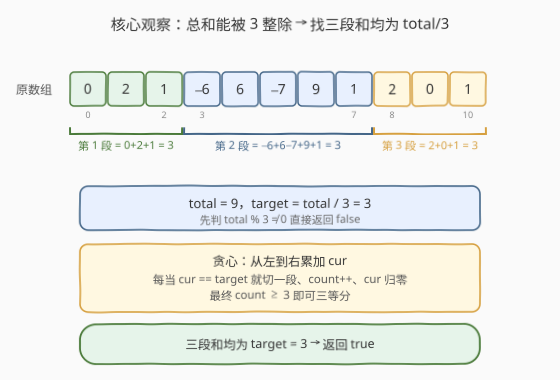
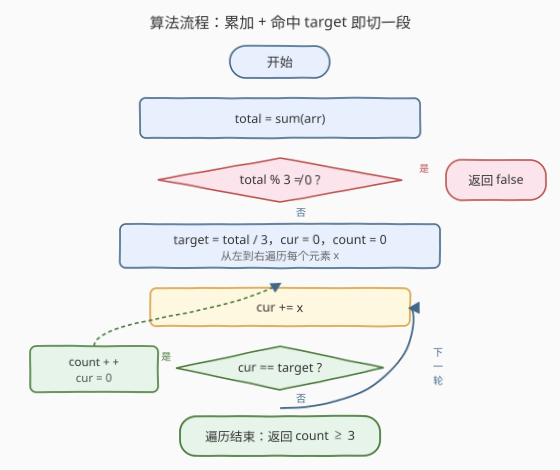
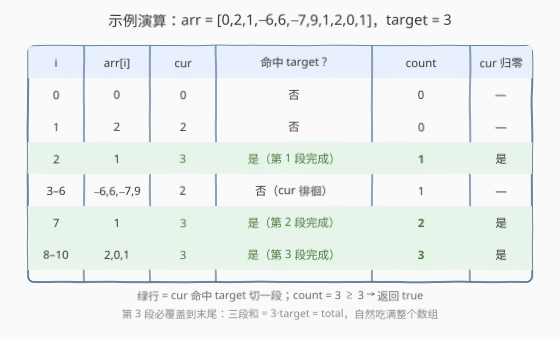

# LeetCode 将数组分成和相等的三个部分 题解

## 1. 题目概述

- **标题 / 题号**：将数组分成和相等的三个部分（#1013，easy）
- **链接**：https://leetcode.cn/problems/partition-array-into-three-parts-with-equal-sum/
- **难度**：简单
- **标签**：数组、前缀和、贪心

**题意**：给定一个整数数组 `arr`，判断能否将其划分为**和相等的三个非空部分**。形式上，需找出索引 `i + 1 < j`，使得

$$\text{arr}[0] + \cdots + \text{arr}[i] \;=\; \text{arr}[i+1] + \cdots + \text{arr}[j-1] \;=\; \text{arr}[j] + \cdots + \text{arr}[n-1]$$

即三段**连续**子数组的和都相等。

**示例 1**：

```text
输入：arr = [0,2,1,-6,6,-7,9,1,2,0,1]
输出：true
解释：0 + 2 + 1 = -6 + 6 - 7 + 9 + 1 = 2 + 0 + 1 = 3
```

**示例 2**：

```text
输入：arr = [0,2,1,-6,6,7,9,-1,2,0,1]
输出：false
```

**示例 3**：

```text
输入：arr = [3,3,6,5,-2,2,5,1,-9,4]
输出：true
解释：3 + 3 = 6 = 5 - 2 + 2 + 5 + 1 - 9 + 4 = 6
```

**约束**：

- $3 \leq \text{arr.length} \leq 5 \times 10^4$
- $-10^4 \leq \text{arr}[i] \leq 10^4$

> 💡 **关键直觉**：三段和相等意味着**总和必须是段和的 3 倍**。若 `total` 不能被 3 整除，直接判否；否则令 `target = total / 3`，问题归约为「能否把数组切成三段，每段和均为 `target`」。

## 2. 解题思路

### 2.1 暴力思路

枚举两个切点 `i`、`j`（$0 \le i < j < n-1$），分别计算三段和判定是否相等。配合前缀和可做到 $O(n^2)$，但 $n = 5 \times 10^4$ 时仍超时。

> 💡 暴力的浪费在于：合法切点其实由 `total / 3` 唯一锁定——段和必须等于 `target`，无需两两试探切点，**从左到右累加，每次凑到 `target` 就切一刀**即可。

### 2.2 核心观察：总和约束 + 贪心切分



两步转化：

1. **总和约束**：三段和相等 $\Rightarrow$ 三段和 $= \text{total} / 3$。若 $\text{total} \bmod 3 \neq 0$，直接返回 `false`。
2. **贪心切分**：令 `target = total / 3`，从左到右累加 `cur`；每当 `cur == target` 就切一段、`count++`、`cur` 归零。最终 `count >= 3` 即可三等分。

**为什么贪心（最早切刀）不会出错？** 设存在某个合法切分，切点为 $a, b$（第 1 段末、第 2 段末）。贪心找到的**首个** `cur == target` 的位置 $c_1 \le a$：因为在 $a$ 处前缀和恰为 `target`，首个命中点不会晚于 $a$。此时 $[c_1+1, a]$ 这段和 $= \text{target} - \text{target} = 0$，把它并入第 2 段不改变第 2 段目标和。同理贪心第 2 个切点 $c_2 \le b$，且 $c_2 \le b \le n-2$，第 3 段非空。故「合法切分存在 $\Rightarrow$ 贪心必凑出 3 段」。

> ⚠️ **反向也要成立**：贪心凑出 `count >= 3` 时，前三段和 $= 3 \cdot \text{target} = \text{total}$，恰好吃满整个数组（三段连续从下标 0 起，和等于总和，第 3 段必终止于末尾），故这三段就是一组合法切分。于是 `count >= 3` $\iff$ 可三等分。

### 2.3 算法流程图



维护变量：

- `cur`：当前段累计和，初始 `0`；
- `count`：已切出的段数，初始 `0`；
- `target = total / 3`。

**主循环**（`i` 从 `0` 到 `n-1`）：

1. `cur += arr[i]`。
2. **若** `cur == target`：`count += 1`，`cur = 0`。
3. 继续。

循环结束返回 `count >= 3`。

> ⚠️ **为何判据是 `>= 3` 而非 `== 3`？** 当 `target == 0` 时（如 `arr = [0,0,0,0,0,0]`），每个 `0` 都会让 `cur` 命中 `0`，`count` 可远超 3；但任意取出前三段即得一组合法切分（第 3 段把剩余零全吃掉，仍非空）。`==` 会误判这类全零情形为 `false`，故用 `>=`。

### 2.4 示例演算

以 `arr = [0,2,1,-6,6,-7,9,1,2,0,1]` 为例，`total = 9`，`target = 3`：



| i | arr[i] | cur（入段后） | 命中 target? | count | 说明 |
|---|--------|---------------|--------------|-------|------|
| 0 | 0 | 0 | 否 | 0 | — |
| 1 | 2 | 2 | 否 | 0 | — |
| 2 | 1 | 3 | 是 | 1 | 第 1 段 `[0,2,1]` 完成，cur 归零 |
| 3 | −6 | −6 | 否 | 1 | — |
| 4 | 6 | 0 | 否 | 1 | — |
| 5 | −7 | −7 | 否 | 1 | — |
| 6 | 9 | 2 | 否 | 1 | — |
| 7 | 1 | 3 | 是 | 2 | 第 2 段 `[−6,6,−7,9,1]` 完成，cur 归零 |
| 8 | 2 | 2 | 否 | 2 | — |
| 9 | 0 | 2 | 否 | 2 | — |
| 10 | 1 | 3 | 是 | 3 | 第 3 段 `[2,0,1]` 完成 |

`count = 3 >= 3`，返回 `true`。注意第 3 段恰好终止于末尾——三段和 $3 \cdot 3 = 9 = \text{total}$，自然吃满整个数组。

## 3. 参考代码

### C++

```cpp
class Solution {
  public:
    bool canThreePartsEqualSum(vector<int>& arr) {
        int total = accumulate(arr.begin(), arr.end(), 0);
        if (total % 3 != 0) return false;
        int target = total / 3;
        int cur = 0, count = 0;
        for (int x : arr) {
            cur += x;
            if (cur == target) {
                ++count;
                cur = 0;
            }
        }
        return count >= 3;
    }
};
```

### Python

```python
class Solution:
    def canThreePartsEqualSum(self, arr: List[int]) -> bool:
        total = sum(arr)
        if total % 3 != 0:
            return False
        target = total // 3
        cur = count = 0
        for x in arr:
            cur += x
            if cur == target:
                count += 1
                cur = 0
        return count >= 3
```

> 💡 **`target == 0` 的妙处**：当 `total == 0`，`target` 也是 `0`，循环会不断把和为 `0` 的前缀切出。此时 `count >= 3` 等价于「数组可被切成至少三段零和前缀」——只要前两段切得动，剩余必和为 `0`，第 3 段自动成立。代码无需对零特判。

## 4. 复杂度分析

| 维度 | 复杂度 | 说明 |
|------|--------|------|
| 时间复杂度 | $O(n)$ | 一次求和 + 一次遍历，各 $O(n)$ |
| 空间复杂度 | $O(1)$ | 仅 `total`/`target`/`cur`/`count` 四个变量 |

## 5. 扩展：双切点显式定位（更直观的等价写法）

「累加 + 命中即切」本质是在找前缀和首次等于 `target`、再首次等于 $2 \cdot \text{target}$ 的位置。也可以显式定位两个切点，逻辑等价但更贴近「三段」的几何直觉：

```cpp
bool canThreePartsEqualSum(vector<int>& arr) {
    int total = accumulate(arr.begin(), arr.end(), 0);
    if (total % 3 != 0) return false;
    int target = total / 3, n = arr.size();
    int cur = 0, i = 0;
    // 切点 1：前缀和首次 == target，且 i < n-1（留空给后两段）
    for (; i < n - 1; ++i) {
        cur += arr[i];
        if (cur == target) break;
    }
    if (cur != target) return false;
    // 切点 2：从前缀和 == target 之后继续，首次 == 2*target，且 j < n-1
    cur += arr[++i];
    for (; i < n - 1; ++i) {
        if (cur == 2 * target) return true;
        cur += arr[i + 1];
    }
    return false;
}
```

> 💡 两种写法等价：找到两个切点后，第 3 段和 $= \text{total} - 2 \cdot \text{target} = \text{target}$ 自动成立，只需保证第 3 段非空（`j < n - 1`）。`count >= 3` 版本把「第 3 段非空」的判定隐含在「三段和 = total 必吃满末尾」之中，更简洁。

### 「等和切分」问题家族

| 切分数 | 子集/连续 | 题目 | 套路 |
|--------|-----------|------|------|
| 2 段 | 子集（任选） | [416. 分割等和子集](../0401-0500/416_分割等和子集.md) | 0-1 背包判定 `target = total/2` |
| 3 段 | **连续** | 1013（本题） | 总和整除 + 贪心切分 |
| k 段 | 子集（任选） | [698. 划分为k个相等的子集](../0601-0700/698_划分为K个相等的子集.md) | 回溯 + 剪枝 |
| 左右两段 | 连续（中心下标） | [724. 寻找数组的中心下标](../0701-0800/724_寻找数组的中心下标.md) | 前缀和，左侧和 == 右侧和 |

> ⚠️ **连续 vs 子集**是分水岭：1013 要求三段**连续**，故贪心切分 $O(n)$ 即可；416/698 允许**任选子集**，无连续约束，必须借助背包或回溯，复杂度更高。

## 6. 面试要点

1. **为什么 `total % 3 != 0` 就能直接返回 `false`？**
   - 三段和相等，设每段和为 $s$，则 $\text{total} = 3s$，故 `total` 必为 3 的倍数。反之若 `total` 不被 3 整除，无论怎么切都不可能让三段整数和相等（段和是整数）。

2. **贪心「最早切刀」为什么不会破坏后续可行性？**
   - 设合法切点为 $a, b$。贪心首个命中点 $c_1 \le a$，于是 $[c_1+1, a]$ 和为 $0$。把这段并入第 2 段不改变第 2 段目标和，后续仍能在 $b$ 前凑出第 2 个切点。故贪心不会把后续「逼死」。

3. **判据为何是 `count >= 3` 而不是 `== 3`？**
   - `target == 0` 时单元素 `0` 即可命中，`count` 可远超 3（如全零数组）。但前三段和已 $= 3 \cdot 0 = \text{total}$，必吃满数组，第 3 段非空，构成合法切分。用 `==` 会漏判全零类用例。

4. **第 3 段如何保证非空？**
   - 三段连续从下标 0 起、和 $= 3 \cdot \text{target} = \text{total}$，必终止于最后一个元素，故第 3 段含末尾元素、非空。代码无需像「双切点」版那样显式判 `j < n-1`。

5. **`target == 0` 时算法退化成什么样？**
   - 退化成「把数组切成若干零和前缀」。只要能切出至少 3 段（即前两刀切得动），剩余必和为 `0`，第 3 段自动成立。如 `[1,-1,0,0]`：`[1,-1]`、`[0]`、`[0]` 三段各和 `0`，返回 `true`。

6. **能否不用贪心，用前缀和 + 哈希？**
   - 可以。求前缀和 `pref`，目标是找下标 $i < j < n-1$ 使 `pref[i] == target` 且 `pref[j] == 2*target`。扫一遍记录是否见过 `target`，再见 `2*target` 且非末尾即返回 `true`。与贪心等价，但多 $O(n)$ 空间，无实质优势。

## 同类练习题

| # | 题目 | 与本题的关联 |
|---|------|-------------|
| 416 | [分割等和子集](https://leetcode.cn/problems/partition-equal-subset-sum/)（[题解](../0401-0500/416_分割等和子集.md)） | 2 段等和但允许任选子集，0-1 背包判定，对照本题「连续」与「子集」的分水岭 |
| 698 | [划分为k个相等的子集](https://leetcode.cn/problems/partition-to-k-equal-sum-subsets/)（[题解](../0601-0700/698_划分为K个相等的子集.md)） | k 段等和且任选子集，回溯 + 剪枝，本题的「子集 + 任意 k」泛化 |
| 724 | [寻找数组的中心下标](https://leetcode.cn/problems/find-pivot-index/)（[题解](../0701-0800/724_寻找数组的中心下标.md)） | 前缀和找左和 == 右和的中心，同为「总和约束 + 前缀和」家族 |
| 548 | [将数组分成和相等的两个部分](https://leetcode.cn/problems/split-array-with-equal-sum/) | 在数组中删去中间一段后两侧等和，前缀和 + 枚举中点，本题的「两段 + 留洞」变体 |
