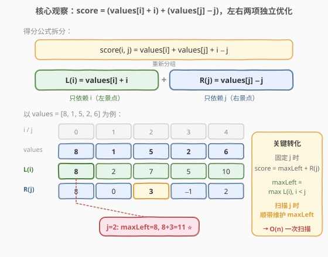
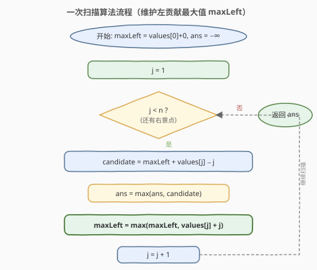

# LeetCode 最佳观光组合 题解

## 1. 题目概述

- **标题 / 题号**：最佳观光组合（#1014，medium）
- **链接**：https://leetcode.cn/problems/best-sightseeing-pair/
- **难度**：中等
- **标签**：数组、动态规划

**题意**：给你一个正整数数组 `values`，其中 `values[i]` 表示第 `i` 个观光景点的评分，两个景点 `i` 和 `j`（`i < j`）之间的**距离**为 `j - i`。一对景点 `(i, j)` 组成的观光组合得分为：

$$\text{score}(i, j) = \text{values}[i] + \text{values}[j] + i - j$$

即评分之和**减去**两者距离。返回能取得的**最高分**。

**示例 1**：

```text
输入：values = [8,1,5,2,6]
输出：11
解释：i = 0, j = 2, values[0] + values[2] + 0 - 2 = 8 + 5 + 0 - 2 = 11
```

**示例 2**：

```text
输入：values = [1,2]
输出：2
解释：i = 0, j = 1, 1 + 2 + 0 - 1 = 2
```

**约束**：

- `2 <= values.length <= 5 * 10^4`
- `1 <= values[i] <= 1000`

## 2. 解题思路

### 2.1 暴力思路

枚举所有满足 `i < j` 的景点对，逐一计算 `values[i] + values[j] + i - j` 取最大值。共 $\binom{n}{2}$ 对，时间复杂度 $O(n^2)$，而 $n$ 可达 $5 \times 10^4$，$n^2 \approx 2.5 \times 10^9$ 必然超时。

### 2.2 核心观察：拆分得分项，左右独立优化



关键直觉是把得分公式**按变量重新分组**：

$$\text{values}[i] + \text{values}[j] + i - j = \underbrace{(\text{values}[i] + i)}_{L(i)} + \underbrace{(\text{values}[j] - j)}_{R(j)}$$

- **左贡献** $L(i) = \text{values}[i] + i$：只依赖左景点 $i$。下标越大、评分越高则越大。
- **右贡献** $R(j) = \text{values}[j] - j$：只依赖右景点 $j$。下标越小、评分越高则越大。

由于 $i < j$ 是硬约束，**固定 $j$ 时**，能配对的最佳 $i$ 就是所有 $i < j$ 中 $L(i)$ 最大的那个：

$$\text{score}(j) = \max_{i < j} L(i) \;+\; R(j)$$

于是只需从左到右扫描 $j$，**顺便维护** $\text{maxLeft} = \max_{i < j} L(i)$，每步用 $O(1)$ 算出以 $j$ 为右景点的最优得分，全局取最大即答案。$O(n^2)$ 被压缩到 $O(n)$。

> 💡 **识别信号**：题目形如「求 $\max_{i<j} f(i, j)$，且 $f$ 可拆成「只含 $i$ 的项 + 只含 $j$ 的项」」时，就想「**维护前缀极值 + 当前项组合**」。这是 [53. 最大子数组和](../0001-0100/53_最大子数组和.md) 的前缀极值思想、[121. 买卖股票的最佳时机](../0101-0200/121_买卖股票的最佳时机.md) 的「维护历史最小价」的同款骨架。

> ⚠️ **更新顺序不能反**：必须先用当前 `maxLeft`（只含 $i < j$）算 `candidate`，**再**用 `values[j] + j` 更新 `maxLeft`。若先更新再算，会把 $i = j$ 也算进去，违反 $i < j$。

### 2.3 算法流程图



流程要点：`maxLeft` 初始化为 `values[0] + 0`（$j$ 从 1 起，保证第一个右景点有左景点可配），`ans` 初始化为极小值。循环体内严格按「先算候选 → 更新答案 → 更新 maxLeft」的顺序执行。

### 2.4 示例演算

![示例演算：values = [8,1,5,2,6]](../images/bestsight_example_walkthrough.svg)

以 `values = [8,1,5,2,6]` 为例，初始 `maxLeft = 8`（$L(0)=8+0$），`ans = −∞`：

- **j=1**：$R(1)=1-1=0$，`candidate = 8+0 = 8` → `ans = 8`；$L(1)=2$，不刷新 `maxLeft`。
- **j=2**：$R(2)=5-2=3$，`candidate = 8+3 = 11` → `ans = 11` ⭐（即 $i=0, j=2$）；$L(2)=7$，不刷新。
- **j=3**：$R(3)=2-3=-1$，`candidate = 8+(−1) = 7 < 11`，`ans` 不变；$L(3)=5$，不刷新。
- **j=4**：$R(4)=6-4=2$，`candidate = 8+2 = 10 < 11`，`ans` 不变；$L(4)=10$，刷新 `maxLeft = 10`（但已无后续 $j$）。

最终返回 `ans = 11`。注意 `maxLeft` 直到 $j=4$ 才被刷新——这正好说明「前缀极值」可能在很久都不变，但维护它的代价仅 $O(1)$。

## 3. 参考代码

### C++

```cpp
class Solution {
  public:
    int maxScoreSightseeingPair(vector<int>& values) {
        int maxLeft = values[0] + 0;   // max_{i<j} (values[i] + i)
        int ans = INT_MIN;
        int n = values.size();
        for (int j = 1; j < n; ++j) {
            int candidate = maxLeft + values[j] - j;  // R(j) = values[j] - j
            ans = max(ans, candidate);
            maxLeft = max(maxLeft, values[j] + j);    // 把当前 j 纳入后续的左候选
        }
        return ans;
    }
};
```

### Python

```python
class Solution:
    def maxScoreSightseeingPair(self, values: List[int]) -> int:
        max_left = values[0] + 0    # max_{i<j} (values[i] + i)
        ans = float('-inf')
        for j in range(1, len(values)):
            candidate = max_left + values[j] - j    # R(j) = values[j] - j
            ans = max(ans, candidate)
            max_left = max(max_left, values[j] + j) # 把当前 j 纳入后续的左候选
        return ans
```

> ⚠️ **两个易错点**：
> 1. **`maxLeft` 初值是 `values[0] + 0` 而非 `0`**：$j$ 从 1 起，必须保证第一个右景点能和 $i=0$ 配对。若初值取 `0`，当 `values[0] + 0` 本身为正时会漏掉这个左候选。
> 2. **循环从 `j = 1` 开始**：因为需要 $i < j$，$j=0$ 没有可配对的左景点。`maxLeft` 在循环外用 `values[0]` 初始化，恰好把 $i=0$ 纳入左候选集。

## 4. 复杂度分析

| 维度 | 复杂度 | 说明 |
|------|--------|------|
| 时间复杂度 | O(n) | 只遍历数组一次，每步做 $O(1)$ 的加法、比较与取最大 |
| 空间复杂度 | O(1) | 仅用 `maxLeft`、`ans`、`j` 三个常数变量 |

> 💡 $n \le 5 \times 10^4$，$O(n)$ 约 $5 \times 10^4$ 次运算，远低于时限。即便 $n$ 到 $10^7$ 也能轻松通过。

## 5. 扩展：与「买卖股票的最佳时机」的同构

本题与 [121. 买卖股票的最佳时机](../0101-0200/121_买卖股票的最佳时机.md) 几乎是**同一道题的不同外衣**：

| 维度 | 121 买卖股票 | 1014 最佳观光 |
|------|-------------|--------------|
| 目标 | $\max_{i<j}(\text{prices}[j] - \text{prices}[i])$ | $\max_{i<j}(\text{values}[i]+i + \text{values}[j]-j)$ |
| 左项（依赖 $i$） | $-\text{prices}[i]$（取最小价） | $\text{values}[i]+i$（取最大左贡献） |
| 右项（依赖 $j$） | $\text{prices}[j]$ | $\text{values}[j]-j$ |
| 维护的前缀极值 | $\min$ | $\max$ |
| 每步候选 | $\text{prices}[j] - \text{minPrice}$ | $\text{maxLeft} + \text{values}[j] - j$ |

两者骨架完全一致：**把二元函数拆成「只含 $i$ 的项 + 只含 $j$ 的项」，扫描 $j$ 时维护前缀极值，$O(1)$ 组合出当前最优**。掌握了这个范式，遇到任何形如 $\max_{i<j}(g(i) + h(j))$ 的式子都能秒杀。

> 💡 **更一般的形式**：只要目标函数能写成 $f(i, j) = g(i) + h(j)$（$i < j$），就可用「维护 $\max/\min$ 前缀 + 当前 $h(j)$」一次扫描求解。本题 $g(i) = \text{values}[i]+i$，$h(j) = \text{values}[j]-j$。

## 6. 面试要点

1. **为什么能从 $O(n^2)$ 优化到 $O(n)$？**

   - 得分 `values[i] + values[j] + i - j` 可拆成 $L(i) = \text{values}[i]+i$ 与 $R(j) = \text{values}[j]-j$ 两项。固定 $j$ 时，最优 $i$ 就是 $i < j$ 中 $L(i)$ 最大的，与 $j$ 本身无关。因此扫描 $j$ 时维护 $\text{maxLeft} = \max_{i<j} L(i)$，每步 $O(1)$ 组合即可。

2. **`maxLeft` 为什么必须在算完 `candidate` 之后才更新？**

   - 约束是 $i < j$。若先用 `values[j] + j` 更新 `maxLeft` 再算候选，等于允许 $i = j$ 自配对（得 `2*values[j]`，无意义且违规）。先算后更才能保证 `maxLeft` 里只有严格在 $j$ 左侧的 $i$。

3. **`maxLeft` 和 `ans` 的初值为什么这样取？**

   - `maxLeft = values[0] + 0`：$j$ 从 1 起，$i=0$ 是唯一可配的左景点，必须预置。`ans = −∞`（C++ 用 `INT_MIN`，Python 用 `float('-inf')`）：保证第一次比较一定被覆盖。也可直接用 `maxLeft + values[1] - 1` 初始化 `ans`，省掉极小值常量。

4. **如果要输出最优的 $(i, j)$ 而非分数，怎么改？**

   - 给 `maxLeft` 配一个 `bestI`：当 `values[j] + j > maxLeft` 更新时同步记 `bestI = j`；当 `candidate` 刷新 `ans` 时记 `bestJ = j`，此时对应的左景点就是当前的 `bestI`。注意 `bestI` 是「刷新 `maxLeft` 时的那个 $j$」，它在后续被当作 $i$ 使用。

5. **为什么不用分治或二分？**

   - 本题没有「单调性可二分的答案空间」（不同于 [1011. 在 D 天内送达包裹的能力](./1011_在D天内送达包裹的能力.md) 那类「最小化最大值」），也不是「区间聚合」（不同于线段树类）。它本质是「前缀极值 + 当前项」的一次扫描，$O(n)$ 已是最优下界（至少要看完每个元素）。

## 同类练习题

| # | 题目 | 与本题的关联 |
|---|------|-------------|
| 121 | [买卖股票的最佳时机](https://leetcode.cn/problems/best-time-to-buy-and-sell-stock/) | 同构题，维护历史最小价 `minPrice`，每步 `profit = prices[j] - minPrice`，骨架与本题完全一致 |
| 53 | [最大子数组和](https://leetcode.cn/problems/maximum-subarray/) | 一次扫描维护前缀极值（Kadane 的「负前缀丢弃」即维护「最优前缀和」），同属 $O(n)$ 单遍范式 |
| 978 | [最长湍流子数组](https://leetcode.cn/problems/longest-turbulent-subarray/) | 一次扫描维护滚动状态（上/下比较方向），延续「单遍维护可复用状态」思想 |
| 152 | [乘积最大子数组](https://leetcode.cn/problems/maximum-product-subarray/) | 维护 max/min 两态滚动（乘法下负号翻转），一次扫描的进阶版 |
