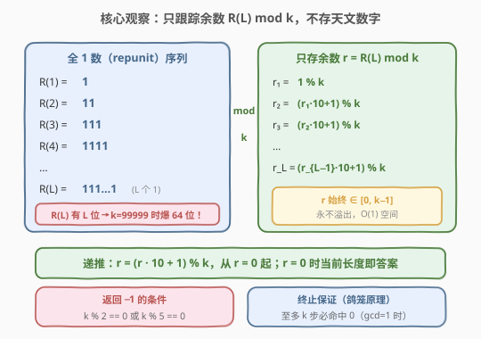
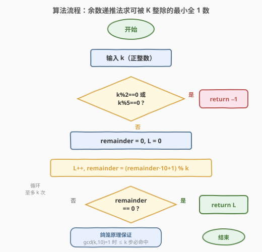
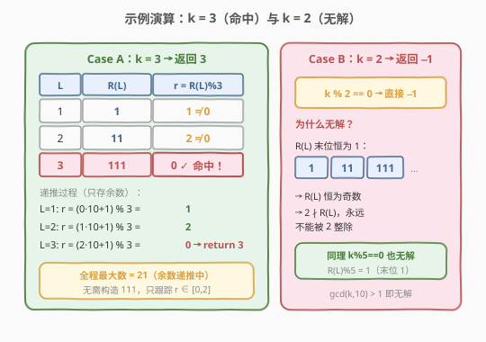

# 可被 K 整除的最小整数

- **题目名称**：可被 K 整除的最小整数
- **链接**：[1015. 可被 K 整除的最小整数](https://leetcode.cn/problems/smallest-integer-divisible-by-k/)
- **难度**：中等
- **标签**：数学, 哈希

## 1. 题目概述

给定正整数 $k$，找出**仅包含数字 1** 的最小正整数 $n$ 的**长度**，使得 $k \mid n$。若不存在这样的 $n$，返回 $-1$。

> ⚠️ $n$ 的值可能超出 64 位带符号整数范围——这正是本题的核心陷阱：不能直接构造 $n$ 再取模。

**示例 1**：

```text
输入：k = 1
输出：1
解释：n = 1，长度为 1，1 % 1 == 0。
```

**示例 2**：

```text
输入：k = 2
输出：-1
解释：全 1 数末位恒为 1（奇数），不可能被 2 整除。
```

**示例 3**：

```text
输入：k = 3
输出：3
解释：n = 111，长度为 3，111 % 3 == 0。
```

**约束条件**：

- $1 \leq k \leq 10^5$

> 💡 **全 1 数（repunit）**：记 $R(L)$ 为长度为 $L$ 的全 1 数，如 $R(1) = 1$、$R(2) = 11$、$R(3) = 111$。本题等价于求最小的 $L$ 使得 $R(L) \equiv 0 \pmod{k}$。

---

## 2. 解题思路

### 2.1 暴力思路：构造全 1 数取模

最直观的做法是逐个构造 $R(1), R(2), R(3), \ldots$，每次检查 $R(L) \bmod k == 0$：

```python
n = 0
for L in range(1, ???):
    n = n * 10 + 1       # R(L) = R(L-1) * 10 + 1
    if n % k == 0:
        return L
```

问题在于 $R(L)$ 有 $L$ 位，当 $k = 99999$ 时答案可达近 $10^5$ 位——远超 64 位整数。即便用 Python 的大整数或字符串模拟，每轮 $R(L) \bmod k$ 的时间为 $O(L)$，总体 $O(k^2) = 10^{10}$，严重超时。

> 💡 转机在于：**判断整除只需余数，不需原数**。$R(L) \bmod k$ 的值完全由 $R(L-1) \bmod k$ 决定，与 $R(L)$ 的具体数值无关。

### 2.2 核心观察：余数递推——只跟踪 $R(L) \bmod k$



关键性质有三点：

1. **余数递推**：$R(L) = R(L-1) \times 10 + 1$，故

$$R(L) \bmod k = \big((R(L-1) \bmod k) \times 10 + 1\big) \bmod k$$

   只需维护余数 $r$，每步 $r \gets (r \times 10 + 1) \bmod k$。$r$ 始终在 $[0, k-1]$ 内，**永不溢出**。

2. **命中条件**：当某步 $r = 0$ 时，当前长度 $L$ 即为答案。

3. **无解判定**：$R(L)$ 末位恒为 $1$，故 $R(L)$ 恒为**奇数**且**不被 $5$ 整除**。若 $\gcd(k, 10) > 1$（即 $2 \mid k$ 或 $5 \mid k$），则 $k$ 含因子 $2$ 或 $5$，而 $R(L)$ 不含，故 $k \nmid R(L)$，返回 $-1$。

> 💡 **关键转化**：把「构造天文数字再取模」归约为「维护一个 $[0, k-1]$ 范围的余数递推」。整除判定只需余数为零，与原数大小无关——这是模运算的核心威力。

### 2.3 算法流程图



算法只需四步：

1. **判无解**：若 $k \% 2 == 0$ 或 $k \% 5 == 0$，直接返回 $-1$。
2. **初始化**：$r = 0$，$L = 0$。
3. **余数递推**：$L \gets L + 1$，$r \gets (r \times 10 + 1) \bmod k$。
4. **命中返回**：若 $r == 0$，返回 $L$；否则回到步骤 3。

> ⚠️ **终止保证**：由**鸽笼原理**，$\gcd(k, 10) = 1$ 时至多 $k$ 步必命中 $r = 0$（详见第 5 节）。故循环上界设为 $k$ 即可。

### 2.4 示例演算

以 $k = 3$（命中）和 $k = 2$（无解）为例：



**Case A：$k = 3$ → 返回 3**

| $L$ | $R(L)$ | $r = R(L) \bmod 3$ | 递推计算 |
|-----|--------|---------------------|----------|
| 1 | 1 | $1$ | $r = (0 \times 10 + 1) \bmod 3 = 1$ |
| 2 | 11 | $2$ | $r = (1 \times 10 + 1) \bmod 3 = 2$ |
| 3 | 111 | $0$ ✓ | $r = (2 \times 10 + 1) \bmod 3 = 0$ → 返回 3 |

全程最大中间值为 $21$（递推中的 $2 \times 10 + 1$），无需构造 $111$，只跟踪 $r \in [0, 2]$。

**Case B（无解）：$k = 2$ → 返回 $-1$**

$k \% 2 == 0$，直接返回 $-1$。$R(L)$ 末位恒为 $1$（奇数），$2 \nmid R(L)$，永远无解。同理 $k \% 5 == 0$ 时 $R(L) \bmod 5 = 1 \neq 0$，也无解。

---

## 3. 参考代码

### C++

```cpp
class Solution {
  public:
    int smallestRepunitDivByK(int k) {
        if (k % 2 == 0 || k % 5 == 0) return -1;
        int remainder = 0;
        for (int L = 1; L <= k; L++) {
            remainder = (remainder * 10 + 1) % k;
            if (remainder == 0) return L;
        }
        return -1;
    }
};
```

> ⚠️ **溢出分析**：$k \leq 10^5$，$r \in [0, k-1]$，$r \times 10 + 1 \leq 10^6 - 9$，远小于 `INT_MAX`（$\approx 2.1 \times 10^9$），`int` 完全安全，无需 `long long`。

### Python

```python
class Solution:
    def smallestRepunitDivByK(self, k: int) -> int:
        if k % 2 == 0 or k % 5 == 0:
            return -1
        remainder = 0
        for L in range(1, k + 1):
            remainder = (remainder * 10 + 1) % k
            if remainder == 0:
                return L
        return -1
```

也可**省去 $\gcd$ 预判**，直接循环 $k$ 次——鸽笼原理保证有解时必在 $k$ 步内命中，无解时 $k$ 步后自然返回 $-1$：

```python
class Solution:
    def smallestRepunitDivByK(self, k: int) -> int:
        remainder = 0
        for L in range(1, k + 1):
            remainder = (remainder * 10 + 1) % k
            if remainder == 0:
                return L
        return -1
```

> 💡 两种写法**正确性等价**。预判版在 $k \% 2 == 0$ 或 $k \% 5 == 0$ 时 $O(1)$ 返回，避免 $k$ 次无意义循环；省判版更简洁，代码更短。面试中两种都可接受，预判版更能体现对无解条件的理解。

---

## 4. 复杂度分析

| 维度 | 复杂度 | 说明 |
|------|--------|------|
| 时间复杂度 | $O(k)$ | 循环至多 $k$ 次，每步一次乘加取模 $O(1)$；预判命中时 $O(1)$ |
| 空间复杂度 | $O(1)$ | 仅维护余数 $r$ 与长度 $L$ 两个变量 |

> 💡 与暴力构造法（$O(k^2)$ 时间、$O(k)$ 空间用于存大数）相比，余数递推法将空间压到 $O(1)$、时间降到 $O(k)$，关键在于「整除判定只需余数」这一观察。

---

## 5. 扩展：鸽笼原理证明终止性

### 5.1 为什么至多 $k$ 步必命中

设 $\gcd(k, 10) = 1$（已排除 $2 \mid k$ 和 $5 \mid k$）。考虑余数序列 $r_1, r_2, \ldots, r_{k+1}$（共 $k+1$ 个值），每个 $r_i \in [0, k-1]$（共 $k$ 种取值）。

**反证**：假设前 $k$ 步均未命中 $0$，即 $r_1, \ldots, r_k \in \{1, 2, \ldots, k-1\}$（$k-1$ 种取值）。由**鸽笼原理**，$k$ 个值放入 $k-1$ 种取值，必有重复 $r_i = r_j$（$1 \leq i < j \leq k$）。

此时：

$$R(j) \equiv R(i) \pmod{k} \implies R(j) - R(i) \equiv 0 \pmod{k}$$

而 $R(j) - R(i) = \underbrace{11\ldots1}_{j-i \text{ 个}} \times 10^i = R(j-i) \times 10^i$，故：

$$R(j-i) \times 10^i \equiv 0 \pmod{k}$$

由于 $\gcd(10, k) = 1$，$10^i$ 在模 $k$ 下可逆，故 $R(j-i) \equiv 0 \pmod{k}$。但 $j - i \leq k$，说明第 $j-i$ 步应已命中 $r = 0$，与假设矛盾。$\square$

### 5.2 何时无解

当 $\gcd(k, 10) > 1$（即 $2 \mid k$ 或 $5 \mid k$）时无解：

- $R(L) = \underbrace{11\ldots1}_{L}$ 末位恒为 $1$
- $R(L) \bmod 2 = 1 \neq 0$（恒奇数）
- $R(L) \bmod 5 = 1 \neq 0$（末位 $1$）

故 $k$ 含因子 $2$ 或 $5$ 时，$k \nmid R(L)$ 对所有 $L$ 成立。

> 💡 **更本质的视角**：$R(L) = \frac{10^L - 1}{9}$。$R(L) \equiv 0 \pmod{k}$ 要求 $10^L \equiv 1 \pmod{9k/\gcd(9,k)}$。$10^L \equiv 1 \pmod{m}$ 有解当且仅当 $\gcd(10, m) = 1$（欧拉定理保证存在）。本题中 $m$ 含 $k$ 的因子，$\gcd(10, k) > 1$ 时无解，与上述分析一致。

---

## 6. 面试要点

1. **为什么不能直接构造 $R(L)$ 检查整除？**

   - $R(L)$ 有 $L$ 位，$k = 10^5$ 时答案可达近 $10^5$ 位，远超 64 位整数。即使用大整数/字符串，每轮取模 $O(L)$，总体 $O(k^2) = 10^{10}$，超时。关键是利用模运算性质，只跟踪余数。

2. **为什么 $k \% 2 == 0$ 或 $k \% 5 == 0$ 时返回 $-1$？**

   - $R(L)$ 末位恒为 $1$，故恒为奇数且不被 $5$ 整除。若 $2 \mid k$ 或 $5 \mid k$，$k$ 的因子中有 $2$ 或 $5$ 而 $R(L)$ 不含，故 $k \nmid R(L)$。等价条件：$\gcd(k, 10) > 1$。

3. **鸽笼原理如何保证至多 $k$ 步？**

   - 余数 $r \in [0, k-1]$ 共 $k$ 种。若前 $k$ 步均非 $0$，则 $r_1, \ldots, r_k \in \{1, \ldots, k-1\}$（$k-1$ 种），必有 $r_i = r_j$。由 $R(j) - R(i) = R(j-i) \cdot 10^i \equiv 0$ 和 $\gcd(10, k) = 1$ 得 $R(j-i) \equiv 0$，但 $j-i \leq k$ 应已命中，矛盾。

4. **不提前判断 $k\%2/k\%5$，直接循环 $k$ 次可以吗？**

   - 可以。鸽笼原理保证有解则 $\leq k$ 步命中；无解（$\gcd > 1$）时 $k$ 步后未命中，自然返回 $-1$。预判只是优化（$O(1)$ 提前退出），不影响正确性。两种写法等价。

5. **`remainder * 10 + 1` 会溢出吗？**

   - $k \leq 10^5$，$r \in [0, k-1]$，$r \times 10 + 1 \leq 10^6 - 9$，远小于 `INT_MAX`（$\approx 2.1 \times 10^9$），C++ `int` 完全安全，无需 `long long`。Python 整数无限精度，无此顾虑。

---

## 7. 同类练习题

- [166. 分数到小数](https://leetcode.cn/problems/fraction-to-recurring-decimal/)（[题解](../0201-0300/166_分数到小数.md)）：长除法只跟踪余数，余数重复即循环节。与本题「不构造大数，只跟踪余数」同构，是模运算避免溢出的经典双题
- [202. 快乐数](https://leetcode.cn/problems/happy-number/)（[题解](../0001-0100/202_快乐数.md)）：数位平方和序列 + Floyd 判圈。与本题「序列到达目标 or 陷入循环」结构同构，都需判断序列是否终止
- [974. 和可被 K 整除的子数组](https://leetcode.cn/problems/subarray-sums-divisible-by-k/)（[题解](../0901-1000/974_和可被K整除的子数组.md)）：前缀和同余定理。共享「模 $K$ 整除性」主题，余数相减判整除
- [172. 阶乘后的零](https://leetcode.cn/problems/factorial-trailing-zeroes/)（[题解](../0001-0100/172_阶乘后的零.md)）：勒让德公式数因子。数论入门，与本题 $\gcd(k, 10)$ 判可行性对照，都是因子分析驱动
