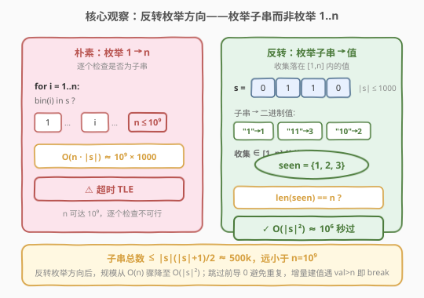
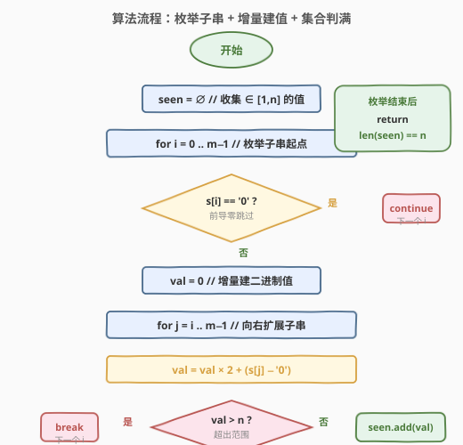
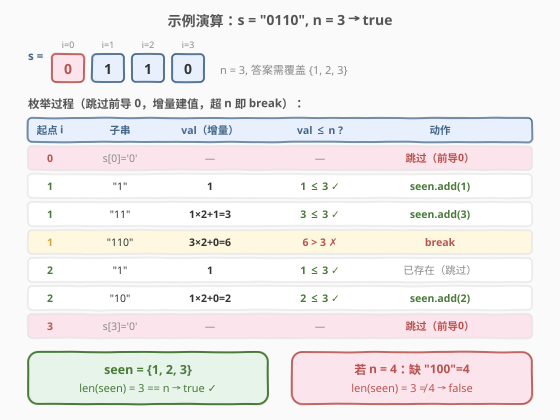

# 子串能表示从 1 到 N 数字的二进制串

- **题目名称**：子串能表示从 1 到 N 数字的二进制串
- **链接**：[1016. 子串能表示从 1 到 N 数字的二进制串](https://leetcode.cn/problems/binary-string-with-substrings-representing-1-to-n/)
- **难度**：中等
- **标签**：字符串、位运算

## 1. 题目概述

给定一个**二进制字符串** `s` 和一个**正整数** `n`，判断 `[1, n]` 范围内的**每个整数**，其二进制表示是否都是 `s` 的**子字符串**（连续子串）。全部满足返回 `true`，否则 `false`。

**示例 1**：

```text
输入：s = "0110", n = 3
输出：true
解释：1 = "1", 2 = "10", 3 = "11"，三者都是 "0110" 的子串。
```

**示例 2**：

```text
输入：s = "0110", n = 4
输出：false
解释：4 = "100"，不是 "0110" 的子串。
```

**约束条件**：

- $1 \leq \text{s.length} \leq 1000$
- `s[i]` 为 `'0'` 或 `'1'`
- $1 \leq n \leq 10^9$

> ⚠️ **关键矛盾**：`n` 可达 $10^9$，但 `s` 长度仅 $1000$。朴素的「枚举 $1 \ldots n$ 逐个检查」会直接超时。突破口在于**反转枚举方向**——不枚举数字，而枚举 `s` 的子串，详见第 2 节。

---

## 2. 解题思路

### 2.1 暴力思路：枚举 1 到 n

最直观的做法是对每个 $i \in [1, n]$，将其转为二进制串 `bin(i)`，再判断是否为 `s` 的子串：

```python
for i in range(1, n + 1):
    if bin(i)[2:] not in s:
        return False
return True
```

时间 $O(n \cdot |s|)$。当 $n = 10^9$、$|s| = 1000$ 时约 $10^{12}$ 次操作，**直接超时**。

> 💡 转机在于：虽然 $n$ 巨大，但 `s` 的长度只有 $1000$。`s` 的所有子串总数至多 $\frac{|s|(|s|+1)}{2} \approx 5 \times 10^5$，远小于 $10^9$。既然「能被子串表示的值」数量有限，何不**反过来枚举子串**，收集它们能表示的值？

### 2.2 核心观察：反转枚举方向——枚举子串而非枚举 1..n



关键转化：**不问「$i$ 的二进制是否为子串」，而问「这个子串表示的值是否落在 $[1, n]$」**。

具体做法：

1. **枚举所有子串**：以每个位置 `i` 为起点，向右扩展终点 `j`，得到子串 `s[i..j]`。
2. **跳过前导零**：若 `s[i] == '0'`，该子串表示的值有前导零（如 `"01"` = `"1"` = 1），会与更短子串重复，直接跳过起点。
3. **增量建值**：从 `s[i]` 起，`val = val * 2 + bit` 逐位累加，避免每次重新解析整个子串。
4. **提前终止**：一旦 `val > n`，继续扩展只会更大（二进制追加位使值翻倍），直接 `break`。
5. **集合判满**：将所有落在 $[1, n]$ 的 `val` 加入 `seen` 集合；最终判断 `len(seen) == n`。

> ⚠️ **为什么 `len(seen) == n` 即可？** `seen` 只收集 $[1, n]$ 内的值（超过 $n$ 的已 `break` 丢弃）。若 `seen` 恰有 $n$ 个元素，则 $1 \ldots n$ **全部命中**（因为值域是 $[1, n]$，最多 $n$ 个不同值，凑满 $n$ 个即全覆盖）。若 `n` 远大于子串能表示的值数，`seen` 自然凑不满，返回 `false`。

> 💡 **关键转化**：把「$n$ 个查询 $\times$ $|s|$ 代价」翻转为「$O(|s|^2)$ 个子串 $\times$ $O(1)$ 增量」，规模从 $O(n \cdot |s|)$ 降至 $O(|s|^2)$。这本质是**用小规模一方枚举、大规模一方判定**的思路，与 [204. 计数质数](../0201-0300/204_计数质数.md) 中「不枚举每个数判质数，而枚举质数的倍数划掉」异曲同工。

### 2.3 算法流程图



维护变量：

- `seen`：集合，收集落在 $[1, n]$ 内的子串值；
- `m = len(s)`：字符串长度。

**双层循环**：

- **外层** `i` 从 `0` 到 `m-1`（子串起点）：
  - 若 `s[i] == '0'`：`continue`（跳过前导零）。
  - `val = 0`。
  - **内层** `j` 从 `i` 到 `m-1`（子串终点）：
    - `val = val * 2 + (s[j] - '0')`（增量累加）。
    - 若 `val > n`：`break`（继续扩展只会更大）。
    - `seen.add(val)`。

**最终判定**：`return len(seen) == n`。

> ⚠️ **跳过前导零的正确性**：`"01"` 的值是 1，与 `"1"` 相同。从 `s[i]='0'` 开始的子串，其值一定等于从后续某个 `'1'` 开始的更短子串的值。跳过它们不会遗漏任何值，只避免重复计算。例如 `"011"` = `"11"` = 3，而 `"11"` 会从第一个 `'1'` 起被枚举到。

### 2.4 示例演算

以 `s = "0110", n = 3` 为例：



| 起点 `i` | 子串 | `val`（增量） | `val ≤ n`? | 动作 |
|----------|------|--------------|-----------|------|
| 0 | `s[0]='0'` | — | — | 跳过（前导 0） |
| 1 | `"1"` | 1 | $1 \leq 3$ ✓ | `seen.add(1)` |
| 1 | `"11"` | $1 \times 2 + 1 = 3$ | $3 \leq 3$ ✓ | `seen.add(3)` |
| 1 | `"110"` | $3 \times 2 + 0 = 6$ | $6 > 3$ ✗ | `break` |
| 2 | `"1"` | 1 | $1 \leq 3$ ✓ | 已存在（集合去重） |
| 2 | `"10"` | $1 \times 2 + 0 = 2$ | $2 \leq 3$ ✓ | `seen.add(2)` |
| 3 | `s[3]='0'` | — | — | 跳过（前导 0） |

最终 `seen = {1, 2, 3}`，`len(seen) = 3 == n`，返回 `true` ✓。

对照 `n = 4`：4 的二进制是 `"100"`，不是 `"0110"` 的子串，`seen` 仍为 `{1, 2, 3}`，`len = 3 ≠ 4`，返回 `false` ✓。

> 💡 **增量建值的优势**：`i=1` 时，`val` 从 1 → 3 → 6 逐步累加，每次仅 $O(1)$（一次乘 2 加位）。无需对每个子串重新做字符串→整数的 $O(|子串|)$ 转换。总操作数为子串数 $O(|s|^2)$ 而非 $O(|s|^3)$。

---

## 3. 参考代码

### C++

```cpp
class Solution {
  public:
    bool queryString(string s, int n) {
        int m = s.size();
        unordered_set<int> seen;
        for (int i = 0; i < m; ++i) {
            if (s[i] == '0') continue;        // 跳过前导零
            long long val = 0;
            for (int j = i; j < m; ++j) {
                val = val * 2 + (s[j] - '0');  // 增量建值
                if (val > n) break;            // 超出范围，继续扩展只会更大
                seen.insert((int)val);
            }
        }
        return (int)seen.size() == n;
    }
};
```

> ⚠️ **C++ 类型陷阱**：`val` 用 `long long` 而非 `int`。因为 `val` 在超过 `n` 时才 `break`，而 `n` 最大 $10^9$，`val * 2` 可能达到 $2 \times 10^9$，略超 `INT_MAX`（$2{,}147{,}483{,}647$）。用 `long long` 规避溢出。由于 `n ≤ 10^9 < 2^{30}`，内层循环最多 $30$ 次即 `break`（二进制位长超过 30 时 `val` 必超 `n`），实际效率远好于 $O(|s|^2)$。

### Python

```python
class Solution:
    def queryString(self, s: str, n: int) -> bool:
        m = len(s)
        seen = set()
        for i in range(m):
            if s[i] == '0':
                continue                    # 跳过前导零
            val = 0
            for j in range(i, m):
                val = val * 2 + (ord(s[j]) - ord('0'))  # 增量建值
                if val > n:
                    break                  # 超出范围
                seen.add(val)
        return len(seen) == n
```

> 💡 Python 整数无限精度，无溢出顾虑。`ord(s[j]) - ord('0')` 比 `int(s[j])` 略快（避免函数调用开销），但对 $|s| \leq 1000$ 影响可忽略。

---

## 4. 复杂度分析

| 维度 | 复杂度 | 说明 |
|------|--------|------|
| 时间复杂度 | $O(|s|^2)$ | 外层 $|s|$ 个起点，内层每个起点最多扩展 $|s|$ 步；但 `val > n` 后 `break`，实际内层最多 $\lfloor \log_2 n \rfloor + 1 \leq 30$ 步，故严格上界 $O(|s| \cdot \min(|s|, \log n))$ |
| 空间复杂度 | $O(\min(n, |s|^2))$ | `seen` 集合最多存 $\min(n, \frac{|s|(|s|+1)}{2})$ 个元素 |

> ⚠️ **`break` 的加速效果**：$n \leq 10^9 < 2^{30}$，任何超过 30 位的子串其值必超 $n$。故内层循环实际最多 30 步，总时间 $O(|s| \cdot 30) = O(|s|)$，远好于形式上的 $O(|s|^2)$。这使得即使 $|s| = 1000$，总操作仅约 $3 \times 10^4$。

> 💡 **对比朴素法**：朴素法 $O(n \cdot |s|)$ 在 $n = 10^9$ 时约 $10^{12}$；反转法利用 `break` 后实际 $O(|s| \cdot \log n) \approx 3 \times 10^4$，快了 $8$ 个数量级。

---

## 5. 扩展：n 的上界与「答案为 true」的必要条件

### 5.1 为什么 n 很大时答案一定为 false？

直觉上，`s` 长度仅 $1000$，能表示的值有限，`n` 太大时不可能全覆盖。形式化地：

**k 位二进制数**（从 $2^{k-1}$ 到 $2^k - 1$）共有 $2^{k-1}$ 个。`s` 中长度恰为 $k$ 的子串至多 $|s| - k + 1$ 个，其中以 `'1'` 开头的（即真正的 k 位表示）更少。若 $2^{k-1} > |s| - k + 1$，则 k 位数不可能全覆盖。

以 $|s| = 1000$ 为例：

| 位长 $k$ | k 位数个数 $2^{k-1}$ | s 中 k 长子串数 $|s|-k+1$ | 可否全覆盖？ |
|----------|---------------------|--------------------------|-------------|
| 10 | 512 | 991 | 可能 |
| 11 | 1024 | 990 | **不可能**（$1024 > 990$） |

故当 $n \geq 2^{10} = 1024$ 时，需要覆盖全部 11 位数中的至少一部分，但实际上 11 位数有 $1024$ 个而 `s` 最多容纳 $990$ 个 11 长子串——**若 $n \geq 1024 + 990 = 2014$，则必然无法覆盖**（需要超过 $990$ 个 11 位数）。

更宽松地，`s` 的所有子串总数 $\leq \frac{|s|(|s|+1)}{2} \approx 5 \times 10^5$，故 $n > 5 \times 10^5$ 时答案必为 `false`。但我们的算法**不需要显式判断这个上界**——`seen` 自然收集不满，`len(seen) != n` 直接返回 `false`。

### 5.2 朴素法加上界剪枝也能 AC

既然 $n$ 实际上不超过约 $2000$ 就可能为 `true`，朴素法加上一个「$n > |s|^2$ 直接返回 `false`」的剪枝也能通过：

```python
def queryString(self, s: str, n: int) -> bool:
    if n > len(s) * len(s):          # 子串总数不够覆盖 1..n
        return False
    for i in range(1, n + 1):
        if bin(i)[2:] not in s:
            return False
    return True
```

当 $n > |s|^2$ 时 $O(1)$ 返回 `false`；否则 $n \leq 10^6$，朴素循环 $O(n \cdot |s|) \leq 10^9$，勉强通过。但反转枚举法**无需依赖此数学上界**，且常数更优、逻辑更简洁。

> 💡 **两种思路对比**：朴素+剪枝依赖「$n$ 的有效上界」这一数学洞察；反转枚举利用「小规模方枚举」的算法洞察，更通用——即使约束改变（如 $|s|$ 更大、$n$ 更小），反转法无需调整。

---

## 6. 面试要点

1. **为什么不能直接枚举 1 到 n？**

   - $n$ 可达 $10^9$，逐个转二进制并查子串，$O(n \cdot |s|)$ 约 $10^{12}$，必超时。关键在于 `s` 长度仅 $1000$，子串总数 $\leq 5 \times 10^5$，远小于 $n$，应**反转枚举子串**。

2. **为什么跳过前导零是安全的？**

   - `"01"` 的值是 1，与 `"1"` 相同。任何以 `'0'` 开头的子串，其值等于去掉前导零后的更短子串的值，后者会从某个 `'1'` 起点被枚举到。跳过前导零避免重复，不遗漏任何值。

3. **`val > n` 时为什么可以直接 break？**

   - 二进制追加一位使值 `val = val * 2 + bit`，翻倍后更大。既然当前 `val` 已超 `n`，继续向右扩展只会更大，不可能再落回 $[1, n]$。这使内层循环最多 $\lfloor \log_2 n \rfloor + 1 \leq 30$ 步。

4. **`len(seen) == n` 为什么等价于全覆盖？**

   - `seen` 只收集 $[1, n]$ 内的值（超出的已 `break`）。$[1, n]$ 恰有 $n$ 个不同整数，若 `seen` 有 $n$ 个元素则必为 $\{1, 2, \ldots, n\}$ 全集。若 `n` 远大于子串能表示的值数，`seen` 凑不满，自然返回 `false`。

5. **C++ 中为什么用 `long long`？**

   - `val` 在超过 `n` 时才 `break`，而 `val * 2` 可达 $2 \times 10^9$，超过 `INT_MAX`（$2{,}147{,}483{,}647$）。用 `long long` 规避有符号溢出。Python 无此问题。

6. **有没有 $O(|s|)$ 的解法？**

   - 利用 `break`，内层循环实际最多 $30$ 步（$n < 2^{30}$），总时间已是 $O(|s| \cdot \log n) = O(|s|)$ 级别。更紧地说，$n \leq 10^9$ 时 $\log_2 n < 30$，故约 $30 |s| \leq 3 \times 10^4$。无需更复杂的优化。

---

## 7. 同类练习题

- [204. 计数质数](https://leetcode.cn/problems/count-primes/)（[题解](../0201-0300/204_计数质数.md)）：同为「反转枚举方向」——不枚举每个数判质数，而枚举质数的倍数划掉，用小规模方驱动
- [187. 重复的 DNA 序列](https://leetcode.cn/problems/repeated-dna-sequences/)（[题解](../0101-0200/187_重复的DNA序列.md)）：枚举定长子串 + 滚动哈希，与本题枚举子串建值思路相通
- [1011. 在 D 天内送达包裹的能力](https://leetcode.cn/problems/capacity-to-ship-packages-within-d-days/)（[题解](../1001-1100/1011_在D天内送达包裹的能力.md)）：二分答案把「枚举大值域」压缩为 $O(\log n)$，与本题「反转枚举降规模」同为避免线性枚举大值域的思路
- [8. 字符串转换整数 (atoi)](https://leetcode.cn/problems/string-to-integer-atoi/)（[题解](../0001-0100/8_字符串转换整数atoi.md)）：字符串转整数的逐位累加 `val = val * 10 + digit`，与本题 `val = val * 2 + bit` 同构（基数为 2 vs 10）
