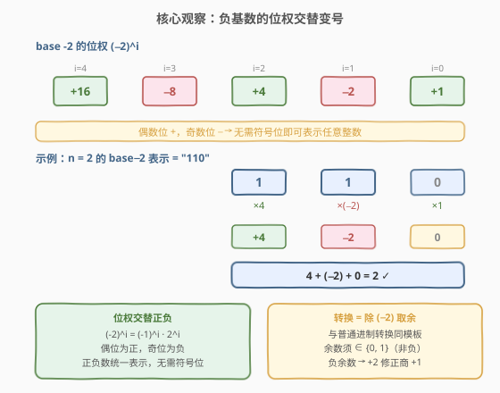
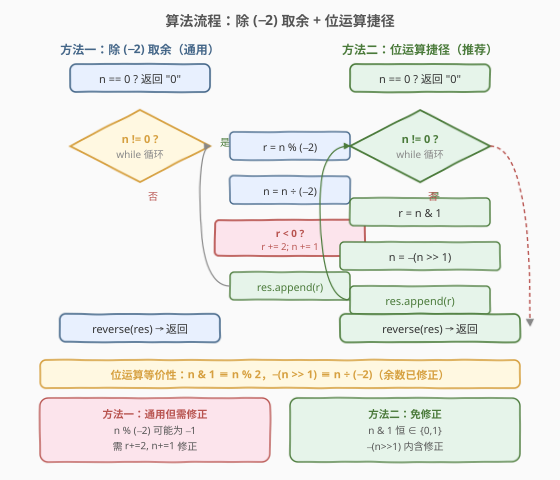
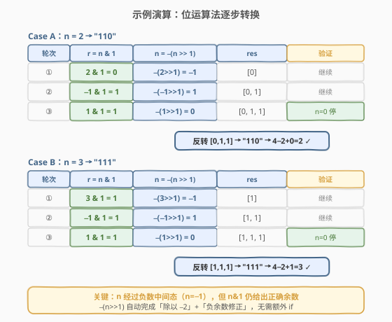

# 负二进制转换

- **题目名称**：负二进制转换
- **链接**：[1017. 负二进制转换](https://leetcode.cn/problems/convert-to-base-neg-2/)
- **难度**：中等
- **标签**：数学、位运算

## 1. 题目概述

给定一个整数 `n`，返回其二进制字符串表示，但**基数为 $-2$**。即把 `n` 表示为 $\sum_{i} d_i \cdot (-2)^i$，其中 $d_i \in \{0, 1\}$，返回的字符串不应有前导零（`n = 0` 时返回 `"0"`）。

**示例 1**：

```text
输入：n = 2
输出："110"
解释：(−2)² + (−2)¹ = 4 − 2 = 2
```

**示例 2**：

```text
输入：n = 3
输出："111"
解释：(−2)² + (−2)¹ + (−2)⁰ = 4 − 2 + 1 = 3
```

**示例 3**：

```text
输入：n = 4
输出："100"
解释：(−2)² = 4
```

**约束条件**：

- $0 \leq n \leq 10^9$

> 💡 **负基数的核心特性**：在 base $-2$ 中，位权 $(-2)^i$ 随 $i$ 的奇偶**交替变号**——偶数位为正（$1, 4, 16, \ldots$），奇数位为负（$-2, -8, -32, \ldots$）。这意味着 base $-2$ **无需符号位**即可表示任意整数（正数和负数），因为负权位天然提供了"减法"能力。

---

## 2. 解题思路

### 2.1 暴力思路：逐位搜索

最朴素的想法是枚举每一位取 `0` 或 `1`，验证 $\sum d_i \cdot (-2)^i = n$ 是否成立。但 $n \leq 10^9 < 2^{30}$，最坏需要枚举 30 位，$2^{30} \approx 10^9$ 种组合——不可行。

退一步，可以**从高位到低位贪心**：对每个位权 $(-2)^i$ 从大到小尝试，若"选 1"能让剩余值更接近 `0` 就选 `1`。但这种贪心缺乏严格的单调性保证（因为位权交替变号，选 `1` 可能增加也可能减少总和），实现复杂且容易出错。

> 💡 转机在于：**进制转换的本质**是"除基取余"。无论是 base 2、base 7 还是 base $-2$，转换算法的模板完全一样——反复除以基数、收集余数、逆序输出。区别仅在于**负基数会引入负余数**，需要做一步修正。

### 2.2 核心观察：除 $-2$ 取余 + 负余数修正



**关键性质**有两点：

1. **位权交替变号**：$(-2)^i = (-1)^i \cdot 2^i$。偶数位（$i = 0, 2, 4, \ldots$）权值为正，奇数位（$i = 1, 3, 5, \ldots$）权值为负。这使得正负整数都能被唯一表示。

2. **除 $-2$ 取余模板**：与普通进制转换相同，设 $n = (-2) \cdot q + r$，其中 $r \in \{0, 1\}$（非负余数）。反复执行此分解，直到 $n = 0$，收集的余数逆序即为 base $-2$ 表示。

**难点在于负余数修正**：

在不同语言中，`n % (-2)` 和 `n / (-2)` 的行为不一致：

| 语言 | `n % (-2)` 的符号 | 负余数处理 |
|------|-------------------|------------|
| Python | 跟随除数符号（$-2$），可能为 $-1$ | 需手动修正 |
| C++ (C++11+) | 跟随被除数符号，可能为 $-1$ | 需手动修正 |

当余数 $r = -1$ 时，需要修正为 $r' = r + 2 = 1$，同时商 $q' = q + 1$（因为 $(-2)(q+1) + 1 = -2q - 2 + 1 = -2q - 1 = (-2)q + (-1) = n$）。

> ⚠️ **为什么余数必须非负？** 因为 base $-2$ 的合法数字只有 `0` 和 `1`，余数就是每一位的数字值，必须 $\in \{0, 1\}$。负余数 $-1$ 不是合法数字，所以必须修正。

### 2.3 算法流程图



算法有两种实现方式：

**方法一（通用）**：标准的除 $-2$ 取余，遇到负余数时修正。

1. **判零**：若 `n == 0`，返回 `"0"`。
2. **循环**：`while n != 0`：
   - `r = n % (-2)`，`n = n / (-2)`（注意语言差异）
   - 若 `r < 0`：`r += 2`，`n += 1`（修正负余数）
   - 将 `r` 追加到结果列表
3. **逆序输出**：反转结果列表，拼成字符串。

**方法二（位运算捷径，推荐）**：利用等价性绕过修正。

1. **判零**：若 `n == 0`，返回 `"0"`。
2. **循环**：`while n != 0`：
   - `r = n & 1`（取最低位，恒 $\in \{0, 1\}$）
   - `n = -(n >> 1)`（等价于"除以 $-2$ 且自动修正余数"）
   - 将 `r` 追加到结果列表
3. **逆序输出**：反转结果列表，拼成字符串。

> 💡 **位运算等价性证明**：设 $n = (-2) \cdot q + r$，其中 $r = n \bmod 2 = n \mathbin{\&} 1$（$\in \{0, 1\}$）。则 $q = \frac{n - r}{-2} = -\frac{n - r}{2}$。由于 $r = n \mathbin{\&} 1$ 清除了最低位，$\frac{n - r}{2} = n \gg 1$（算术右移），故 $q = -(n \gg 1)$。这一步**内含了负余数修正**——因为 `n & 1` 永远给出非负余数，无需额外 `if`。

### 2.4 示例演算

以 `n = 2` 和 `n = 3` 为例，使用位运算法逐步推演：



**Case A：`n = 2`**

| 轮次 | $r = n \mathbin{\&} 1$ | $n = -(n \gg 1)$ | res | 验证 |
|------|------------------------|-------------------|-----|------|
| ① | $2 \mathbin{\&} 1 = 0$ | $-(2 \gg 1) = -1$ | `[0]` | 继续 |
| ② | $-1 \mathbin{\&} 1 = 1$ | $-(-1 \gg 1) = 1$ | `[0, 1]` | 继续 |
| ③ | $1 \mathbin{\&} 1 = 1$ | $-(1 \gg 1) = 0$ | `[0, 1, 1]` | n=0 停 |

反转 `[0, 1, 1]` → `"110"` → $4 + (-2) + 0 = 2$ ✓

**Case B：`n = 3`**

| 轮次 | $r = n \mathbin{\&} 1$ | $n = -(n \gg 1)$ | res | 验证 |
|------|------------------------|-------------------|-----|------|
| ① | $3 \mathbin{\&} 1 = 1$ | $-(3 \gg 1) = -1$ | `[1]` | 继续 |
| ② | $-1 \mathbin{\&} 1 = 1$ | $-(-1 \gg 1) = 1$ | `[1, 1]` | 继续 |
| ③ | $1 \mathbin{\&} 1 = 1$ | $-(1 \gg 1) = 0$ | `[1, 1, 1]` | n=0 停 |

反转 `[1, 1, 1]` → `"111"` → $4 + (-2) + 1 = 3$ ✓

> ⚠️ **关键观察**：`n` 在循环中会经过**负数中间态**（如 $n = -1$），这是负基数的正常现象。`n & 1` 在二补码下对负数仍给出正确的最低位（$-1$ 的二补码为全 `1`，故 $-1 \mathbin{\&} 1 = 1$），这正是位运算法能绕过修正的原因。

---

## 3. 参考代码

### C++

**方法一：除 $-2$ 取余 + 修正（通用模板）**

```cpp
class Solution {
  public:
    string baseNeg2(int n) {
        if (n == 0) return "0";
        string res;
        while (n != 0) {
            int r = n % (-2);
            n /= -2;
            if (r < 0) {            // 负余数修正
                r += 2;
                n += 1;
            }
            res.push_back('0' + r);
        }
        reverse(res.begin(), res.end());
        return res;
    }
};
```

**方法二：位运算捷径（推荐）**

```cpp
class Solution {
  public:
    string baseNeg2(int n) {
        if (n == 0) return "0";
        string res;
        while (n != 0) {
            res.push_back('0' + (n & 1));
            n = -(n >> 1);
        }
        reverse(res.begin(), res.end());
        return res;
    }
};
```

> ⚠️ **C++ 注意**：`n >> 1` 对负数是算术右移（符号扩展），在大多数平台和 C++20 标准下是良定义的。`-(n >> 1)` 正确等价于"除以 $-2$ 并修正余数"。`n & 1` 对负数取最低位，在二补码下恒 $\in \{0, 1\}$。

### Python

**方法一：除 $-2$ 取余 + 修正**

```python
class Solution:
    def baseNeg2(self, n: int) -> str:
        if n == 0:
            return "0"
        res = []
        while n != 0:
            r = n % (-2)
            n //= -2
            if r < 0:
                r += 2
                n += 1
            res.append(str(r))
        return "".join(reversed(res))
```

> 💡 **Python 的 `%` 和 `//`**：Python 的取模结果符号跟随**除数**，故 `3 % (-2) = -1`（而非 `1`），`3 // (-2) = -2`（向下取整）。这导致余数可能为 $-1$，需要修正。这与 C++ 的"截断取整"行为不同，但修正逻辑通用。

**方法二：位运算捷径（推荐）**

```python
class Solution:
    def baseNeg2(self, n: int) -> str:
        if n == 0:
            return "0"
        res = []
        while n != 0:
            res.append(str(n & 1))
            n = -(n >> 1)
        return "".join(reversed(res))
```

> 💡 **Python 的优势**：Python 整数无限精度，`n >> 1` 对负数做算术右移（向负无穷取整），`-(n >> 1)` 等价于"除以 $-2$ 并自动修正余数"。无需处理溢出，代码极简。也可用 `divmod` 一行写：`r, n = divmod(n, -2)` + 修正，但位运算法更简洁。

---

## 4. 复杂度分析

| 维度 | 复杂度 | 说明 |
|------|--------|------|
| 时间复杂度 | $O(\log n)$ | 循环次数等于 base $-2$ 表示的位数。$n \leq 10^9 < 2^{30}$，而 base $-2$ 的位数与 base $2$ 同阶（最多约 $32$ 位），故循环至多 $\sim 32$ 次 |
| 空间复杂度 | $O(\log n)$ | 结果字符串长度等于位数，至多 $\sim 32$ 字符 |

> 💡 两种方法的时间空间复杂度相同，但位运算法（方法二）避免了 `if` 分支判断和取模运算，常数更优。对于 $n \leq 10^9$ 的约束，两种方法都是常数级（$\leq 32$ 次循环），性能差异可忽略。

---

## 5. 扩展：负基数的一般性质

### 5.1 为什么 base $-2$ 能表示所有整数？

对于任意正整数 $n$，可以证明 $n$ 在 base $-2$ 下有唯一的 $\{0, 1\}$ 表示。直观理解：

- 若 $n$ 为偶数：$n = (-2) \cdot q + 0$，$q = -n/2$（负数），递归处理 $q$。
- 若 $n$ 为奇数：$n = (-2) \cdot q + 1$，$q = (1 - n)/2$，递归处理 $q$。

每步 $|q| \leq \lceil |n| / 2 \rceil$，故 $|q|$ 严格递减，最终到达 $0$，算法终止。

### 5.2 推广到 base $-K$

对于任意负基数 $-K$（$K \geq 2$），转换算法同样适用：除以 $-K$ 取余，余数 $\in \{0, 1, \ldots, K-1\}$，遇到负余数时 $r \mathrel{+}= K$、$q \mathrel{+}= 1$。位运算法仅对 $K = 2$ 有效（因为 `n & 1` 恰好给出二进制最低位），一般 $-K$ 需用算术取余法。

### 5.3 base $-2$ 与 base $2$ 的对比

| 维度 | base $2$ | base $-2$ |
|------|----------|-----------|
| 位权 | $2^i$（全正） | $(-2)^i$（交替正负） |
| 符号位 | 需要（或用补码） | 不需要 |
| 表示范围 | 非负整数（无符号） | 任意整数 |
| 转换 | `n % 2; n //= 2` | `n & 1; n = -(n >> 1)` |
| 位数 | $\lfloor \log_2 n \rfloor + 1$ | 同阶（$\leq \lfloor \log_2 n \rfloor + 2$） |

---

## 6. 面试要点

1. **base $-2$ 的位权有什么特殊之处？**

   - 位权 $(-2)^i = (-1)^i \cdot 2^i$ 随 $i$ 的奇偶**交替变号**。偶数位为正（$1, 4, 16, \ldots$），奇数位为负（$-2, -8, -32, \ldots$）。这使得正负整数都能被表示——负权位天然提供了"减法"能力，无需符号位。

2. **为什么除 $-2$ 取余会出现负余数？如何修正？**

   - 在大多数语言中，`n % (-2)` 的结果可能为 $-1$（而非 $1$），因为取模/取余运算的符号规则因语言而异。修正方法：若 $r < 0$，则 $r \mathrel{+}= 2$（变为 $1$），同时 $q \mathrel{+}= 1$（补偿：$(-2)(q+1) + 1 = (-2)q + (-1) = n$）。这保证了余数 $\in \{0, 1\}$，是合法的 base $-2$ 数字。

3. **位运算法 `n & 1; n = -(n >> 1)` 为什么等价于除 $-2$ 取余？**

   - 设 $n = (-2)q + r$，$r = n \bmod 2 = n \mathbin{\&} 1$（恒 $\in \{0, 1\}$）。则 $q = -(n - r) / 2 = -(n \gg 1)$（算术右移等价于除以 $2$ 向下取整）。因为 `n & 1` 直接给出非负余数，**无需修正**——修正已内含在 `-(n >> 1)` 中。

4. **`n = -1` 时 `n & 1` 等于多少？为什么？**

   - 在二补码表示下，$-1$ 的二进制为全 $1$（`...11111111`），故 $-1 \mathbin{\&} 1 = 1$。这正是位运算法能正确处理负数中间态的关键——即使 $n$ 变为负数，`n & 1` 仍给出正确的最低位数字。

5. **base $-2$ 表示的位数最多是多少？**

   - 与 base $2$ 同阶。$n \leq 10^9 < 2^{30}$，base $2$ 最多 $30$ 位，base $-2$ 最多约 $32$ 位（多出的位用于"抵消"负权位的影响）。故循环至多 $\sim 32$ 次，时间复杂度为 $O(\log n)$，在约束下为常数级。

---

## 7. 同类练习题

- [504. 七进制数](https://leetcode.cn/problems/base-7/)：正基数进制转换的母模板（除 $7$ 取余），对比负基数的差异——正基数无需修正余数，负基数需处理负余数
- [168. Excel 表列名称](https://leetcode.cn/problems/excel-sheet-column-title/)（[题解](../0001-0100/168_Excel表列名称.md)）：1-indexed 进制转换（先减 1 再取余），与本题同为"非标准进制转换"家族，但偏移方式不同
- [171. Excel 表列序号](https://leetcode.cn/problems/excel-sheet-column-title/)（[题解](../0001-0100/171_Excel表列序号.md)）：168 的逆方向（合成），与本题的"解码方向"对照
- [1073. 负二进制数相加](https://leetcode.cn/problems/adding-two-negabinary-numbers/)：base $-2$ 的加法运算，是本题的自然延伸——先转十进制相加再转回，或直接在 base $-2$ 下模拟进位（进位可能为 $-1$）
- [1018. 可被 5 整除的二进制前缀](https://leetcode.cn/problems/binary-prefix-divisible-by-5/)：base $2$ 的前缀求值 + 取模判整除，与本题的进制转换互为正逆方向
