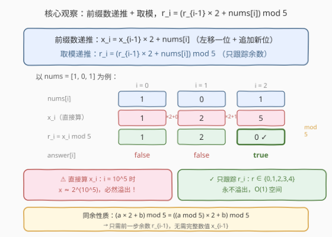
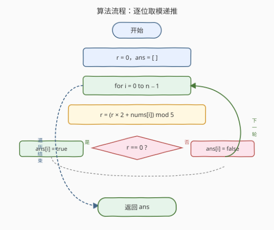
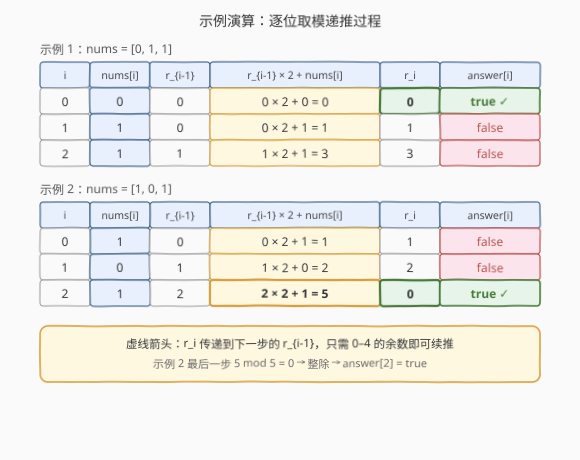

# LeetCode 可被 5 整除的二进制前缀 题解

## 1. 题目概述

- **标题 / 题号**：可被 5 整除的二进制前缀（#1018，easy）
- **链接**：https://leetcode.cn/problems/binary-prefix-divisible-by-5/
- **难度**：简单
- **标签**：数组、数学、位运算

**题意**：给定一个二进制数组 `nums`（索引从 `0` 开始）。定义 $x_i$ 为子数组 `nums[0..i]` 表示的二进制数（从最高有效位到最低有效位）。返回布尔列表 `answer`，当 $x_i$ 能被 `5` 整除时 `answer[i]` 为 `true`，否则为 `false`。

> 💡 **二进制前缀的含义**：`nums[0..i]` 从左到右就是 $x_i$ 的二进制位，最高位在前。例如 `nums = [1,0,1]` 时 $x_0 = 1_{(2)} = 1$，$x_1 = 10_{(2)} = 2$，$x_2 = 101_{(2)} = 5$。

**示例 1**：

```text
输入：nums = [0,1,1]
输出：[true,false,false]
解释：输入数字为 0, 01, 011；即十进制中的 0, 1, 3。
      只有第一个数 0 能被 5 整除，故 answer[0] = true。
```

**示例 2**：

```text
输入：nums = [1,1,1]
输出：[false,false,false]
解释：输入数字为 1, 11, 111；即十进制中的 1, 3, 7。均不能被 5 整除。
```

**示例 3**：

```text
输入：nums = [1,0,1]
输出：[false,false,true]
解释：输入数字为 1, 10, 101；即十进制中的 1, 2, 5。5 能被 5 整除。
```

**约束**：

- $1 \leq \text{nums.length} \leq 10^5$
- `nums[i]` 为 `0` 或 `1`

## 2. 解题思路

### 2.1 暴力思路：直接构造数值

最直观的做法是逐位构造 $x_i$：每读入一位，将已有的数左移一位（乘 `2`）并加上新位，得到 $x_i$ 后检查 $x_i \bmod 5 == 0$。

$$x_i = x_{i-1} \times 2 + \text{nums}[i]$$

> ⚠️ **致命问题：溢出**。`nums` 长度可达 $10^5$，$x_i$ 最多有 $10^5$ 位二进制，数值约为 $2^{10^5}$，远超任何整数类型（C++ `unsigned long long` 仅 64 位、Python 虽有大整数但 $O(n)$ 位运算累加导致 $O(n^2)$ 总时间）。必须避免存储完整数值。

> 💡 **突破口**：我们只关心 $x_i \bmod 5$ 是否为 `0`，不关心 $x_i$ 本身。利用**同余性质**，每步只保留余数即可——余数永远在 $\{0, 1, 2, 3, 4\}$，不会增长。

### 2.2 核心观察：取模递推



关键转化：**不存 $x_i$，只存 $r_i = x_i \bmod 5$**。

由同余性质 $(a \times b + c) \bmod m = ((a \bmod m) \times b + c) \bmod m$，递推公式可化为：

$$r_i = (r_{i-1} \times 2 + \text{nums}[i]) \bmod 5$$

- $r_0 = \text{nums}[0] \bmod 5$（即 `nums[0]`，因为 `0` 或 `1` 都 $< 5$）。
- 每步只需前一步的余数 $r_{i-1} \in \{0,1,2,3,4\}$，乘 `2` 加位后最大 $4 \times 2 + 1 = 9$，取模后回到 $\{0,\ldots,4\}$。
- `answer[i] = (r_i == 0)`。

**为什么不会溢出？** $r_{i-1} \leq 4$，$r_{i-1} \times 2 + \text{nums}[i] \leq 9$，任何整数类型都能轻松容纳，无需大数运算。

> ⚠️ **与 [166. 分数到小数](../0101-0200/166_分数到小数.md) 的呼应**：166 题用长除法模拟时同样只跟踪**余数**来检测循环节——余数决定了下一步的全部行为，商的整数部分不再需要。本题是同一思想的前缀版：只留余数，丢弃完整数值。

### 2.3 算法流程图



维护变量：

- `r`：当前前缀数对 `5` 的余数，初始 `0`。
- `ans`：结果列表。

**主循环**（`i` 从 `0` 到 `n-1`）：

1. 更新余数：`r = (r * 2 + nums[i]) % 5`。
2. 记录答案：`ans[i] = (r == 0)`。

循环结束返回 `ans`。

### 2.4 示例演算

以 `nums = [0, 1, 1]` 和 `nums = [1, 0, 1]` 为例，下表给出逐步递推过程：



**示例 1** `nums = [0, 1, 1]`：

| $i$ | nums[i] | $r_{i-1}$ | $r_{i-1} \times 2 + \text{nums}[i]$ | $r_i$ | answer[i] |
|-----|---------|-----------|--------------------------------------|-------|-----------|
| 0 | 0 | 0 | $0 \times 2 + 0 = 0$ | 0 | true ✓ |
| 1 | 1 | 0 | $0 \times 2 + 1 = 1$ | 1 | false |
| 2 | 1 | 1 | $1 \times 2 + 1 = 3$ | 3 | false |

**示例 2** `nums = [1, 0, 1]`：

| $i$ | nums[i] | $r_{i-1}$ | $r_{i-1} \times 2 + \text{nums}[i]$ | $r_i$ | answer[i] |
|-----|---------|-----------|--------------------------------------|-------|-----------|
| 0 | 1 | 0 | $0 \times 2 + 1 = 1$ | 1 | false |
| 1 | 0 | 1 | $1 \times 2 + 0 = 2$ | 2 | false |
| 2 | 1 | 2 | $2 \times 2 + 1 = 5$ | 0 | true ✓ |

> 💡 示例 2 最后一步：$r_{i-1} = 2$，读入 `1`，得 $2 \times 2 + 1 = 5$，$5 \bmod 5 = 0$，整除！注意 $x_2 = 101_{(2)} = 5$，与余数推导完全一致——我们从未计算过 `5` 这个完整数值，却正确判定了整除性。

## 3. 参考代码

### C++

```cpp
class Solution {
  public:
    vector<bool> prefixesDivBy5(vector<int>& nums) {
        int n = nums.size();
        vector<bool> ans(n);
        int r = 0;
        for (int i = 0; i < n; ++i) {
            r = (r * 2 + nums[i]) % 5;       // 取模递推，r 恒 ∈ {0,1,2,3,4}
            ans[i] = (r == 0);
        }
        return ans;
    }
};
```

### Python

```python
class Solution:
    def prefixesDivBy5(self, nums: List[int]) -> List[bool]:
        ans = []
        r = 0
        for bit in nums:
            r = (r * 2 + bit) % 5            # 取模递推，r 恒 ∈ {0,1,2,3,4}
            ans.append(r == 0)
        return ans
```

> 💡 **Python 大整数也能过**：Python 原生支持大整数，直接 `x = x * 2 + bit; ans.append(x % 5 == 0)` 也能 AC，但 $10^5$ 位的大整数乘法/取模会让单步从 $O(1)$ 退化为 $O(n)$，总时间 $O(n^2)$。取模递推保证每步 $O(1)$，是最优解。

## 4. 复杂度分析

| 维度 | 复杂度 | 说明 |
|------|--------|------|
| 时间复杂度 | $O(n)$ | 单趟遍历，每步 $r \times 2 + \text{bit}$ 与取模均为 $O(1)$ |
| 空间复杂度 | $O(1)$ | 仅用 `r` 一个变量（结果数组不计入额外空间） |

> ⚠️ 若不取模而直接构造大整数，C++/Java 必然溢出，Python 虽不溢出但单步大数运算退化为 $O(n)$，总时间 $O(n^2)$，$n = 10^5$ 时 TLE。取模是**必须的**，不是可选优化。

## 5. 扩展：任意模数与 DFA 视角

### 5.1 推广到任意模数

将 `5` 替换为任意正整数 $m$，递推公式不变：

$$r_i = (r_{i-1} \times 2 + \text{nums}[i]) \bmod m$$

只要 $r_{i-1} < m$，则 $r_{i-1} \times 2 + 1 \leq 2m - 1 < 2m$，取模后回到 $[0, m)$。当 $m \leq 2^{30}$ 时（`r * 2` 不溢出 `int`），无需特殊处理；$m$ 更大时用 `long long` 存中间值即可。

### 5.2 DFA 视角：5 状态自动机

取模递推本质上是一个**确定性有限自动机（DFA）**：

- **状态集**：$\{0, 1, 2, 3, 4\}$（即当前余数）。
- **输入字母表**：$\{0, 1\}$（二进制位）。
- **转移函数**：$\delta(r, b) = (r \times 2 + b) \bmod 5$。
- **初始状态**：$0$。
- **接受状态**：$\{0\}$（余数为 `0` 即可被 `5` 整除）。

每个 `answer[i]` 就是读入 `nums[0..i]` 后自动机是否处于接受状态。这与 [65. 有效数字](../0001-0100/65_有效数字.md) 用 DFA 校验字符串、[8. 字符串转换整数（atoi）](../0001-0100/8_字符串转换整数atoi.md) 用状态机解析整数是同一范式——**用有限状态编码无限增长的中间信息**。

> 💡 **状态压缩的本质**：完整数值 $x_i$ 有 $O(n)$ 位信息，但「$x_i \bmod 5$」只有 $\lceil \log_2 5 \rceil = 3$ 位信息。取模运算是一个**信息投影**，把指数增长的数值空间压缩到常数大小的余数空间，恰好保留了「能否整除」这一判定所需的信息。

### 5.3 为什么是 5？

`5` 的二进制末尾模式有规律：$5 = 101_{(2)}$。一个数能被 `5` 整除，当且仅当其值 $\bmod 5 = 0$。虽然存在类似「被 `3` 整除看各位和」「被 `4` 整除看末两位」的速判规则，但对 `5` 没有简单的位级速判法（`5` 不是 `2` 的幂），因此取模递推是最自然的做法。

## 6. 面试要点

1. **为什么不能直接算 $x_i$？**
   - `nums` 长度达 $10^5$，$x_i$ 有 $10^5$ 位二进制，数值约 $2^{10^5}$。C++/Java 的 64 位整数必然溢出；Python 虽有大整数，但单步运算 $O(n)$，总 $O(n^2)$ 会超时。必须取模避免存储完整数值。

2. **取模递推的正确性依据是什么？**
   - 同余性质：$(a \times 2 + b) \bmod 5 = ((a \bmod 5) \times 2 + b) \bmod 5$。因此只保留前一步余数 $r_{i-1} = x_{i-1} \bmod 5$ 即可算出 $r_i = x_i \bmod 5$，无需知道 $x_{i-1}$ 的完整值。

3. **余数 $r$ 的最大值是多少？为什么不会溢出？**
   - $r \in \{0, 1, 2, 3, 4\}$，更新时 $r \times 2 + \text{bit} \leq 4 \times 2 + 1 = 9$，取模后回到 $\leq 4$。中间值 `9` 远在 `int` 范围内，无溢出风险。

4. **如果把 `5` 换成其他数（如 `7`、`13`），算法要改什么？**
   - 只需把 `% 5` 改为 `% m`。当 $m \leq 2^{30}$ 时 `r * 2 + bit` 不溢出 `int`；$m$ 更大时用 `long long` 存中间值。递推结构完全不变。

5. **这道题和 [974. 和可被 K 整除的子数组](../0901-1000/974_和可被K整除的子数组.md) 有什么异同？**
   - 974 用**前缀和的同余定理**（两个前缀和同余则中间段可被整除），是**减法**关系 $S_j - S_i$；本题是**构造**关系 $x_i = x_{i-1} \times 2 + \text{bit}$，是**递推**。两者都靠「只跟踪余数」避免溢出，但递推结构不同：974 是前缀和 + 哈希计数，本题是单变量滚动更新。

## 同类练习题

| # | 题目 | 与本题的关联 |
|---|------|-------------|
| 67 | [二进制求和](https://leetcode.cn/problems/add-binary/)（[题解](../0001-0100/67_二进制求和.md)） | 二进制数的逐位构造与进位，本题的「左移 + 加位」是其加法版的单侧递推 |
| 166 | [分数到小数](https://leetcode.cn/problems/fraction-to-recurring-decimal/)（[题解](../0101-0200/166_分数到小数.md)） | 长除法中只跟踪余数检测循环节，与本题「只留余数丢弃完整数值」是同一思想 |
| 974 | [和可被 K 整除的子数组](https://leetcode.cn/problems/subarray-sums-divisible-by-k/)（[题解](../0901-1000/974_和可被K整除的子数组.md)） | 前缀和同余定理判整除，对比本题的递推取模，两种「只跟踪余数」的不同应用 |
| 1010 | [总持续时间可被 60 整除的歌曲对](https://leetcode.cn/problems/pairs-of-songs-with-total-durations-divisible-by-60/)（[题解](../1001-1100/1010_总持续时间可被60整除的歌曲对.md)） | 取余后按余数分组配对，同为「取模 + 整除判定」家族 |
| 190 | [颠倒二进制位](https://leetcode.cn/problems/reverse-bits/)（[题解](../0101-0200/190_颠倒二进制位.md)） | 逐位构造二进制数的基础操作，本题的位处理是其变体 |
