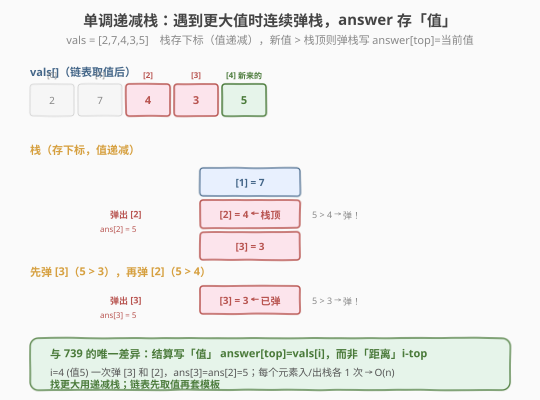
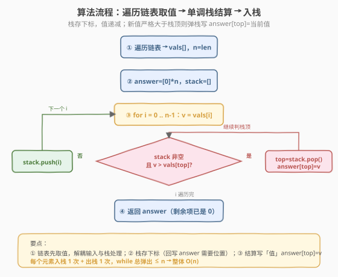
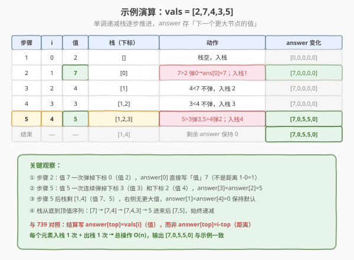

# 链表中的下一个更大节点

- **题目名称**：链表中的下一个更大节点
- **链接**：[1019. 链表中的下一个更大节点](https://leetcode.cn/problems/next-greater-node-in-linked-list/)
- **难度**：中等
- **标签**：栈、链表、单调栈

## 1. 题目概述

给定一个长度为 `n` 的单链表 `head`。对于链表中的每个节点，找到它**右侧第一个**值**严格大于**它的节点，返回该节点的值；若不存在则记 `0`。

返回一个整数数组 `answer`，其中 `answer[i]` 是第 `i` 个节点的「下一个更大节点的值」。

**示例 1**：

```text
输入：head = [2,1,5]
输出：[5,5,0]
解释：
  节点 0 值 2 → 右侧首个更大是 5 → answer[0]=5
  节点 1 值 1 → 右侧首个更大是 5 → answer[1]=5
  节点 2 值 5 → 右侧没有更大     → answer[2]=0
```

**示例 2**：

```text
输入：head = [2,7,4,3,5]
输出：[7,0,5,5,0]
解释：
  节点 0 值 2 → 7 更大 → answer[0]=7
  节点 1 值 7 → 没更大 → answer[1]=0
  节点 2 值 4 → 5 更大 → answer[2]=5
  节点 3 值 3 → 5 更大 → answer[3]=5
  节点 4 值 5 → 没更大 → answer[4]=0
```

**约束条件**：

- 链表中节点数为 `n`
- `1 <= n <= 10^4`
- `1 <= Node.val <= 10^9`

> 💡 这是 [739. 每日温度](../0701-0800/739_每日温度.md) 的**链表变体**——同样是「找每个元素右侧第一个更大」，同样用**单调递减栈** `O(n)` 解决。两处差异：① 输入从数组换成链表，需先遍历取值（或边遍历边入栈）；② `answer[i]` 存的是「更大节点的**值**」而非「隔几天」的**距离**，结算时直接 `answer[top] = 当前值`。掌握 739 的模板后，本题只需做这两处微调。

---

## 2. 解题思路

### 2.1 暴力思路：双重循环

把链表转成数组 `vals`，对每个 `i` 向右扫描找第一个 `vals[j] > vals[i]`，`answer[i] = vals[j]`，找不到则 `0`。

```text
for i in 0..n:
    for j in i+1..n:
        if vals[j] > vals[i]:
            answer[i] = vals[j]
            break
```

时间复杂度 `O(n²)`，`n = 10^4` 时约 `10^8` 次比较，**勉强 / 易超时**。更大的问题是：每个元素向后扫描时**重复比较了大量已扫过的元素**——例如 `[2,7,4,3,5]` 找 4 的下一个更大扫过 3、5，找 3 的下一个更大又扫过 5。单调栈能消除这些重复比较。

### 2.2 核心观察：单调递减栈

**关键定义**：维护一个**栈**，栈中存放下标，对应节点值从栈底到栈顶**单调递减**（不严格，允许相等）。

**核心规则**：按下标顺序遍历每个节点值 `vals[i]`：

- 若 `vals[i]` **严格大于**栈顶对应值：说明第 `i` 个节点就是栈顶那个节点的「下一个更大节点」！弹出栈顶 `top`，`answer[top] = vals[i]`。**循环弹**直到栈顶值 ≥ 当前值（保持单调性）或栈空。
- 然后**把** `i` **入栈**（它还没找到答案，等后续更大的来结算）。



**为什么是递减栈？** 我们要找「下一个更大」。栈里存的是「还没找到更大值」的元素，它们应**递减**排列——栈顶总是当前最小、最迫切等待更大值的下标。新来的值先和栈顶比，一旦更大就结算栈顶，循环弹到栈顶不再小于当前值为止。

> 💡 **与 739 的对照**：骨架**完全相同**——都是「遍历 + while 弹栈结算 + 入栈」。差异仅在**结算内容**：
> - 739 存距离：`answer[top] = i - top`（隔几天）。
> - 1019 存值：`answer[top] = vals[i]`（更大节点的值）。
>
> 因为链表没法像数组那样「下标相减」直达距离，且题目问的就是「更大节点的值」，所以直接把当前值写进 `answer`。这是单调栈模板「**结算内容随题意变**」的典型体现。

### 2.3 算法流程图



**完整步骤**：

1. **取值**：遍历链表一次，把节点值存入数组 `vals`，得到长度 `n`。
2. **初始化**：栈 `stack = []`，结果 `answer` 全填 `0`（长度 `n`）。
3. **遍历** `i` **从 0 到 n-1**：
   - `while stack 非空 且 vals[i] > vals[stack.top()]`：
     - `top = stack.pop()`
     - `answer[top] = vals[i]`（栈顶节点的下一个更大值就是当前值）
   - `stack.push(i)`
4. **结束**：栈中剩余下标 `answer` 保持 `0`（右侧没有更大节点）。

> ⚠️ **栈存下标而非值**：虽然本题 `answer` 存的是值，但仍需用下标定位 `answer[top]` 这个位置——存值无法回写到正确下标。这与 739 一致：「**需要回写某下标的答案时，栈存下标**」是单调栈通用原则。

### 2.4 示例演算

以 `head = [2,7,4,3,5]` 为例，`vals = [2,7,4,3,5]`：



| 步骤 | i | 值 | 栈（下标） | 动作 | answer 变化 |
|------|---|----|-----------|------|------------|
| 1 | 0 | 2 | [] | 栈空，入栈 | [0,0,0,0,0] |
| 2 | 1 | 7 | [0] | 7>2 弹 0→ans[0]=7；栈空；入栈 1 | [7,0,0,0,0] |
| 3 | 2 | 4 | [1] | 4<7 不弹，入栈 2 | [7,0,0,0,0] |
| 4 | 3 | 3 | [1,2] | 3<4 不弹，入栈 3 | [7,0,0,0,0] |
| 5 | 4 | 5 | [1,2,3] | 5>3 弹3→ans[3]=5；5>4 弹2→ans[2]=5；5<7 停；入栈4 | [7,0,5,5,0] |
| 结束 | — | — | [1,4] | 剩余 answer 保持 0 | [7,0,5,5,0] |

注意步骤 5：值 `5` 一次连续弹掉 `3` 和 `4`（下标 3、2），正是单调栈「一个新值结算多个答案」的威力。步骤结束后栈剩 `[1,4]`（值 7 和 5），它们右侧没有更大值，`answer` 保持 `0`，与输出 `[7,0,5,5,0]` 完全一致。

> 💡 对比暴力法：找节点 2（值 4）的答案，暴力要从下标 3 扫到 4（扫 2 次）；单调栈在步骤 5（i=4, 值 5）一次性弹掉栈里的 3 和 2，节点 2 的答案直接写为 `5`。每个元素只被弹 1 次，总操作 `O(n)`。

---

## 3. 参考代码

### C++

```cpp
// 1019. 链表中的下一个更大节点.cpp —— 单调递减栈
// 编译: g++ -O2 -std=c++17 1019.cpp -o ngnll
#include <vector>
#include <stack>
using namespace std;

struct ListNode {
    int val;
    ListNode *next;
    ListNode() : val(0), next(nullptr) {}
    ListNode(int x) : val(x), next(nullptr) {}
    ListNode(int x, ListNode *next) : val(x), next(next) {}
};

class Solution {
  public:
    vector<int> nextLargerNodes(ListNode* head) {
        // 1. 链表取值
        vector<int> vals;
        for (ListNode* p = head; p; p = p->next) {
            vals.push_back(p->val);
        }
        int n = vals.size();

        // 2. 单调递减栈（存下标）
        vector<int> answer(n, 0); // 默认 0（无更大节点）
        stack<int> stk;

        for (int i = 0; i < n; ++i) {
            // 当前值比栈顶大 → 结算栈顶，answer 存「值」
            while (!stk.empty() && vals[i] > vals[stk.top()]) {
                int top = stk.top();
                stk.pop();
                answer[top] = vals[i];
            }
            stk.push(i);
        }
        // 栈中剩余下标 answer 已是 0，无需处理
        return answer;
    }
};
```

### Python

```python
class Solution:
    def nextLargerNodes(self, head: Optional[ListNode]) -> List[int]:
        # 1. 链表取值
        vals: list[int] = []
        p = head
        while p:
            vals.append(p.val)
            p = p.next
        n = len(vals)

        # 2. 单调递减栈（存下标）
        answer = [0] * n
        stack: list[int] = []

        for i, v in enumerate(vals):
            # 当前值比栈顶大 → 结算栈顶，answer 存「值」
            while stack and v > vals[stack[-1]]:
                answer[stack.pop()] = v
            stack.append(i)
        # 栈中剩余 answer 已是 0
        return answer
```

> 💡 Python 用 `list` 当栈（`append` 入栈，`pop()` 出栈，均 `O(1)`）。`stack[-1]` 是栈顶下标，`vals[stack[-1]]` 是栈顶值。注意 `answer[stack.pop()] = v` 一行完成「弹栈 + 回写」，比 C++ 的三行更紧凑。

> ⚠️ **能否不先转数组、边遍历链表边入栈？** 可以——用一个自增 `idx` 计数当前位置，栈存 `(idx, val)` 或只存 `idx` 并配合一个并行的 `vals` 数组（边遍历边 `append`）。但「先取值再处理」写法最清晰、不易错，且只多一次 `O(n)` 遍历，不影响整体复杂度。面试中推荐先取值版本，便于讲解。

---

## 4. 复杂度分析

| 维度 | 复杂度 | 说明 |
|------|--------|------|
| **时间复杂度** | `O(n)` | 链表取值遍历 `O(n)`；每个下标恰好入栈 1 次、出栈 1 次，栈操作总计 `2n` |
| **空间复杂度** | `O(n)` | `vals` 数组 `O(n)` + 栈最多 `n` 个下标（值严格递减时）+ `answer` `O(n)`，整体 `O(n)` |

> ⚠️ 虽然 `while` 嵌套在 `for` 里，看似 `O(n²)`，但**均摊分析**：每个元素至多入栈 1 次出栈 1 次，`while` 的总弹出次数 ≤ `n`，所以总时间 `O(n)`。这是单调栈「均摊 O(1)」的特性，与 [739. 每日温度](../0701-0800/739_每日温度.md) 完全一致。

---

## 5. 扩展：「找下一个更 X」的模板家族

### 5.1 通用模板

```python
stack = []
for i in range(n):
    while stack and 比较条件(arr[i], arr[stack[-1]]):
        top = stack.pop()
        # 结算 top 的答案（写值 / 算距离 / 累加跨度，随题意而定）
    stack.append(i)
# 栈中剩余元素无「下一个更 X」，answer 保持默认（0 或 -1）
```

**比较条件**决定单调性，**结算内容**随题意变：

| 题目 | 找什么 | 结算内容 | 栈单调性 |
|------|--------|---------|---------|
| **1019（本题）** | 下一个更大 | 写「更大节点的值」`answer[top]=v` | 递减栈 |
| 739 每日温度 | 下一个更大 | 算「隔几天」`answer[top]=i-top` | 递减栈 |
| 496 下一个更大元素 I | 下一个更大 | 写「更大值」，跨数组哈希映射 | 递减栈 |
| 503 下一个更大元素 II | 下一个更大（循环） | 写「更大值」，拼接两遍或取模 | 递减栈 |
| 901 股票价格跨度 | 左边连续更小或等 | 累加「跨度」 | 递减栈 |

> 💡 这些题的骨架**完全相同**——都是「遍历 + while 弹栈结算 + 入栈」。差别只在比较方向（更大/更小）、结算内容（写值/算距离/累加跨度）、扫描方向（单侧/双侧/循环）。掌握 739 或 1019 的模板，496/503/901 可秒杀。

### 5.2 与 739 每日温度的对照

两题**同构**，差异仅两点：

| 维度 | 739 每日温度 | 1019 链表中的下一个更大节点 |
|------|-------------|--------------------------|
| 输入 | 整数数组 | 单链表（需先取值） |
| `answer[i]` 含义 | 隔几天（**距离**） | 更大节点的值（**值**） |
| 结算语句 | `answer[top] = i - top` | `answer[top] = vals[i]` |
| 比较条件 | `t > temperatures[stk.top()]` | `v > vals[stk.top()]` |
| 时间复杂度 | `O(n)` | `O(n)` |

> 💡 **识别信号**：题目出现「每个元素的下一个更大/更小」「右侧第一个比它大/小」→ 想**单调栈**。若输入是链表，先转数组再套模板，是最稳妥的写法。

---

## 6. 面试要点

1. **为什么用单调栈而不是双重循环或 DP？**

   - 双重循环 `O(n²)` 重复比较了大量已扫过的元素，`n = 10^4` 时易超时。
   - DP 需无后效性的状态定义，但「下一个更大」依赖**未来**元素，反向 DP 虽可行（`dp[i]` 借助 `dp[i+1]` 跳跃）却不如单调栈直观，且最坏仍可能退化。
   - 单调栈天然适合「暂存未结算元素，遇到触发条件批量结算」，是本题最优解，`O(n)` 一次扫描搞定。

2. **栈里存下标还是存值？为什么？**

   - 存**下标**。虽然 `answer` 存的是「值」，但必须用下标定位 `answer[top]` 这个位置回写——存值无法回写到正确下标。
   - 通用原则：**需要回写某下标答案时存下标**，只需比较值时存值（少见）。本题与 739 一致，都存下标。

3. **为什么是单调递减栈？递增栈行不行？**

   - 找「下一个更大」，栈里存「还没找到更大的」元素。若栈递增（栈顶最大），新来的小元素入栈后，栈顶的小元素被压在下面，永远等不到更大的来结算——破坏了「栈顶先结算」的机制。
   - 递减栈保证栈顶是最小、最迫切等更大值的元素，新来的值先和它比，满足「先进后出」的结算顺序。
   - 口诀：**找更大用递减栈，找更小用递增栈**。

4. **为什么先把链表转成数组？能否原地处理？**

   - 转数组写法清晰：一次遍历取值 `O(n)`，再套标准单调栈模板，便于讲解和避免链表指针与栈操作的交织出错。
   - 原地处理可行：用自增 `idx` 计数，栈存 `idx`，同时维护一个并行的 `vals` 数组边遍历边 `append`，效果相同。
   - 两者空间都是 `O(n)`（都要存 `answer` 和栈/`vals`），时间都是 `O(n)`，先取值版本更不易错，面试推荐。

5. **时间复杂度为什么是 O(n) 而不是 O(n²)？**

   - 虽然 `while` 嵌套在 `for` 里，但**均摊分析**：每个元素入栈 1 次、出栈 1 次，`while` 的总弹出次数 ≤ `n`。
   - `for` 跑 `n` 轮，每轮的 `while` 总共弹出 `≤ n` 次（不是每轮都弹 `n` 次），所以总操作 `O(n) + O(n) = O(n)`。
   - 这是「每个元素均摊 O(1)」的经典例子，与 [739. 每日温度](../0701-0800/739_每日温度.md) 的复杂度论证完全相同。

> 💡 **一句话总结**：1019 是单调栈「找下一个更大」家族的链表变体——把链表取值后套 739 的递减栈模板，唯一改动是 `answer[top]` 存「更大节点的值」而非「距离」。核心技巧：**栈存下标**（回写需要）+ **递减栈**（找更大用递减）+ **链表先取值**（解耦输入与栈处理）。这个 `while + pop + push` 骨架可迁移到 496/503/901 等所有「找下一个更 X」问题，是面试必会的核心模板。

---

## 7. 同类练习题

- [739. 每日温度](https://leetcode.cn/problems/daily-temperatures/)（[题解](../0701-0800/739_每日温度.md)）：单调栈招牌题，`answer` 存「距离」而非「值」，本题的数组原版
- [496. 下一个更大元素 I](https://leetcode.cn/problems/next-greater-element-i/)：两个数组，单调栈 + 哈希映射值到下标，`answer` 存「值」与本题同
- [503. 下一个更大元素 II](https://leetcode.cn/problems/next-greater-element-ii/)：循环数组单调栈，拼接两遍或取模处理环形
- [901. 股票价格跨度](https://leetcode.cn/problems/online-stock-span/)（[题解](../0901-1000/901_股票价格跨度.md)）：在线流式单调栈，弹栈时累加跨度，本题变体进阶
