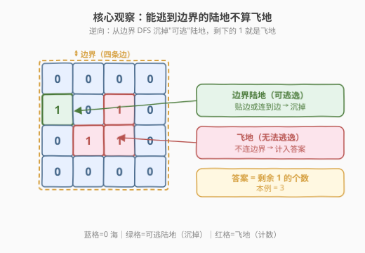
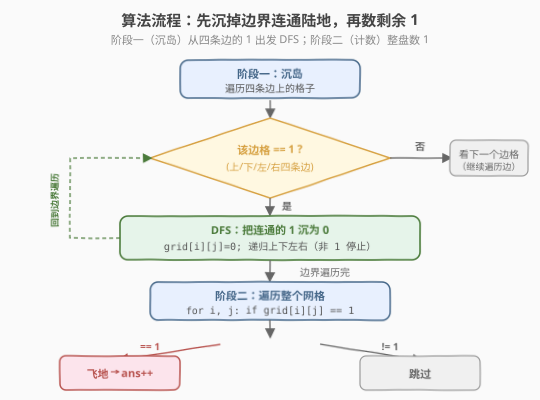
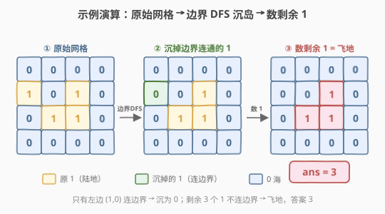

# 飞地的数量

- **题目名称**：飞地的数量
- **链接**：[1020. 飞地的数量](https://leetcode.cn/problems/number-of-enclaves/)
- **难度**：中等
- **标签**：图、DFS、BFS、网格

## 1. 题目概述

给你一个 $m \times n$ 的二进制矩阵 `grid`，其中 `0` 表示海洋单元格、`1` 表示陆地单元格。一次**移动**是指从一个陆地单元格走到另一个相邻（**上、下、左、右**）的陆地单元格或跨过 `grid` 的边界。

返回网格中**无法**在任意次数的移动中离开网格边界的陆地单元格的数量。

> 💡 **一句话题意**：数出那些「被海洋完全包围、无论怎么走都到不了边界」的陆地格子个数——即**飞地**（enclave）的格子数。

**示例 1**：

```text
输入：grid = [
  [0,0,0,0],
  [1,0,1,0],
  [0,1,1,0],
  [0,0,0,0]
]
输出：3
解释：有三个 1 被 0 包围。一个 1（左边界上的 (1,0)）没被包围，因为它在边界上。
```

**示例 2**：

```text
输入：grid = [
  [0,1,1,0],
  [0,0,1,0],
  [0,0,1,0],
  [0,0,0,0]
]
输出：0
解释：所有 1 都在边界上或可以到达边界。
```

**约束条件**：

- $m == \text{grid.length}$
- $n == \text{grid[i].length}$
- $1 \leq m, n \leq 500$
- $\text{grid[i][j]}$ 的值为 `0` 或 `1`

> ⚠️ **注意与 [200. 岛屿数量](../0101-0200/200_岛屿数量.md) 的输入差异**：200 题的 `grid[i][j]` 是**字符** `'0'`/`'1'`，本题是**整数** `0`/`1`。比较时分别用 `!= '1'` 与 `!= 1`，复制模板时勿漏这一处类型差异。

---

## 2. 解题思路

### 2.1 暴力思路

对每个陆地格子 `1`，DFS/BFS 探索它所在的连通块，判断该连通块是否**触碰边界**：若不触碰，则该格子是飞地，计数 +1。这样每个连通块会被从内部逐格重复扫描，最坏 $O((M \times N)^2)$，在 $m, n \leq 500$（25 万格）下必然超时。

> 💡 暴力的浪费在于：判定「能否到边界」是**整个连通块**的属性，逐格重复探索同一连通块毫无意义。转机是**逆向思维**——与其逐格判断「谁被困」，不如一次性标记「谁能逃」。

### 2.2 核心观察：能逃到边界的陆地不算飞地



> 💡 **逆向思维**：任何**与边界上的陆地连通**的陆地都有一条「逃生通道」——可以一路走到边界并跨出去，因此**不算飞地**。剩下的、未被标记的 `1` 才是无法逃逸的飞地。

于是问题归约为两步：

1. **沉岛（标记可逃）**：从四条边界上的每个 `1` 出发，DFS/BFS 把所有连通的 `1` **置为 `0`**（沉掉）。这些「可逃」的陆地被一次性消除。
2. **计数（数飞地）**：遍历整个网格，统计剩余的 `1` 的个数，即为飞地数量。

> ⚠️ **边界上的 `1` 本身就能逃**：题目定义「跨过 `grid` 的边界」也是一次合法移动，故贴边的陆地天然能离开网格，必非飞地。这与 [130. 被围绕的区域](../0101-0200/130_被围绕的区域.md) 中「边界 `O` 安全」的设定完全一致。

### 2.3 算法流程图



**阶段一（沉岛）**——从边界出发的 DFS：

1. 遍历四条边（第 0 行、最后一行、第 0 列、最后一列）。
2. 遇到 `grid[i][j] == 1`，从该格 DFS：把当前格置 `0`（沉岛），递归处理上下左右四个邻居（越界或非 `1` 停止）。

**阶段二（计数）**：

3. 遍历所有格子，`grid[i][j] == 1` 则 `ans += 1`。
4. 返回 `ans`。

> 💡 **为何沉岛用置 `0` 而非临时标记 `'#'`？** 130 题需要区分「原 `X`」与「要翻成 `X` 的被围绕 `O`」，故用第三种字符 `'#'` 暂存安全格。本题只需**计数**剩余 `1`，沉掉的 `1` 直接变 `0` 即与海洋同色，扫描时自然跳过——无需第三种状态，更简洁。

### 2.4 示例演算



以示例 1 为例，网格为 $4 \times 4$：

| 阶段 | (1,0) | (1,2) | (2,1) | (2,2) | 说明 |
|------|-------|-------|-------|-------|------|
| ① 原始 | 1 | 1 | 1 | 1 | 四个陆地格 |
| ② 沉岛 | 0 | 1 | 1 | 1 | 从左边界 (1,0) 出发 DFS，只沉自身（邻居皆 `0`/越界） |
| ③ 计数 | — | 1 | 1 | 1 | 剩余 3 个 `1`，答案 = 3 ✓ |

边界扫描只有 `(1,0)` 是边界陆地，DFS 把它沉为 `0`；`(1,2)`、`(2,1)`、`(2,2)` 三格互不与边界连通（四周被 `0` 围住），保留为 `1`，计数得 `3`。

> 💡 **示例 2 对照**：顶边 `(0,1)`、`(0,2)` 是边界陆地，DFS 从它们出发沿 `(0,2)→(1,2)→(2,2)` 把整条「L 形」陆地全沉掉，剩余 `1` 为 0，答案 = 0。

---

## 3. 参考代码

### C++

```cpp
class Solution {
    int m, n;
    int dx[4] = {0, 0, 1, -1};
    int dy[4] = {1, -1, 0, 0};

    void dfs(vector<vector<int>>& grid, int i, int j) {
        if (i < 0 || i >= m || j < 0 || j >= n || grid[i][j] != 1)
            return;
        grid[i][j] = 0; // 沉岛，兼做 visited
        for (int d = 0; d < 4; d++)
            dfs(grid, i + dx[d], j + dy[d]);
    }

  public:
    int numEnclaves(vector<vector<int>>& grid) {
        m = grid.size();
        n = grid[0].size();

        // 1. 从四条边界出发，沉掉所有与边界连通的陆地
        for (int i = 0; i < m; i++) {
            dfs(grid, i, 0);       // 左边界
            dfs(grid, i, n - 1);   // 右边界
        }
        for (int j = 0; j < n; j++) {
            dfs(grid, 0, j);       // 上边界
            dfs(grid, m - 1, j);   // 下边界
        }

        // 2. 数剩余的 1 = 飞地
        int ans = 0;
        for (int i = 0; i < m; i++)
            for (int j = 0; j < n; j++)
                if (grid[i][j] == 1) ans++;
        return ans;
    }
};
```

### Python

```python
class Solution:
    def numEnclaves(self, grid: List[List[int]]) -> int:
        m, n = len(grid), len(grid[0])

        def dfs(i, j):
            if i < 0 or i >= m or j < 0 or j >= n or grid[i][j] != 1:
                return
            grid[i][j] = 0          # 沉岛
            for di, dj in [(0, 1), (0, -1), (1, 0), (-1, 0)]:
                dfs(i + di, j + dj)

        # 1. 从四条边界出发，沉掉所有与边界连通的陆地
        for i in range(m):
            dfs(i, 0)
            dfs(i, n - 1)
        for j in range(n):
            dfs(0, j)
            dfs(m - 1, j)

        # 2. 数剩余的 1 = 飞地
        return sum(row.count(1) for row in grid)
```

> ⚠️ **Python 递归栈溢出风险**：$m, n \leq 500$，最坏情况（边界连成一条贴边长蛇）递归深度可达 $M \times N = 250000$，远超 Python 默认递归上限（约 1000）。下文第 5 节给出 BFS 版本规避此问题。

---

## 4. 复杂度分析

| 维度 | 复杂度 | 说明 |
|------|--------|------|
| 时间复杂度 | $O(M \times N)$ | 沉岛阶段每个格子最多被访问一次（沉后不再访问）；计数阶段再遍历一次，总计线性 |
| 空间复杂度 | $O(M \times N)$ | DFS 递归栈最坏深度可达 $M \times N$（贴边长蛇形陆地）；BFS 版本队列最坏 $O(\min(M, N))$ |

> 💡 **对比 130 题**：130 的约束 $m, n \leq 200$，本题 $m, n \leq 500$，规模更大，DFS 栈溢出风险更高。这是 1020 相对 130 在工程实现上的主要新增注意点。

---

## 5. 扩展：BFS 规避栈溢出 / 与 130、1254 的关系

### 5.1 BFS 版本（推荐 Python 使用）

把递归 DFS 换成显式队列，彻底规避栈溢出。从边界陆地入队，每次取出后沉岛 + 四向邻居入队：

```python
from collections import deque

class Solution:
    def numEnclaves(self, grid: List[List[int]]) -> int:
        m, n = len(grid), len(grid[0])
        q = deque()
        # 把四条边上的陆地全部入队
        for i in range(m):
            for j in (0, n - 1):
                if grid[i][j] == 1:
                    grid[i][j] = 0
                    q.append((i, j))
        for j in range(n):
            for i in (0, m - 1):
                if grid[i][j] == 1:
                    grid[i][j] = 0
                    q.append((i, j))
        # BFS 扩散沉岛
        while q:
            i, j = q.popleft()
            for di, dj in [(0, 1), (0, -1), (1, 0), (-1, 0)]:
                ni, nj = i + di, j + dj
                if 0 <= ni < m and 0 <= nj < n and grid[ni][nj] == 1:
                    grid[ni][nj] = 0
                    q.append((ni, nj))
        return sum(row.count(1) for row in grid)
```

> 💡 **多源 BFS**：边界陆地天然有多个起点，全部先入队再统一扩散——这与 [994. 腐烂的橘子](../0901-1000/994_腐烂的橘子.md) 的「多源 BFS」、[417. 太平洋大西洋水流问题](../0401-0500/417_太平洋大西洋水流问题.md) 的「从海洋边界反向扩散」是同一范式：**从已知确定的边界集合出发，反向传播可达性**。

### 5.2 与 130、1254 的关系：边界 DFS 三兄弟

本题与 [130. 被围绕的区域](../0101-0200/130_被围绕的区域.md)、[1254. 统计封闭岛屿的数目](https://leetcode.cn/problems/number-of-closed-islands/) 共享「从边界 DFS/BFS 标记可达块」的核心骨架，差异只在**对剩余块的处理方式**：

| 题目 | 剩余块（不连边界）的处理 | 返回 |
|------|--------------------------|------|
| 130 被围绕的区域 | 翻转为 `X`（**修改**） | 原地改 board |
| 1254 统计封闭岛屿的数目 | 整块算 **1 个**岛屿（**数块**） | 岛屿个数 |
| **1020 飞地的数量** | 逐格计数（**数格**） | 陆地格数 |

> ⚠️ **1020 vs 1254 的关键区分**：1254 数的是「**封闭岛屿的个数**」（每个连通块算 1），1020 数的是「**飞地陆地格的个数**」（连通块内每格都算）。一个由 3 格组成的封闭岛，1254 答案 +1，1020 答案 +3。两者骨架相同，仅计数粒度不同——面试时务必听清「数岛屿」还是「数陆地格」。

### 5.3 提前剪枝

与 130 一致，当 $m < 3$ 或 $n < 3$ 时，所有格子都贴着边界，不存在「完全被围绕」的内部格，飞地数必为 0，可直接返回：

```python
if m < 3 or n < 3:
    return 0
```

> 💡 这是一个不影响正确性、仅省一点常数时间的提前返回，可与 130 的同款剪枝交叉记忆。

---

## 6. 面试要点

1. **为什么从边界出发而不是从内部逐格判断？**

   - 从内部判断「是否被困」需先探索完整个连通块再定论，且同一连通块会被逐格重复扫描，最坏 $O((M \times N)^2)$。
   - 从边界出发只需一次 DFS/BFS 沉掉所有「可逃」陆地，剩下未沉的 `1` 必然是飞地——**一次扫描即定论**，$O(M \times N)$。

2. **沉岛时把 `1` 直接置 `0`，会不会影响后续判断？**

   - 不会。被沉的 `1` 本就是「可逃」陆地，不该计入飞地；置 `0` 后扫描时自然跳过，兼做 `visited` 标记，省额外空间。前提是允许修改输入 `grid`；若不可改，需额外 `visited` 矩阵。

3. **1020 和 1254「统计封闭岛屿的数目」有什么区别？**

   - 骨架完全相同（边界 DFS 沉掉可达块），区别在**计数粒度**：1254 数**岛屿个数**（每个连通块 +1），1020 数**陆地格数**（块内每格 +1）。一个 3 格封闭岛，1254 得 1、1020 得 3。

4. **Python 大网格 DFS 会栈溢出吗？怎么处理？**

   - 会。$m, n \leq 500$，最坏递归深度 $250000$，远超默认上限（约 1000）。处理方式二选一：改用**显式队列 BFS**（推荐，彻底规避），或调高 `sys.setrecursionlimit`（治标不治本，仍可能爆 C 栈）。BFS 队列空间最坏 $O(\min(M, N))$，更省。

5. **这题和 130「被围绕的区域」、417「太平洋大西洋水流问题」是什么关系？**

   - 都是「**从边界反向传播可达性**」的范式：130 标记边界连通的 `O` 后翻转其余；417 从两片海洋边界逆流而上取交集；1020 从四条边沉掉可达陆地后数剩余。三题共用「边界多源 DFS/BFS」骨架，只是对「可达集」与「不可达集」的后续处理不同。

6. **`m < 3 || n < 3` 为什么可以直接返回 0？**

   - 行或列数小于 3 时，所有格子都贴着边界（任意格至少在某条边上），不存在「完全被海洋包围」的内部格，飞地数必为 0。这是与 130 同款的提前剪枝。

---

## 7. 同类练习题

- [130. 被围绕的区域](https://leetcode.cn/problems/surrounded-regions/)（[题解](../0101-0200/130_被围绕的区域.md)）：同一骨架的「修改型」版本——边界 DFS 标记安全格后翻转被围绕的 `O`，与本题「计数型」对照
- [1254. 统计封闭岛屿的数目](https://leetcode.cn/problems/number-of-closed-islands/)：同一骨架的「数块型」版本——数不连边界的岛屿个数，与本题「数格型」仅计数粒度不同
- [200. 岛屿数量](https://leetcode.cn/problems/number-of-islands/)（[题解](../0101-0200/200_岛屿数量.md)）：网格 DFS 沉岛计数母题，本题的模板原型
- [417. 太平洋大西洋水流问题](https://leetcode.cn/problems/pacific-atlantic-water-flow/)（[题解](../0401-0500/417_太平洋大西洋水流问题.md)）：从海洋边界反向多源 DFS/BFS，与本题「边界出发」思路完全一致
- [994. 腐烂的橘子](https://leetcode.cn/problems/rotting-oranges/)（[题解](../0901-1000/994_腐烂的橘子.md)）：多源 BFS 范式，与本题 BFS 版本的「多起点入队统一扩散」同源
