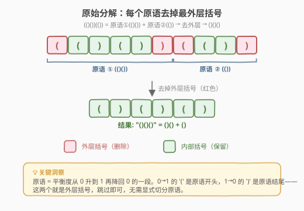
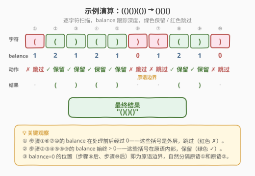

# LeetCode 删除最外层的括号 题解

## 1. 题目概述

- **标题 / 题号**：删除最外层的括号（#1021，easy）
- **链接**：https://leetcode.cn/problems/remove-outermost-parentheses/
- **难度**：简单
- **标签**：栈、字符串

**题意**：有效括号字符串的定义：空字符串 `""`、`"(" + A + ")"`（A 是有效括号字符串），或 `A + B`（A、B 均为有效括号字符串）。

**原语（primitive）**有效括号字符串是一个**非空**的有效括号字符串，它**无法拆分**为 `A + B`（即不是两个非空有效括号字符串的拼接）。任意非空有效括号字符串 `s` 都可唯一分解为若干原语的拼接：$s = P_1 + P_2 + \dots + P_k$。

给定一个有效括号字符串 `s`，将其每个原语的最外层括号去除后返回。

**示例 1**：

```text
输入：s = "(()())(())"
输出："()()()"
解释：输入字符串可分解为 "(()())" + "(())"，去掉每个原语的外层括号后得到 "()()" + "()" = "()()"。
```

**示例 2**：

```text
输入：s = "(()())(())(()(()))"
输出："()()()()(())"
解释：分解为 "(()())" + "(())" + "(()(()))"，去外层得 "()()" + "()" + "()(())" = "()()()()(())"。
```

**示例 3**：

```text
输入：s = "()()"
输出：""
解释：分解为 "()" + "()"，去外层得 "" + "" = ""。
```

**约束**：

- $1 \leq \text{s.length} \leq 10^5$
- `s[i]` 为 `'('` 或 `')'`
- `s` 是一个有效括号字符串

## 2. 解题思路

### 2.1 暴力思路

先显式求出原语分解：遍历 `s`，用计数器 `balance` 跟踪深度，每当 `balance` 从非零降回 0 时就切出一个原语；然后对每个原语切片 `[1:-1]` 去掉首尾括号，拼接返回。

这需要两遍扫描（先切分再切片）和 $O(n)$ 额外空间存储所有原语，逻辑清晰但冗余——**切分与去外层其实可以一步到位**。

### 2.2 核心观察：计数法一步到位



关键洞察：**原语的外层括号恰好出现在 `balance` 经过 0 的时刻**。

- 外层 `'('`：`balance` 从 0 升到 1 的那一刻——这是原语的开头。
- 外层 `')'`：`balance` 从 1 降回 0 的那一刻——这是原语的结尾。

因此**无需显式切分原语**，只需在遍历时判断当前括号是否处于"外层位置"：

> 读到 `'('`：若 `balance > 0`（说明已在某个原语内部），则保留；否则跳过（外层）。然后 `balance++`。
>
> 读到 `')'`：先 `balance--`。若 `balance > 0`（说明还没回到原语边界），则保留；否则跳过（外层）。

> 💡 **为什么 `'('` 先判断再 `++`，而 `')'` 先 `--` 再判断？** 因为外层 `'('` 在 `balance=0` 时遇到（加之前判断），外层 `')'` 在 `balance` 减到 0 后识别（减之后判断）。两者都是在 `balance` 跨越 0 的"外侧"被识别为外层——`balance > 0` 表示"在原语内部"，此时遇到的括号都是内部括号，保留。

### 2.3 算法流程图


一句话规则：

- `'('`：若 `balance > 0` 则保留，然后 `balance += 1`
- `')'`：先 `balance -= 1`，若 `balance > 0` 则保留

`balance == 0` 标志原语边界——此刻遇到的括号就是外层，跳过。

### 2.4 示例演算

以 `s = "(()())(())"` 为例，逐字符扫描：



| 步骤 | 字符 | balance 变化 | balance（处理后） | 动作 | 结果 |
|------|------|-------------|-------------------|------|------|
| ① | `(` | 0 → 1 | 1 | 跳过（外层 `(`） | `""` |
| ② | `(` | 1 → 2 | 2 | 保留 | `"("` |
| ③ | `)` | 2 → 1 | 1 | 保留 | `"()"` |
| ④ | `(` | 1 → 2 | 2 | 保留 | `"()("` |
| ⑤ | `)` | 2 → 1 | 1 | 保留 | `"()"` |
| ⑥ | `)` | 1 → 0 | 0 | 跳过（外层 `)`） | `"()"` |
| ⑦ | `(` | 0 → 1 | 1 | 跳过（外层 `(`） | `"()"` |
| ⑧ | `(` | 1 → 2 | 2 | 保留 | `"()()("` |
| ⑨ | `)` | 2 → 1 | 1 | 保留 | `"()()"` |
| ⑩ | `)` | 1 → 0 | 0 | 跳过（外层 `)`） | `"()()"` |

> 💡 注意步骤⑥⑦⑩：`balance` 在处理后为 0，说明这些括号位于原语边界——步骤⑥是原语①的结尾 `)`，步骤⑦是原语②的开头 `(`，步骤⑩是原语②的结尾 `)`。它们都是外层括号，被跳过。`balance=0` 的位置天然分隔了原语①和原语②。

## 3. 参考代码

### C++

```cpp
class Solution {
public:
    string removeOuterParentheses(string s) {
        string result;
        int balance = 0;
        for (char c : s) {
            if (c == '(') {
                if (balance > 0) result += c;
                balance++;
            } else {
                balance--;
                if (balance > 0) result += c;
            }
        }
        return result;
    }
};
```

### Python

```python
class Solution:
    def removeOuterParentheses(self, s: str) -> str:
        result = []
        balance = 0
        for c in s:
            if c == '(':
                if balance > 0:
                    result.append(c)
                balance += 1
            else:
                balance -= 1
                if balance > 0:
                    result.append(c)
        return ''.join(result)
```

> 💡 **Python 用 `list.append` + `''.join` 而非字符串拼接**：字符串在 Python 中不可变，`result += c` 每次创建新字符串，$O(n^2)$。用列表暂存再 `join` 是 $O(n)$。这是 Python 字符串构建的通用最佳实践。

## 4. 复杂度分析

| 维度 | 复杂度 | 说明 |
|------|--------|------|
| 时间复杂度 | $O(n)$ | 单次遍历，每个字符 $O(1)$ 处理 |
| 空间复杂度 | $O(n)$ | 结果字符串占 $O(n)$（不计输出则为 $O(1)$，仅 `balance` 一个整数变量） |

> ⚠️ 严格来说，若不计输出空间，计数法的额外空间为 $O(1)$——这是它优于"先切分再切片"暴力法（$O(n)$ 额外空间存原语列表）的核心优势。C++ 中 `string result` 会预分配，Python 中 `list` 暂存也需 $O(n)$，但这些属于输出空间。

## 5. 扩展：栈解法与切分解法

### 5.1 栈解法

计数法中的 `balance` 本质上是**栈大小的抽象**——用 `balance` 跟踪深度等价于用栈跟踪未匹配的 `'('`，只是不需要存储实际字符。若用显式栈实现：

```python
class Solution:
    def removeOuterParentheses(self, s: str) -> str:
        result = []
        stack = []
        for c in s:
            if c == '(':
                if stack:          # 栈非空 → 内部括号 → 保留
                    result.append(c)
                stack.append(c)
            else:
                stack.pop()
                if stack:          # 弹出后栈仍非空 → 内部括号 → 保留
                    result.append(c)
        return ''.join(result)
```

> 💡 **栈与计数法的等价关系**：`len(stack)` == `balance`。栈非空 ⟺ `balance > 0`。遇到 `'('`：栈非空则保留（等价 `balance > 0`），然后入栈（等价 `balance++`）。遇到 `')'`：先出栈（等价 `balance--`），栈仍非空则保留（等价 `balance > 0`）。栈解法更直观地体现了"括号匹配"的 LIFO 语义，但空间多 $O(n)$；计数法是栈的空间优化版。

### 5.2 切分 + 切片解法（暴力法）

显式切分原语再切片，两遍扫描但逻辑最直白：

```python
class Solution:
    def removeOuterParentheses(self, s: str) -> str:
        result = []
        balance = 0
        start = 0
        for i, c in enumerate(s):
            balance += 1 if c == '(' else -1
            if balance == 0:                       # 原语边界
                result.append(s[start + 1 : i])    # 去掉首尾
                start = i + 1
        return ''.join(result)
```

> 💡 **三种解法的关系**：切分法先找原语再切片（两阶段）；栈法用栈跟踪匹配状态（直观但费空间）；计数法将栈压缩为一个整数（最优）。三者都是 $O(n)$ 时间，区别在空间常数和代码简洁度——**面试首选计数法**。

## 6. 面试要点

1. **为什么 `'('` 先判断再 `balance++`，而 `')'` 先 `balance--` 再判断？**

   - 外层 `'('` 在 `balance == 0` 时遇到，需要在**加之前**判断 `balance > 0` 来识别它是否为外层。
   - 外层 `')'` 在 `balance` 从 1 降到 0 后被识别，需要在**减之后**判断 `balance > 0`。
   - 两者都是在 `balance` 跨越 0 的"外侧"被识别——`balance > 0` 表示"在原语内部"，此刻的括号都是内部的。

2. **计数法和栈法有什么关系？**

   - 完全等价。`balance` 就是栈大小，`balance > 0` 就是栈非空。计数法是栈法的空间优化——不需要存储实际的 `'('` 字符，只需知道"当前嵌套深度"即可判断内外层。

3. **这题和 [20. 有效括号](../0001-0100/20_有效括号.md) 的区别？**

   - 20 题判断括号是否**合法**（类型匹配 + 嵌套正确），需要栈存储字符做类型比对。本题输入保证合法，只需识别**外层括号**，因此连栈都不需要——一个 `balance` 计数器足矣。20 题是"判定型"，1021 是"变换型"。

4. **`balance = 0` 的含义是什么？**

   - `balance = 0` 表示当前不在任何原语内部——恰好处于两个原语之间的边界。此时遇到的 `'('` 必是新原语的外层开头，`balance` 降回 0 时遇到的 `')'` 必是原语的外层结尾。

5. **如果输入不是合法括号字符串怎么办？**

   - 题目保证输入合法，无需处理。若不保证，需先用 20 题的栈方法校验合法性，再做外层去除。实际面试中若被追问，可提及这一前置校验。

## 同类练习题

| # | 题目 | 与本题的关联 |
|---|------|-------------|
| 20 | [有效的括号](https://leetcode.cn/problems/valid-parentheses/)（[题解](../0001-0100/20_有效括号.md)） | 括号匹配判定母题，栈匹配 LIFO 语义，与本题的 `balance` 计数同源 |
| 1249 | [移除无效的括号](https://leetcode.cn/problems/minimum-remove-to-make-valid-parentheses/) | 栈标记非法括号后删除，与本题"删除特定括号"思路相近但判定逻辑不同 |
| 921 | [使括号有效的最少添加](https://leetcode.cn/problems/minimum-add-to-make-parentheses-valid/) | 用 `balance` 跟踪不平衡度，与本题同用计数器但目标相反（添加而非删除） |
| 1614 | [括号的最大嵌套深度](https://leetcode.cn/problems/maximum-nesting-depth-of-the-parentheses/) | 同样用 `balance` 跟踪深度取最大值，与本题共用计数器框架 |
| 32 | [最长有效括号](https://leetcode.cn/problems/longest-valid-parentheses/)（[题解](../0001-0100/32_最长有效括号.md)） | 括号匹配进阶，栈/DP 求最长合法子串，与本题共享括号计数直觉 |
