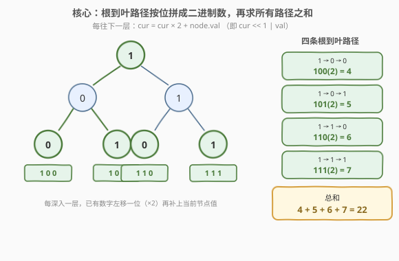
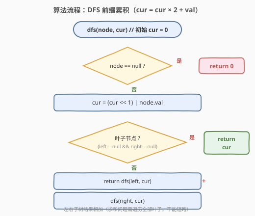
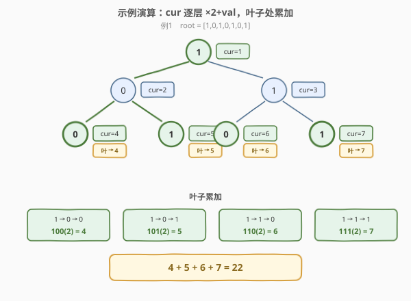

# LeetCode 从根到叶的二进制数之和 题解

## 1. 题目概述

- **标题 / 题号**：从根到叶的二进制数之和（#1022，easy）
- **链接**：https://leetcode.cn/problems/sum-of-root-to-leaf-binary-numbers/
- **难度**：简单
- **标签**：树、深度优先搜索、二叉树

**题意**：给定一棵二叉树的根节点 `root`，树上每个节点存放一位二进制数字 `0` 或 `1`。每条「从根节点到叶子节点」的路径表示一个**二进制数**：路径上从根到叶的各节点值按顺序拼接，**最高有效位在根**。求所有根到叶路径所表示的二进制数之和（返回十进制整数）。

> 💡 **叶子节点**：没有左右孩子的节点。拼接规则即「每往下一层，已有数字左移一位（×2）再补当前节点值」。例如路径 `1 → 0 → 1` 表示二进制数 $101_{(2)} = 5_{(10)}$。

**示例 1**：

```text
输入：root = [1,0,1,0,1,0,1]
输出：22
解释：四条根到叶路径：
  1 → 0 → 0 = 100(2) = 4
  1 → 0 → 1 = 101(2) = 5
  1 → 1 → 0 = 110(2) = 6
  1 → 1 → 1 = 111(2) = 7
  总和 = 4 + 5 + 6 + 7 = 22
          1
         / \
        0   1
       / \ / \
      0  1 0  1
```

**示例 2**：

```text
输入：root = [0]
输出：0
解释：只有根节点本身是叶子，路径 "0" 表示二进制数 0。
```

**示例 3**：

```text
输入：root = [1]
输出：1
解释：只有根节点本身是叶子，路径 "1" 表示二进制数 1。
```

**约束**：

- 树中节点数目在范围 `[1, 1000]` 内
- `Node.val` 为 `0` 或 `1`
- 树的深度不超过 `10`
- **保证**答案在 32 位有符号整数范围内（即答案 $\le 2^{31} - 1$）

> 💡 本题是 [129. 求根节点到叶节点数字之和](../0101-0200/129_求根节点到叶节点数字之和.md) 的「二进制版」变体：129 把路径上的十进制数字按位拼接（`cur × 10 + val`），本题把 `0/1` 按位拼成二进制数（`cur × 2 + val`）。二者共享同一套「DFS 一路下传」骨架，区别只在「下传的运算」从 ×10 换成了 ×2（即左移一位）。同时与 [1018. 可被 5 整除的二进制前缀](1018_可被5整除的二进制前缀.md) 共享「左移加位」的位构造思想——只不过 1018 是数组上的线性递推，本题是树上的 DFS 递推。

## 2. 解题思路

### 2.1 暴力思路：收集路径再转换

最直观的做法是 DFS 枚举每一条「根到叶」路径，把路径上的 `0/1` 收集成字符串或数组，再在叶子处把它转成十进制整数（按二进制权重求和），最后累加所有路径的值。

> ⚠️ **问题：额外空间 + 重复扫描**。每条路径都要存一份 `O(h)` 长度的列表/字符串，且叶子处转换时还要再扫一遍路径，写起来啰嗦。其实可以在 DFS 过程中**边走边算**——每深入一层就把当前数字左移一位加上新位，到叶子时数字已经算好，直接累加。

### 2.2 核心观察：前缀累积 —— cur 一路「×2 + val」下去



关键观察是**二进制的位拼接本质**：从根走到当前节点时，路径上已经形成的二进制数 `cur`，每深入一层就执行一次 `cur = cur × 2 + node.val`——`×2` 即二进制左移一位，`+val` 即在最低位补上当前节点的 `0/1`。

- 进入根节点时，`cur` 从 `0` 开始，变为 $0 \times 2 + \text{root.val} = \text{root.val}$；
- 每往子节点走一层，已有数字左移一位（×2），再补上当前节点值；
- **走到叶子时**，`cur` 就是这条根到叶路径所表示的完整二进制数（的十进制值），直接把它累加进答案。

> 💡 这是一种「**前缀累积**」写法：`dfs(node, cur)` 表示「在以 `node` 为根的子树里，所有从根到叶路径所表示二进制数之和，其中 `cur` 是从根到 `node` 的父节点已经拼出的前缀」。子问题定义清晰，`cur` 作为参数随递归下传，无需额外数组、无需回溯。

> ⚠️ **为什么不需要回溯？** 因为 `cur` 是**按值传递**的函数参数（C++ 的 `int`、Python 的 `int` 都是不可变值）。每次递归调用 `dfs(child, cur × 2 + val)` 时，新调用拿到的是一份新的 `cur` 值，调用返回后当前层的 `cur` 不受影响——天然就是「向下传副本」，省去了手动「撤销选择」的步骤。这与需要维护可变 `path` 数组的 [113. 路径总和 II](../0101-0200/113_路径总和II.md) 不同。

> 💡 **与 [1018](1018_可被5整除的二进制前缀.md) 的对照**：1018 在数组上做 `r = (r × 2 + bit) % 5` 的线性递推，需要取模避免溢出（$n$ 可达 $10^5$）；本题在树上做 `cur = cur × 2 + val` 的 DFS 递推，**无需取模**——约束保证树深 $\le 10$，`cur` 最大 $2^{10} - 1 = 1023$，求和后也 $\le 2^{31} - 1$，`int` 完全够用。

### 2.3 算法流程图



**DFS 递归逻辑**：

| 情况 | 处理 |
|------|------|
| `node == null` | 返回 `0`（空子树不贡献任何数字） |
| 先更新前缀 | `cur = cur × 2 + node.val` |
| 叶子（左右都空） | 返回 `cur`（这条路径的完整二进制数） |
| 否则（内部节点） | 返回 `dfs(left, cur) + dfs(right, cur)` |

> ⚠️ **必须判叶子**：累加只能发生在**叶子节点**。若在内部节点就返回 `cur`，会把「未走到叶的半截路径」也计入答案——例如根 `1` 有孩子 `0`，若根处就返回 `1`，则多算了一个不合法的数字。判叶子即 `node.left == null && node.right == null`。

> 💡 **求和 vs 判定**：和 [112. 路径总和](../0101-0200/112_路径总和.md) 的 `||` 短路不同，本题是**求和问题**——必须遍历**所有**叶子并把它们的数字相加，**不能短路**。左子树的结果无论大小都要加上右子树的结果，因此递归式是 `dfs(left, cur) + dfs(right, cur)` 而非 `||`。这是「枚举/求和问题需全搜」的体现。

### 2.4 示例演算

以示例 1（`root = [1,0,1,0,1,0,1]`）为例，沿「前缀累积」追踪每条根到叶路径：



| 根到叶路径 | cur 演变（逐层 ×2+val） | 叶子处二进制 | 十进制值 | 累计和 |
|-----------|--------------------------|--------------|----------|--------|
| 1 → 0 → 0 | 0→**1**→**2**→**4** | $100_{(2)}$ | 4 | 4 |
| 1 → 0 → 1 | 0→1→2→**5** | $101_{(2)}$ | 5 | 9 |
| 1 → 1 → 0 | 0→1→**3**→**6** | $110_{(2)}$ | 6 | 15 |
| 1 → 1 → 1 | 0→1→3→**7** | $111_{(2)}$ | 7 | 22 |

四条路径全部走完后，总和 $4 + 5 + 6 + 7 = 22$。

> 💡 注意 `cur` 在每个节点处独立演变：进入左子树 `0` 时左路 `cur=2`、右路（`1` 分支）`cur=3`，二者互不干扰——这正是「按值传递、天然免回溯」的好处。若改用「全局变量 + 手动回溯」，则需在进入/退出节点时显式 `push/pop` 当前数字，容易出错。

> 💡 **二进制视角的小巧思**：示例 1 这棵满二叉树的四条路径恰好是 $100_{(2)}, 101_{(2)}, 110_{(2)}, 111_{(2)}$，即 $4, 5, 6, 7$——正好是连续四个整数，因为根固定为 `1` 后，剩余两位遍历了 `00/01/10/11` 全部组合。总和 $4+5+6+7 = 22$ 也可整体计算：$4 \times 4 + (0+1+2+3) = 16 + 6 = 22$（高位贡献 + 低位全组合贡献），这是满二叉树路径和的速算技巧。

## 3. 参考代码

### C++

```cpp
/**
 * Definition for a binary tree node.
 * struct TreeNode {
 *     int val;
 *     TreeNode *left;
 *     TreeNode *right;
 *     TreeNode() : val(0), left(nullptr), right(nullptr) {}
 *     TreeNode(int x) : val(x), left(nullptr), right(nullptr) {}
 *     TreeNode(int x, TreeNode *left, TreeNode *right) : val(x), left(left), right(right) {}
 * };
 */
class Solution {
  public:
    int sumRootToLeaf(TreeNode* root) {
        return dfs(root, 0);
    }
  private:
    int dfs(TreeNode* node, int cur) {
        if (node == nullptr) return 0;                       // 空节点：不贡献数字
        cur = (cur << 1) | node->val;                        // 前缀累积：左移一位再补当前位
        if (node->left == nullptr && node->right == nullptr) // 叶子：返回这条路径的完整二进制数
            return cur;
        return dfs(node->left, cur) + dfs(node->right, cur); // 内部节点：左右子树求和（不能短路）
    }
};
```

### Python

```python
class Solution:
    def sumRootToLeaf(self, root: Optional[TreeNode]) -> int:
        def dfs(node: Optional[TreeNode], cur: int) -> int:
            if node is None:                              # 空节点：不贡献数字
                return 0
            cur = (cur << 1) | node.val                   # 前缀累积：左移一位再补当前位
            if node.left is None and node.right is None:  # 叶子：返回这条路径的完整二进制数
                return cur
            return dfs(node.left, cur) + dfs(node.right, cur)  # 左右子树求和（不能短路）

        return dfs(root, 0)
```

> 💡 **位运算写法 `(cur << 1) | val`**：因为 `val` 只能是 `0` 或 `1`，`cur × 2 + val` 等价于 `cur << 1 | val`（左移一位后，最低位或上 `val`）。两者结果完全相同，位运算写法更贴合「二进制位拼接」的语义。若用 `cur * 2 + node.val` 也完全正确，可读性反而更好——面试时两种写法都说明即可。

> 💡 也可写成「返回值不累加在递归里、而在叶子处把 `cur` 加到一个外部 `self.ans`」的非纯写法，但需注意 `self.ans` 是可变状态、要在进入 `sumRootToLeaf` 时重置。上面这种「递归返回值即子树之和」的纯函数写法更易推理，面试推荐。

## 4. 复杂度分析

| 维度 | 复杂度 | 说明 |
|------|--------|------|
| **时间复杂度** | $O(n)$ | 每个节点恰好访问一次，每次做 $O(1)$ 的左移/或运算；求和问题需遍历全部叶子，无法短路 |
| **空间复杂度** | $O(h)$ | 递归调用栈深度 = 树高 $h$。平衡树 $h = O(\log n)$；链状树 $h = O(n)$。本题保证 $h \le 10$，栈开销极小 |

> 💡 本题 $n \le 1000$ 且树深 $\le 10$，递归完全安全，无需担心栈溢出。约束「树深 $\le 10$」也保证了拼出的二进制数最多 10 位（$< 2^{10} = 1024$），即使所有路径求和也远在 `int` 范围内（$\le 2^{31} - 1$），无需用 `long long` 防溢出。

## 5. 扩展：迭代写法（显式栈）

把递归栈显式化，栈里存 `(node, cur)`，`cur` 表示「从根到该节点已拼出的前缀数字」。遇到叶子就把 `cur` 累加进答案：

```python
class Solution:
    def sumRootToLeaf(self, root: Optional[TreeNode]) -> int:
        if not root:
            return 0
        ans = 0
        stack = [(root, root.val)]
        while stack:
            node, cur = stack.pop()
            if not node.left and not node.right:      # 叶子：累加
                ans += cur
                continue
            if node.left:
                stack.append((node.left,  (cur << 1) | node.left.val))
            if node.right:
                stack.append((node.right, (cur << 1) | node.right.val))
        return ans
```

> 💡 这是把递归的「调用栈」换成「手动栈」，逻辑完全对应。注意入栈时就把 `cur` 算好（`(cur << 1) | child.val`），与递归版在「进入子节点前」更新前缀一致。用 `pop()` 取末尾是 DFS；换成 `deque.popleft()` 即变 BFS，但 BFS 会在还没走到叶时就把中间节点都入队，空间更费，本题 DFS 更合适。

## 6. 面试要点

1. **为什么用「cur × 2 + val」而不是「字符串拼接再转换」？**

   - 两者等价，但「数字乘加/位运算」更高效：字符串拼接需 $O(\text{路径长})$ 拷贝，叶子处还要 `int(s, 2)` 再扫一遍，而 `cur << 1 | val` 是 $O(1)$ 整数运算。此外数字写法天然按值传递、免回溯，代码最简洁。字符串写法要把可变 `str`/`list` 当状态传，还得手动回溯，容易出错。面试推荐「位运算乘加」。

2. **为什么必须判叶子，而不能在 `node == null` 时累加 `cur`？**

   - 若改为「左空且右空时累加」，需要先更新 `cur` 再判——这是本题的正确做法。但**不能**在 `node == null` 这个 base case 里累加：因为一个叶子有左右两个 `null` 孩子，会在 `null` 处把同一条路径的数字**重复累加两次**。正确做法是在**叶子节点本身**（`node.left == null && node.right == null`）返回 `cur`，`node == null` 只返回 `0`。

3. **`cur << 1 | val` 和 `cur * 2 + val` 有区别吗？**

   - 结果完全相同。`val ∈ {0, 1}`，左移一位后最低位为 `0`，`| val` 等价于 `+ val`。位运算写法更贴合「二进制位拼接」语义，乘加写法更通用（可推广到任意进制如 129 题的 `×10 + val`）。面试时两种都提一句更显功底。

4. **`cur` 需要回溯吗？为什么？**

   - 不需要。`cur` 是按值传递的整数参数（C++ `int`、Python `int` 均不可变）。每次递归调用 `dfs(child, cur × 2 + val)` 时，子调用拿到的是计算后的新值，**当前层的 `cur` 不被子调用修改**。调用返回后当前层继续用原来的 `cur` 处理另一个孩子，天然隔离。这与 [113. 路径总和 II](../0101-0200/113_路径总和II.md) 中维护可变 `path` 列表必须手动 `pop` 回溯的情形形成对比。

5. **需要担心溢出吗？什么情况下要取模？**

   - 本题不需要。约束保证树深 $\le 10$，单条路径数字 $\le 2^{10} - 1 = 1023$，路径数 $\le 500$（满二叉树叶子数），总和远小于 $2^{31} - 1$，`int` 完全够用。但若面试官放宽约束（如树深可达 $10^5$），则需对 $10^9 + 7$ 取模：`cur = ((cur << 1) | val) % MOD`，叶子处 `return cur % MOD`，求和也模意义下相加。这与 [1018](1018_可被5整除的二进制前缀.md) 应对 $10^5$ 位数的思想一致——大输入下取模是必备手段。

> 💡 **一句话总结**：1022 是树 DFS「前缀累积」的二进制版——「`cur × 2 + val` 下传 + 叶子返回 `cur` + `+` 求和」三件套。它和 [129](../0101-0200/129_求根节点到叶节点数字之和.md)（十进制版，`×10 + val`）是同一骨架换进制，和 [1018](1018_可被5整除的二进制前缀.md)（数组线性版，`×2 + bit`）是同一运算换载体（树 DFS vs 数组遍历）。掌握这一族，所有「按位拼数」类题目都是变体。

## 同类练习题

| # | 题目 | 与本题的关联 |
|---|------|-------------|
| 129 | [求根节点到叶节点数字之和](https://leetcode.cn/problems/sum-root-to-leaf-numbers/)（[题解](../0101-0200/129_求根节点到叶节点数字之和.md)） | 本题的十进制版，`cur × 10 + val`，DFS 骨架完全相同，对照学习进制替换 |
| 1018 | [可被 5 整除的二进制前缀](https://leetcode.cn/problems/binary-prefix-divisible-by-5/)（[题解](1018_可被5整除的二进制前缀.md)） | 数组上的 `cur × 2 + bit` 线性递推，对比本题的树 DFS 版，同一位构造运算在不同载体上的应用 |
| 112 | [路径总和](https://leetcode.cn/problems/path-sum/)（[题解](../0101-0200/112_路径总和.md)） | 树 DFS「前缀累积」的判定版，把「拼数求和」换成「加值判等」，汇总用 `\|\|` 短路 |
| 257 | [二叉树的所有路径](https://leetcode.cn/problems/binary-tree-paths/) | 收集所有根到叶路径的字符串形式，练习字符串版回溯，是 112→113→129/1022 的中间过渡 |
| 404 | [左叶子之和](https://leetcode.cn/problems/sum-of-left-leaves/) | 树 DFS 求和的另一变体，按「左孩子且为叶子」筛选累加，对比本题「任意叶子都累加」的判定条件 |
