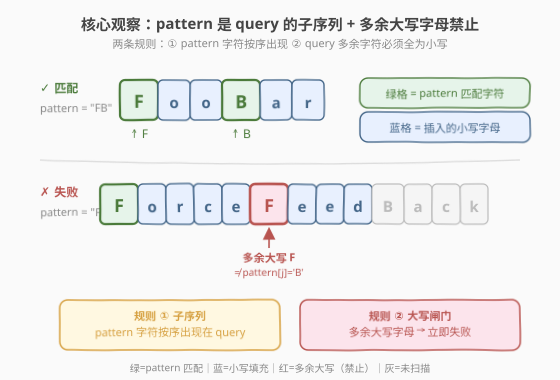
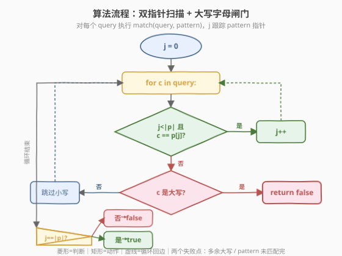
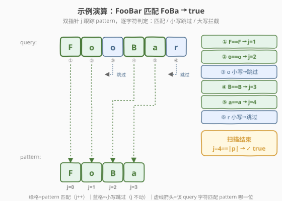

# 驼峰式匹配

- **题目名称**：驼峰式匹配
- **链接**：[1023. 驼峰式匹配](https://leetcode.cn/problems/camelcase-matching/)
- **难度**：中等
- **标签**：双指针、字符串、贪心

## 1. 题目概述

给定一个字符串数组 `queries` 和一个模式串 `pattern`，返回一个布尔数组 `answer`。`answer[i]` 为 `true` 当且仅当可以通过在 `pattern` 的**任意位置插入小写字母**（也可不插入）得到 `queries[i]`。

> 💡 **一句话题意**：`pattern` 的所有字符必须按序出现在 `queries[i]` 中（即 `pattern` 是 `queries[i]` 的**子序列**），且 `queries[i]` 中**多余的大写字母一律禁止**——只允许插入小写字母。

**示例 1**：

```text
输入：queries = ["FooBar","FooBarTest","FootBall","FrameBuffer","ForceFeedBack"], pattern = "FB"
输出：[true,false,true,true,false]
解释：
"FooBar"      = "F" + "oo" + "B" + "ar"            ✓
"FootBall"    = "F" + "oot" + "B" + "all"          ✓
"FrameBuffer" = "F" + "rame" + "B" + "uffer"       ✓
"FooBarTest"  → pattern 走完后 query 还剩大写 'T'   ✗
"ForceFeedBack" → 'F' 后出现多余大写 'F'            ✗
```

**示例 2**：

```text
输入：queries = ["FooBar","FooBarTest","FootBall","FrameBuffer","ForceFeedBack"], pattern = "FoBa"
输出：[true,false,true,false,false]
```

**示例 3**：

```text
输入：queries = ["FooBar","FooBarTest","FootBall","FrameBuffer","ForceFeedBack"], pattern = "FoBaT"
输出：[false,true,false,false,false]
解释：只有 "FooBarTest" = "Fo"+"o"+"Ba"+"r"+"T"+"est" 匹配。
```

**约束条件**：

- $1 \leq \text{queries.length} \leq 100$
- $1 \leq \text{queries[i].length} \leq 100$
- $1 \leq \text{pattern.length} \leq 100$
- `queries[i]` 和 `pattern` 仅由英文字母（大小写）组成

> ⚠️ **关键约束**：允许插入的**只有小写字母**。这意味着 `queries[i]` 中的每个大写字母**必须**被 `pattern` 中的对应大写字母「吃掉」，否则失败。这是本题与普通子序列判定（[392. 判断子序列](../0301-0400/392_判断子序列.md)）的核心差异。

---

## 2. 解题思路

### 2.1 暴力思路：枚举插入位置

对每个 `query`，尝试在 `pattern` 的每个间隙（共 `|pattern|+1` 个间隙）插入若干小写字母，看能否拼出 `query`。这本质是一个搜索问题，插入方案数随长度爆炸，不可行。

> 💡 转机在于：题目等价于「`pattern` 是 `query` 的子序列，且 `query` 的多余字符全为小写」。这是一个**带约束的子序列匹配**，用双指针一次扫描即可判定。

### 2.2 核心观察：双指针 + 大写字母闸门



把问题拆成两条规则：

1. **子序列规则**：`pattern` 的字符必须按序出现在 `query` 中——与 [392. 判断子序列](../0301-0400/392_判断子序列.md) 完全相同的贪心双指针。
2. **大写闸门**：`query` 中**未被 pattern 匹配的多余字符**，若是大写字母则直接失败（因为只允许插入小写）。

用双指针 `i`（扫 `query`）、`j`（扫 `pattern`）同步推进：

- 若 `query[i] == pattern[j]`：匹配成功，`i++`、`j++`（pattern 前进一位）。
- 若不等：
  - `query[i]` 为**小写**：视为插入的小写字母，`i++`（跳过，pattern 不动）。
  - `query[i]` 为**大写**：❌ 无法插入大写字母，直接返回 `false`。

扫描结束后，若 `j == |pattern|`（pattern 全部匹配完）则 `true`，否则 `false`。

> ⚠️ **为什么「大写不匹配即失败」？** 题目只允许插入小写字母。`query` 中的大写字母只能来自 `pattern` 本身——若它不等于当前 `pattern[j]`，说明这个大写字母在 `pattern` 中找不到对应，无法通过插入小写来解释，故失败。小写字母则可随时当作「插入的填充」跳过。

> 💡 **与 392 的对照**：392 的子序列判定中，`t` 的多余字符**无约束**（全小写，随便跳过）。本题给「跳过」加了一道闸门——只许跳小写、不许跳大写。核心骨架仍是贪心双指针，多了一个 `isupper` 判断分支。

### 2.3 算法流程图



对每个 `query` 执行 `match(query, pattern)`：

1. 初始化 `j = 0`（只跟踪 pattern 指针，query 用 for-each 遍历）。
2. 对 `query` 的每个字符 `c`：
   - **判断 A**：`j < |pattern|` 且 `c == pattern[j]`？
     - 是 → `j++`（吃掉一个 pattern 字符）。
     - 否 → **判断 B**：`c` 是大写字母？
       - 是 → 返回 `false`（大写闸门拦截）。
       - 否 → 跳过（小写填充，`j` 不动）。
3. 循环结束 → 返回 `j == |pattern|`（pattern 是否全部被吃掉）。

> 💡 **两个失败条件**：(1) 扫描中途遇到不匹配的大写字母；(2) 扫描完但 `pattern` 没吃完（`query` 太短或 `pattern` 有字符没出现）。两者分别由判断 B 和最终 `j == |pattern|` 守护。

### 2.4 示例演算

以 `pattern = "FoBa"` 匹配 `query = "FooBar"` 为例：



| 步骤 | `c` | `pattern[j]` | 大小写 | 动作 | `j` |
|------|-----|-------------|--------|------|-----|
| 1 | `F` | `F` | 大写 | 匹配 → `j++` | 1 |
| 2 | `o` | `o` | 小写 | 匹配 → `j++` | 2 |
| 3 | `o` | `B` | 小写 | 不等，小写 → 跳过 | 2 |
| 4 | `B` | `B` | 大写 | 匹配 → `j++` | 3 |
| 5 | `a` | `a` | 小写 | 匹配 → `j++` | 4 |
| 6 | `r` | — | 小写 | `j == |pattern|`，不等，小写 → 跳过 | 4 |

扫描结束，`j = 4 == |pattern|`，返回 `true` ✓。

对照失败例 `query = "ForceFeedBack"`、`pattern = "FB"`：

| 步骤 | `c` | `pattern[j]` | 大小写 | 动作 |
|------|-----|-------------|--------|------|
| 1 | `F` | `F` | 大写 | 匹配 → `j=1` |
| 2 | `o` | `B` | 小写 | 不等，小写 → 跳过 |
| 3 | `r` | `B` | 小写 | 不等，小写 → 跳过 |
| 4 | `c` | `B` | 小写 | 不等，小写 → 跳过 |
| 5 | `e` | `B` | 小写 | 不等,小写 → 跳过 |
| 6 | `F` | `B` | **大写** | 不等，**大写 → 返回 false** ✗ |

第 6 步遇到多余大写 `F`（不等于 `pattern[1]='B'`），闸门拦截，返回 `false`。

> 💡 **大写字母的「分流」作用**：大写字母在驼峰命名中标记「词段边界」。本题本质上要求 `query` 与 `pattern` 的**大写字母序列完全一致**，小写字母可以自由填充。大写字母既是必须匹配的硬约束，也是天然的失败检测点。

---

## 3. 参考代码

### C++

```cpp
class Solution {
  public:
    vector<bool> camelMatch(vector<string>& queries, string pattern) {
        vector<bool> ans;
        ans.reserve(queries.size());
        for (const string& q : queries)
            ans.push_back(match(q, pattern));
        return ans;
    }

  private:
    bool match(const string& q, const string& p) {
        int j = 0;
        for (char c : q) {
            if (j < p.size() && c == p[j])
                ++j;                 // 匹配 pattern 字符
            else if (isupper(c))
                return false;        // 多余大写字母，禁止
            // 否则 c 是小写，视为插入的填充，跳过
        }
        return j == p.size();        // pattern 是否全部匹配完
    }
};
```

> ⚠️ **`j < p.size()` 的前置检查**：当 `j` 已等于 `p.size()`（pattern 用尽）时，不能再访问 `p[j]`。此时若 `c` 为小写则跳过，为大写则由 `else if (isupper(c))` 拦截返回 `false`。C++ 中 `p.size()` 返回 `size_t`（无符号），`j` 为 `int`，比较时 `j` 会隐式转换为无符号——`j` 非负故无问题，但养成 `j < (int)p.size()` 的习惯可避免潜在坑。

### Python

```python
class Solution:
    def camelMatch(self, queries: List[str], pattern: str) -> List[bool]:
        def match(q: str) -> bool:
            j = 0
            for c in q:
                if j < len(pattern) and c == pattern[j]:
                    j += 1            # 匹配 pattern 字符
                elif c.isupper():
                    return False      # 多余大写字母，禁止
                # 否则 c 是小写，视为插入的填充，跳过
            return j == len(pattern)  # pattern 是否全部匹配完

        return [match(q) for q in queries]
```

> 💡 **Python 的 `isupper()`**：对单个字符调用 `c.isupper()`，大写字母返回 `True`，小写返回 `False`。注意空字符串 `''.isupper()` 返回 `False`，但本题 `c` 一定是单个非空字符，无此边界问题。

---

## 4. 复杂度分析

| 维度 | 复杂度 | 说明 |
|------|--------|------|
| 时间复杂度 | $O\left(\sum_{i} |\text{queries[i]}|\right)$ | 每个 query 单次线性扫描，指针 `i`、`j` 各至多走 $|\text{query}|$ 步；所有 query 求和即为总字符数 |
| 空间复杂度 | $O(Q)$ | 输出数组长度为 $Q = \text{queries.length}$；匹配过程仅用常数额外空间 $O(1)$ |

> 💡 **效率来源**：双指针贪心使每个 query 只扫一遍，无回溯、无搜索。`isupper` 判断是 $O(1)$ 的字符比较。总时间即为「读入所有 query 字符」的代价，已达理论下界。

---

## 5. 扩展：批量查询的预处理思路

本题 `queries` 数量 $\leq 100$、每个长度 $\leq 100$，逐个双指针扫描绰绰有余。但若 `queries` 数量极大（如 $10^5$），逐个扫描的 $O(Q \cdot L)$ 可能不够。

借鉴 [392. 判断子序列](../0301-0400/392_判断子序列.md) 的进阶思路——当**被匹配串固定、查询串多变**时，可预处理被匹配串的字符位置索引（`pos[char] = [位置列表]`），每次查询用二分找下一个可行位置。但本题是**查询串多变、pattern 也可变**，且核心约束在查询串自身的大写字母分布上，预处理收益有限。

更实用的批量优化是：**按 query 的大写字母序列做哈希分组**——大写序列相同的 query 共享同一次 pattern 匹配结果。但本题数据规模下无需此优化。

> 💡 **与 392 进阶的本质区别**：392 的进阶是「固定 t、批量查 s」，预处理 t 收益高；本题的「被匹配方」pattern 也在变，预处理对象不固定，故双指针逐个扫描是最自然的选择。

---

## 6. 面试要点

1. **本题和普通子序列判定（392）有什么区别？**

   - 392 只要求 `s` 是 `t` 的子序列，`t` 的多余字符无约束。本题要求 `pattern` 是 `query` 的子序列，**且 `query` 的多余字符必须全为小写**——大写字母只能来自 `pattern`，不匹配即失败。核心骨架同为贪心双指针，本题多一个 `isupper` 闸门分支。

2. **为什么大写字母不匹配就直接返回 false？**

   - 题目只允许插入小写字母。`query` 中的大写字母无法通过「插入」产生，只能由 `pattern` 的对应大写字母匹配。若 `query[i]` 是大写且不等于当前 `pattern[j]`，说明这个大写字母在 `pattern` 中无对应，匹配失败。

3. **扫描结束后为什么还要检查 `j == |pattern|`？**

   - 双指针扫描只保证 `query` 中没有「多余大写字母」，但不保证 `pattern` 的所有字符都被匹配到。例如 `query = "Fo"`、`pattern = "FoBa"`，扫描中无大写冲突，但 `pattern` 的 `Ba` 未被吃掉，`j = 2 < 4`，返回 `false`。

4. **`j < p.size()` 这个前置条件能否省略？**

   - 不能。当 `pattern` 已全部匹配完（`j == |pattern|`）后，`query` 可能还有剩余小写字符（合法的填充）。若省略前置检查直接访问 `p[j]`，会越界访问。前置条件确保只在 `pattern` 还有待匹配字符时才比较。

5. **小写字母的「跳过」为什么是贪心安全的？**

   - 小写字母既可匹配 `pattern` 当前的小写字符，也可作为填充跳过。但「能匹配就匹配」是贪心策略——尽早推进 `pattern` 指针，留给后续 `pattern` 字符的匹配空间更大。这与 392 的「选最早位置」贪心论证一致：若延迟匹配当前 `pattern` 字符，后续匹配空间只会更小。

---

## 7. 同类练习题

- [392. 判断子序列](https://leetcode.cn/problems/is-subsequence/)（[题解](../0301-0400/392_判断子序列.md)）：普通子序列判定的母题，无大写约束的「裸」双指针，理解本题的骨架基础
- [28. 找出字符串中第一个匹配项的下标](https://leetcode.cn/problems/find-the-index-of-the-first-occurrence-in-a-string/)：字符串匹配的另一范式（连续子串匹配 vs 本题子序列匹配），对照「连续」与「保序可跳」的差异
- [792. 匹配子序列的单词数](https://leetcode.cn/problems/number-of-matching-subsequences/)：批量子序列判定，392 的进阶批量版，可与本题的「批量 query」扩展思路对照
- [8. 字符串转换整数 (atoi)](https://leetcode.cn/problems/string-to-integer-atoi/)（[题解](../0001-0100/8_字符串转换整数atoi.md)）：字符串单遍扫描 + 分支判定，与本题「逐字符分流处理」的扫描风格相通
