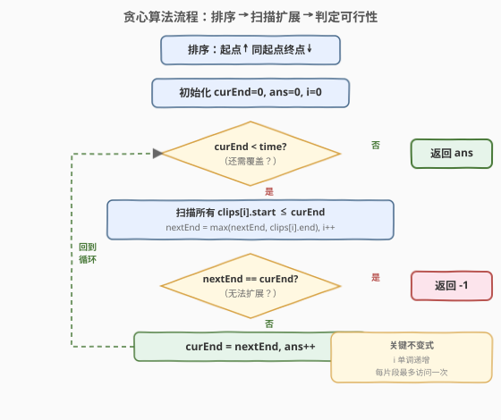

# 视频拼接

- **题目名称**：视频拼接
- **链接**：[1024. 视频拼接](https://leetcode.cn/problems/video-stitching/)
- **难度**：中等
- **标签**：贪心、数组、动态规划

## 1. 题目概述

你将获得一系列视频片段，这些片段来自一项持续时长为 `time` 秒的体育赛事。片段可能重叠，也可能长度不一。

用数组 `clips` 描述所有片段，其中 `clips[i] = [start_i, end_i]` 表示某片段从 `start_i` 开始到 `end_i` 结束。可以对片段自由再剪辑（例如 `[0, 7]` 可以剪成 `[0, 1] + [1, 3] + [3, 7]`）。

需要将片段拼接成覆盖整个比赛过程 `[0, time]` 的完整视频。返回所需片段的**最小数目**，如果无法完成则返回 `-1`。

**示例 1**：

```text
输入：clips = [[0,2],[4,6],[8,10],[1,9],[1,5],[5,9]], time = 10
输出：3
解释：选中 [0,2], [8,10], [1,9] 三个片段。
     将 [1,9] 再剪辑为 [1,2] + [2,8] + [8,9]，
     手上的片段为 [0,2] + [2,8] + [8,10]，覆盖了整场比赛 [0, 10]。
```

**示例 2**：

```text
输入：clips = [[0,1],[1,2]], time = 5
输出：-1
解释：无法只用 [0,1] 和 [1,2] 覆盖 [0,5] 的整个过程。
```

**示例 3**：

```text
输入：clips = [[0,1],[6,8],[0,2],[5,6],[0,4],[0,3],[6,7],[1,3],[4,7],[1,4],[2,5],[2,6],[3,4],[4,5],[5,7],[6,9]], time = 9
输出：3
解释：选取片段 [0,4], [4,7] 和 [6,9]。
```

**约束条件**：

- `1 <= clips.length <= 100`
- `0 <= start_i <= end_i <= 100`
- `1 <= time <= 100`

---

## 2. 解题思路

### 2.1 暴力思路

枚举所有片段的子集（共 $2^n$ 个），对每个子集检查其并集是否覆盖 $[0, \text{time}]$，在所有可行子集中取最小大小。验证单个子集是 $O(n \cdot \text{time})$，整体 $O(2^n \cdot n \cdot \text{time})$，$n = 100$ 时完全不可行。

### 2.2 核心观察：贪心区间覆盖


本题本质是经典的**区间覆盖问题**：用最少数量的区间覆盖 $[0, \text{time}]$。关键观察是：

- **片段可再剪辑**意味着我们只关心每个片段的起点和终点，片段内部的连续性不影响拼接——选了 $[1,9]$ 就等价于拥有 $[1,2], [2,8], [8,9]$ 等任意子片段。
- **贪心策略**：在已覆盖区域 $[0, \text{curEnd}]$ 的基础上，从所有起点 $\leq \text{curEnd}$（能与已覆盖区域衔接）的片段中，**选终点最远的那个**，把覆盖范围尽量向右扩展。

具体做法：

1. **排序**：按起点升序排序；起点相同的，终点降序（优先考虑更长的片段）。
2. **扫描**：维护 `curEnd`（当前已覆盖的右端点，初始 0）和 `nextEnd`（本轮扫描中能到达的最远终点）。
3. **贪心选择**：扫描所有起点 $\leq \text{curEnd}$ 的片段，取它们终点的最大值作为 `nextEnd`。这批片段中只需选**终点最远的那一个**（因为片段可再剪辑，选一个最长的就能覆盖到 `nextEnd`）。
4. **跳跃**：`curEnd = nextEnd`，计数 `+1`，重复直到 `curEnd >= time`。
5. **不可行判定**：若某轮 `nextEnd == curEnd`（没有任何片段能继续向右扩展），返回 `-1`。

> 💡 **识别信号**：题目求「用最少数量的区间覆盖完整范围」，且区间可自由裁剪 → 想「贪心区间覆盖」。与 [45. 跳跃游戏 II](../0001-0100/45_跳跃游戏II.md) 的贪心完全同构——那里是"从当前位置能跳到的最远位置"，这里是"从已覆盖区域能扩展到的最远终点"。

> ⚠️ **排序时起点相同必须按终点降序**：若起点相同按终点升序，贪心扫描可能先处理短片段并错误地提前跳跃。按终点降序保证同起点的长片段先被考虑，`nextEnd` 取到最大值。

### 2.3 算法流程图



注意内层 `while` 扫描的是"所有起点 $\leq \text{curEnd}$"的片段，它们都能与已覆盖区域衔接。扫描完这批后，`nextEnd` 即为最优跳跃目标。若 `nextEnd` 没有超过 `curEnd`，说明存在覆盖缺口，返回 `-1`。

### 2.4 示例演算

![示例演算：clips = [[0,2],[4,6],[8,10],[1,9],[1,5],[5,9]], time = 10](../images/video_stitching_example_walkthrough.svg)

以 `clips = [[0,2],[4,6],[8,10],[1,9],[1,5],[5,9]]`、`time = 10` 为例。

排序后：`[0,2], [1,9], [1,5], [4,6], [5,9], [8,10]`（起点升序，同起点终点降序）。

| 轮次 | curEnd | 扫描的片段（起点 ≤ curEnd） | nextEnd | 选择 | ans |
|------|--------|---------------------------|---------|------|-----|
| 1 | 0 | [0,2] | 2 | [0,2] | 1 |
| 2 | 2 | [1,9], [1,5] | 9 | [1,9] | 2 |
| 3 | 9 | [4,6], [5,9], [8,10] | 10 | [8,10] | 3 |

第 3 轮后 `curEnd = 10 >= time`，返回 `ans = 3`。

- **第 1 轮**：`curEnd = 0`，只有 `[0,2]` 起点为 0 ≤ 0，`nextEnd = 2`。选 `[0,2]`，覆盖 $[0,2]$。
- **第 2 轮**：`curEnd = 2`，`[1,9]` 和 `[1,5]` 起点均 ≤ 2，`nextEnd = max(9, 5) = 9`。选 `[1,9]`（再剪辑为 $[2,9]$），覆盖扩展到 $[0,9]$。
- **第 3 轮**：`curEnd = 9`，`[4,6]`、`[5,9]`、`[8,10]` 起点均 ≤ 9，`nextEnd = max(6, 9, 10) = 10`。选 `[8,10]`（再剪辑为 $[9,10]$），覆盖扩展到 $[0,10]$。`curEnd >= time`，结束。

---

## 3. 参考代码

### C++

```cpp
class Solution {
  public:
    int videoStitching(vector<vector<int>>& clips, int time) {
        sort(clips.begin(), clips.end(), [](const auto& a, const auto& b) {
            return a[0] != b[0] ? a[0] < b[0] : a[1] > b[1];
        });
        int ans = 0, curEnd = 0, i = 0, n = clips.size();
        while (curEnd < time) {
            int nextEnd = curEnd;
            while (i < n && clips[i][0] <= curEnd) {
                nextEnd = max(nextEnd, clips[i][1]);
                ++i;
            }
            if (nextEnd == curEnd) return -1;
            curEnd = nextEnd;
            ++ans;
        }
        return ans;
    }
};
```

### Python

```python
class Solution:
    def videoStitching(self, clips: List[List[int]], time: int) -> int:
        clips.sort(key=lambda c: (c[0], -c[1]))
        ans, cur_end, i, n = 0, 0, 0, len(clips)
        while cur_end < time:
            next_end = cur_end
            while i < n and clips[i][0] <= cur_end:
                next_end = max(next_end, clips[i][1])
                i += 1
            if next_end == cur_end:
                return -1
            cur_end = next_end
            ans += 1
        return ans
```

> ⚠️ **三个易错点**：
> 1. **排序的次要关键字**：起点相同时必须按终点**降序**排（`-c[1]`），否则同起点的短片段可能先被处理导致 `i` 提前越过，虽然不影响 `nextEnd` 取 max 的正确性，但会多一轮无意义的扫描。更重要的是，降序保证逻辑清晰：长片段优先。
> 2. **`nextEnd` 初始化为 `curEnd` 而非 `0`**：这样当没有片段能继续扩展时，`nextEnd == curEnd` 自然触发 `-1` 返回。若初始化为 0，则无法区分"无法扩展"和"扩展到 0"。
> 3. **外层 `while` 条件是 `curEnd < time`**：一旦 `curEnd >= time` 就停止，避免多算一次。注意 `curEnd` 更新后立即检查，不是等下一轮。

---

## 4. 复杂度分析

| 维度 | 复杂度 | 说明 |
|------|--------|------|
| 时间复杂度 | $O(n \log n)$ | 排序 $O(n \log n)$；贪心扫描中 `i` 单调递增，每个片段最多被访问一次，扫描总计 $O(n)$ |
| 空间复杂度 | $O(1)$ | 仅用常数额外变量（排序为原地） |

> 💡 由于 $n \leq 100$、$\text{time} \leq 100$，即使 $O(n \cdot \text{time})$ 的 DP 也能轻松通过。但贪心解法更优且更能体算法直觉。

---

## 5. 扩展：动态规划解法

由于约束很小（$n, \text{time} \leq 100$），也可以用 DP 求解。

**状态定义**：`dp[i]` = 覆盖 $[0, i]$ 所需的最少片段数。

**转移方程**：对于每个片段 $[a, b]$，若已覆盖 $[0, a-1]$（`dp[a-1]` 可达），则该片段可将覆盖扩展到 $[0, b]$：

$$\text{dp}[b] = \min(\text{dp}[b],\ \text{dp}[a-1] + 1), \quad \text{对每个片段 } [a, b],\ a > 0$$

$$\text{dp}[j] = 1, \quad \text{对每个片段 } [0, b],\ 0 \leq j \leq b$$

> 💡 **为什么是 `dp[a-1]` 而非 `dp[a]`？** 片段 $[a, b]$ 覆盖 $[a, b]$，要与前续覆盖 $[0, a-1]$ 无缝衔接（$a-1$ 与 $a$ 相邻），需 `dp[a-1]` 可达。若用 `dp[a]`，则当 $a = i$ 时转移变为 `dp[i] = dp[i] + 1`，形成循环依赖。

**正确性**：`dp` 具有单调性——`dp[i] <= dp[j]`（$i < j$），因为覆盖 $[0, j]$ 的方案也能覆盖 $[0, i]$。因此扩展时取最左可达点 `dp[a-1]` 即最优。按起点升序排序后，处理片段 $[a, b]$ 时 `dp[a-1]` 已由所有起点 $< a$ 的片段最终确定。

```cpp
class Solution {
  public:
    int videoStitching(vector<vector<int>>& clips, int time) {
        sort(clips.begin(), clips.end());
        const int INF = 1e9;
        vector<int> dp(time + 1, INF);
        for (auto& c : clips) {
            int a = c[0], b = min(c[1], time);
            if (a > time) break;
            if (a == 0) {
                for (int j = 0; j <= b; ++j) dp[j] = min(dp[j], 1);
            } else if (dp[a - 1] < INF) {
                for (int j = a; j <= b; ++j) dp[j] = min(dp[j], dp[a - 1] + 1);
            }
        }
        return dp[time] < INF ? dp[time] : -1;
    }
};
```

| 维度 | 复杂度 | 说明 |
|------|--------|------|
| 时间复杂度 | $O(n \cdot \text{time})$ | 排序 $O(n \log n)$；每个片段更新最多 $\text{time}+1$ 个 dp 值 |
| 空间复杂度 | $O(\text{time})$ | dp 数组 |

> 💡 **贪心 vs DP**：贪心利用了"片段可再剪辑"的特性（选最长即可），$O(n \log n)$ 更优；DP 更通用，即使片段不可裁剪也能求解（改为区间 DP）。面试中优先讲贪心，DP 作为备选展示深度。

---

## 6. 面试要点

1. **贪心策略是什么？为什么选终点最远的片段？**

   - 在已覆盖 $[0, \text{curEnd}]$ 的基础上，从所有起点 $\leq \text{curEnd}$ 的片段中选终点最远的。因为片段可再剪辑，选一个最长的就能覆盖到最远终点，且终点越远后续衔接的选择越多。**选更短的片段不会让后续更优**（交换论证：把短片段换成长片段，覆盖范围只增不减，后续选择是长片段的超集）。

2. **如何判断无法覆盖？**

   - 某轮扫描后 `nextEnd == curEnd`，即没有任何起点 $\leq \text{curEnd}$ 的片段能将覆盖向右扩展，说明存在覆盖缺口。典型场景：片段间有空洞（如示例 2 中 $[0,1]$ 和 $[1,2]$ 无法覆盖 $[0,5]$），或没有起点为 0 的片段（第一步就无法迈出）。

3. **为什么按起点排序，起点相同按终点降序？**

   - 按起点排序保证扫描时 `i` 单调递增，每个片段只访问一次。起点相同按终点降序，保证同起点的长片段先被考虑，`nextEnd` 尽早取到最大值，逻辑更清晰。即使起点相同按终点升序，由于 `nextEnd` 取 max，最终结果不变，但降序更符合直觉。

4. **贪心和 [45. 跳跃游戏 II](https://leetcode.cn/problems/jump-game-ii/) 的关系？**

   - 完全同构。跳跃游戏 II 中 `nums[i]` 表示从位置 $i$ 能跳到的最远位置，等价于片段 $[i, i + \text{nums}[i]]$；本题的片段是显式给出的 $[a, b]$。两题的贪心骨架一致：维护当前边界 `end` 和下一跳最远 `maxPos`/`nextEnd`，到边界时计数 `+1` 并跳跃。

5. **DP 解法中为什么用 `dp[a-1]` 而不是 `dp[a]`？**

   - 片段 $[a, b]$ 覆盖 $[a, b]$，需与前续覆盖 $[0, a-1]$ 衔接。若用 `dp[a]`，当 $a = i$ 时 `dp[i] = dp[i] + 1` 是循环依赖。用 `dp[a-1]` 避免了自引用，且 `dp` 的单调性保证 `dp[a-1]` 是 $[0, a-1]$ 区间的最优值。

---

## 7. 同类练习题

- [45. 跳跃游戏 II](https://leetcode.cn/problems/jump-game-ii/)：完全同构的贪心，维护当前边界与下一跳最远边界，求最小跳跃次数
- [55. 跳跃游戏](https://leetcode.cn/problems/jump-game/)：贪心可达性判定，本题的"能否覆盖"版本
- [1326. 灌溉花园](https://leetcode.cn/problems/minimum-number-of-taps-to-open-to-water-a-garden/)：完全相同的区间覆盖问题，把水龙头喷射范围转化为 $[a, b]$ 片段即可
- [435. 无重叠区间](https://leetcode.cn/problems/non-overlapping-intervals/)：区间调度的对偶问题——删最少区间使剩余无重叠，按右端点贪心；本题是选最少区间使覆盖完整，按起点贪心
