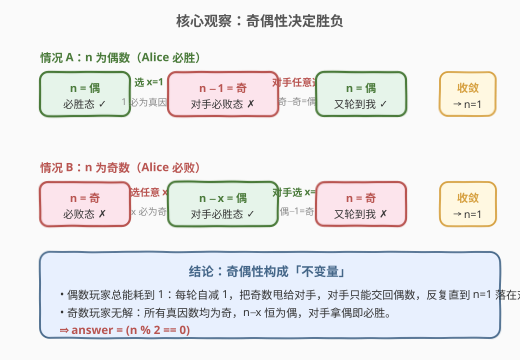
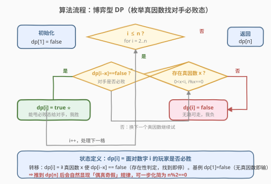

# 除数博弈

- **题目名称**：除数博弈
- **链接**：[1025. 除数博弈](https://leetcode.cn/problems/divisor-game/)
- **难度**：简单
- **标签**：博弈、动态规划、数学

## 1. 题目概述

爱丽丝和鲍勃一起玩游戏，**爱丽丝先手**。起初黑板上有一个数字 `n`。在每个玩家的回合，玩家需要执行以下操作：

- 选出任一整数 `x`，满足 $0 < x < n$ 且 $n \bmod x == 0$（即 $x$ 是 $n$ 的**真因数**）；
- 用 $n - x$ 替换黑板上的数字 $n$。

若玩家无法执行操作（即 $n == 1$，没有真因数），则该玩家**输掉游戏**。在双方都采用**最优策略**的前提下，返回爱丽丝是否获胜。

**示例 1**：

```text
输入：n = 2
输出：true
解释：爱丽丝选 x = 1，n 变为 1，鲍勃无法操作，爱丽丝获胜。
```

**示例 2**：

```text
输入：n = 3
输出：false
解释：爱丽丝只能选 x = 1，n 变为 2；鲍勃选 x = 1，n 变为 1；爱丽丝无法操作，爱丽丝输。
```

**约束条件**：

- $1 \leq n \leq 1000$

> 💡 本题是「公平组合博弈」的入门题。关键不在于模拟对局，而在于识别**必胜态/必败态**的递推结构，进而发现一个极简的奇偶不变量。博弈型 DP 与数学归纳在此完美合流。

---

## 2. 解题思路

### 2.1 暴力思路：DFS 枚举所有合法操作

最直接的写法是递归：对当前数字 $n$，枚举每个真因数 $x$，递归到 $n - x$。若存在某个 $x$ 使**对手在 $n - x$ 必败**，则我在 $n$ 必胜；否则必败。

```python
@lru_cache(None)
def win(n):
    if n == 1:
        return False
    for x in range(1, n):
        if n % x == 0 and not win(n - x):
            return True
    return False
```

能 AC，但未加记忆化时复杂度呈指数爆炸（每步可选因数个数不确定，递归树极宽）。加上 `lru_cache` 后状态数为 $n$、每个状态枚举 $O(\sqrt n)$ 个因数，总复杂度 $O(n \sqrt n)$，完全可接受——但仍然「绕了一圈」：没有提炼出胜负的**决定性结构**。

> 💡 转机在于：把 `win(n)` 的真值表列出来，会立刻看到一条**严格的奇偶交替**规律。一旦识别出这个不变量，$O(n \sqrt n)$ 的 DP 可一步化简为 $O(1)$。

### 2.2 核心观察：奇偶性决定胜负



关键性质有两条，二者共同把胜负锁死在奇偶性上：

1. **偶数必胜**：当 $n$ 为偶数时，$1$ 恒为其真因数。选 $x = 1$，把 $n - 1$（奇数）甩给对手——而奇数是必败态（见下条）。于是偶数玩家总能**把必败态推给对手**，自己立于不败。

2. **奇数必败**：当 $n$ 为奇数时，$n$ 的**所有真因数均为奇数**（偶因数意味着 $n$ 能被 2 整除，与 $n$ 为奇矛盾）。于是 $n - x$（奇 − 奇）恒为**偶数**，即对手必拿到必胜态。无论怎么走，对手都赢，故奇数必败。

> ⚠️ 第 2 条是整个论证的「命门」：奇数的真因数全为奇，导致 $n - x$ 必为偶。这一步把「枚举因数」简化为「奇偶一次减法」——博弈树被压缩成一条笔直的奇偶交替链。

| $n$ 的奇偶 | 可选 $x$ | $n - x$ 的奇偶 | 对手状态 | 我的状态 |
|------------|----------|----------------|----------|----------|
| 偶 | 可选 $x = 1$ | 奇 | 必败 ✗ | **必胜 ✓** |
| 奇 | 全为奇（含 $x = 1$） | 偶 | 必胜 ✓ | **必败 ✗** |

收敛性：偶数玩家每轮自减 $1$，把奇数甩给对手；对手只能从奇数减奇因数得偶数，再交回。$n$ 严格递减，最终 $n = 1$（奇数，必败）必落在**对手的轮次**。故：

> 💡 **关键转化**：爱丽丝获胜 $\iff n$ 为偶数，即 `answer = (n % 2 == 0)`。$O(1)$ 一行解决。

### 2.3 算法流程图



即便直接写 DP，结构也很清晰。定义 `dp[i]` = 面对数字 $i$ 的玩家是否必胜：

- **基例**：`dp[1] = false`（无真因数，无法操作即输）。
- **转移**：`dp[i] = ` 存在 $i$ 的真因数 $x$（$0 < x < i,\ i \bmod x = 0$）使得 `dp[i - x] == false`。即「存在一步能把必败态甩给对手」。
- **答案**：`dp[n]`。

$$
dp[i] = \bigvee_{\substack{x \mid i \\ 0 < x < i}} \neg\, dp[i - x]
$$

> 💡 这是典型的**博弈型 DP** 转移：当前状态必胜 $\iff$ 存在一个合法转移通向对手的必败态。存在性判定，找到即停（短路）。推完 `dp[1..n]` 后会自然显现「偶真奇假」的规律，可再一步化简为 `n % 2 == 0`。

### 2.4 示例演算

以 $n = 1 \ldots 8$ 为例，逐格递推 `dp` 并记录制胜操作 $x$：

![示例演算：dp[1..8] 逐格递推（n%2 规律自然显现）](../images/divisor_game_walkthrough.svg)

| $n$ | 真因数 $x$ | $dp[n - x]$ 取值 | 是否存在 $dp[n-x]=\text{F}$ | $dp[n]$ | 制胜 $x$ |
|-----|-----------|------------------|----------------------------|---------|----------|
| 1 | —（无） | — | 否 | **F** | — |
| 2 | 1 | $dp[1]=\text{F}$ | 是 | **T** | 1 |
| 3 | 1 | $dp[2]=\text{T}$ | 否 | **F** | — |
| 4 | 1, 2 | $dp[3]=\text{F}$, $dp[2]=\text{T}$ | 是（$x=1$） | **T** | 1 |
| 5 | 1 | $dp[4]=\text{T}$ | 否 | **F** | — |
| 6 | 1, 2, 3 | $dp[5]=\text{F}$, … | 是（$x=1$） | **T** | 1 |
| 7 | 1 | $dp[6]=\text{T}$ | 否 | **F** | — |
| 8 | 1, 2, 4 | $dp[7]=\text{F}$, … | 是（$x=1$） | **T** | 1 |

观察制胜列：偶数格的制胜操作**恒为 $x = 1$**——这正是 2.2 节论证的直接体现。`dp` 真值表严格按 `F T F T F T F T` 交替，规律即 `dp[n] = (n % 2 == 0)`。

> 💡 示例 1（$n = 2$）：偶数 → 选 $x = 1$，对手得 $1$（必败）→ 爱丽丝胜 ✓。
> 示例 2（$n = 3$）：奇数 → 唯一真因数 $x = 1$，对手得 $2$（必胜）→ 爱丽丝负 ✗。

---

## 3. 参考代码

### C++

**数学法（$O(1)$）**：

```cpp
class Solution {
  public:
    bool divisorGame(int n) {
        return n % 2 == 0;
    }
};
```

**博弈型 DP**（用于理解转移结构，面试时可先写 DP 再化简）：

```cpp
class Solution {
  public:
    bool divisorGame(int n) {
        vector<bool> dp(n + 1, false);
        for (int i = 2; i <= n; ++i) {
            for (int x = 1; x < i; ++x) {
                if (i % x == 0 && !dp[i - x]) {
                    dp[i] = true;
                    break;          // 存在性判定，找到即停
                }
            }
        }
        return dp[n];
    }
};
```

### Python

**数学法**：

```python
class Solution:
    def divisorGame(self, n: int) -> bool:
        return n % 2 == 0
```

**博弈型 DP + 记忆化**：

```python
class Solution:
    def divisorGame(self, n: int) -> bool:
        dp = [False] * (n + 1)
        for i in range(2, n + 1):
            for x in range(1, i):
                if i % x == 0 and not dp[i - x]:
                    dp[i] = True
                    break        # 存在性判定，找到即停
        return dp[n]
```

> ⚠️ **易错点**：DP 内层枚举因数时，找到**任意一个**使 `dp[i - x] == false` 的 $x$ 即可置 `dp[i] = true` 并 `break`。这是**存在性**判定（OR），不是要枚举所有因数——漏掉 `break` 不会错但浪费时间，更危险的是把判定条件写反成 `dp[i - x] == true`（变成「通向对手必胜态才胜」，逻辑完全颠倒）。

---

## 4. 复杂度分析

| 维度 | 数学法 | 博弈型 DP |
|------|--------|-----------|
| 时间复杂度 | $O(1)$ | $O(n \sqrt n)$（每格枚举因数）或 $O(n^2)$（朴素枚举 $1 \ldots i-1$） |
| 空间复杂度 | $O(1)$ | $O(n)$（dp 数组） |

> 💡 本题 $n \leq 1000$，DP 法 $O(n^2) \approx 10^6$ 也轻松 AC。但数学法揭示了问题的**本质结构**：胜负完全由奇偶性决定，与 $n$ 的大小无关——这是「博弈题先找不变量」思维方法的典型胜利。

---

## 5. 扩展：归纳法证明奇偶结论

2.2 节的论证已经给出了完整的因果链，这里用**数学归纳法**给出严格版本，便于面试时从容应对「为什么」。

**命题**：对任意 $n \geq 1$，`dp[n] = true` $\iff$ $n$ 为偶数。

**基础**（$n = 1$）：$1$ 无真因数，`dp[1] = false`；$1$ 为奇数。命题成立。

**归纳**：设对所有 $k < n$ 命题成立，考察 $n$：

- **$n$ 为偶数**：$x = 1$ 是 $n$ 的真因数，$n - 1$ 为奇数。由归纳假设 `dp[n - 1] = false`，即存在一步通向对手必败态，故 `dp[n] = true`。✓
- **$n$ 为奇数**：$n$ 的任一真因数 $x$ 必为奇数（若 $x$ 为偶则 $2 \mid x \mid n$，与 $n$ 奇矛盾），故 $n - x$ 为偶数。由归纳假设对所有合法 $x$ 均有 `dp[n - x] = true`，即**不存在**通向对手必败态的转移，故 `dp[n] = false`。✓

由归纳原理，命题对所有 $n \geq 1$ 成立。

> 💡 归纳法的第二步正是「奇数的真因数全奇」这条命门。它把「枚举所有因数验证」压缩为「奇偶一次减法」，是整个 $O(1)$ 化简的合法性根基。

---

## 6. 面试要点

1. **为什么答案是 `n % 2 == 0`？**
   - 偶数玩家选 $x = 1$ 把奇数甩给对手；奇数玩家的真因数全为奇，$n - x$ 恒为偶，只能把必胜态交还对手。$n$ 严格递减，$n = 1$（必败）必落在对手轮次。可用归纳法严格证明。

2. **博弈型 DP 的转移方程怎么写？**
   - `dp[i] = ` 存在 $i$ 的真因数 $x$ 使 `dp[i - x] == false`。即「存在一步通向对手必败态则我必胜」，是**存在性（OR）判定**，找到即短路停。基例 `dp[1] = false`（无真因数即输）。

3. **为什么奇数的真因数一定全为奇？**
   - 若 $x$ 是 $n$ 的真因数且 $x$ 为偶，则 $2 \mid x$，又 $x \mid n$，故 $2 \mid n$，与 $n$ 为奇矛盾。因此奇数的因数不含任何偶数，真因数全为奇，$n - x$（奇 − 奇）必为偶。

4. **数学法和 DP 法各适合什么场景？**
   - 数学法 $O(1)$ 最优，适合已识破规律的本题。DP 法 $O(n \sqrt n)$ 通用——当规则改掉「真因数」为别的约束（如改为「选 $x$ 使 $n \oplus x < n$」）时，奇偶不变量失效，DP 仍能求解。面试先写 DP 再化简是稳妥路径。

5. **「最优策略」在博弈题中意味着什么？**
   - 双方都追求自己必胜、且在必胜时**尽快锁定**（存在性短路）、在必败时**尽量拖延**（但无法改变结局）。本题是「公平组合博弈」 + 「无随机性」 + 「有限状态」，故存在确定性的必胜/必败态划分，不依赖心理博弈。

---

## 7. 同类练习题

- [292. Nim 游戏](https://leetcode.cn/problems/nim-game/)（[题解](../0201-0300/292_Nim游戏.md)）：同为「先手必胜 $\iff$ 简单数学条件」（`n % 4 != 0`），博弈题找不变量的母题，与本题奇偶结论对照
- [877. 石子游戏](https://leetcode.cn/problems/stone-game/)（[题解](../0801-0900/877_石子游戏.md)）：博弈型区间 DP，先手恒胜但需 DP 证明，对比本题「一步化简」的边界
- [1140. 石子游戏 II](https://leetcode.cn/problems/stone-game-ii/)：博弈 + 前缀和 + 区间 DP，规则更复杂、无简单不变量，凸显本题奇偶结构的特殊性
- [486. 预测赢家](https://leetcode.cn/problems/predict-the-winner/)（[题解](../0401-0500/486_预测赢家.md)）：博弈型区间 DP + Minimax，另一类「无简单数学结论需 DP」的对照题
- [1908. Nim 游戏 II](https://leetcode.cn/problems/game-of-nim/)：Nim 变体，异或不变量，与本题的奇偶不变量同属「博弈题找不变量」范式
