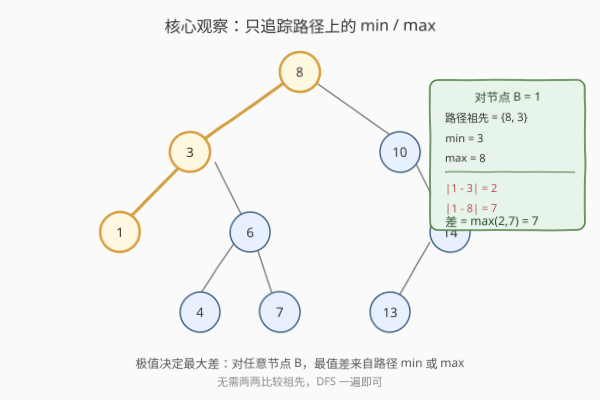
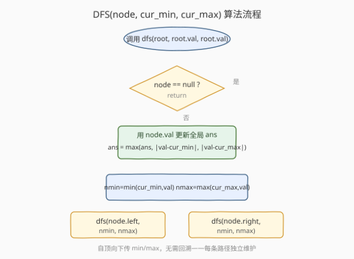
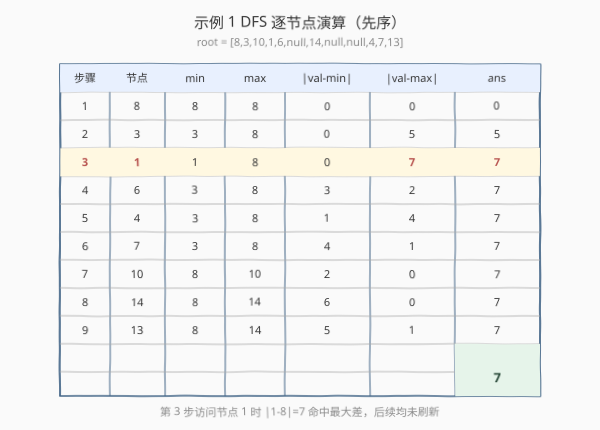

# LeetCode 节点与其祖先之间的最大差值 题解

## 1. 题目概述

- **标题 / 题号**：节点与其祖先之间的最大差值（#1026，medium）
- **链接**：https://leetcode.cn/problems/maximum-difference-between-node-and-ancestor/
- **难度**：中等
- **标签**：树、二叉树、深度优先搜索

**题意**：给定二叉树的根节点 `root`，找出存在于 **不同** 节点 `A` 和 `B` 之间的最大值 `V`，其中 `V = |A.val - B.val|`，且 `A` 是 `B` 的祖先。

（如果 `A` 的任何子节点之一为 `B`，或者 `A` 的任何子节点是 `B` 的祖先，那么我们认为 `A` 是 `B` 的祖先。）

**示例 1**：

```text
输入：root = [8,3,10,1,6,null,14,null,null,4,7,13]
输出：7
解释：
我们有大量的节点与其祖先的差值，其中一些如下：
|8 - 3| = 5
|3 - 7| = 4
|8 - 1| = 7
|10 - 13| = 3
在所有可能的差值中，最大值 7 由 |8 - 1| = 7 得出。
```

**示例 2**：

```text
输入：root = [1,null,2,null,0,3]
输出：3
```

**约束**：

- 树中的节点数在 `2` 到 `5000` 之间。
- `0 <= Node.val <= 10^5`

> 💡 这是一道「**祖先-后代**」型树题。关键不在遍历方式（任何 DFS 都行），而在于**把"和所有祖先两两比较"这个 $O(n^2)$ 直觉，压缩成"只追踪路径上的 min/max"的 $O(n)$ 优化**。这种"极值决定差值"的归约思想，与 [121. 买卖股票的最佳时机](../0001-0100/121_买卖股票的最佳时机.md) 中"只追踪历史最小价"是同一种范式。

## 2. 解题思路

### 2.1 暴力思路：每个节点对照所有祖先

最直白的做法：遍历到每个节点 `B` 时，把它和**路径上每一个祖先** `A` 都比一遍，更新全局最大差。

```text
dfs(B, 路径祖先列表):
    for A in 路径祖先列表:
        ans = max(ans, |A.val - B.val|)
    dfs(B.left,  路径祖先列表 + [B])
    dfs(B.right, 路径祖先列表 + [B])
```

**复杂度**：最坏情况（退化为链）每个节点要和 $O(n)$ 个祖先比较，总时间 $O(n^2)$，空间 $O(n)$（路径栈）。当 $n = 5000$ 时约 $2.5 \times 10^7$ 次比较，能过但不够优雅。

> ⚠️ 瓶颈在于"**对每个 B 都重新扫一遍全部祖先**"。但仔细想：祖先之间谁和 B 的差最大？一定是**值最极端**的那个（最大或最小）。所以根本不需要保留全部祖先，只需保留路径上的 **min 和 max**。

### 2.2 核心观察：只追踪路径 min / max

对任意节点 `B`，设它路径上的祖先集合为 `S`。要最大化 $|A.\text{val} - B.\text{val}|$（$A \in S$），由绝对差的几何意义可知：**$A.\text{val}$ 离 $B.\text{val}$ 越远，差越大**。因此最大差一定出现在 $A$ 取 $S$ 中的**最大值**或**最小值**时：

$$V_B = \max\big(\,B.\text{val} - \min S,\ \max S - B.\text{val}\,\big)$$

> 💡 这与 $|\cdot|$ 的性质一致：$|x - c|$ 在区间 $[\min S, \max S]$ 上的最大值，只能在端点处取得。中间的祖先无论取什么值，差都不会超过两端。

于是 DFS 时只需**自顶向下**传递两个标量 `cur_min`、`cur_max`，到每个节点用上式更新一次全局答案即可——$O(n)$ 时间，$O(h)$ 空间。



上图以示例 1 中节点 `B = 1` 为例：路径祖先是 `{8, 3}`，`min = 3`、`max = 8`，于是 $V_1 = \max(|1-3|, |1-8|) = \max(2, 7) = 7$，这正是全局最优。

### 2.3 算法流程图



**关键点**：

- **自顶向下传参**：`cur_min` / `cur_max` 作为参数沿路径向下传递，**不需要回溯**。因为每条从根出发的路径独立维护自己的极值，进入新分支时父路径的极值天然作为起点，递归返回后父调用自身的 `cur_min` / `cur_max` 不受子调用影响（值传递）。
- **在"进入节点"时更新答案**：用当前节点的值与传下来的 `cur_min` / `cur_max` 比较，再收缩成新的 `nmin` / `nmax` 传给孩子。注意顺序——先用**祖先**的极值算差（祖先集合不含自身），再把自己并入极值传下去。

### 2.4 示例演算

以示例 1 `root = [8,3,10,1,6,null,14,null,null,4,7,13]` 为例，先序遍历逐节点演算：



| 步骤 | 节点 | 路径 min | 路径 max | $\|\text{val-min}\|$ | $\|\text{val-max}\|$ | 累计 ans |
|------|------|----------|----------|----------------------|----------------------|----------|
| 1 | 8 | 8 | 8 | 0 | 0 | 0 |
| 2 | 3 | 3 | 8 | 0 | 5 | 5 |
| 3 | **1** | **1** | **8** | **0** | **7** | **7** |
| 4 | 6 | 3 | 8 | 3 | 2 | 7 |
| 5 | 4 | 3 | 8 | 1 | 4 | 7 |
| 6 | 7 | 3 | 8 | 4 | 1 | 7 |
| 7 | 10 | 8 | 10 | 2 | 0 | 7 |
| 8 | 14 | 8 | 14 | 6 | 0 | 7 |
| 9 | 13 | 8 | 14 | 5 | 1 | 7 |

第 3 步访问节点 `1` 时 $|1-8| = 7$ 命中最大差，此后所有节点均未刷新答案，最终返回 `7`。

> ⚠️ 注意步骤 3 的 `min` 列：到达节点 `1` 时路径 min 已经收缩到 `1`，但 $\|\text{val-min}\| = 0$ 没用——真正贡献答案的是 $\|\text{val-max}\| = 7$（来自祖先 `8`）。这印证了"两端取大"的思路：min 和 max 各算一遍，取大者，永远不会漏。

## 3. 参考代码

### 方法一：DFS + 路径极值（推荐）

### C++

```cpp
/**
 * Definition for a binary tree node.
 * struct TreeNode {
 *     int val;
 *     TreeNode *left;
 *     TreeNode *right;
 *     TreeNode() : val(0), left(nullptr), right(nullptr) {}
 *     TreeNode(int x) : val(x), left(nullptr), right(nullptr) {}
 *     TreeNode(int x, TreeNode *left, TreeNode *right) : val(x), left(left), right(right) {}
 * };
 */
class Solution {
public:
    int maxAncestorDiff(TreeNode* root) {
        int ans = 0;
        dfs(root, root->val, root->val, ans);
        return ans;
    }

private:
    void dfs(TreeNode* node, int curMin, int curMax, int& ans) {
        if (!node) return;
        // 用祖先路径的极值更新答案（极值此时不含 node 自身）
        int d1 = node->val - curMin;   // val - min，必 >= 0
        int d2 = curMax - node->val;   // max - val，必 >= 0
        ans = max(ans, max(d1, d2));
        // 收缩极值后传给孩子
        int nMin = min(curMin, node->val);
        int nMax = max(curMax, node->val);
        dfs(node->left,  nMin, nMax, ans);
        dfs(node->right, nMin, nMax, ans);
    }
};
```

### Python

```python
class Solution:
    def maxAncestorDiff(self, root: Optional[TreeNode]) -> int:
        ans = 0

        def dfs(node: Optional[TreeNode], cur_min: int, cur_max: int) -> None:
            nonlocal ans
            if not node:
                return
            # 用祖先路径的极值更新答案（极值此时不含 node 自身）
            ans = max(ans, node.val - cur_min, cur_max - node.val)
            # 收缩极值后传给孩子
            n_min = min(cur_min, node.val)
            n_max = max(cur_max, node.val)
            dfs(node.left,  n_min, n_max)
            dfs(node.right, n_min, n_max)

        dfs(root, root.val, root.val)
        return ans
```

> 💡 Python 版利用 `max` 支持多参数，一行写完答案更新：`ans = max(ans, node.val - cur_min, cur_max - node.val)`。因为 `cur_min <= node.val <= cur_max`（极值来自祖先，node 自身尚未并入），两个差都非负，直接取大即可，无需写 `abs`。

### 方法二：返回值版（无全局变量）

把答案作为返回值向上聚合，避免 `nonlocal` / 引用传参。语义更函数式，面试时可作备选：

### C++

```cpp
class Solution {
public:
    int maxAncestorDiff(TreeNode* root) {
        return dfs(root, root->val, root->val);
    }

private:
    int dfs(TreeNode* node, int curMin, int curMax) {
        if (!node) return 0;
        int best = max(node->val - curMin, curMax - node->val);
        int nMin = min(curMin, node->val);
        int nMax = max(curMax, node->val);
        best = max(best, dfs(node->left,  nMin, nMax));
        best = max(best, dfs(node->right, nMin, nMax));
        return best;
    }
};
```

### Python

```python
class Solution:
    def maxAncestorDiff(self, root: Optional[TreeNode]) -> int:
        def dfs(node: Optional[TreeNode], cur_min: int, cur_max: int) -> int:
            if not node:
                return 0
            best = max(node.val - cur_min, cur_max - node.val)
            n_min, n_max = min(cur_min, node.val), max(cur_max, node.val)
            best = max(best, dfs(node.left, n_min, n_max))
            best = max(best, dfs(node.right, n_min, n_max))
            return best

        return dfs(root, root.val, root.val)
```

## 4. 复杂度分析

| 维度 | 方法 | 复杂度 | 说明 |
|------|------|--------|------|
| 时间复杂度 | DFS + 极值 | $O(n)$ | 每个节点访问一次，每次 $O(1)$ 极值比较与收缩 |
| 空间复杂度 | DFS + 极值 | $O(h)$ | 递归栈深度，$h$ 为树高；平衡时 $O(\log n)$，退化为链时 $O(n)$ |
| 时间复杂度 | 暴力两两比较 | $O(n^2)$ | 最坏每个节点对照 $O(n)$ 个祖先 |
| 空间复杂度 | 暴力两两比较 | $O(n)$ | 路径祖先列表 |

> ⚠️ 本题节点数上限 $5000$，$O(n^2)$ 约 $2.5 \times 10^7$ 次比较也能 AC，但 $O(n)$ 的极值法才是正解——它把"和集合中每个元素比较"归约为"和集合的两个端点比较"，这是**极值消除枚举**的通用技巧。

## 5. 扩展：为什么"自顶向下传参"不需要回溯？

很多树形 DFS（如 [236. 二叉树的最近公共祖先](../0201-0300/236_二叉树的最近公共祖先.md)）用**自底向上**返回值聚合信息。本题却用**自顶向下**传参，原因在于所求信息的**流向**：

- **自顶向下适合"祖先影响后代"**：路径极值是从根累积到当前节点的，天然由父传子。每条路径独立，传参即拷贝，子调用修改不了父调用的局部变量。
- **自底向上适合"后代聚合给祖先"**：如子树和、子树最大深度、LCA 的"是否在子树中"——信息要从叶子汇总到根。

若所求改为"**每个节点与其所有后代**的最大差"（方向反过来），就需要自底向上：每个节点聚合子树返回的 min/max，再算差。两种方向本质对称，看信息流方向选模型。

> 💡 一句话判断：**信息来自祖先 → 自顶向下传参；信息来自子树 → 自底向上返回值**。

## 6. 面试要点

1. **为什么只追踪 min/max 就够？**
   - 对固定节点 $B$，$|A.\text{val} - B.\text{val}|$ 在祖先集合 $S$ 上的最大值只能在 $\max S$ 或 $\min S$ 处取得（绝对差在区间端点取极值），故只需两个标量。

2. **更新答案的顺序重要吗？先用祖先极值还是先收缩？**
   - 重要。必须**先用祖先的极值算差**（此时极值不含自身），再把自身并入极值传给孩子。若先收缩再算差，会把"自身和自身"算成 0，虽然不影响该节点答案（0 不会刷新最大值），但语义上"祖先差"应严格不含自身。

3. **需要回溯 min/max 吗？**
   - 不需要。极值作为**参数**按值传递，每条路径独立维护。递归返回后父调用的极值未被修改，自然恢复，省去显式 backtrack。

4. **如果把题目改成"后代-后代的最大差"或"任意两节点最大差"怎么办？**
   - 任意两节点的最大差就是 `全局 max - 全局 min`，$O(n)$ 一次遍历即可，与祖先关系无关。本题的约束"A 是 B 的祖先"使得差只能在**同一条根到叶路径上**取，所以才需要路径极值而非全局极值。

5. **方法和 [121. 买卖股票的最佳时机](../0001-0100/121_买卖股票的最佳时机.md) 有何相通？**
   - 都是"**和前面某个元素求最大差**"。121 是"当前价 - 历史最低价"（只单向，因为利润必须低买高卖），本题是"|当前值 - 路径极值|"（双向，取 max/min 两端）。两者都用"极值消除枚举"把 $O(n^2)$ 降到 $O(n)$。

## 同类练习题

| # | 题目 | 与本题的关联 |
|---|------|-------------|
| 121 | [买卖股票的最佳时机](https://leetcode.cn/problems/best-time-to-buy-and-sell-stock/)（[题解](../0001-0100/121_买卖股票的最佳时机.md)） | 同样"和前面元素求最大差"，单向极值消除枚举，$O(n)$ 一遍遍历 |
| 236 | [二叉树的最近公共祖先](https://leetcode.cn/problems/lowest-common-ancestor-of-a-binary-tree/)（[题解](../0201-0300/236_二叉树的最近公共祖先.md)） | 对照"自底向上返回值"范式，理解树形 DFS 的两种信息流方向 |
| 98 | [验证二叉搜索树](https://leetcode.cn/problems/validate-binary-search-tree/)（[题解](../0001-0100/98_验证二叉搜索树.md)） | 另一类"自顶向下传上下界"的树形 DFS，与本题传 min/max 同骨架 |
| 124 | [二叉树中的最大路径和](https://leetcode.cn/problems/binary-tree-maximum-path-sum/) | 自底向上聚合子树信息的代表作，对照本题理解两种 DFS 方向 |
| 1373 | [二叉搜索子树的最大键值和](https://leetcode.cn/problems/maximum-sum-bst-in-binary-tree/) | 自底向上返回 (min,max,sum,isBST) 四元组，综合极值传递与子树聚合 |
