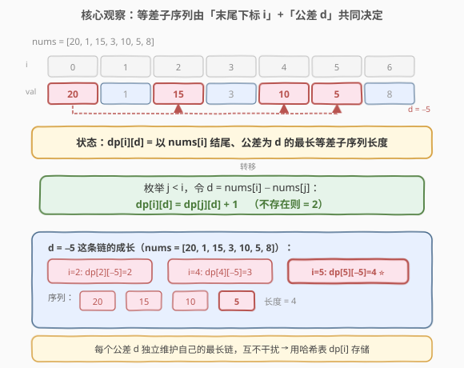
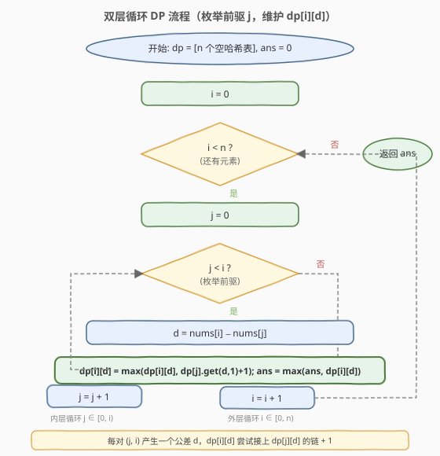

# 最长等差数列

- **题目名称**：最长等差数列
- **链接**：[1027. 最长等差数列](https://leetcode.cn/problems/longest-arithmetic-subsequence/)
- **难度**：中等
- **标签**：数组、动态规划

## 1. 题目概述

给定一个整数数组 `nums`，返回 `nums` 中**最长等差子序列**的长度。

> **等差数列**：序列中相邻元素的差（公差）相同，即 $\text{seq}[i+1] - \text{seq}[i] = d$（常数）对所有 $i$ 成立。**子序列**：可从原数组中删除若干元素，不改变剩余元素的顺序。

**示例 1**：

```text
输入：nums = [3,6,9,12]
输出：4
解释：整个数组本身就是公差 d = 3 的等差数列。
```

**示例 2**：

```text
输入：nums = [9,4,7,2,10]
输出：3
解释：最长等差子序列是 [4,7,10]，公差 d = 3，长度 3。
```

**示例 3**：

```text
输入：nums = [20,1,15,3,10,5,8]
输出：4
解释：最长等差子序列是 [20,15,10,5]，公差 d = −5，长度 4。
```

**约束条件**：

- $2 \leq \text{nums.length} \leq 1000$
- $0 \leq \text{nums[i]} \leq 500$

---

## 2. 解题思路

### 2.1 暴力思路：枚举子序列

枚举所有子序列再逐一判断是否等差——子序列总数 $2^n$，$n = 1000$ 时完全不可行。

退一步：**固定公差 $d$ 与起点**，用 $O(n)$ 贪心扫描能延伸多长。由于 $\text{nums[i]} \in [0, 500]$，公差 $d \in [-500, 500]$，约 1001 种取值，总复杂度 $O(1001 \cdot n) \approx 10^6$，可行但**强依赖值域小**，一旦 $\text{nums[i]}$ 范围放大就失效。

更本质的做法是动态规划。

### 2.2 核心观察：以「下标 + 公差」为状态



关键观察：**等差子序列的延伸只取决于「末尾元素下标 $i$」和「公差 $d$」**。若已知以 $\text{nums}[j]$ 结尾、公差为 $d$ 的最长等差子序列长度，且 $\text{nums}[i] - \text{nums}[j] = d$，则该序列可向右延伸到 $\text{nums}[i]$。

定义状态：

$$\text{dp}[i][d] = \text{以 } \text{nums}[i] \text{ 结尾、公差为 } d \text{ 的最长等差子序列长度}$$

转移：枚举前驱 $j < i$，令 $d = \text{nums}[i] - \text{nums}[j]$：

$$\text{dp}[i][d] = \max(\text{dp}[i][d],\ \text{dp}[j][d] + 1)$$

其中 $\text{dp}[j][d]$ 若不存在，则 $i, j$ 两元素自身构成一个长度为 2 的等差序列，取 $\text{dp}[j][d] = 1$（即 $\text{dp}[i][d] = 1 + 1 = 2$）。

> 💡 **任意两个元素都构成长度为 2 的等差子序列**，所以状态最小值为 2，全局答案至少为 2（$n \geq 2$ 保证）。

> ⚠️ **为什么用哈希表而非二维数组？** 公差 $d$ 的取值依赖元素差，理论上可达 $O(\text{值域范围})$ 种。用 `unordered_map<int,int>` 按「实际出现的公差」存储，既通用又省空间。当值域较小时（如本题 $\text{nums[i]} \leq 500$），也可改用数组 + 偏移量优化（见第 5 节）。

### 2.3 算法流程图



流程要点：

- 外层 $i$ 从 $0$ 到 $n-1$，内层 $j$ 从 $0$ 到 $i-1$。
- 每对 $(j, i)$ 计算 $d = \text{nums}[i] - \text{nums}[j]$，查 $\text{dp}[j][d]$ 是否已有记录：有则 $\text{dp}[i][d] = \text{dp}[j][d] + 1$，无则 $\text{dp}[i][d] = 2$。
- 用 $\max$ 更新 $\text{dp}[i][d]$（同一 $d$ 可能有多个前驱 $j$，取最长），并维护全局 $\text{ans}$。

### 2.4 示例演算

![示例演算：nums = [20,1,15,3,10,5,8]](../images/las_example_walkthrough.svg)

以 `nums = [20,1,15,3,10,5,8]` 为例，重点关注公差 $d = -5$ 这条链的成长过程：

| $i$ | $\text{nums}[i]$ | 关键前驱 $(j, d)$ | $\text{dp}[i][d]$ 更新 | $\text{ans}$ |
|-----|------------------|--------------------|------------------------|--------------|
| 0 | 20 | —（无前驱） | $\text{dp}[0] = \{\}$ | 0 |
| 1 | 1  | $j=0,\ d=-19$ | $\text{dp}[1][-19]=2$ | 2 |
| 2 | 15 | $j=0,\ d=-5$ | $\text{dp}[2][-5]=2$（序列 $[20,15]$） | 2 |
| 3 | 3  | $j=1,\ d=2$ | $\text{dp}[3][2]=2$ | 2 |
| 4 | 10 | $j=2,\ d=-5$ | $\text{dp}[4][-5]=\text{dp}[2][-5]+1=3$（$[20,15,10]$） | 3 |
| 5 | 5  | $j=4,\ d=-5$ | $\text{dp}[5][-5]=\text{dp}[4][-5]+1=\mathbf{4}$ ⭐（$[20,15,10,5]$） | **4** ⭐ |
| 6 | 8  | $j=5,\ d=3$ | $\text{dp}[6][3]=2$ | 4 |

公差 $d = -5$ 的链在 $i = 2, 4, 5$ 处依次延长：$[20,15] \to [20,15,10] \to [20,15,10,5]$，长度 $2 \to 3 \to 4$。最终 $\text{ans} = 4$。

> 💡 **链的成长机制**：每次 $\text{nums}[i] - \text{nums}[j] = -5$ 且 $\text{dp}[j][-5]$ 已有记录时，$\text{dp}[i][-5]$ 就能接上 $\text{dp}[j][-5] + 1$。中间穿插的其他公差不会干扰这条链——**每个公差 $d$ 独立维护自己的最长链**。

---

## 3. 参考代码

### C++

```cpp
class Solution {
  public:
    int longestArithSeqLength(vector<int>& nums) {
        int n = nums.size();
        vector<unordered_map<int, int>> dp(n);
        int ans = 0;
        for (int i = 0; i < n; ++i) {
            for (int j = 0; j < i; ++j) {
                int d = nums[i] - nums[j];
                int len = dp[j].count(d) ? dp[j][d] + 1 : 2;
                if (len > dp[i][d]) dp[i][d] = len;
                ans = max(ans, dp[i][d]);
            }
        }
        return ans;
    }
};
```

### Python

```python
class Solution:
    def longestArithSeqLength(self, nums: List[int]) -> int:
        n = len(nums)
        dp = [{} for _ in range(n)]
        ans = 0
        for i in range(n):
            for j in range(i):
                d = nums[i] - nums[j]
                length = dp[j].get(d, 1) + 1
                dp[i][d] = max(dp[i].get(d, 0), length)
                ans = max(ans, dp[i][d])
        return ans
```

> ⚠️ **易错点**：`dp[j].get(d, 1) + 1` 中默认值是 `1` 而非 `0`——当 $d$ 不在 $\text{dp}[j]$ 中时，$j$ 自身作为长度 1 的「单元素序列」，加上 $\text{nums}[i]$ 得到长度 2。若默认值取 `0`，则两元素只能得到长度 1，答案恒少 1。

---

## 4. 复杂度分析

| 维度 | 复杂度 | 说明 |
|------|--------|------|
| 时间复杂度 | $O(n^2)$ | 双层循环枚举所有 $(j, i)$ 对，每对 $O(1)$ 哈希操作 |
| 空间复杂度 | $O(n^2)$ | 最坏情况下每个 $\text{dp}[i]$ 存 $i$ 个不同公差，总计 $\sum_{i=1}^{n-1} i = O(n^2)$ |

> 💡 本题 $n \leq 1000$，$n^2 = 10^6$，双层循环 + 哈希表操作在时限内轻松通过。若需进一步提速，可用数组替代哈希表（见第 5 节）。

---

## 5. 扩展：数组替代哈希表（值域优化）

当 $\text{nums[i]}$ 值域较小时（本题 $\text{nums[i]} \in [0, 500]$），公差 $d \in [-500, 500]$，可用**定长数组 + 偏移量**替代哈希表，消除哈希开销：

```cpp
class Solution {
  public:
    int longestArithSeqLength(vector<int>& nums) {
        int n = nums.size();
        int OFFSET = 500;
        // dp[i][d + OFFSET]: 以 nums[i] 结尾、公差为 d 的最长长度
        vector<vector<int>> dp(n, vector<int>(1001, 0));
        int ans = 0;
        for (int i = 0; i < n; ++i) {
            for (int j = 0; j < i; ++j) {
                int d = nums[i] - nums[j] + OFFSET;
                int len = dp[j][d] > 0 ? dp[j][d] + 1 : 2;
                dp[i][d] = max(dp[i][d], len);
                ans = max(ans, dp[i][d]);
            }
        }
        return ans;
    }
};
```

> 💡 **取舍**：数组版时间仍为 $O(n^2)$，但常数更小（无哈希计算与冲突处理），空间固定为 $O(n \cdot 1001)$。哈希表版空间按实际公差数量分配，更省内存但常数略大。面试中两种写法都可接受，哈希表版更通用（不依赖值域假设）。

---

## 6. 面试要点

1. **为什么状态要包含公差 $d$？**

   - 等差子序列由「末尾元素」和「公差」共同刻画。仅以末尾下标为状态无法区分不同公差的序列——同一元素可以是多条不同公差等差序列的末尾。必须用 $(i, d)$ 二元组才能完整描述「以 $\text{nums}[i]$ 结尾、公差为 $d$ 的最长长度」。

2. **为什么枚举前驱 $j$ 而非枚举公差 $d$？**

   - 公差 $d$ 由 $\text{nums}[i] - \text{nums}[j]$ 自然产生，枚举 $j$ 同时确定了 $d$，无需额外遍历公差空间。且 $j < i$ 保证子序列顺序，转移天然合法。

3. **为什么 $\text{dp}[j][d]$ 不存在时取 2 而非 1？**

   - 任意两个元素 $\text{nums}[j], \text{nums}[i]$（$j < i$）天然构成一个长度为 2 的等差子序列。$\text{dp}[j][d]$ 不存在意味着 $j$ 之前没有同公差的前驱，但 $j$ 自身作为起点（长度 1），加上 $i$ 得到长度 2。代码中用 `dp[j].get(d, 1) + 1` 实现：默认值 1 表示「$j$ 自身长度」。

4. **与 [300. 最长递增子序列](../0201-0300/300_最长递增子序列.md) 有何异同？**

   - **同**：都是「以 $i$ 结尾」的子序列 DP，都枚举前驱 $j < i$ 做转移。
   - **异**：LIS 的约束是 $\text{nums}[j] < \text{nums}[i]$（值序），状态只需一维 `dp[i]`；本题的约束是 $\text{nums}[i] - \text{nums}[j] = d$（差序），同一 $i$ 对应多种 $d$，状态需二维 $(i, d)$。

5. **如何输出具体的最长等差子序列（而非长度）？**

   - 给每个状态 $\text{dp}[i][d]$ 额外存 `prev[i][d] = j`（最优前驱下标）。DP 结束后从最优 $(i^*, d^*)$ 回溯：$i \leftarrow \text{prev}[i][d]$，直到无前驱，收集路径上的下标逆序即为子序列。

---

## 7. 同类练习题

- [300. 最长递增子序列](https://leetcode.cn/problems/longest-increasing-subsequence/)（[题解](../0201-0300/300_最长递增子序列.md)）：同为「以 $i$ 结尾」的子序列 DP，对比一维状态（值序约束）与本题二维状态（差序约束）
- [413. 等差数列划分](https://leetcode.cn/problems/arithmetic-slices/)：求**连续子数组**中是等差数列的个数，状态只需一维（连续性消除公差维度），对比「子序列」与「子数组」的 DP 差异
- [446. 等差数列划分 II - 子序列](https://leetcode.cn/problems/arithmetic-slices-ii-subsequence/)：求等差**子序列**（任意长度 ≥ 3）的**个数**而非最长长度，状态定义相同 $(i, d)$ 但转移求和而非取 max
- [1218. 最长定差子序列](https://leetcode.cn/problems/longest-arithmetic-subsequence-of-given-difference/)：公差 $d$ 给定，退化为只需一维哈希 `dp[value]`，$O(n)$ 一次扫描，对比「公差未知」与「公差已知」的复杂度差异
- [1027. 最长等差数列](https://leetcode.cn/problems/longest-arithmetic-subsequence/)：本题，公差未知的最长子序列 DP
