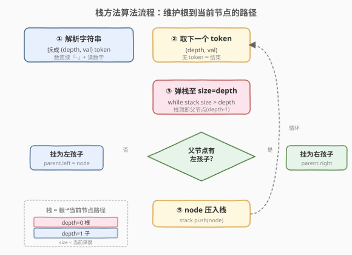
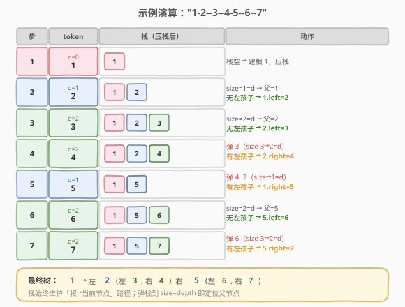

# LeetCode 从先序遍历还原二叉树 题解

## 1. 题目概述

- **标题 / 题号**：从先序遍历还原二叉树（#1028，hard）
- **链接**：https://leetcode.cn/problems/recover-a-tree-from-preorder-traversal/
- **难度**：困难
- **标签**：树、栈、DFS、字符串

**题意**：对一棵二叉树做前序深度优先搜索（DFS），在遍历时按如下规则输出一个字符串：每到达一个节点，先输出 $D$ 个连字符 `-`（$D$ 为该节点的深度，根节点深度为 0），再输出该节点的值。**若节点只有一个孩子，则该孩子为左孩子**。

现在给定这个字符串 `traversal`，请还原出原来的二叉树并返回根节点。

**示例 1**：

```text
输入：traversal = "1-2--3--4-5--6--7"
输出：[1,2,5,3,4,6,7]
解释：根节点 1 的深度为 0；2、5 深度为 1；3、4、6、7 深度为 2。
```

**示例 2**：

```text
输入：traversal = "1-2--3---4-5--6---7"
输出：[1,2,5,3,null,6,null,4,null,7,null]
```

**示例 3**：

```text
输入：traversal = "1-401--349---90--88"
输出：[1,401,null,349,88,90]
```

**约束**：

- 原树中的节点数在范围 $[1, 1000]$ 内。
- $1 \leq \text{Node.val} \leq 10^9$。
- 输入字符串保证合法。

## 2. 解题思路

### 2.1 暴力思路：递归分治 + 线性找子串边界

将字符串解析为 $(\text{depth}, \text{val})$ 的 token 序列后，可以递归构造：给定当前期望深度 $D$，从指针位置开始，只要后续 token 的深度等于 $D$，就属于当前层级。对于根节点的 token，其左右子树的所有 token 深度都 $\geq D+1$，且左子树 token 连续在前、右子树 token 连续在后。

这种分治需要线性扫描找左右子树边界，最坏 $O(n^2)$（链状树），不够高效。

### 2.2 核心观察：栈维护路径（最优）


关键观察：前序遍历的顺序是「根-左-右」，而字符串中的**深度信息**告诉我们每个节点在树中的层级。用一个**栈**维护从根到当前处理节点的路径：

1. 解析字符串，逐个取出 $(\text{depth}, \text{val})$ token。
2. 对于当前 token 的深度 $D$，**弹栈直到栈大小等于 $D$**——此时栈顶就是当前节点的父节点（深度 $D-1$）。
3. 创建新节点，若父节点无左孩子则挂为左孩子，否则挂为右孩子。
4. 将新节点压入栈。

> 💡 栈的本质是「根到当前节点的路径」。前序遍历每进入一个更深的节点就压栈，每回溯到更浅的节点就弹栈。深度 $D$ 恰好等于栈应有的元素个数（从深度 0 到 $D-1$ 共 $D$ 个祖先），所以「弹栈到 `size == D`」一步定位父节点。

### 2.3 算法流程图



> ⚠️ **单孩子必为左孩子**：题目约定若节点只有一个孩子则为左孩子。因此挂载时先检查 `parent->left` 是否为空，为空则挂左，否则挂右。这一约定保证了树构造的唯一性。

### 2.4 示例演算



以 `traversal = "1-2--3--4-5--6--7"` 为例，解析出 7 个 token：

| 步骤 | token (depth, val) | 弹栈动作 | 栈（压栈后） | 挂载 |
|------|---------------------|----------|--------------|------|
| 1 | (0, 1) | 栈空 | [1] | 建根 |
| 2 | (1, 2) | size=1=d | [1, 2] | 1.left = 2 |
| 3 | (2, 3) | size=2=d | [1, 2, 3] | 2.left = 3 |
| 4 | (2, 4) | 弹 3 → size=2=d | [1, 2, 4] | 2.right = 4 |
| 5 | (1, 5) | 弹 4, 2 → size=1=d | [1, 5] | 1.right = 5 |
| 6 | (2, 6) | size=2=d | [1, 5, 6] | 5.left = 6 |
| 7 | (2, 7) | 弹 6 → size=2=d | [1, 5, 7] | 5.right = 7 |

最终树：`1` 左 `2` 右 `5`；`2` 左 `3` 右 `4`；`5` 左 `6` 右 `7`。

## 3. 参考代码

### C++

```cpp
/**
 * Definition for a binary tree node.
 * struct TreeNode {
 *     int val;
 *     TreeNode *left;
 *     TreeNode *right;
 *     TreeNode() : val(0), left(nullptr), right(nullptr) {}
 *     TreeNode(int x) : val(x), left(nullptr), right(nullptr) {}
 *     TreeNode(int x, TreeNode *left, TreeNode *right) : val(x), left(left), right(right) {}
 * };
 */
class Solution {
  public:
    TreeNode* recoverFromPreorder(string traversal) {
        vector<pair<int, int>> tokens;          // (depth, val)
        int i = 0, n = traversal.size();
        while (i < n) {
            int depth = 0;
            while (i < n && traversal[i] == '-') {   // 数连字符
                ++depth;
                ++i;
            }
            int val = 0;
            while (i < n && isdigit(traversal[i])) { // 读数字
                val = val * 10 + (traversal[i] - '0');
                ++i;
            }
            tokens.push_back({depth, val});
        }

        vector<TreeNode*> stk;                    // 栈：根→当前节点路径
        for (auto& [depth, val] : tokens) {
            while (stk.size() > depth) stk.pop_back();   // 弹栈到 size=depth
            TreeNode* node = new TreeNode(val);
            if (!stk.empty()) {
                TreeNode* parent = stk.back();
                if (!parent->left) parent->left = node;   // 先左后右
                else                parent->right = node;
            }
            stk.push_back(node);
        }
        return stk.empty() ? nullptr : stk[0];
    }
};
```

### Python

```python
class Solution:
    def recoverFromPreorder(self, traversal: str) -> Optional[TreeNode]:
        tokens = []
        i, n = 0, len(traversal)
        while i < n:
            depth = 0
            while i < n and traversal[i] == '-':       # 数连字符
                depth += 1
                i += 1
            val = 0
            while i < n and traversal[i].isdigit():    # 读数字
                val = val * 10 + int(traversal[i])
                i += 1
            tokens.append((depth, val))

        stk: List[TreeNode] = []                       # 栈：根→当前节点路径
        for depth, val in tokens:
            while len(stk) > depth:                    # 弹栈到 size=depth
                stk.pop()
            node = TreeNode(val)
            if stk:
                parent = stk[-1]
                if not parent.left:                    # 先左后右
                    parent.left = node
                else:
                    parent.right = node
            stk.append(node)

        return stk[0] if stk else None
```

> 💡 也可以将解析与构造**合并在一次遍历中**完成，边解析 token 边压栈/弹栈，无需存储 tokens 数组，空间更省。上面的写法先解析再构造，逻辑更清晰。

## 4. 复杂度分析

| 维度 | 复杂度 | 说明 |
|------|--------|------|
| 时间复杂度 | $O(n)$ | 每个字符在解析阶段访问一次；每个节点在构造阶段入栈/出栈各一次 |
| 空间复杂度 | $O(n)$ | tokens 数组 $O(n)$；栈最坏 $O(n)$（链状树）。合并解析+构造可省去 tokens 数组，空间为 $O(h)$（$h$ 为树高） |

## 5. 扩展：递归解法

除栈方法外，还可以用**递归 + 全局指针**完成构造，思路与 [1008. 前序遍历构造二叉搜索树](../1001-1100/1008_前序遍历构造二叉搜索树.md) 的上下界递归异曲同工：

```cpp
class Solution {
    int i = 0, n;
    string s;

    TreeNode* build(int expectedDepth) {
        if (i >= n) return nullptr;
        int depth = 0;
        int j = i;
        while (j < n && s[j] == '-') { ++depth; ++j; }
        if (depth != expectedDepth) return nullptr;    // 不属于当前深度，回溯
        i = j;
        int val = 0;
        while (i < n && isdigit(s[i])) {
            val = val * 10 + (s[i] - '0');
            ++i;
        }
        TreeNode* root = new TreeNode(val);
        root->left = build(expectedDepth + 1);         // 先尝试左子树
        root->right = build(expectedDepth + 1);        // 再尝试右子树
        return root;
    }

public:
    TreeNode* recoverFromPreorder(string traversal) {
        s = traversal;
        n = s.size();
        return build(0);
    }
};
```

> 💡 递归法的指针 `i` 单调递增、永不回退（`depth != expectedDepth` 时只是「窥探不消费」），总访问次数为 $O(n)$。与栈方法相比，递归法无需显式存储路径栈，但依赖系统调用栈（最坏 $O(n)$）。

### 两种解法对比

| 解法 | 时间 | 空间 | 思路 |
|------|------|------|------|
| **栈方法** | $O(n)$ | $O(n)$（tokens）或 $O(h)$（合并） | 弹栈到 `size=depth` 定位父节点 |
| **递归法** | $O(n)$ | $O(h)$（递归栈） | 全局指针 + 期望深度匹配 |

> ⚠️ 栈方法更直观地展示了「路径」概念，面试时易于白板书写；递归法代码更紧凑。两者都是 $O(n)$，面试任选其一即可。

## 6. 面试要点

1. **为什么弹栈到 `size == depth` 就能定位父节点？**
   - 栈维护从根（深度 0）到当前节点路径上的所有祖先。若当前节点深度为 $D$，则它有 $D$ 个祖先（深度 $0$ 到 $D-1$），栈中应恰好保留这 $D$ 个节点。弹栈到 `size == D` 后，栈顶就是深度 $D-1$ 的父节点。

2. **如何保证「单孩子为左孩子」的约定被正确执行？**
   - 挂载新节点时先检查 `parent->left` 是否为空：为空则挂左孩子，非空则挂右孩子。由于前序遍历先访问左子树再访问右子树，左孩子一定先于右孩子出现，所以这个检查顺序天然正确。

3. **递归法中指针 `i` 真的不回退吗？**
   - 「回溯」时确实会重新数连字符判断深度，但只在 `depth != expectedDepth` 时返回 `nullptr`，**不消费**数值部分。真正消费 `i`（读取数值）只在深度匹配时发生，每个节点的数值恰好被读一次，因此 $O(n)$。

4. **这道题与「前序+中序构造树」的区别是什么？**
   - [105](../0101-0200/105_从前序与中序遍历序列构造二叉树.md) 需要两个序列（前序定根、中序划分左右子树）。本题只需一个序列，因为深度信息已经编码在字符串中，等价于「前序序列 + 每个节点的深度」，足以唯一确定树形（加上单孩子为左孩子的约定）。

5. **如果输入不合法（深度跳跃）会怎样？**
   - 栈方法中弹栈后若 `stack.size() > depth` 无法满足（说明深度不连续），或同一父节点已有左右孩子还要挂第三个孩子，都说明输入非法。本题保证合法，无需处理。

## 同类练习题

| # | 题目 | 与本题的关联 |
|---|------|-------------|
| 105 | [从前序与中序遍历序列构造二叉树](https://leetcode.cn/problems/construct-binary-tree-from-preorder-and-inorder-traversal/)（[题解](../0101-0200/105_从前序与中序遍历序列构造二叉树.md)） | 双序列构造树，对比本题的单序列+深度信息 |
| 106 | [从中序与后序遍历序列构造二叉树](https://leetcode.cn/problems/construct-binary-tree-from-inorder-and-postorder-traversal/)（[题解](../0101-0200/106_从中序与后序遍历序列构造二叉树.md)） | 后序定根、中序划分，分治构造 |
| 1008 | [前序遍历构造二叉搜索树](https://leetcode.cn/problems/construct-binary-search-tree-from-preorder-traversal/)（[题解](../1001-1100/1008_前序遍历构造二叉搜索树.md)） | 单序列构造 BST，上下界递归 vs 栈方法，与本题思路相通 |
| 297 | [二叉树的序列化与反序列化](https://leetcode.cn/problems/serialize-and-deserialize-binary-tree/)（[题解](../0201-0300/297_二叉树的序列化与反序列化.md)） | 前序 + 空节点标记的序列化，另一种「单序列编码树形」方案 |
| 889 | [根据前序和后序遍历构造二叉树](https://leetcode.cn/problems/construct-binary-tree-from-preorder-and-postorder-traversal/) | 前序+后序构造（当节点有单孩子时不唯一），对比本题深度信息如何消除歧义 |
