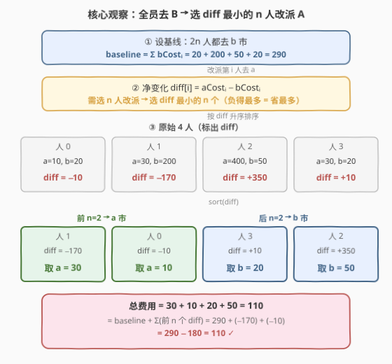
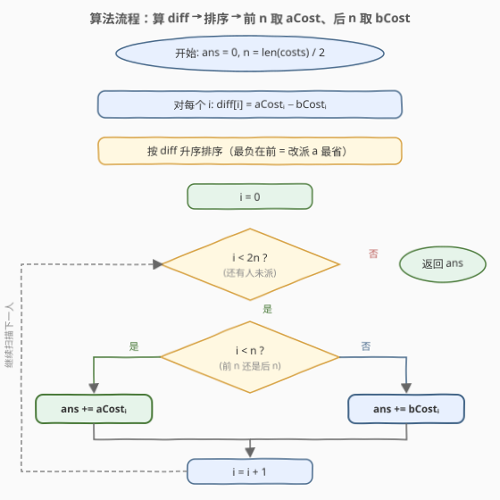
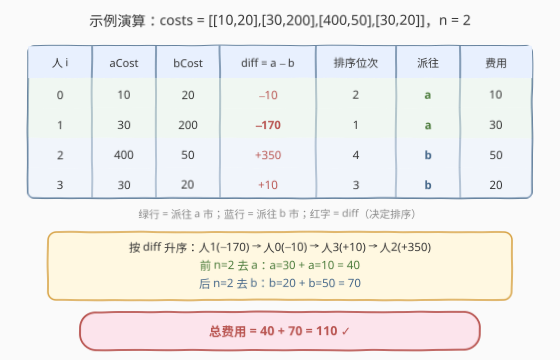

# 两地调度

- **题目名称**：两地调度
- **链接**：[1029. 两地调度](https://leetcode.cn/problems/two-city-scheduling/)
- **难度**：中等
- **标签**：贪心、数组、排序

## 1. 题目概述

公司计划面试 $2n$ 人。给定数组 `costs`，其中 `costs[i] = [aCostᵢ, bCostᵢ]`，表示第 $i$ 人飞往 **a 市**的费用为 `aCostᵢ`、飞往 **b 市**的费用为 `bCostᵢ`。需要把每个人都派往 a、b 中的一座城市，且**每座城市恰好有 $n$ 人抵达**。返回最低总费用。

**示例 1**：

```text
输入：costs = [[10,20],[30,200],[400,50],[30,20]]
输出：110
解释：第 1、2 人去 a 市（10 + 30），第 3、4 人去 b 市（50 + 20），合计 110。
```

**示例 2**：

```text
输入：costs = [[259,770],[448,54],[926,667],[184,139],[840,118],[577,469]]
输出：1859
```

**示例 3**：

```text
输入：costs = [[515,563],[451,713],[537,709],[343,819],[855,779],[457,60],[650,359],[631,42]]
输出：3086
```

**约束条件**：

- $2n = \text{costs.length}$，即人数恒为偶数
- $2 \le \text{costs.length} \le 100$
- $1 \le \text{aCostᵢ}, \text{bCostᵢ} \le 1000$

> 💡 **关键直觉**：约束「a、b 各 $n$ 人」是**基数相等**的硬约束，而非「总费用相等」。这意味着每个人去哪座城市只通过**差值** $\text{aCostᵢ} - \text{bCostᵢ}$ 影响总费用的相对大小——差值越负，派往 a 越划算。

---

## 2. 解题思路

### 2.1 暴力思路

从 $2n$ 人中选 $n$ 人去 a 市，其余去 b 市，枚举所有 $\binom{2n}{n}$ 种组合，对每种求和取最小。$n = 50$ 时 $\binom{100}{50} \approx 10^{29}$，完全不可行。

> 💡 暴力的浪费在于：每个人的「派往 a 相对派往 b 的额外代价」是独立的，**无需两两试探组合**——把这个额外代价排序，取最小的 $n$ 个即可。

### 2.2 核心观察：全员去 B 基线 + 按差值选 n 人改派 A



做一次视角转换，把问题变成「在固定基线上做 $n$ 次最小增量选择」：

1. **设基线**：假设 $2n$ 人**全部去 b 市**，总费用 $\text{baseline} = \sum \text{bCostᵢ}$。此时 b 市有 $2n$ 人、a 市有 0 人，不满足约束。
2. **改派代价**：把第 $i$ 人从 b 市改派到 a 市，费用从 $\text{bCostᵢ}$ 变为 $\text{aCostᵢ}$，**净变化**为

$$\text{diff}_i = \text{aCostᵢ} - \text{bCostᵢ}$$

   - $\text{diff}_i < 0$：a 更便宜，改派**省钱**；
   - $\text{diff}_i > 0$：a 更贵，改派**亏钱**。
3. **选 n 个**：需恰好选 $n$ 人改派到 a（使 a 市凑满 $n$ 人）。要最小化总费用，等价于最小化 $\sum_{\text{选中的 } i} \text{diff}_i$，即**选 diff 最小的 $n$ 个**。

于是总费用可写成：

$$\text{answer} = \sum \text{bCostᵢ} \;+\; \sum_{\text{diff 最小的 } n \text{ 个}} \text{diff}_i$$

实现上只需：按 $\text{diff}_i$ 升序排序，**前 $n$ 人去 a**（取 `aCost`），**后 $n$ 人去 b**（取 `bCost`），累加即可。$O(n \log n)$ 一发入魂。

> ⚠️ **为什么排序后「前 n 去 a、后 n 去 b」等价于上面的公式？** 排序后前 $n$ 个正是 diff 最小的 $n$ 个。这 $n$ 人取 `aCost`（= `bCost + diff`），后 $n$ 人取 `bCost`，总和 $= \sum_{后 n} \text{bCost} + \sum_{前 n}(\text{bCost} + \text{diff}) = \sum \text{bCost} + \sum_{前 n}\text{diff}$，与公式一致。

> 💡 **识别信号**：题目形如「把元素分成**基数固定**的两组、最小化总代价」时，先想「**差值排序**」——把分组选择转化为「在基线上做最小增量选择」。对比 [1049. 最后一块石头的重量 II](./1049_最后一块石头的重量II.md)：1049 的两组**基数不固定**（任意划分），故贪心失效、需 0-1 背包；本题基数锁定为 $n$，差值排序即可秒杀。

### 2.3 算法流程图



流程要点：

- **第一步**：对每个 $i$ 计算 `diff[i] = costs[i][0] - costs[i][1]`。
- **第二步**：按 `diff` **升序**排序（最负在前，即「改派 a 最省钱」的优先）。
- **第三步**：前 $n$ 个下标取 `aCost`、后 $n$ 个下标取 `bCost`，累加得答案。

> ⚠️ **排序方向**：必须按 `aCost - bCost` **升序**。若误写成降序，会把「改派 a 最亏」的人塞去 a，得到最大费用而非最小。也可等价地按 `bCost - aCost` 降序，效果相同。

### 2.4 示例演算

以 `costs = [[10,20],[30,200],[400,50],[30,20]]` 为例，$n = 2$：



| 人 $i$ | aCost | bCost | diff = a − b | 排序后位次 | 派往 | 费用 |
|--------|-------|-------|--------------|-----------|------|------|
| 0 | 10 | 20 | −10 | 2 | a | 10 |
| 1 | 30 | 200 | −170 | 1 | a | 30 |
| 2 | 400 | 50 | +350 | 4 | b | 50 |
| 3 | 30 | 20 | +10 | 3 | b | 20 |

按 diff 升序：人 1 (−170) → 人 0 (−10) → 人 3 (+10) → 人 2 (+350)。前 $n=2$（人 1、人 0）去 a，后 $n=2$（人 3、人 2）去 b。

- baseline $= 20+200+50+20 = 290$
- 前 $n$ 个 diff 之和 $= (-170) + (-10) = -180$
- 答案 $= 290 + (-180) = 110$ ✓

---

## 3. 参考代码

### C++

```cpp
class Solution {
  public:
    int twoCitySchedCost(vector<vector<int>>& costs) {
        int n = costs.size() / 2;
        // 按 diff = aCost - bCost 升序排序
        sort(costs.begin(), costs.end(),
             [](const vector<int>& x, const vector<int>& y) {
                 return (x[0] - x[1]) < (y[0] - y[1]);
             });
        int ans = 0;
        for (int i = 0; i < 2 * n; ++i) {
            ans += (i < n) ? costs[i][0]   // 前 n 人去 a
                           : costs[i][1];  // 后 n 人去 b
        }
        return ans;
    }
};
```

### Python

```python
class Solution:
    def twoCitySchedCost(self, costs: List[List[int]]) -> int:
        n = len(costs) // 2
        costs.sort(key=lambda x: x[0] - x[1])   # 按 diff 升序
        ans = 0
        for i in range(2 * n):
            ans += costs[i][0] if i < n else costs[i][1]
        return ans
```

> 💡 **一行 Python 版**（利用切片求和，等价但更紧凑）：
> ```python
> def twoCitySchedCost(self, costs: List[List[int]]) -> int:
>     n = len(costs) // 2
>     costs.sort(key=lambda x: x[0] - x[1])
>     return sum(c[0] for c in costs[:n]) + sum(c[1] for c in costs[n:])
> ```

> ⚠️ **排序稳定性无关**：即使两人 diff 相同，谁排前都不影响总和（取 a 还是取 b 由位次决定，但相同 diff 意味着 `aCost - bCost` 相等，互换后两市的费用变化相互抵消）。无需额外处理并列。

---

## 4. 复杂度分析

| 维度 | 复杂度 | 说明 |
|------|--------|------|
| 时间复杂度 | $O(n \log n)$ | 排序主导；后续一次遍历累加 $O(n)$ |
| 空间复杂度 | $O(\log n)$ | 排序的递归栈空间（原地排序，无额外数组） |

> 💡 $2n \le 100$，$O(n \log n)$ 约 $50 \log 50 \approx 280$ 次比较，远低于时限。即便人数放大到 $10^6$ 也能稳过。

---

## 5. 扩展：动态规划解法（基数约束的泛化）

差值排序贪心能成立，**关键在「a、b 各 $n$ 人」的基数约束**让选 n 个 diff 最小直接合法。若约束改为「a 市 $k$ 人、b 市 $2n-k$ 人」（$k$ 任意给定），同样取 diff 最小的 $k$ 个即可。但若约束变为「两队费用差不超过 $T$」之类**非线性约束**，贪心失效，需 DP。

定义 `dp[i][j]` = 前 $i$ 人中派 $j$ 人去 a 市的最小费用。转移：

$$\text{dp}[i][j] = \min\begin{cases} \text{dp}[i-1][j-1] + \text{aCost}_{i} & (j \ge 1,\ \text{第 } i \text{ 人去 a}) \\ \text{dp}[i-1][j] + \text{bCost}_{i} & (\text{第 } i \text{ 人去 b}) \end{cases}$$

```cpp
int twoCitySchedCost(vector<vector<int>>& costs) {
    int n = costs.size() / 2;
    vector<vector<int>> dp(2 * n + 1, vector<int>(n + 1, INT_MAX / 2));
    dp[0][0] = 0;
    for (int i = 1; i <= 2 * n; ++i)
        for (int j = 0; j <= min(i, n); ++j) {
            if (j > 0)
                dp[i][j] = min(dp[i][j], dp[i-1][j-1] + costs[i-1][0]); // 去 a
            if (j < i)
                dp[i][j] = min(dp[i][j], dp[i-1][j]   + costs[i-1][1]); // 去 b
        }
    return dp[2*n][n];
}
```

时间 $O(n^2)$、空间 $O(n^2)$（可滚动数组优化到 $O(n)$）。$n \le 50$ 时两者都能过，但贪心 $O(n \log n)$ 明显更优。

> 💡 **贪心 vs DP 的分水岭**：本题贪心能赢，是因为「最小化 $\sum \text{diff}$ + 选恰好 $n$ 个」是**无约束的 Top-$n$ 选择**——排序即解。一旦每个选择带有「与前一个选择相关」的耦合（如费用随已派人数变化、相邻不可同市等），就必须上 DP。

---

## 6. 面试要点

1. **为什么按 `aCost - bCost` 排序、前 n 取 a 就是最优？**

   - 设全员去 b 的基线为 $\sum \text{bCost}$。把第 $i$ 人改派 a 的净变化为 $\text{diff}_i = \text{aCost}_i - \text{bCost}_i$。总费用 $= \text{baseline} + \sum_{\text{选中的}} \text{diff}_i$。在「恰好选 $n$ 个」的约束下，最小化等价于选 diff 最小的 $n$ 个，排序取前 $n$ 即得。

2. **为什么不能直接「每个人都去更便宜的城市」？**

   - 这样可能凑不满「a、b 各 $n$ 人」的基数约束。如示例 1 中人 0 (a=10,b=20) 该去 a，人 1 (a=30,b=200) 也该去 a，人 2 (a=400,b=50) 该去 b，人 3 (a=30,b=20) 该去 b——此例恰好 2a2b 成立；但若 diff 分布不均，局部最优会破坏基数平衡。差值排序在保证基数的同时最大化局部收益。

3. **按 `aCost` 排序或按 `bCost` 排序为什么不行？**

   - 只看单边费用忽略了「另一边的代价」。如人 A 的 `aCost=1, bCost=1000`（diff=−999，改派 a 省 999）和人 B 的 `aCost=2, bCost=3`（diff=−1，改派 a 只省 1），按 `aCost` 升序会把 B 排在 A 前，但 A 才是更该去 a 的人。只有**差值**才度量了「改派的相对收益」。

4. **diff 相同的两人顺序影响结果吗？**

   - 不影响。若 $\text{diff}_i = \text{diff}_j$，则 $\text{aCost}_i - \text{bCost}_i = \text{aCost}_j - \text{bCost}_j$。无论谁去 a 谁去 b，两人合计 $= \text{aCost}_\text{去a} + \text{bCost}_\text{去b}$，由差值相等可证两种分配的总和相同。

5. **贪心和 DP 何时该用哪个？**

   - 本题基数约束（恰好 $n$ 个）且代价独立 → 贪心 $O(n \log n)$。若约束变为「费用差不超过 $T$」「相邻不能同市」「每人有额外权重」等耦合条件，贪心失效，用 $O(n^2)$ DP 泛化。

---

## 7. 同类练习题

- [1049. 最后一块石头的重量 II](https://leetcode.cn/problems/last-stone-weight-ii/)（[题解](./1049_最后一块石头的重量II.md)）：同样「分两组最小化差」，但**基数不固定**（任意划分），贪心失效需 0-1 背包——与本题「基数固定」形成鲜明对照
- [416. 分割等和子集](https://leetcode.cn/problems/partition-equal-subset-sum/)（[题解](../0401-0500/416_分割等和子集.md)）：分两组使和相等，0-1 背包判定，同属「两组划分」家族但目标和不同
- [406. 根据身高重建队列](https://leetcode.cn/problems/queue-reconstruction-by-height/)（[题解](../0401-0500/406_根据身高重建队列.md)）：贪心 + 自定义排序键重构队列，延续「按某维度排序后贪心放置」范式
- [455. 分发饼干](https://leetcode.cn/problems/assign-cookies/)（[题解](../0401-0500/455_分发饼干.md)）：双排序 + 贪心匹配，经典贪心入门题，与本题同属「排序后线性决策」
- [621. 任务调度器](https://leetcode.cn/problems/task-scheduler/)（[题解](../0601-0700/621_任务调度器.md)）：贪心调度最小化总时长，构造贪心的另一典型形态
