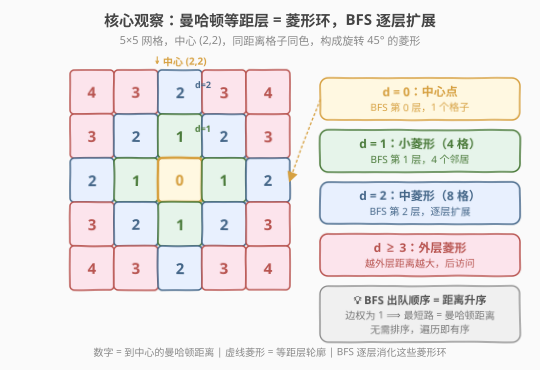
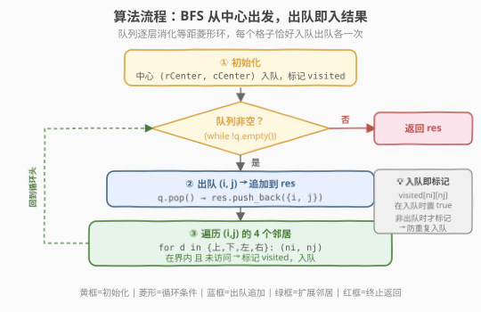
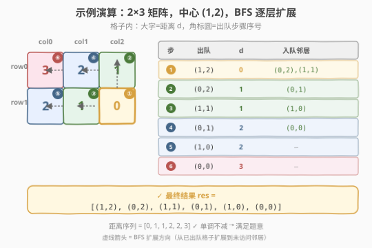

# 距离顺序排列矩阵单元格

- **题目名称**：距离顺序排列矩阵单元格
- **链接**：[1030. 距离顺序排列矩阵单元格](https://leetcode.cn/problems/matrix-cells-in-distance-order/)
- **难度**：简单
- **标签**：BFS、排序、几何

## 1. 题目概述

给定四个整数 `rows`、`cols`、`rCenter` 和 `cCenter`。有一个 $rows \times cols$ 的矩阵，你在单元格上的坐标是 $(rCenter, cCenter)$。

返回矩阵中的所有单元格的坐标，并按与 $(rCenter, cCenter)$ 的**距离**从小到大排序。可以按**任何**满足此条件的顺序返回答案。

> 💡 **距离定义**：单元格 $(r_1, c_1)$ 和 $(r_2, c_2)$ 之间的**曼哈顿距离**为 $|r_1 - r_2| + |c_1 - c_2|$。

**示例 1**：

```text
输入：rows = 1, cols = 2, rCenter = 0, cCenter = 0
输出：[[0,0],[0,1]]
解释：从 (0,0) 到其他单元格的距离为 [0,1]
```

**示例 2**：

```text
输入：rows = 2, cols = 2, rCenter = 0, cCenter = 1
输出：[[0,1],[0,0],[1,1],[1,0]]
解释：从 (0,1) 到其他单元格的距离为 [0,1,1,2]
```

**示例 3**：

```text
输入：rows = 2, cols = 3, rCenter = 1, cCenter = 2
输出：[[1,2],[0,2],[1,1],[0,1],[1,0],[0,0]]
解释：从 (1,2) 到其他单元格的距离为 [0,1,1,2,2,3]
```

**约束条件**：

- $1 \leq rows, cols \leq 100$
- $0 \leq rCenter < rows$
- $0 \leq cCenter < cols$

> ⚠️ **「按任何顺序」的含义**：同距离的格子之间顺序不限——示例 2 中 `[[0,1],[1,1],[0,0],[1,0]]` 同样正确。这意味着只需保证**距离单调不减**，无需在同距离层内排序，自然契合 BFS 的层序性质。

---

## 2. 解题思路

### 2.1 暴力思路

最直接的做法：生成全部 $rows \times cols$ 个格子坐标，然后按曼哈顿距离 `abs(i - rCenter) + abs(j - cCenter)` 排序。

```python
res = [[i, j] for i in range(rows) for j in range(cols)]
res.sort(key=lambda x: abs(x[0] - rCenter) + abs(x[1] - cCenter))
return res
```

> 💡 暴力法完全正确，且 $rows \times cols \leq 10000$ 时 `sort` 仅需 $O(N \log N) \approx 10000 \times 14 \approx 14$ 万次比较，实际跑得很快。但它**没有利用距离的几何结构**——曼哈顿距离在网格上呈现**菱形等距层**，天然可以按层枚举而无需比较排序。

### 2.2 核心观察：曼哈顿等距层 = BFS 层序



> 💡 **关键洞察**：在四连通网格上，两个格子之间的**最短路径长度恰好等于曼哈顿距离**（每走一步改变恰好 1 的距离）。因此从中心出发的 **BFS 按层扩展**——先访问距离 0（自身），再访问距离 1 的全部格子，再访问距离 2……每层恰对应一个曼哈顿等距层，输出顺序天然满足「距离从小到大」。

等距层在网格上呈**菱形**（旋转 45° 的正方形）：距离 $d$ 的格子构成以中心为对称中心、顶点到中心轴距离为 $d$ 的菱形轮廓。BFS 的队列恰好**逐层消化**这些菱形环：

| BFS 层 | 曼哈顿距离 | 该层格子数（满网格时） | 轮廓形状 |
|--------|-----------|----------------------|----------|
| 0 | 0 | 1 | 点（中心） |
| 1 | 1 | 4 | 边长 1 的小菱形 |
| 2 | 2 | 8 | 边长 2 的菱形 |
| $d$ | $d$ | $4d$（边界不裁剪时） | 边长 $d$ 的菱形 |

> ⚠️ **为何 BFS 保证有序？** BFS 的核心不变量是「队列中所有格子的距离 $\leq$ 当前层距离 $+1$，且严格按入队顺序处理」。由于每条边的权重为 1（相邻格子距离差恰好为 1），BFS 第一次访问某格子时走过的步数 = 最短路径长度 = 曼哈顿距离。因此 BFS 的访问顺序就是距离非递减序。

### 2.3 算法流程图



**BFS 流程**：

1. **初始化**：创建队列，将 $(rCenter, cCenter)$ 入队，标记 `visited[rCenter][cCenter] = true`。
2. **循环出队**：只要队列非空，取出队首 $(i, j)$，将其追加到结果数组 `res`。
3. **扩展邻居**：对 $(i, j)$ 的上下左右四个邻居 $(ni, nj)$，若在矩阵范围内且未访问过，则标记已访问并入队。
4. **终止**：队列为空时，`res` 中恰好包含全部 $rows \times cols$ 个格子，且按距离非递减排列。

> 💡 **为何入队时即标记 `visited`，而非出队时？** 防止同一格子被多个邻居重复入队。例如中心 $(2,2)$ 的右上邻居 $(1,3)$ 既是 $(1,2)$ 的右邻、又是 $(2,3)$ 的上邻——若出队才标记，它会被入队两次。**入队即标记**是 BFS 的标准范式，保证每个格子恰好入队一次。

### 2.4 示例演算



以示例 3 为例：$rows = 2, cols = 3, rCenter = 1, cCenter = 2$。矩阵与距离标注如下：

```text
     col0  col1  col2
row0   3     2     1
row1   2     1     0  ← 中心 (1,2)
```

| 步骤 | 出队格子 | 距离 | 入队邻居 | 队列（处理后） | 结果 res |
|------|---------|------|---------|---------------|----------|
| ① | (1,2) | 0 | (0,2)↑, (1,1)← | [(0,2), (1,1)] | [(1,2)] |
| ② | (0,2) | 1 | (0,1)← | [(1,1), (0,1)] | [(1,2), (0,2)] |
| ③ | (1,1) | 1 | (1,0)← | [(0,1), (1,0)] | [(1,2), (0,2), (1,1)] |
| ④ | (0,1) | 2 | (0,0)← | [(1,0), (0,0)] | [···, (0,1)] |
| ⑤ | (1,0) | 2 | 无新邻居 | [(0,0)] | [···, (1,0)] |
| ⑥ | (0,0) | 3 | 无 | [] | [···, (0,0)] |

最终 `res = [(1,2), (0,2), (1,1), (0,1), (1,0), (0,0)]`，距离序列 $[0, 1, 1, 2, 2, 3]$ ✓

> 💡 **观察邻居入队方向**：每步的入队邻居是「上/下/左/右」中未访问且在界内的。步骤②从 $(0,2)$ 只向左扩展 $(0,1)$——向上越界、向右越界、向下是已访问的中心。步骤⑤从 $(1,0)$ 无新邻居——向上是已访问的 $(0,0)$（步骤④刚入队）、向左越界、向下越界、向右是已访问的 $(1,1)$。

---

## 3. 参考代码

### C++

```cpp
class Solution {
    int dx[4] = {0, 0, 1, -1};
    int dy[4] = {1, -1, 0, 0};
  public:
    vector<vector<int>> allCellsDistOrder(int rows, int cols, int rCenter, int cCenter) {
        vector<vector<int>> res;
        res.reserve(rows * cols);
        vector<vector<char>> visited(rows, vector<char>(cols, 0));
        queue<pair<int, int>> q;
        q.push({rCenter, cCenter});
        visited[rCenter][cCenter] = 1;
        while (!q.empty()) {
            auto [i, j] = q.front();
            q.pop();
            res.push_back({i, j});
            for (int d = 0; d < 4; d++) {
                int ni = i + dx[d], nj = j + dy[d];
                if (ni >= 0 && ni < rows && nj >= 0 && nj < cols && !visited[ni][nj]) {
                    visited[ni][nj] = 1;
                    q.push({ni, nj});
                }
            }
        }
        return res;
    }
};
```

### Python

```python
from collections import deque
from typing import List

class Solution:
    def allCellsDistOrder(self, rows: int, cols: int, rCenter: int, cCenter: int) -> List[List[int]]:
        res = []
        visited = [[False] * cols for _ in range(rows)]
        q = deque([(rCenter, cCenter)])
        visited[rCenter][cCenter] = True
        while q:
            i, j = q.popleft()
            res.append([i, j])
            for di, dj in [(0, 1), (0, -1), (1, 0), (-1, 0)]:
                ni, nj = i + di, j + dj
                if 0 <= ni < rows and 0 <= nj < cols and not visited[ni][nj]:
                    visited[ni][nj] = True
                    q.append((ni, nj))
        return res
```

> 💡 **`visited` 用 `char`/`bool` 而非 `int`**：仅作存在性标记，无需计数，用最小类型节省空间。C++ 中 `vector<char>` 比 `vector<int>` 省 4 倍内存，在 $100 \times 100$ 网格下差异不大但养成习惯有益。

---

## 4. 复杂度分析

| 维度 | 复杂度 | 说明 |
|------|--------|------|
| 时间复杂度 | $O(rows \times cols)$ | 每个格子恰好入队、出队各一次；每步扩展 4 个邻居，总计 $4 \times rows \times cols$ 次邻接检查，线性 |
| 空间复杂度 | $O(rows \times cols)$ | `visited` 矩阵 $O(rows \times cols)$；BFS 队列最坏存约半数格子 $O(rows \times cols)$；结果数组 $O(rows \times cols)$ |

> 💡 **对比暴力排序**：暴力法时间 $O(N \log N)$、空间 $O(N)$（$N = rows \times cols$）。BFS 牺牲一点空间（多一个 `visited` 矩阵）换取时间降到 $O(N)$，但实际差距很小（$N \leq 10000$）。BFS 的价值在于**展示了「利用几何结构避免比较排序」的思维**，而非性能本身。

---

## 5. 扩展：桶排序——另一种 $O(N)$ 方案

BFS 并非唯一的线性解法。**按距离分桶**同样可以 $O(N)$ 完成排序：

```python
class Solution:
    def allCellsDistOrder(self, rows: int, cols: int, rCenter: int, cCenter: int) -> List[List[int]]:
        max_dist = rows + cols - 2
        buckets = [[] for _ in range(max_dist + 1)]
        for i in range(rows):
            for j in range(cols):
                d = abs(i - rCenter) + abs(j - cCenter)
                buckets[d].append([i, j])
        res = []
        for d in range(max_dist + 1):
            res.extend(buckets[d])
        return res
```

> 💡 **为何是桶排序而非计数排序？** 计数排序对每个键只存计数，无法还原原始元素（格子坐标）。桶排序为每个键（距离值）维护一个列表，存入所有该距离的格子——本质是**键值域已知的桶排序**，键域为 $[0, rows + cols - 2]$。

| 方案 | 时间 | 空间 | 优劣 |
|------|------|------|------|
| 直接排序 | $O(N \log N)$ | $O(N)$ | 最简洁，一行代码 |
| **BFS** | $O(N)$ | $O(N)$ | 利用几何结构，思维含量高 |
| **桶排序** | $O(N)$ | $O(N)$ | 直观，无需 `visited`，遍历两遍 |

> ⚠️ **面试怎么选？** 若面试官只要求「写出正确解」，直接排序最稳。若追问「能否 $O(N)$」，BFS 和桶排序都是好答案——BFS 展示图论直觉，桶排序展示排序理论，各有亮点。

---

## 6. 面试要点

1. **为什么 BFS 的输出顺序就是距离顺序？**

   - 在四连通网格上，相邻格子的曼哈顿距离差恰好为 1，等价于**边权全为 1 的无权图**。BFS 在无权图上的核心性质是「按最短路径长度分层扩展」，而最短路径长度 = 曼哈顿距离。因此 BFS 的出队顺序天然按距离非递减排列。

2. **为什么要「入队即标记 visited」而不是「出队才标记」？**

   - 若出队才标记，同一格子可能被多个邻居重复入队。例如 $(1,1)$ 既是 $(0,1)$ 的下邻、又是 $(1,0)$ 的右邻、又是 $(2,1)$ 的上邻、又是 $(1,2)$ 的左邻——四个邻居都可能把它入队。入队即标记保证每个格子恰好入队一次，队列中无重复。

3. **BFS 和桶排序哪个更好？**

   - 两者都是 $O(N)$ 时间。BFS 只遍历一遍，但需要 `visited` 矩阵和队列；桶排序遍历两遍（填桶 + 展开），但无需 `visited`，且按行优先序遍历更缓存友好。实际性能差异可忽略。BFS 的优势是**可推广到更复杂的图最短路问题**，桶排序的优势是**实现更简单且不依赖图结构**。

4. **曼哈顿距离的等距层为什么是菱形？**

   - 距离 $d$ 的格子满足 $|i - r| + |j - c| = d$，在 $(i, j)$ 平面上这是以 $(r, c)$ 为中心、旋转 45° 的正方形（菱形）。四个顶点分别在 $(r-d, c)$、$(r, c+d)$、$(r+d, c)$、$(r, c-d)$。满网格时第 $d$ 层有 $4d$ 个格子。

5. **如果题目改为欧几里得距离呢？**

   - BFS 不再适用——相邻格子的欧几里得距离不是常数（水平和斜向不同），图不再无权。只能用排序或更复杂的算法。这正说明 BFS 有序性**依赖曼哈顿距离 = 网格最短路径这一等价关系**，换距离定义则失效。

---

## 7. 同类练习题

- [994. 腐烂的橘子](https://leetcode.cn/problems/rotting-oranges/)（[题解](../0901-1000/994_腐烂的橘子.md)）：多源 BFS 逐层扩展，与本题「BFS 按层访问」同源，只是从单源变为多源、目标从「输出顺序」变为「求最大层数」
- [542. 01 矩阵](https://leetcode.cn/problems/01-matrix/)：多源 BFS 求每个格子到最近 0 的曼哈顿距离——逆向使用本题的「BFS = 曼哈顿距离分层」性质，从所有 0 出发扩散
- [1091. 二进制矩阵中的最短路径](https://leetcode.cn/problems/shortest-path-in-binary-matrix/)：八连通 BFS 求左上到右下的最短路径，进一步验证「无权图 BFS = 最短路径」范式
- [417. 太平洋大西洋水流问题](https://leetcode.cn/problems/pacific-atlantic-water-flow/)（[题解](../0401-0500/417_太平洋大西洋水流问题.md)）：从边界反向多源 BFS/DFS 标记可达集，与本题同为「从特定源出发逐层扩散」的 BFS 范式
- [200. 岛屿数量](https://leetcode.cn/problems/number-of-islands/)（[题解](../0101-0200/200_岛屿数量.md)）：网格 BFS/DFS 沉岛计数母题，本题的 BFS 模板原型
