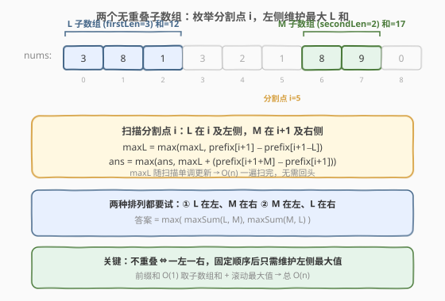
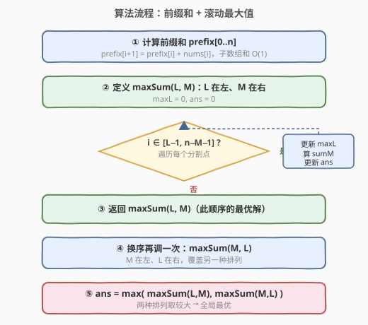
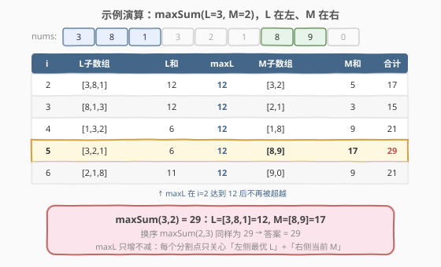

# LeetCode 两个无重叠子数组的最大和 题解

## 1. 题目概述

- **标题 / 题号**：两个无重叠子数组的最大和（#1031，medium）
- **链接**：https://leetcode.cn/problems/maximum-sum-of-two-non-overlapping-subarrays/
- **难度**：中等
- **标签**：数组、动态规划、前缀和

**题意**：给定一个整数数组 `nums` 和两个整数 `firstLen` 与 `secondLen`，找出两个**无重叠**的连续子数组，长度分别为 `firstLen` 和 `secondLen`，使二者元素之和最大，返回该最大和。

长度为 `firstLen` 的子数组可以出现在 `secondLen` 子数组**之前或之后**，但二者不能重叠。子数组是数组的**连续**部分。

**示例 1**：

```text
输入：nums = [0,6,5,2,2,5,1,9,4], firstLen = 1, secondLen = 2
输出：20
解释：子数组 [9] 长度为 1（和 9），[6,5] 长度为 2（和 11），总计 20。
```

**示例 2**：

```text
输入：nums = [3,8,1,3,2,1,8,9,0], firstLen = 3, secondLen = 2
输出：29
解释：子数组 [3,8,1] 长度为 3（和 12），[8,9] 长度为 2（和 17），总计 29。
```

**示例 3**：

```text
输入：nums = [2,1,5,6,0,9,5,0,3,8], firstLen = 4, secondLen = 3
输出：31
解释：子数组 [5,6,0,9] 长度为 4（和 20），[0,3,8] 长度为 3（和 11），总计 31。
```

**约束**：

- $1 \leq \text{firstLen}, \text{secondLen} \leq 1000$
- $2 \leq \text{firstLen} + \text{secondLen} \leq 1000$
- $\text{firstLen} + \text{secondLen} \leq \text{nums.length} \leq 1000$
- $0 \leq \text{nums}[i] \leq 1000$

> ⚠️ **「无重叠」的含义**：两个子数组在原数组中不能共享任何一个下标位置。由于二者均为连续段，不重叠等价于**一个整体在另一个的左侧**——这正是后续把问题拆成两种顺序的理论依据。

## 2. 解题思路

### 2.1 暴力思路

枚举两个子数组的起始位置 $i$（长 `firstLen` 段）和 $j$（长 `secondLen` 段），保证两段不重叠：

$$[i, i+\text{firstLen}-1] \cap [j, j+\text{secondLen}-1] = \emptyset$$

对每对合法的 $(i, j)$ 计算两段之和取最大。子数组和可用前缀和 $O(1)$ 求得，但枚举起点对仍是 $O(n^2)$，$n \leq 1000$ 时约 $10^6$ 次组合，勉强可过却**没有利用「一左一右」的结构**——绝大多数 $(i, j)$ 对都是无意义的重叠组合。

> 💡 暴力的浪费在于：它把两个子数组看作「两个独立自由变量」，而实际上不重叠约束把两者限制成**一左一右的有序关系**。一旦固定了谁在左、谁在右，右侧子数组的位置确定后，左侧只需关心「左侧所有同长段中的最大和」这一个标量。

### 2.2 核心观察：固定顺序 + 滚动最大值



**关键洞察**：两个不重叠的连续段，必然是一个在左、一个在右。于是只需考虑两种排列：

- **排列 ①**：长 `firstLen` 段在左，长 `secondLen` 段在右
- **排列 ②**：长 `secondLen` 段在左，长 `firstLen` 段在右

对任一固定排列（设左段长 $L$、右段长 $M$），枚举**分割点 $i$**：左段结束于 $i$ 及之前，右段起始 于 $i+1$ 及之后。此时：

- **左段最优和 `maxL`**：随着 $i$ 从左到右扫描，左段候选（以 $i$ 结尾的 $L$ 长子数组）逐个出现，`maxL` 取其历史最大值——这是一个**只增不减的滚动标量**，$O(1)$ 维护。
- **右段当前和 `sumM`**：以 $i+1$ 起头的 $M$ 长子数组，前缀和 $O(1)$ 求得。
- **候选答案**：`maxL + sumM`。

每步 $O(1)$，整体一趟扫描 $O(n)$。两种排列各扫一遍，总 $O(n)$。

> 💡 **为何 `maxL` 取「以 $i$ 结尾」而非「以任意 $\leq i$ 结尾」？** 扫描时每到一个新 $i$，把「以 $i$ 结尾的 $L$ 长段」纳入候选并更新 `maxL = max(maxL, 当前L段和)`。由于 `max` 累积了所有历史值，`maxL` 实际表示的就是「结束位置 $\leq i$ 的所有 $L$ 长段的最大和」——这正是分割点 $i$ 左侧的最优左段。右段则固定取「以 $i+1$ 起头的 $M$ 长段」，因为它紧跟分割点，是当前 $i$ 下唯一需要考察的右段。

> ⚠️ **两种排列都要试**：不能只试 `firstLen` 在左，因为最优解可能恰好是 `secondLen` 段在左（例如示例 1 中 `[6,5]` 在左、`[9]` 在右才是最优 20，反过来 `[9]` 在左只能拿到 19）。

### 2.3 算法流程图



**流程要点**：

1. **前缀和**：`prefix[i+1] = prefix[i] + nums[i]`，任意子数组 `nums[l..r]` 的和 = `prefix[r+1] - prefix[l]`，$O(1)$。
2. **辅助函数 `maxSum(L, M)`**：处理「$L$ 段在左、$M$ 段在右」这一种排列。
   - 扫描分割点 $i \in [L-1,\ n-M-1]$（保证左段不越左界、右段不越右界）。
   - 每步：`maxL = max(maxL, prefix[i+1] - prefix[i+1-L])`，`sumM = prefix[i+1+M] - prefix[i+1]`，`ans = max(ans, maxL + sumM)`。
3. **两次调用**：`max(maxSum(firstLen, secondLen), maxSum(secondLen, firstLen))`。

> 💡 **下标推导**：左段以 $i$ 结尾 ⇒ 占据 $[i-L+1,\ i]$，和 = `prefix[i+1] - prefix[i+1-L]`；右段以 $i+1$ 起头 ⇒ 占据 $[i+1,\ i+M]$，和 = `prefix[i+1+M] - prefix[i+1]`。合法范围：左段起 $\geq 0$ 得 $i \geq L-1$；右段终 $\leq n-1$ 得 $i \leq n-M-1$。

### 2.4 示例演算



以示例 2 `nums = [3,8,1,3,2,1,8,9,0]`、`firstLen=3`、`secondLen=2` 为例，演示排列 ① `maxSum(L=3, M=2)`（$L$ 段在左）：

`prefix = [0, 3, 11, 12, 15, 17, 18, 26, 35, 35]`，分割点 $i$ 从 $2$ 到 $6$：

| $i$ | 左段(以 $i$ 结尾, 长 3) | 左段和 | `maxL` | 右段(以 $i+1$ 起头, 长 2) | 右段和 | `maxL`+右段和 |
|-----|------------------------|--------|--------|--------------------------|--------|--------------|
| 2 | `[3,8,1]` | 12 | **12** | `[3,2]` | 5 | 17 |
| 3 | `[8,1,3]` | 12 | **12** | `[2,1]` | 3 | 15 |
| 4 | `[1,3,2]` | 6 | **12** | `[1,8]` | 9 | 21 |
| 5 | `[3,2,1]` | 6 | **12** | `[8,9]` | 17 | **29** |
| 6 | `[2,1,8]` | 11 | **12** | `[9,0]` | 9 | 21 |

`maxSum(3, 2) = 29`（左段 `[3,8,1]=12`、右段 `[8,9]=17`）。注意 `maxL` 在 $i=2$ 即达到 12 后再未被超越——后续左段和都不超过 12，所以候选答案完全由右段和拉动，$i=5$ 时右段 `[8,9]=17` 最大，得到 29。

> 💡 **换序验证**：排列 ② `maxSum(2, 3)`（`secondLen=2` 段在左）扫描后同样得到 29（左段 `[3,8]=11`、右段 `[1,8,9]=18`，$11+18=29$）。两种排列取较大仍为 29 ✓。

## 3. 参考代码

### C++

```cpp
class Solution {
  public:
    int maxSumTwoNoOverlap(vector<int>& nums, int firstLen, int secondLen) {
        int n = nums.size();
        vector<int> prefix(n + 1, 0);
        for (int i = 0; i < n; ++i)
            prefix[i + 1] = prefix[i] + nums[i];
        return max(maxSum(prefix, firstLen, secondLen),
                   maxSum(prefix, secondLen, firstLen));
    }

  private:
    // L 段在左、M 段在右，返回该排列下的最大和
    int maxSum(const vector<int>& prefix, int L, int M) {
        int n = (int)prefix.size() - 1;
        int maxL = 0, ans = 0;
        for (int i = L - 1; i <= n - M - 1; ++i) {
            maxL = max(maxL, prefix[i + 1] - prefix[i + 1 - L]);
            int sumM = prefix[i + 1 + M] - prefix[i + 1];
            ans = max(ans, maxL + sumM);
        }
        return ans;
    }
};
```

### Python

```python
from typing import List

class Solution:
    def maxSumTwoNoOverlap(self, nums: List[int], firstLen: int, secondLen: int) -> int:
        n = len(nums)
        prefix = [0] * (n + 1)
        for i in range(n):
            prefix[i + 1] = prefix[i] + nums[i]

        def max_sum(L: int, M: int) -> int:
            maxL = 0
            ans = 0
            for i in range(L - 1, n - M):
                maxL = max(maxL, prefix[i + 1] - prefix[i + 1 - L])
                sumM = prefix[i + 1 + M] - prefix[i + 1]
                ans = max(ans, maxL + sumM)
            return ans

        return max(max_sum(firstLen, secondLen), max_sum(secondLen, firstLen))
```

> ⚠️ **两个易错点**：
> 1. **循环范围**：左段以 $i$ 结尾需 $i \geq L-1$（左段起 $\geq 0$），右段以 $i+1$ 起头需 $i+M \leq n-1$ 即 $i \leq n-M-1$。Python `range(L-1, n-M)` 上界排除 $n-M$ 恰好到 $n-M-1$；C++ 写 `i <= n - M - 1`。范围写错会漏掉边界分割点或越界访问 `prefix`。
> 2. **两种顺序都要调用**：仅调用 `max_sum(firstLen, secondLen)` 会漏掉「`secondLen` 段在左」的最优解。务必 `max(max_sum(L,M), max_sum(M,L))`。

> 💡 **`maxL` 初始化为 0 安全吗？** 安全。题目保证 $0 \leq \text{nums}[i] \leq 1000$，所有子数组和 $\geq 0$，`maxL` 从 0 开始不会误判。若元素可能为负，应将 `maxL`/`ans` 初始化为 `INT_MIN`/负无穷。

## 4. 复杂度分析

| 维度 | 复杂度 | 说明 |
|------|--------|------|
| 时间复杂度 | $O(n)$ | 前缀和预处理 $O(n)$；`maxSum` 单趟扫描 $O(n)$，调用两次共 $O(n)$；总计线性 |
| 空间复杂度 | $O(n)$ | 前缀和数组 `prefix` 占 $O(n)$；其余常数变量 |

> 💡 $n \leq 1000$ 时 $O(n)$ 极其宽裕，即便 $O(n^2)$ 暴力也能通过。本解法的价值在于**展示「不重叠 ⇒ 一左一右 ⇒ 滚动最大值」的降维思维**——把双变量枚举降到单变量扫描，可推广到更大的 $n$ 与更多子数组的变体。

## 5. 扩展：DP 左右预处理法

除「滚动最大值」外，还有一种等价的**左右预处理 DP** 写法，思路更显式：

- `leftMaxL[i]`：`nums[0..i]` 中长度为 $L$ 的子数组的最大和。
- `rightMaxM[i]`：`nums[i..n-1]` 中长度为 $M$ 的子数组的最大和。

预处理后，枚举分割点 $i$：`ans = max(ans, leftMaxL[i] + rightMaxM[i+1])`。

```python
def maxSumTwoNoOverlap(self, nums, firstLen, secondLen):
    n = len(nums)
    prefix = [0] * (n + 1)
    for i in range(n):
        prefix[i + 1] = prefix[i] + nums[i]

    def help(L, M):
        leftMax = [0] * n
        for i in range(L - 1, n):
            cur = prefix[i + 1] - prefix[i + 1 - L]
            leftMax[i] = cur if i == L - 1 else max(leftMax[i - 1], cur)
        rightMax = [0] * n
        for i in range(n - M, -1, -1):
            cur = prefix[i + M] - prefix[i]
            rightMax[i] = cur if i == n - M else max(rightMax[i + 1], cur)
        ans = 0
        for i in range(L - 1, n - M):
            ans = max(ans, leftMax[i] + rightMax[i + 1])
        return ans

    return max(help(firstLen, secondLen), help(secondLen, firstLen))
```

> 💡 **与滚动最大值的对照**：两者本质相同——`leftMax[i]` 就是滚动解法里的 `maxL`，只是显式存成数组。滚动最大值法**省去 `leftMax`/`rightMax` 两个数组**，把空间从 $O(n)$ 降到 $O(1)$（不计前缀和），更精简。DP 预处理法的优势在于**可读性强、便于扩展到三段及以上**（如求三个不重叠子数组的最大和时，左右预处理更直观）。

## 6. 面试要点

1. **为什么两个不重叠子数组必然是一左一右？**

   - 两个连续段若不重叠，则不存在共享下标。设两段区间为 $[a,b]$ 与 $[c,d]$，不重叠意味着 $b < c$ 或 $d < a$——即一个区间的右端严格小于另一个的左端。无论哪种情况都是「一段在左、一段在右」的有序关系，不可能交错或嵌套。

2. **为什么需要调用两次 `maxSum`？只调一次会怎样？**

   - `maxSum(L, M)` 只考虑了 $L$ 段在左、$M$ 段在右的排列。最优解可能出现在另一种顺序（$M$ 段在左、$L$ 段在右）。例如示例 1 最优解 `[6,5]` 在左、`[9]` 在右（和 20），若只试 `[9]` 在左则最多拿到 19，漏掉正确答案。

3. **`maxL` 为什么能代表「分割点 $i$ 左侧所有 $L$ 长段的最优」？**

   - 扫描时每到一个 $i$，把「以 $i$ 结尾的 $L$ 长段」纳入候选并执行 `maxL = max(maxL, 该段和)`。由于 `max` 累积了从起点到 $i$ 的所有历史候选，`maxL` 恰是「结束位置 $\leq i$ 的全部 $L$ 长段的最大和」。这是**前缀最大值**的滚动维护，$O(1)$ 每步。

4. **前缀和在这里起什么作用？**

   - 任意连续子数组 `nums[l..r]` 的和 = `prefix[r+1] - prefix[l]`，$O(1)$ 取得。若无前缀和，每次求子数组和需 $O(L)$ 或 $O(M)$，整体退化为 $O(n \cdot (L+M))$。前缀和把「取段和」常数化，是滚动最大值法线性复杂度的基础。

5. **如果 `nums[i]` 可能为负，代码要改哪里？**

   - `maxL` 与 `ans` 不能初始化为 0（可能所有段和为负，0 会误判为更优）。应初始化为负无穷（Python 用 `float('-inf')`，C++ 用 `INT_MIN`）。其余逻辑不变——`max` 累积仍正确。

## 同类练习题

| # | 题目 | 与本题的关联 |
|---|------|-------------|
| 53 | [最大子数组和](https://leetcode.cn/problems/maximum-subarray/)（[题解](../0001-0100/53_最大子数组和.md)） | 单段最大子数组和，前缀和 + 维护最小前缀的同一套思路，本题是其「双段不重叠」扩展 |
| 689 | [三个无重叠子数组的最大和](https://leetcode.cn/problems/maximum-sum-of-3-non-overlapping-subarrays/) | 本题扩展到三段，左右预处理 DP 更直观，固定一段后两侧各取最优 |
| 1423 | [可获得的最大点数](https://leetcode.cn/problems/maximum-points-you-can-obtain-from-cards/) | 从两端取连续段求最大和，本质也是「两段不重叠」（中间剩余段），前缀和 + 滑窗思路 |
| 410 | [分割数组的最大值](https://leetcode.cn/problems/split-array-largest-sum/)（[题解](../0401-0500/410_分割数组的最大值.md)） | 连续分段求最值，前缀和配合二分答案/DP，对照本题「固定段长」的简化情形 |
| 209 | [长度最小的子数组](https://leetcode.cn/problems/minimum-size-subarray-sum/)（[题解](../0201-0300/209_长度最小的子数组.md)） | 前缀和 + 单调性扫描的基础模板，承接本题前缀和使用范式 |
