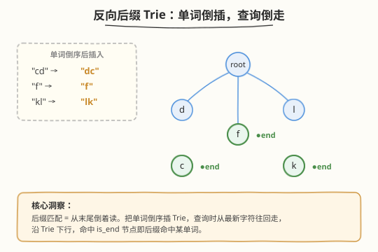

# 字符流

- **题目名称**：字符流
- **链接**：[1032. 字符流](https://leetcode.cn/problems/stream-of-characters/)
- **难度**：困难
- **标签**：字典树、设计、字符串

## 1. 题目概述

设计一个算法，接受一个**字符流**，并在每次接收新字符时判断：当前字符流的**某个后缀**是否等于给定单词列表中的某个单词。

实现 `StreamChecker` 类：
- `StreamChecker(String[] words)`：用单词列表初始化。
- `boolean query(char letter)`：接收一个新字符，若当前字符流的某个后缀（可以是整个流）恰好等于 `words` 中某个单词，返回 `true`，否则 `false`。

**示例**：

```text
输入：
["StreamChecker", "query", "query", "query", "query", "query", "query", "query"]
[[["cd", "f", "kl"]], ["a"], ["b"], ["c"], ["d"], ["e"], ["f"], ["g"]]

输出：[null, false, false, false, true, false, true, false]

解释：
StreamChecker sc = new StreamChecker(["cd", "f", "kl"]);
sc.query("a");  // false，流 = "a"，后缀无匹配
sc.query("b");  // false，流 = "ab"
sc.query("c");  // false，流 = "abc"
sc.query("d");  // true， 流 = "abcd"，后缀 "cd" 命中
sc.query("e");  // false，流 = "abcde"
sc.query("f");  // true， 流 = "abcdef"，后缀 "f" 命中
sc.query("g");  // false，流 = "abcdefg"
```

**约束条件**：

- $1 \leq \text{words.length} \leq 2000$
- $1 \leq \text{words[i].length} \leq 200$
- `words[i]` 仅由小写英文字母组成
- `query` 最多被调用 $4 \times 10^4$ 次
- `letter` 是小写英文字母

---

## 2. 解题思路

### 2.1 暴力思路：每次检查所有后缀

每次 `query` 后，字符流增长一个字符。最直接的做法：对当前流的所有后缀（从全长到单字符），逐一在单词集合中查找。

设流长为 $n$、单词最大长度为 $L$，则每次查询需检查 $O(\min(n, L))$ 个后缀，每个后缀哈希查找 $O(L)$，单次查询 $O(L^2)$。$4 \times 10^4$ 次查询 $\times\ 200^2 = 1.6 \times 10^9$，超时。

> 💡 **瓶颈**：后缀是「从末尾倒着读」的。暴力做法每次都从零开始枚举后缀，无法复用前次查询的结构。需要一个能**按字符快速匹配后缀**的数据结构。

### 2.2 核心观察：反向后缀 Trie



关键洞察：**后缀匹配 = 从末尾倒着读**。

- 把每个单词**倒序**后插入 Trie。例如 `"cd"` 倒序为 `"dc"`，插入路径 `root → d → c`。
- 查询时，从流的**最新字符**开始，沿 Trie **倒着走**（即从 `stream` 末尾向前逐字符匹配 Trie 边）。
- 若走到某个 `is_end` 节点，说明某个倒序单词被完整匹配——即原单词恰好是当前流的后缀。

> ⚠️ **为什么必须反向？** 正向 Trie 只能匹配前缀。若正向插入 `"cd"`，查询时要从流**开头**匹配，但后缀的起点未知（流中任意位置都可能是某单词的起点）。反向后，Trie 从**末尾**（已知位置）开始匹配，起点固定为最新字符，每次查询只需 $O(L)$ 一次遍历。

### 2.3 算法流程图


流程要点：

- **初始化**：所有单词倒序插入 Trie，记录最长单词长度 `maxLen`。
- **查询**：将 `letter` 追加到流末尾，从 `stream[len-1]` 开始向左走，沿 Trie 下行。
- **截断优化**：倒走步数不超过 `maxLen`——比最长单词还长的后缀不可能命中。
- **终止条件**：遇到 `is_end` 节点 → `true`；Trie 无对应边 → `false`；走完 `maxLen` 步仍未命中 → `false`。

### 2.4 示例演算

![示例演算：words = ["cd","f","kl"]](../images/streamchecker_walkthrough.svg)

以 `words = ["cd", "f", "kl"]` 为例，倒序插入后 Trie 结构为：

| 原单词 | 倒序 | Trie 路径 |
|--------|------|-----------|
| `"cd"` | `"dc"` | root → d → c● |
| `"f"`  | `"f"`  | root → f● |
| `"kl"` | `"lk"` | root → l → k● |

字符流逐步为 `a → b → c → d → e → f → …`，关键查询步：

| query | 流尾部 | Trie 倒走 | 命中 | 结果 |
|-------|--------|-----------|------|------|
| `c`   | `…c`   | root→c? 无此边 | ✗ | `false` |
| `d`   | `…cd`  | root→d→c● | ✓ | **`true`** |
| `e`   | `…cde` | root→e? 无此边 | ✗ | `false` |
| `f`   | `…ef`  | root→f● | ✓ | **`true`** |
| `k`   | `…jk`  | root→k? 无此边 | ✗ | `false` |
| `l`   | `…jkl` | root→l→k● | ✓ | **`true`** |

> 💡 **`query('d')` 详解**：流为 `"abcd"`，从末尾 `d` 开始倒走：`root → d`（存在）`→ c`（存在且 `is_end`）→ 命中倒序单词 `"dc"`，即原单词 `"cd"` 是 `"abcd"` 的后缀，返回 `true`。

---

## 3. 参考代码

### C++

```cpp
class StreamChecker {
    struct TrieNode {
        TrieNode* children[26] = {};
        bool is_end = false;
    };
    TrieNode* root;
    string stream;
    int maxLen = 0;

  public:
    StreamChecker(vector<string>& words) {
        root = new TrieNode();
        for (string& w : words) {
            TrieNode* node = root;
            for (int i = (int)w.size() - 1; i >= 0; --i) {
                int idx = w[i] - 'a';
                if (!node->children[idx])
                    node->children[idx] = new TrieNode();
                node = node->children[idx];
            }
            node->is_end = true;
            maxLen = max(maxLen, (int)w.size());
        }
    }

    bool query(char letter) {
        stream.push_back(letter);
        TrieNode* node = root;
        for (int i = (int)stream.size() - 1, step = 0;
             i >= 0 && step < maxLen; --i, ++step) {
            int idx = stream[i] - 'a';
            if (!node->children[idx]) return false;
            node = node->children[idx];
            if (node->is_end) return true;
        }
        return false;
    }
};
```

### Python

```python
class StreamChecker:
    def __init__(self, words: List[str]):
        self.root = {}
        self.stream = []
        self.max_len = 0
        for w in words:
            node = self.root
            for ch in reversed(w):
                if ch not in node:
                    node[ch] = {}
                node = node[ch]
            node['#'] = True
            self.max_len = max(self.max_len, len(w))

    def query(self, letter: str) -> bool:
        self.stream.append(letter)
        node = self.root
        start = len(self.stream) - 1
        stop = max(-1, start - self.max_len)
        for i in range(start, stop, -1):
            ch = self.stream[i]
            if ch not in node:
                return False
            node = node[ch]
            if '#' in node:
                return True
        return False
```

> ⚠️ **易错点**：`maxLen` 截断是**必须**的——不加截断，流增长到 $4 \times 10^4$ 字符后，每次查询要倒走整个流，单次 $O(n)$ 退化为 $O(4 \times 10^4)$，总量 $1.6 \times 10^9$ 超时。加了截断后单次查询 $O(\min(n, L)) = O(L) = O(200)$，总量 $8 \times 10^6$，轻松通过。

---

## 4. 复杂度分析

| 维度 | 复杂度 | 说明 |
|------|--------|------|
| 初始化时间 | $O(N \cdot L)$ | $N$ 个单词各倒序插入 Trie，每个 $O(L)$ |
| 单次 query | $O(\min(n, L))$ | 倒走最多 $L$ 步（`maxLen` 截断），$n$ 为当前流长 |
| 总查询时间 | $O(Q \cdot L)$ | $Q$ 次查询 × 每次 $L$ 步，$Q = 4 \times 10^4$，$L \leq 200$ |
| 空间 | $O(N \cdot L)$ | Trie 节点总数上限 $N \cdot L$（共享前缀时更少） |

> 💡 本题 $Q \cdot L = 4 \times 10^4 \times 200 = 8 \times 10^6$，远低于时限。`maxLen` 截断是关键优化——将单次查询从 $O(n)$（流长）降到 $O(L)$（单词长度上限）。

---

## 5. 扩展：Aho-Corasick 自动机

反向 Trie 已是本题最优解，但若问题变为**同时匹配多个模式串在前缀位置**（而非后缀），则需 Aho-Corasick（AC 自动机）：

- AC 自动机在 Trie 上构建 `fail` 指针（类似 KMP 的 next 数组），实现**一次扫描文本匹配所有模式串**。
- 本题用反向 Trie 是因为后缀匹配的起点固定（流末尾），AC 自动机适用于前缀/任意位置匹配，杀鸡用牛刀。

> 💡 **何时用 AC 自动机**：当需要在一段文本中找到**所有出现的**模式串（如敏感词过滤），而非仅判断后缀是否命中时。参考 [214. 最短回文串](../0201-0300/214_最短回文串.md) 的 KMP 思想是 AC 自动机的一维特例。

---

## 6. 面试要点

1. **为什么要把单词倒序插入 Trie？**

   - 后缀匹配的本质是「从末尾倒着读」。正向 Trie 只能匹配前缀（起点已知、终点未知），后缀的起点未知而终点已知（流的最新字符）。倒序插入后，Trie 从最新字符出发向下走，恰好等价于从后缀终点向后缀起点匹配，起点固定、方向确定，每次查询只需 $O(L)$ 一次遍历。

2. **为什么不直接用哈希集合存所有后缀？**

   - 每次查询流增长一个字符，可能产生 $O(L)$ 个新后缀（长度 1 到 $L$），全部存入哈希集合则单次查询 $O(L^2)$（生成 $L$ 个子串）。反向 Trie 只走一条路径、$O(L)$ 步，且共享前缀省空间，远优于暴力哈希。

3. **`maxLen` 截断的作用是什么？不加会怎样？**

   - 最长单词长度 `maxLen` 限制了倒走步数：比 `maxLen` 更长的后缀不可能命中任何单词。不加截断时，流增长到 $4 \times 10^4$ 字符后，每次查询倒走整个流 $O(n)$，总量 $O(Q \cdot n) = O(Q^2) = 1.6 \times 10^9$ 超时。加截断后单次 $O(L)$，总量 $O(Q \cdot L) = 8 \times 10^6$ 通过。

4. **与 [208. 实现 Trie](../0201-0300/208_实现Trie.md) 有何异同？**

   - **同**：都用 Trie 的 `children[26]` + `is_end` 结构，插入逻辑相同。
   - **异**：208 是正向插入、正向查询（前缀匹配）；本题是反向插入、反向查询（后缀匹配）。208 的 `search` 走完整条路径才判 `is_end`，本题在**路径中间任意节点**命中 `is_end` 即返回 `true`（因为倒序单词可能比当前后缀短）。

5. **能否用后缀数组 / 后缀自动机？**

   - 理论可行但过度复杂。后缀数组适合静态文本的批量后缀查询，本题是**在线**流式查询（文本不断增长）。后缀自动机支持在线扩展但实现复杂度远超反向 Trie。反向 Trie + `maxLen` 截断已是本题的最优平衡点。

---

## 7. 同类练习题

- [208. 实现 Trie (前缀树)](https://leetcode.cn/problems/implement-trie-prefix-tree/)（[题解](../0201-0300/208_实现Trie.md)）：Trie 基础模板，对比正向插入/查询与本题反向插入/查询
- [211. 添加与搜索单词](https://leetcode.cn/problems/design-add-and-search-words-data-structure/)（[题解](../0201-0300/211_添加与搜索单词.md)）：Trie + 通配符 DFS，扩展 Trie 的查询能力
- [676. 实现一个魔法字典](https://leetcode.cn/problems/implement-magic-dictionary/)：Trie + 恰好一处不等的匹配，变体 Trie 查询
- [745. 前缀和后缀搜索](https://leetcode.cn/problems/prefix-and-suffix-search/)：同时支持前缀和后缀查询，可用双 Trie 或后缀拼接 Trie
- [214. 最短回文串](https://leetcode.cn/problems/shortest-palindrome/)（[题解](../0201-0300/214_最短回文串.md)）：KMP 求「最长回文前缀」，与反向匹配思想一脉相承（KMP 是一维的 fail 指针，Trie 是树形的）
