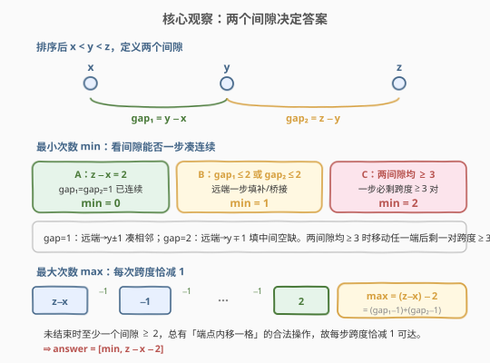
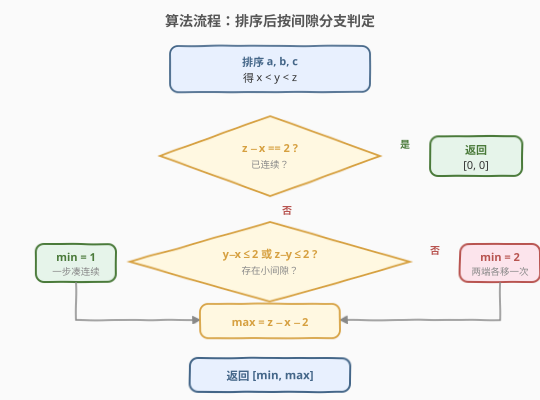
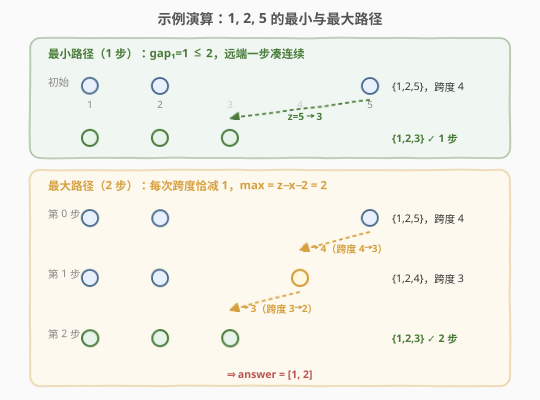

# LeetCode 移动石子直到连续 题解

## 1. 题目概述

- **标题 / 题号**：移动石子直到连续（#1033，medium）
- **链接**：https://leetcode.cn/problems/moving-stones-until-consecutive/
- **难度**：中等
- **标签**：数学、脑筋急转弯、贪心

**题意**：三枚石子放置在数轴上，位置分别为 `a`、`b`、`c`（互不相同）。每一回合，你可以从两端之一（位置最大或最小的石子）拿起一枚，放入两端之间的任一**空闲**整数位置 $k$，要求 $x < k < z$ 且 $k \neq y$（其中 $x < y < z$ 为当前三枚石子的有序位置）。

当石子位置**连续**（即排好后形如 $p, p+1, p+2$）时游戏结束。求使游戏结束的**最小**与**最大**移动次数，以 $[\text{min}, \text{max}]$ 形式返回。

**示例 1**：

```text
输入：a = 1, b = 2, c = 5
输出：[1, 2]
解释：将 5 直接移到 3 即一步完成（最小）；也可 5→4 再 4→3 走两步（最大）。
```

**示例 2**：

```text
输入：a = 4, b = 3, c = 2
输出：[0, 0]
解释：排序后 2,3,4 已连续，无需移动。
```

**约束**：

- $1 \leq a, b, c \leq 100$
- $a, b, c$ 互不相同

> 💡 本题是典型的「先排序再数间隙」脑筋急转弯。三枚石子只有两个间隙，最小/最大次数都由这两个间隙的大小直接决定，无需模拟移动过程。

## 2. 解题思路

### 2.1 暴力思路：BFS 模拟所有移动

把有序三元组 $(x, y, z)$ 视为状态。从初始状态出发，每次枚举所有合法移动（拿起 $x$ 或 $z$，放到 $(x, z)$ 中任一非 $y$ 的空位），BFS 求到「连续态」的最短步数；对最大步数则做记忆化 DFS 取最长合法链。

> ⚠️ 状态空间随位置范围膨胀：位置 $\leq 100$，三元组状态数约 $\binom{100}{3} \approx 16$ 万，BFS 尚可接受，但**完全没必要**——三枚石子的结构极度简单，两个间隙的大小就锁死了答案。暴力模拟是「用大炮打蚊子」，既掩盖数学结构又徒增实现复杂度。

### 2.2 核心观察：两个间隙决定答案



先把 $a, b, c$ 升序排序为 $x < y < z$，定义两个间隙：

$$\text{gap}_1 = y - x, \qquad \text{gap}_2 = z - y$$

连续态等价于 $\text{gap}_1 = \text{gap}_2 = 1$（即 $z - x = 2$）。所有结论都围绕「把两个间隙各自压缩到 1」展开。

**最小次数**——能否一步到位：

| 条件 | min | 理由 |
|------|-----|------|
| $z - x = 2$（已连续） | 0 | 无需移动 |
| $\text{gap}_1 \leq 2$ 或 $\text{gap}_2 \leq 2$ | 1 | 移动远端石子填补/桥接小间隙，一步成连续 |
| 否则（两个间隙均 $\geq 3$） | 2 | 任一端移动后必剩一对跨度 $\geq 3$ 的石子，一步无法连续；两步必可（$x \to y-1$、$z \to y+1$） |

> 💡 **为何「间隙 $\leq 2$ 即一步可解」？** 若 $\text{gap}_1 = 1$（$x, y$ 已相邻），把 $z$ 移到 $y+1$ 即得 $\{x, x+1, x+2\}$；若 $\text{gap}_1 = 2$（$x, y$ 隔一格），把 $z$ 移到 $x+1 = y-1$ 即填补空缺。$\text{gap}_2$ 同理对称。而两个间隙均 $\geq 3$ 时，任意一端移动后，留下的另一对石子跨度仍 $\geq 3 > 2$，三点不可能连续，故至少两步。

**最大次数**——每次只压缩一格：

每次移动必须拿起一个端点放入内部，**端点严格内移意味着跨度 $z - x$ 至少减 1**。要想最大化步数，就让每次恰好减 1：只要某个间隙 $\geq 2$，就把对应端点向内挪一格（如 $\text{gap}_2 \geq 2$ 时把 $z$ 移到 $z-1$，$\text{gap}_1 \geq 2$ 时把 $x$ 移到 $x+1$）。

从初始跨度 $z - x$ 降到终止跨度 $2$，每步降 $1$，故：

$$\text{max} = (z - x) - 2 = (\text{gap}_1 - 1) + (\text{gap}_2 - 1)$$

> ⚠️ **「每次恰好减 1」总可行吗？** 游戏未结束时两个间隙不可能同时为 1（否则已连续），故至少有一个间隙 $\geq 2$，总有合法的「内移一格」操作。因此最大步数恰等于从 $z-x$ 降到 $2$ 的格数 $z - x - 2$。

### 2.3 算法流程图



**流程**：

1. **排序**：将 $a, b, c$ 升序排列得 $x < y < z$。
2. **判定连续**：若 $z - x = 2$，直接返回 $[0, 0]$。
3. **算 min**：若 $y - x \leq 2$ 或 $z - y \leq 2$，$\text{min} = 1$；否则 $\text{min} = 2$。
4. **算 max**：$\text{max} = z - x - 2$。
5. **返回** $[\text{min}, \text{max}]$。

### 2.4 示例演算



**示例 1**：$a=1, b=2, c=5$，排序得 $x=1, y=2, z=5$，$\text{gap}_1=1, \text{gap}_2=3$。

- **最小路径**（1 步）：$\text{gap}_1 = 1 \leq 2$，把 $z=5$ 移到 $y+1=3$ → $\{1,2,3\}$ 连续。✓
- **最大路径**（2 步）：先把 $z=5$ 内移到 $4$ → $\{1,2,4\}$（跨度 $5\to3$）；再把端点 $4$ 内移到 $3$ → $\{1,2,3\}$（跨度 $3\to2$）。共 $z-x-2 = 5-1-2 = 2$ 步。✓

**示例 2**：$a=4, b=3, c=2$，排序得 $2,3,4$，$z-x = 2$ 已连续 → $[0,0]$。✓

**补充（min=2 的情形）**：$a=1, b=4, c=7$，$\text{gap}_1=3, \text{gap}_2=3$ 均不 $\leq 2$，$\text{min}=2$（$1\to3$、$7\to5$ 得 $\{3,4,5\}$）；$\text{max} = 7-1-2 = 4$。

## 3. 参考代码

### C++

```cpp
class Solution {
  public:
    vector<int> numMovesStones(int a, int b, int c) {
        int x = min({a, b, c});
        int z = max({a, b, c});
        int y = a + b + c - x - z;
        int mx = z - x - 2;
        int mn;
        if (z - x == 2) {
            mn = 0;
        } else if (y - x <= 2 || z - y <= 2) {
            mn = 1;
        } else {
            mn = 2;
        }
        return {mn, mx};
    }
};
```

### Python

```python
class Solution:
    def numMovesStones(self, a: int, b: int, c: int) -> list[int]:
        x, y, z = sorted([a, b, c])
        mx = z - x - 2
        if z - x == 2:
            mn = 0
        elif y - x <= 2 or z - y <= 2:
            mn = 1
        else:
            mn = 2
        return [mn, mx]
```

> 💡 **排序的两种写法**：C++ 用 `min/max` 配合三者之和求中位数 $y = a+b+c-x-z$，避免引入容器；Python 直接 `sorted` 最直观。两者等价，选顺手的即可。注意 `max` 公式**不依赖 min 的分支**——即便已连续（$z-x=2$），$z-x-2=0$ 也恰好正确，所以代码里 `mx` 可无条件先算。

## 4. 复杂度分析

| 维度 | 复杂度 | 说明 |
|------|--------|------|
| 时间复杂度 | $O(1)$ | 三个数排序为常数次比较；min/max 判定为 $O(1)$ 算术 |
| 空间复杂度 | $O(1)$ | 仅用常数个整型变量 |

> 💡 本题数据范围虽小（$\leq 100$），但解法与规模无关——即便位置上限放大到 $10^9$，公式仍然 $O(1)$ 成立。这正是「数学题先找不变量」的价值。

## 5. 扩展：最大步数的双向夹逼证明

最大步数 $\text{max} = z - x - 2$ 可用「上界 + 下界」严格证明：

**上界（$\text{max} \leq z - x - 2$）**：每次移动拿起端点放入内部，端点严格内移 $\Rightarrow$ 跨度 $z - x$ 严格减小（至少减 1）。终止跨度为 2，故步数 $\leq (z - x) - 2$。

**下界（$\text{max} \geq z - x - 2$）**：构造策略——只要游戏未结束（两个间隙不都为 1），必存在间隙 $\geq 2$ 的端，将其端点内移一格（合法且跨度恰减 1）。重复至跨度为 2，恰用 $(z - x) - 2$ 步。

上下界相等，故 $\text{max} = z - x - 2$。

> 💡 数值上它恰等于区间 $(x, z)$ 内的空位数 $z - x - 2$（扣除 $x, y, z$ 三点），但这只是**数值巧合**——真正的约束是「跨度每步减 1」而非「每步消耗一个空位」（移动端点时旧位变空、新位被占，区间内空位数并不单调递减）。

## 6. 面试要点

1. **最小次数的分类依据是什么？**

   - 排序后看两个间隙。若已连续（$z-x=2$）则 0 步；若任一间隙 $\leq 2$ 则 1 步（移动远端填补/桥接小间隙）；否则两步（分别把两端移到 $y\pm1$）。核心是「一对石子跨度 $\leq 2$ 时，第三枚一步即可凑成连续三元」。

2. **为什么两个间隙都 $\geq 3$ 时一步不够？**

   - 移动一个端点后，未移动的那对石子（如移走 $z$ 则剩 $x, y$）跨度 $\geq 3$。三点连续要求最大跨度为 2，故无论第三枚落在何处都无法连续。因此至少两步。

3. **最大次数为什么是 $z - x - 2$？**

   - 每次移动端点严格内移，跨度至少减 1；游戏未结束时总存在间隙 $\geq 2$ 的端可「内移一格」使跨度恰减 1。从跨度 $z-x$ 到 $2$，每步减 1，共 $(z-x)-2$ 步。

4. **「每次跨度恰好减 1」为什么总可行？**

   - 游戏未结束 $\Leftrightarrow$ 两个间隙不都为 1 $\Leftrightarrow$ 至少一个间隙 $\geq 2$。间隙 $\geq 2$ 的那端，把端点内移一格（如 $\text{gap}_2 \geq 2$ 时 $z \to z-1$，此时 $z-1 \neq y$ 且 $z-1$ 为空）合法且使跨度减 1。

5. **为什么不用 BFS 模拟？**

   - 三枚石子只有两个间隙，答案由间隙大小的简单不等式直接给出，$O(1)$ 公式即可。BFS 在状态空间上徒增复杂度，且掩盖了问题的数学结构。面试中应优先识别「不变量/间隙」型题目。

## 同类练习题

| # | 题目 | 与本题的关联 |
|---|------|-------------|
| 1040 | [移动石子直到连续 II](https://leetcode.cn/problems/moving-stones-until-consecutive-ii/) | 本题升级版，石子数量变为 $n$ 枚，间隙分析与贪心策略的延伸，直接承接本题的「排序+数间隙」范式 |
| 292 | [Nim 游戏](https://leetcode.cn/problems/nim-game/)（[题解](../0201-0300/292_Nim游戏.md)） | 同为「看似博弈实为数学不变量」的脑筋急转弯，对照「找简单充要条件」的思维 |
| 1025 | [除数博弈](https://leetcode.cn/problems/divisor-game/)（[题解](./1025_除数博弈.md)） | 博弈题化简为奇偶不变量，与本题「化简为间隙不等式」同属「数学结构压倒模拟」的范式 |
| 453 | [最小操作次数使数组元素相等](https://leetcode.cn/problems/minimum-moves-to-equal-array-elements/)（[题解](../0401-0500/453_最小操作次数使数组元素相等.md)） | 逆向思维 + 数学化简（$n-1$ 个加 1 $\Leftrightarrow$ 1 个减 1），与本题同为「数学观察替代暴力模拟」的脑筋急转弯 |
| 462 | [最小操作次数使数组元素相等 II](https://leetcode.cn/problems/minimum-moves-to-equal-array-elements-ii/)（[题解](../0401-0500/462_最小操作次数使数组元素相等II.md)） | 中位数贪心 + 排序，排序后用位置结构直接求答案，与本题「排序揭示结构」相通 |
