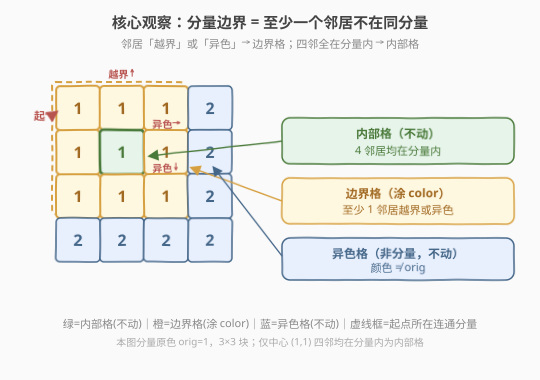
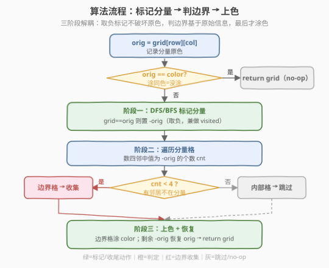
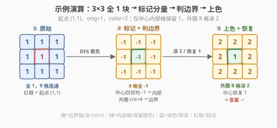

# LeetCode 边界着色 题解

## 1. 题目概述

- **标题 / 题号**：边界着色（#1034，medium）
- **链接**：https://leetcode.cn/problems/coloring-a-border/
- **难度**：中等
- **标签**：图、DFS、BFS、网格、连通分量

**题意**：给你一个 $m \times n$ 的整数矩阵 `grid`，每个值表示该位置网格块的颜色。再给你三个整数 `row`、`col` 和 `color`。

- **相邻**：两个方块在**上、下、左、右**任一方向上相邻。
- **连通分量**：颜色相同且相邻的方块属于同一连通分量。
- **连通分量的边界**：分量中满足以下条件**之一**的所有方块：
  - 在上、下、左、右任一方向上与**不属于同一连通分量**的方块相邻；
  - 在网格的边界上（第一行/列或最后一行/列）。

请用 `color` 为「包含 `grid[row][col]` 的连通分量的**边界**」着色，并返回最终的 `grid`。

> 💡 **一句话题意**：从 `(row, col)` 出发找到它所在的同色连通块，把这个块的**外轮廓格子**（贴网格边、或紧邻异色格的格子）涂成 `color`，块内部不动。

**示例 1**：

```text
输入：grid = [[1,1],[1,2]], row = 0, col = 0, color = 3
输出：[[3,3],[3,2]]
解释：起点 (0,0) 所在分量 = {(0,0),(0,1),(1,0)}（颜色均为 1）。
      三格都贴边或邻接异色格 (1,1)=2，全是边界格，涂 3。
```

**示例 2**：

```text
输入：grid = [[1,2,2],[2,3,2]], row = 0, col = 1, color = 3
输出：[[1,3,3],[2,3,3]]
解释：起点 (0,1) 所在分量 = {(0,1),(0,2),(1,2)}（颜色均为 2）。
      三格都贴边，全是边界格，涂 3。注意 (1,0)=2 虽同色但与起点不连通，不属本分量，不动。
```

**示例 3**：

```text
输入：grid = [[1,1,1],[1,1,1],[1,1,1]], row = 1, col = 1, color = 2
输出：[[2,2,2],[2,1,2],[2,2,2]]
解释：起点 (1,1) 所在分量 = 全部 9 格（颜色均为 1）。
      仅中心 (1,1) 四邻都在分量内 → 内部格，不动；其余 8 格贴边 → 边界格，涂 2。
```

**约束**：

- $m == \text{grid.length}$
- $n == \text{grid[i].length}$
- $1 \leq m, n \leq 50$
- $1 \leq \text{grid[i][j]}, \text{color} \leq 1000$
- $0 \leq \text{row} < m$，$0 \leq \text{col} < n$

> ⚠️ **颜色全为正整数**：`grid[i][j]` 与 `color` 都在 $[1, 1000]$，这一条是下文「取负标记法」成立的基石——负数永远不会和任何真实颜色撞车。

## 2. 解题思路

### 2.1 朴素思路与陷阱：边遍历边上色

最直白的写法是：从 `(row, col)` 开始 DFS/BFS 遍历同色连通块，**一旦发现某个格子是边界格，就立刻把它涂成 `color`**。看起来一步到位，却藏着一个致命陷阱——

> ⚠️ **上色会破坏连通性判断**：把边界格涂成 `color` 后，它的同分量邻居在后续扫描时看到一个「异色邻居」，于是被**误判**为边界格也被涂色，错误像多米诺骨牌一样向块内部蔓延，最终把整个分量甚至更多格子都涂掉。

举个例子，分量是 $3 \times 3$ 全 `1` 块、`color = 2`：本应只涂外圈 8 格、中心保留 `1`。若边上色，涂完 `(0,0)` 后 `(0,1)` 发现左邻变成 `2`（异色）→ 误判为边界 → 涂 `2`；接着 `(1,1)` 发现上邻 `(0,1)` 变 `2` → 又误判 → 涂 `2`……中心格也被错误涂掉。

> 💡 根因在于：**边界判定依赖「原始颜色」**，而边遍历边上色把原始颜色提前抹掉了。解法是把两件事**解耦**——先标记分量、再据原始色判边界、最后才上色。

### 2.2 核心观察：分量标记与边界判定解耦



把整个过程拆成**三个不互相干扰的阶段**：

1. **标记分量**：从 `(row, col)` 出发 DFS/BFS，把所有同色连通格子**就地标记**，但**不改变其颜色语义**——只做「到过」的记号。
2. **判定边界**：对每个分量格子，检查它的**四邻**（基于尚未破坏的原始颜色信息）：只要有一个邻居**越界**或**颜色 ≠ 分量原色**，它就是边界格。
3. **上色**：仅对边界格涂 `color`，内部格与异色格原样保留。

**就地标记的小技巧——取负**：与其开一个 $O(mn)$ 的 `visited` 矩阵，不如把分量格子的值从 `orig` 改成 `-orig`（取负）。因为颜色恒为正，`-orig` 不会和任何真实颜色冲突，既标记了「已访问」，又**保留了原色的大小**（`abs` 即原色）。于是：

- 分量格子：值为 `-orig`（负）。
- 异色格子：值为正且 $\neq orig$（保持原样）。
- **边界判定**：一个分量格子是边界格，当且仅当它的四邻中**不全是分量格子**——即「四邻中值为 `-orig` 的个数 $< 4$」（越界邻居或异色邻居都不计入）。

> 💡 **为什么「四邻均为 `-orig`」等价于内部格？** 若某分量格子的四个邻居都值为 `-orig`，说明四邻都在分量内（既未越界、也非异色），它被同色格子四面包围，自然是内部格；反之只要缺一个，那个缺失的邻居要么越界、要么异色，它就是边界格。

> ⚠️ **特判 `color == orig`**：若目标色与原色相同，涂了等于没涂，直接返回原 `grid` 即可。更重要的是，此时若用「取负」法会把 `orig` 变成 `-orig`，而恢复阶段无法区分「该涂的」和「不该动的」，故**必须在入口处提前返回**。

### 2.3 算法流程图



**阶段一（标记分量）**——从 `(row, col)` 出发的 DFS/BFS：

1. 记 `orig = grid[row][col]`；若 `orig == color` 直接返回。
2. 从起点 DFS：当前格值为 `orig` 则置 `-orig`（取负，兼做 `visited`），递归处理四向邻居（越界或非 `orig` 停止）。

**阶段二（判边界）**：

3. 遍历全网格，对每个值为 `-orig` 的格子，数四邻中值为 `-orig` 的个数 `cnt`；`cnt < 4` 即边界格，收集进 `borders`。

**阶段三（上色 + 恢复）**：

4. 把 `borders` 里的格子涂成 `color`。
5. 把仍为 `-orig` 的格子（内部格）恢复为 `orig`，返回 `grid`。

> 💡 **先收集后上色**：第 3 步判定时全部分量格仍为 `-orig`（未被 `color` 污染），第 4 步才统一上色，第 5 步恢复——三步严格分离，杜绝了 2.1 的「边涂边误判」。

### 2.4 示例演算



以示例 3（$3 \times 3$ 全 `1`，起点 `(1,1)`，`color = 2`）为例，`orig = 1`：

| 阶段 | 网格状态 | 关键判定 | 说明 |
|------|----------|----------|------|
| ① 原始 | 全 `1` | — | 9 格同色相连，成单个分量 |
| ② 取负标记 | 全 `-1` | DFS 把 9 格都取负 | `-1` 标记「在分量内」，原色大小 `1` 保留在 `abs` |
| ③ 判边界 | 中心内部、外圈边界 | `(1,1)` 四邻均为 `-1` → `cnt=4` → 内部；其余 8 格贴边 → `cnt<4` → 边界 | 仅中心一格不上色 |
| ④ 上色+恢复 | 外圈 `2`、中心 `1` | 边界格涂 `2`；`-1` 残留格恢复 `1` | 结果 `[[2,2,2],[2,1,2],[2,2,2]]` ✓ |

> 💡 **对照示例 2**：分量是「L 形」3 格 `{(0,1),(0,2),(1,2)}`（原色 `2`），取负后值 `-2`。三格都贴着网格边（`(0,1)` 上邻越界、`(0,2)` 右邻/上邻越界、`(1,2)` 右邻/下邻越界），`cnt` 均 $<4$，全为边界格涂 `3`；同色的 `(1,0)` 不与起点连通，从未被取负，原样保留 `2`。

## 3. 参考代码

### C++

```cpp
class Solution {
    int m, n;
    int dx[4] = {0, 0, 1, -1};
    int dy[4] = {1, -1, 0, 0};

    // 取负标记分量：orig -> -orig，兼做 visited
    void dfs(vector<vector<int>>& g, int i, int j, int orig) {
        if (i < 0 || i >= m || j < 0 || j >= n || g[i][j] != orig) return;
        g[i][j] = -orig;
        for (int d = 0; d < 4; d++) dfs(g, i + dx[d], j + dy[d], orig);
    }

  public:
    vector<vector<int>> colorBorder(vector<vector<int>>& grid, int row, int col, int color) {
        m = grid.size();
        n = grid[0].size();
        int orig = grid[row][col];
        if (orig == color) return grid;          // 特判：涂了等于没涂

        dfs(grid, row, col, orig);               // 阶段一：取负标记分量

        // 阶段二：判定边界格（四邻中 -orig 的个数 < 4）
        vector<pair<int, int>> borders;
        for (int i = 0; i < m; i++)
            for (int j = 0; j < n; j++) {
                if (grid[i][j] != -orig) continue;
                int cnt = 0;
                for (int d = 0; d < 4; d++) {
                    int ni = i + dx[d], nj = j + dy[d];
                    if (ni >= 0 && ni < m && nj >= 0 && nj < n && grid[ni][nj] == -orig) cnt++;
                }
                if (cnt < 4) borders.emplace_back(i, j);
            }

        // 阶段三：边界涂 color，内部格恢复 orig
        for (auto& [i, j] : borders) grid[i][j] = color;
        for (int i = 0; i < m; i++)
            for (int j = 0; j < n; j++)
                if (grid[i][j] == -orig) grid[i][j] = orig;
        return grid;
    }
};
```

### Python

```python
from collections import deque


class Solution:
    def colorBorder(self, grid: List[List[int]], row: int, col: int, color: int) -> List[List[int]]:
        m, n = len(grid), len(grid[0])
        orig = grid[row][col]
        if orig == color:
            return grid                       # 特判：涂了等于没涂

        # 阶段一：BFS 取负标记分量（BFS 规避 Python 递归栈溢出）
        q = deque([(row, col)])
        grid[row][col] = -orig
        while q:
            i, j = q.popleft()
            for di, dj in [(0, 1), (0, -1), (1, 0), (-1, 0)]:
                ni, nj = i + di, j + dj
                if 0 <= ni < m and 0 <= nj < n and grid[ni][nj] == orig:
                    grid[ni][nj] = -orig
                    q.append((ni, nj))

        # 阶段二：判定边界格
        borders = []
        for i in range(m):
            for j in range(n):
                if grid[i][j] != -orig:
                    continue
                cnt = 0
                for di, dj in [(0, 1), (0, -1), (1, 0), (-1, 0)]:
                    ni, nj = i + di, j + dj
                    if 0 <= ni < m and 0 <= nj < n and grid[ni][nj] == -orig:
                        cnt += 1
                if cnt < 4:
                    borders.append((i, j))

        # 阶段三：边界涂 color，内部格恢复 orig
        for i, j in borders:
            grid[i][j] = color
        for i in range(m):
            for j in range(n):
                if grid[i][j] == -orig:
                    grid[i][j] = orig
        return grid
```

> ⚠️ **Python 为何用 BFS 而非 DFS？** $m, n \leq 50$，最坏递归深度可达 $2500$，超过 Python 默认递归上限（约 $1000$）。改用显式队列 BFS 彻底规避，与 [1020. 飞地的数量](./1020_飞地的数量.md) 的处理一致。C++ 栈空间充裕，DFS 无此顾虑。

## 4. 复杂度分析

| 维度 | 复杂度 | 说明 |
|------|--------|------|
| 时间复杂度 | $O(m \times n)$ | 标记分量每格最多访问一次；判边界再遍历一次全网格、每格查四邻 $O(1)$；上色+恢复线性，总计线性 |
| 空间复杂度 | $O(m \times n)$ | DFS 递归栈 / BFS 队列最坏存放整个分量（$m \times n$ 级）；**无额外 `visited` 矩阵**——取负法就地标记，省下 $O(mn)$ 的标记矩阵 |

> 💡 **取负法的空间优势**：相比「`visited` 矩阵 + 收集分量列表」的写法（需 $O(mn)$ 额外标记空间），取负法把标记信息编码进原网格，额外空间仅剩递归栈/队列本身，是本题最省的就地解法。

## 5. 扩展：`visited` 矩阵写法与边界判定的两种等价写法

### 5.1 `visited` 矩阵版（不改原色，更直观）

若不允许修改输入、或觉得取负太「技巧化」，可用独立的 `visited` 矩阵，分量收集到列表后**直接对原始 `grid` 判边界**（此时 `grid` 全程未被破坏）：

```python
from collections import deque

class Solution:
    def colorBorder(self, grid, row, col, color):
        m, n = len(grid), len(grid[0])
        orig = grid[row][col]
        if orig == color:
            return grid
        visited = [[False] * n for _ in range(m)]
        q = deque([(row, col)])
        visited[row][col] = True
        comp = []
        while q:
            i, j = q.popleft()
            comp.append((i, j))
            for di, dj in [(0, 1), (0, -1), (1, 0), (-1, 0)]:
                ni, nj = i + di, j + dj
                if 0 <= ni < m and 0 <= nj < n and not visited[ni][nj] and grid[ni][nj] == orig:
                    visited[ni][nj] = True
                    q.append((ni, nj))
        # grid 未被改动，直接对原色判边界
        for i, j in comp:
            for di, dj in [(0, 1), (0, -1), (1, 0), (-1, 0)]:
                ni, nj = i + di, j + dj
                if not (0 <= ni < m and 0 <= nj < n) or grid[ni][nj] != orig:
                    grid[i][j] = color      # 任一邻居越界或异色 → 边界
                    break
        return grid
```

> 💡 此版判边界条件是「**任一邻居越界或 `grid[ni][nj] != orig`**」。因为 `grid` 没被改过，分量邻居的值仍是 `orig`（不计为边界），异色邻居值 $\neq orig$（计为边界），语义清晰。代价是多一个 $O(mn)$ 的 `visited` 矩阵。

### 5.2 两种边界判定的等价性

| 写法 | 条件 | 适用前提 |
|------|------|----------|
| 取负法 | 四邻中 `-orig` 的个数 $< 4$ | 分量已被取负，原始色信息藏在符号里 |
| `visited` 法 | 存在邻居越界或 `grid[ni][nj] != orig` | `grid` 保持原始未被改动 |

两者**完全等价**：「四邻不全在分量内」⟺「至少一个邻居越界或异色」。面试时可据「能否改输入」择一：能改用取负法省空间，不能改用 `visited` 法保清晰。

## 6. 面试要点

1. **为什么不能边遍历边上色？**

   - 边界判定依赖**原始颜色**：一个格子是不是边界，要看它的邻居「是否同色」。若遍历时就把边界格涂成 `color`，它的同分量邻居会看到一个「异色邻居」而被误判为边界，错误向块内部级联蔓延。必须**先标记、再判边界、最后上色**三阶段解耦。

2. **取负标记法为什么安全？**

   - 题目保证颜色 $\in [1, 1000]$ 恒为正，`-orig` 是负数，永远不会和任何真实颜色撞车；取负既标记了「已访问」，又保留了原色大小（`abs` 即原色），一举两得。前提是 `color != orig`（否则入口提前返回）。

3. **`color == orig` 为什么要特判？**

   - 语义上涂同色等于没涂，直接返回即可。实现上若不特判，取负后所有分量格变成 `-orig`，而 `-orig != orig`，恢复阶段无法把「该恢复」和「该涂」区分清楚，逻辑会乱。入口 `if orig == color: return grid` 一行解决。

4. **「连通分量的边界」和「网格的边界」是一回事吗？**

   - 不是。**网格边界**指第一/最后行列；**分量边界**指分量中「贴网格边」或「紧邻异色格」的格子。一个完全在网格内部的分量（四周被异色格包围）照样有边界——就是它最外圈那层。两者的交集是「贴网格边的分量格」，后者范围更大。

5. **取负法和 `visited` 矩阵法各有什么取舍？**

   - 取负法：就地标记，**额外空间 $O(1)$**（不含递归栈/队列），但要改输入、且依赖颜色为正的前提；`visited` 法：不改原色、逻辑直白，但多 $O(mn)$ 标记空间。面试中若被问「能否 $O(1)$ 额外空间」，取负法就是答案。

6. **和 1020「飞地的数量」、130「被围绕的区域」有何异同？**

   - 三者都是「网格连通分量 + 边界相关」的骨架：130 标记边界连通的 `O` 后翻转被围绕的；1020 沉掉边界连通陆地后数剩余飞地；**本题反过来——只动分量自身的外轮廓格**，不关心分量是否触边。差异在于「对谁操作」：前两题处理「与边界的关系」，本题处理「分量自身的轮廓」。

## 同类练习题

| # | 题目 | 与本题的关联 |
|---|------|-------------|
| 200 | [岛屿数量](https://leetcode.cn/problems/number-of-islands/)（[题解](../0101-0200/200_岛屿数量.md)） | 网格 DFS 沉岛计数母题，本题「同色连通块遍历」的模板原型 |
| 130 | [被围绕的区域](https://leetcode.cn/problems/surrounded-regions/)（[题解](../0101-0200/130_被围绕的区域.md)） | 从边界 DFS 标记安全格后翻转被围绕的 `O`，对照本题「只动分量轮廓」的差异化处理 |
| 1020 | [飞地的数量](https://leetcode.cn/problems/number-of-enclaves/)（[题解](./1020_飞地的数量.md)） | 同区间网格 BFS 邻题，对照「分量与网格边界的关系」 vs 本题「分量自身轮廓」 |
| 1254 | [统计封闭岛屿的数目](https://leetcode.cn/problems/number-of-closed-islands/) | 数「不触碰网格边界」的岛屿个数，从反面理解「分量边界」概念 |
| 417 | [太平洋大西洋水流问题](https://leetcode.cn/problems/pacific-atlantic-water-flow/)（[题解](../0401-0500/417_太平洋大西洋水流问题.md)） | 从海洋边界反向多源 DFS/BFS，与本题「从单源扩散到整块再定轮廓」互为正向/反向参照 |
