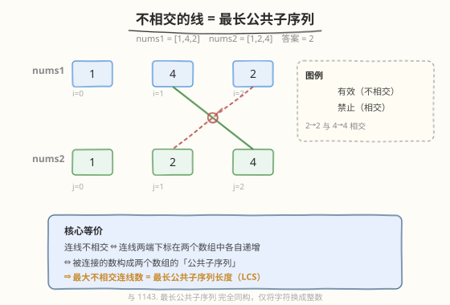
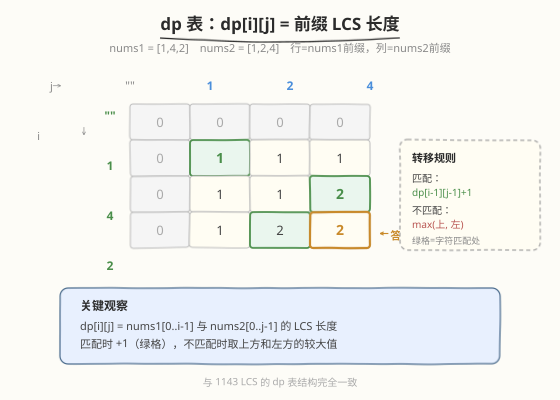
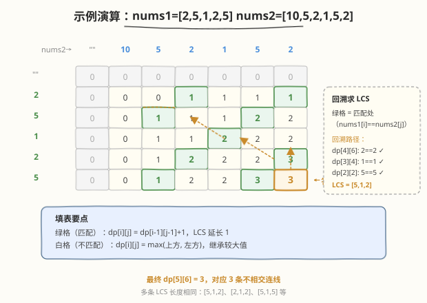

# 不相交的线

- **题目名称**：不相交的线
- **链接**：[1035. 不相交的线](https://leetcode.cn/problems/uncrossed-lines/)
- **难度**：中等
- **标签**：动态规划、二维 DP、数组

## 1. 题目概述

给定两个整数数组 `nums1` 和 `nums2`，将它们分别写在两条水平线上。可以画**连接线**：一条连接线连接 `nums1[i]` 和 `nums2[j]`，要求 `nums1[i] == nums2[j]`，且该线不与任何其他连接线相交（端点也不能重合，每个数最多属于一条连线）。返回能画出的**最大连接线数**。

**示例 1**：

```text
输入：nums1 = [1,4,2], nums2 = [1,2,4]
输出：2
解释：可以连接 nums1[0]=1↔nums2[0]=1 和 nums1[2]=2↔nums2[1]=2（或 nums1[1]=4↔nums2[2]=4），共 2 条不相交线。
```

**示例 2**：

```text
输入：nums1 = [2,5,1,2,5], nums2 = [10,5,2,1,5,2]
输出：3
解释：最大不相交连线数为 3，对应公共子序列如 [5,1,2] 或 [2,1,2]。
```

**示例 3**：

```text
输入：nums1 = [1,3,7,1,7,5], nums2 = [1,9,2,5,1]
输出：2
```

**约束条件**：

- $1 \leq \text{nums1.length}, \text{nums2.length} \leq 500$
- $1 \leq \text{nums1[i]}, \text{nums2[j]} \leq 2000$

> 💡 本题与 [1143. 最长公共子序列](../1101-1200/1143_最长公共子序列.md) **完全同构**——只是把字符串换成了整数数组，把「公共子序列」包装成了「不相交连线」。一旦识别出这层等价关系，解法就直接套用 LCS 的二维 DP 模板。

---

## 2. 解题思路

### 2.1 暴力思路：枚举所有连线组合

对 `nums1` 和 `nums2` 中每对相等的数，枚举「连」或「不连」，再检查是否相交。组合数指数级，且相交判定本身也需要 $O(k^2)$ 比较（$k$ 为连线数），完全不可行。

### 2.2 核心观察：不相交连线 = 最长公共子序列



关键观察：**连线不相交的充要条件是连线两端在两个数组中的下标各自递增**。

设有两条连线 $(i_1, j_1)$ 和 $(i_2, j_2)$，其中 $i_1 < i_2$。若 $j_1 > j_2$，则两条线交叉；若 $j_1 < j_2$，则不相交。因此，一组合法的不相交连线，其 $(i, j)$ 对在两个维度上都严格递增——这正是**公共子序列**的定义。

> 💡 **等价关系**：最大不相交连线数 = `nums1` 与 `nums2` 的最长公共子序列（LCS）长度。于是直接套用 [1143](../1101-1200/1143_最长公共子序列.md) 的二维 DP 模板。

**定义**：$\text{dp}[i][j]$ = `nums1[0..i-1]` 与 `nums2[0..j-1]` 的 LCS 长度。

**边界**：

$$\text{dp}[0][j] = 0, \quad \text{dp}[i][0] = 0 \quad \text{（空前缀，LCS = 0）}$$

**转移**：

$$\text{dp}[i][j] = \begin{cases} \text{dp}[i-1][j-1] + 1 & \text{若 } \text{nums1}[i-1] = \text{nums2}[j-1] \\ \max(\text{dp}[i-1][j],\ \text{dp}[i][j-1]) & \text{若 } \text{nums1}[i-1] \neq \text{nums2}[j-1] \end{cases}$$

**答案**：$\text{dp}[m][n]$。

### 2.3 算法流程图



**完整步骤**：

1. **初始化**：`dp` 为 $(m+1) \times (n+1)$ 矩阵，第 0 行和第 0 列全 0（空数组边界）
2. **逐行填表**：$i$ 从 $1$ 到 $m$，$j$ 从 $1$ 到 $n$：
   - `nums1[i-1] == nums2[j-1]` → $\text{dp}[i][j] = \text{dp}[i-1][j-1] + 1$
   - `nums1[i-1] != nums2[j-1]` → $\text{dp}[i][j] = \max(\text{dp}[i-1][j],\ \text{dp}[i][j-1])$
3. **返回** $\text{dp}[m][n]$

> ⚠️ **填表顺序**：从左到右、从上到下。$\text{dp}[i][j]$ 依赖左上 $(\text{dp}[i-1][j-1])$、正上 $(\text{dp}[i-1][j])$、左方 $(\text{dp}[i][j-1])$，三者必须先算出来。

### 2.4 示例演算

以 `nums1 = [2,5,1,2,5]`, `nums2 = [10,5,2,1,5,2]` 为例：



**dp 表**（行 = nums1 前缀，列 = nums2 前缀）：

| | `""` | `10` | `5` | `2` | `1` | `5` | `2` |
|------|------|------|-----|-----|-----|-----|-----|
| `""` | 0 | 0 | 0 | 0 | 0 | 0 | 0 |
| `2` | 0 | 0 | 0 | **1** | 1 | 1 | **1** |
| `5` | 0 | 0 | **1** | 1 | 1 | **2** | 2 |
| `1` | 0 | 0 | 1 | 1 | **2** | 2 | 2 |
| `2` | 0 | 0 | 1 | **2** | 2 | 2 | **3** |
| `5` | 0 | 0 | **1** | 2 | 2 | **3** | **3** |

**关键填表步骤**：

| 格子 | 数值比较 | 转移 | 值 | 说明 |
|------|----------|------|----|------|
| `dp[1][3]` | `2` == `2` | `dp[0][2]+1` | 1 | 首次匹配 |
| `dp[2][5]` | `5` == `5` | `dp[1][4]+1` | 2 | 接上 `dp[1][3]=1` 传来的 1 |
| `dp[4][6]` | `2` == `2` | `dp[3][5]+1` | 3 | 接上 `dp[3][4]=2` 传来的 2 |
| `dp[5][6]` | `5` ≠ `2` | `max(dp[4][6], dp[5][5])` | 3 | 不匹配，继承较大值 |

最终 $\text{dp}[5][6] = 3$。回溯一条 LCS 路径：`dp[4][6]`(2==2) → `dp[3][4]`(1==1) → `dp[2][2]`(5==5)，得 LCS = `[5,1,2]`，对应 3 条不相交连线。

> 💡 **匹配格的传承**：绿格（匹配）的值 = 左上角 + 1，意味着每遇到一对相等的数，LCS 就可能延长 1。沿着绿格回溯，就能还原出具体的连线方案。

---

## 3. 参考代码

### C++

```cpp
class Solution {
public:
    int maxUncrossedLines(vector<int>& nums1, vector<int>& nums2) {
        int m = nums1.size(), n = nums2.size();
        vector<vector<int>> dp(m + 1, vector<int>(n + 1, 0));

        for (int i = 1; i <= m; i++) {
            for (int j = 1; j <= n; j++) {
                if (nums1[i-1] == nums2[j-1]) {
                    dp[i][j] = dp[i-1][j-1] + 1;
                } else {
                    dp[i][j] = max(dp[i-1][j], dp[i][j-1]);
                }
            }
        }
        return dp[m][n];
    }
};
```

### Python

```python
class Solution:
    def maxUncrossedLines(self, nums1: List[int], nums2: List[int]) -> int:
        m, n = len(nums1), len(nums2)
        dp = [[0] * (n + 1) for _ in range(m + 1)]

        for i in range(1, m + 1):
            for j in range(1, n + 1):
                if nums1[i-1] == nums2[j-1]:
                    dp[i][j] = dp[i-1][j-1] + 1
                else:
                    dp[i][j] = max(dp[i-1][j], dp[i][j-1])

        return dp[m][n]
```

> 💡 **实现细节**：① `dp` 矩阵大小 $(m+1) \times (n+1)$，首行首列表示空数组边界，全 0。② 循环从 1 开始，`nums1[i-1]` 对应 `dp[i]` 行——下标偏移 1。③ 与 1143 LCS 代码**逐字相同**，只是输入类型从 `string` 变为 `vector<int>`。

---

## 4. 复杂度分析

| 维度 | 复杂度 | 说明 |
|------|--------|------|
| 时间复杂度 | $O(m \times n)$ | 双重循环遍历 $(m+1) \times (n+1)$ 个格子，每格 $O(1)$ 转移 |
| 空间复杂度 | $O(m \times n)$ | 二维 dp 矩阵；滚动数组可压至 $O(n)$ |

> 💡 本题 $m, n \leq 500$，$m \times n \leq 2.5 \times 10^5$，远在时限内。

---

## 5. 扩展：滚动数组空间优化

`dp[i][j]` 只依赖上一行和当前行左边，可用一维数组 + `prev` 变量压缩到 $O(n)$ 空间：

```python
class Solution:
    def maxUncrossedLines(self, nums1: List[int], nums2: List[int]) -> int:
        m, n = len(nums1), len(nums2)
        dp = [0] * (n + 1)

        for i in range(1, m + 1):
            prev = dp[0]
            for j in range(1, n + 1):
                temp = dp[j]
                if nums1[i-1] == nums2[j-1]:
                    dp[j] = prev + 1
                else:
                    dp[j] = max(dp[j], dp[j-1])
                prev = temp
        return dp[n]
```

> 💡 **prev 的作用**：`dp[j]` 计算需要左上角 $\text{dp}[i-1][j-1]$，但一维数组中 `dp[j-1]` 已被更新为当前行值。`prev` 在覆盖前保存旧值（上一行的 `dp[j]`），下一次迭代作为新左上角使用。

---

## 6. 面试要点

1. **为什么不相交连线等价于 LCS？**

   > 连线不相交 ⇔ 连线的 $(i, j)$ 对在两个数组中各自下标递增 ⇔ 被连接的数按序构成公共子序列。因此最大连线数 = LCS 长度。

2. **`dp[i][j]` 的定义和下标为什么从 1 开始？**

   > $\text{dp}[i][j]$ = `nums1[0..i-1]` 与 `nums2[0..j-1]` 的 LCS 长度。从 1 开始是因为 `dp[0][j]` 和 `dp[i][0]` 代表空数组边界（LCS=0），需单独占一行/列。

3. **匹配时为什么不取 `max(dp[i-1][j], dp[i][j-1])`？**

   > 因为 $\text{dp}[i-1][j-1]+1$ 恒 $\geq \max(\text{dp}[i-1][j],\ \text{dp}[i][j-1])$。匹配一对数至少不比跳过差，所以直接 `+1` 即可。

4. **与 1143 LCS 有何异同？**

   > **同**：DP 状态定义、转移方程、复杂度完全一致，代码逐字相同。**异**：1143 输入是字符串（字符比较），本题是整数数组（整数比较）；1143 的语义是「公共子序列」，本题包装成「不相交连线」。识别出等价关系是本题的关键一步。

5. **如何还原具体的连线方案？**

   > 从 $\text{dp}[m][n]$ 回溯：若 $\text{nums1}[i-1] == \text{nums2}[j-1]$ 且 $\text{dp}[i][j] == \text{dp}[i-1][j-1]+1$，记录该匹配对并走到 $[i-1][j-1]$；否则走到 $\text{dp}[i-1][j]$ 或 $\text{dp}[i][j-1]$ 中较大者。逆序即为连线方案。滚动数组无法回溯（丢失历史行）。

> 💡 **一句话总结**：1035 是 LCS 的换皮题——「不相交连线」等价于「公共子序列」，识别出这层关系后直接套二维 DP 模板，$O(m \times n)$ 时间、滚动数组 $O(n)$ 空间即可。

---

## 7. 同类练习题

- [1143. 最长公共子序列](https://leetcode.cn/problems/longest-common-subsequence/)（[题解](../1101-1200/1143_最长公共子序列.md)）：本题的原型，字符串版 LCS，代码完全一致
- [718. 最长重复子数组](https://leetcode.cn/problems/maximum-length-of-repeated-subarray/)：改求最长公共**子串**（连续），不匹配时 `dp=0` 而非 `max`
- [72. 编辑距离](https://leetcode.cn/problems/edit-distance/)（[题解](../0001-0100/72_编辑距离.md)）：同构二维 DP，不匹配时 `min` 三选一，求最少操作数
- [583. 两个字符串的删除操作](https://leetcode.cn/problems/delete-operation-for-two-strings/)：LCS 直接应用，$\text{answer} = m + n - 2 \times \text{LCS}$
- [392. 判断子序列](https://leetcode.cn/problems/is-subsequence/)（[题解](../0301-0400/392_判断子序列.md)）：LCS 的判定退化版，只需判断 LCS 长度是否等于短串长度
