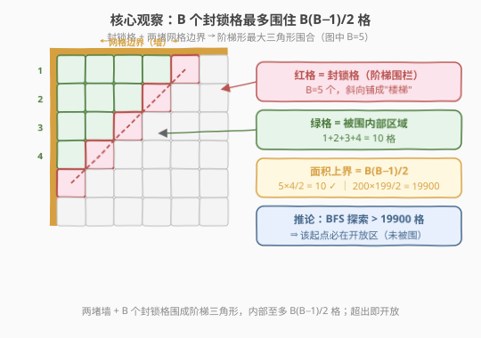
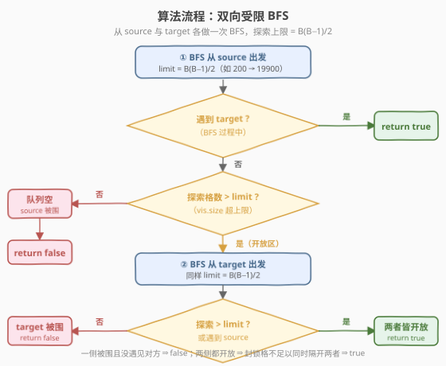
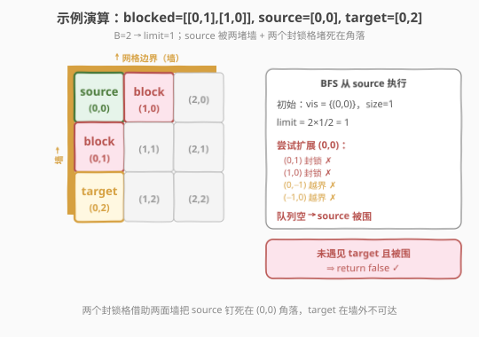

# 逃离大迷宫

- **题目名称**：逃离大迷宫
- **链接**：[1036. 逃离大迷宫](https://leetcode.cn/problems/escape-a-large-maze/)
- **难度**：困难
- **标签**：图、BFS、广度优先搜索、数学

## 1. 题目概述

在一个 $10^6 \times 10^6$ 的网格中，每个方格坐标为 `(x, y)`。从 `source = [sx, sy]` 出发，意图到达 `target = [tx, ty]`。给定封锁列表 `blocked`（其中每个方格禁止通行），每次可走上、下、左、右四个方向的相邻格，不能走出网格、不能踩封锁格。判断能否从 `source` 到达 `target`。

> 💡 **一句话题意**：网格极大（$10^{12}$ 格）、障碍极少（$\leq 200$），问两点是否连通。直接 BFS 整张网格不可行，必须利用「障碍少」这一特性。

**示例 1**：

```text
输入：blocked = [[0,1],[1,0]], source = [0,0], target = [0,2]
输出：false
解释：source 在 (0,0) 角落，(0,1) 与 (1,0) 被封锁，另两面是网格边界，无路可走。
```

**示例 2**：

```text
输入：blocked = [], source = [0,0], target = [999999,999999]
输出：true
解释：没有任何封锁格，两点必然连通。
```

**约束条件**：

- $0 \leq \text{blocked.length} \leq 200$
- $\text{blocked[i].length} == 2$
- $0 \leq x_i, y_i < 10^6$
- $0 \leq s_x, s_y, t_x, t_y < 10^6$
- $\text{source} \neq \text{target}$
- 题目保证 `source` 和 `target` 不在封锁列表内

> ⚠️ **规模陷阱**：网格有 $10^{12}$ 个方格，连 `visited` 二维数组都开不出来（内存爆炸）。突破口在 `blocked.length <= 200`——障碍如此之少，能「围住」的区域必然有上限。

---

## 2. 解题思路

### 2.1 暴力思路

从 `source` 出发对整张 $10^6 \times 10^6$ 网格做 BFS，用二维数组或哈希表记录 `visited`，直到遇见 `target` 或队列空。

> ⚠️ 不可行：网格 $10^{12}$ 格，最坏 BFS 要走遍大半个网格，时间和空间都爆炸。即便用哈希集合存 `visited`，开放区域下也会无限制扩散。

### 2.2 核心观察：障碍能围住的最大面积有上限



关键在于：**200 个封锁格最多能围住多大一块区域？**

- 要把一块区域「围住」，封锁格必须连成一条封闭围栏（可借助网格边界作为围栏的一部分）。
- 在网格上，用最少的封锁格围出最大的面积，最优形状是「**阶梯三角形**」：封锁格沿对角线铺成楼梯，配合两条相互垂直的网格边界围成一个直角三角形。
- 设封锁格数为 $B$，楼梯由 $B$ 个封锁格组成，内部被围的格点数（严格内部，不含封锁格本身）为：

$$\text{面积}_{\max} = \frac{B(B-1)}{2}$$

- 当 $B = 200$ 时，$\frac{200 \times 199}{2} = 19900$。即 **200 个封锁格最多围住 19900 格**。

> 💡 **推论（解题钥匙）**：从某点 BFS，若**探索的格数超过 $B(B-1)/2$ 仍未遇见对方**，则该点必然处于「**开放区域**」（未被围住）——因为若被围住，可探索的格数绝不可能超过这个上限。

于是得到判定框架（**双向受限 BFS**）：

1. 从 `source` 出发 BFS，探索上限 $\text{limit} = B(B-1)/2$。
   - 若在 limit 内遇见 `target` → **连通**，返回 `true`。
   - 若探索格数超过 limit 仍未遇见 → `source` 在**开放区**。
   - 若队列自然耗尽（未超 limit、未遇见 target）→ `source` **被围**，且 `target` 不在围区内 → 返回 `false`。
2. 若 `source` 开放，再从 `target` 出发做同样的受限 BFS。
   - 若 `target` 也开放 → **两侧都开放，必然连通**，返回 `true`。
   - 若 `target` 被围 → `source` 不在 `target` 的围区内 → 返回 `false`。

> ⚠️ **为何两侧都开放就必然连通？** 若 `source` 与 `target` 不连通，则封锁格必须把网格分成至少两个互不可达的区域，二者各居其一。但封锁格总数有限，**至多围住一个面积 $\leq B(B-1)/2$ 的小区域**；不可能同时构造出两个「大区域」来分别容纳两个开放点。故「双侧开放」与「不连通」矛盾 ⇒ 必连通。

### 2.3 算法流程图



文字版步骤：

1. 把 `blocked` 存入哈希集合 `block`（坐标编码为单个整数键，避免二维数组）。
2. 计算 $\text{limit} = B(B-1)/2$（$B = 0$ 时 limit = 0，首轮 BFS 立刻判开放）。
3. `r1 = bfs(source, target)`：
   - 返回值 `1`（遇见 target）→ `true`。
   - 返回值 `0`（被围耗尽）→ `false`。
   - 返回值 `2`（超 limit，开放）→ 继续步骤 4。
4. `r2 = bfs(target, source)`：
   - 返回值 `1`（遇见 source）→ `true`（保险，正常不会走到这）。
   - 返回值 `0`（target 被围）→ `false`。
   - 返回值 `2`（target 开放）→ **双侧开放** → `true`。

### 2.4 示例演算



**示例 1**：`blocked = [[0,1],[1,0]]`，`source = [0,0]`，`target = [0,2]`。

- $B = 2$，$\text{limit} = 2 \times 1 / 2 = 1$。
- BFS 从 `(0,0)` 出发：`vis = {(0,0)}`，size = 1，未超 limit。
- 尝试扩展四邻居：`(0,1)` 封锁 ✗、`(1,0)` 封锁 ✗、`(0,-1)` 越界 ✗、`(-1,0)` 越界 ✗。
- 无可入队格，**队列耗尽** → 返回 `0`（被围）→ **返回 `false`** ✓。

> 💡 **示例 2 对照**：`blocked = []`，$B = 0$，$\text{limit} = 0$。首轮 BFS：`vis` 初始 size = 1 > 0，立即判 `source` 开放（返回 `2`）；次轮同理判 `target` 开放；双侧开放 → **返回 `true`** ✓。

---

## 3. 参考代码

### C++

```cpp
class Solution {
    using ll = long long;
    int dx[4] = {0, 0, 1, -1};
    int dy[4] = {1, -1, 0, 0};
    int B;
    unordered_set<ll> block;
    ll limit;

    // 坐标编码为单整数键，避免开 10^6×10^6 数组
    inline ll enc(int x, int y) const { return (ll)x * 1000000LL + y; }

    // 返回：0=被围耗尽，1=遇见 t，2=超 limit（开放）
    int bfs(const vector<int>& s, const vector<int>& t) {
        unordered_set<ll> vis;
        queue<pair<int,int>> q;
        q.push({s[0], s[1]});
        vis.insert(enc(s[0], s[1]));
        while (!q.empty()) {
            auto [x, y] = q.front(); q.pop();
            if (x == t[0] && y == t[1]) return 1;
            for (int d = 0; d < 4; d++) {
                int nx = x + dx[d], ny = y + dy[d];
                if (nx < 0 || nx >= 1000000 || ny < 0 || ny >= 1000000) continue;
                ll key = enc(nx, ny);
                if (block.count(key) || vis.count(key)) continue;
                vis.insert(key);
                q.push({nx, ny});
            }
            if ((ll)vis.size() > limit) return 2; // 超过围合上限 → 开放
        }
        return 0; // 队列耗尽，被围
    }

public:
    bool isEscapePossible(vector<vector<int>>& blocked,
                          vector<int>& source, vector<int>& target) {
        B = blocked.size();
        block.clear();
        for (auto& b : blocked) block.insert(enc(b[0], b[1]));
        limit = (ll)B * (B - 1) / 2; // 200 -> 19900；B=0 -> 0

        int r1 = bfs(source, target);
        if (r1 == 1) return true;   // 直接相遇
        if (r1 == 0) return false;  // source 被围，target 在外

        int r2 = bfs(target, source);
        if (r2 == 0) return false;  // target 被围，source 在外
        return true;                // 双侧开放 → 必连通
    }
};
```

### Python

```python
from collections import deque
from typing import List

class Solution:
    def isEscapePossible(self, blocked: List[List[int]],
                         source: List[int], target: List[int]) -> bool:
        B = len(blocked)
        block = {(x, y) for x, y in blocked}
        limit = B * (B - 1) // 2  # 200 -> 19900；B=0 -> 0

        def bfs(s, t):
            """返回 0=被围耗尽, 1=遇见 t, 2=超 limit(开放)"""
            vis = {tuple(s)}
            dq = deque([tuple(s)])
            while dq:
                x, y = dq.popleft()
                if [x, y] == t:
                    return 1
                for dx, dy in ((0, 1), (0, -1), (1, 0), (-1, 0)):
                    nx, ny = x + dx, y + dy
                    if 0 <= nx < 1000000 and 0 <= ny < 1000000 \
                       and (nx, ny) not in block and (nx, ny) not in vis:
                        vis.add((nx, ny))
                        dq.append((nx, ny))
                if len(vis) > limit:
                    return 2
            return 0

        r1 = bfs(source, target)
        if r1 == 1:
            return True
        if r1 == 0:
            return False
        r2 = bfs(target, source)
        if r2 == 0:
            return False
        return True  # 双侧开放 → 必连通
```

> 💡 **坐标编码**：网格 $10^6 \times 10^6$，C++ 用 `long long key = x * 1000000LL + y` 把 `(x,y)` 压成单整数做哈希键；Python 直接用 `(x, y)` 元组入集合。两者都**只存真正访问过的格**，空间正比于 BFS 实际探索量（$\leq 19900$）。

---

## 4. 复杂度分析

| 维度 | 复杂度 | 说明 |
|------|--------|------|
| 时间复杂度 | $O(B^2)$ | 每轮 BFS 最多探索 $B(B-1)/2$ 格（约 19900），共两轮；每格 4 向邻居 + 哈希操作 $O(1)$，总量 $\approx 4 \times 10^4$ |
| 空间复杂度 | $O(B^2)$ | `block` 集合 $O(B)$；`visited` 集合最坏 $O(B(B-1)/2) = O(B^2)$，约 19900 项 |

> 💡 **与网格规模无关**：复杂度只依赖封锁格数 $B \leq 200$，与 $10^6 \times 10^6$ 无关——这正是「障碍极少」特性的红利。若 $B$ 增大到与网格同阶，此法退化为普通 BFS，不再可行。

---

## 5. 扩展：围合面积上界的证明

### 5.1 为何恰好是 $B(B-1)/2$

设 $B$ 个封锁格构成围栏。要把内部区域完全封闭，围栏需连成一条「从某面墙到另一面墙」的封闭曲线（曲线可借助网格边界）。在网格（曼哈顿度量）下，给定围栏长度（封锁格数）$B$，所围**内部格数**的最大值在围栏取**阶梯形（对角线）**、且两端各搭一面相互垂直的网格墙时取得。

此时内部是直角三角形，其两直角边各含 $B-1, B-2, \dots$ 递减的格点行，求和：

$$\text{面积}_{\max} = \sum_{k=1}^{B-1} k = \frac{B(B-1)}{2}$$

> ⚠️ **严格内部**：上式只数被围的**内部**格，不含构成围栏的 $B$ 个封锁格本身。若误把封锁格也计入会得到 $B(B+1)/2$，导致 limit 偏大、漏判被围情形——务必只数内部。

### 5.2 limit 取值的宽容度

判定只要求：**被围时 BFS 不超 limit、开放时 BFS 超过 limit**。因此 limit 取 $\geq B(B-1)/2$ 的任意值都正确（取更大值只是开放情形多探几格、常数变大）。常见写法有：

- `limit = B*(B-1)//2`（精确上界，最省探索量，推荐）；
- `limit = 20000`（$B \leq 200$ 时的固定常数，略大于 19900，写法简单）。

两种写法均 AC，差别仅在常数。

---

## 6. 面试要点

1. **为什么不能直接 BFS 整张网格？**

   - 网格 $10^6 \times 10^6 = 10^{12}$ 格，`visited` 二维数组开不出来；用哈希集合的话，开放区域会无限扩散直到爆内存/超时。必须利用 `blocked.length <= 200` 这一约束。

2. **$B(B-1)/2$ 这个上界怎么来的？为什么够用？**

   - $B$ 个封锁格连成围栏（可借网格边界），在网格度量下围出的最大内部区域是阶梯直角三角形，内部格数 $= 1+2+\dots+(B-1) = B(B-1)/2$。$B=200$ 时为 19900。BFS 探索超过此值，说明该点不可能在被围区域内 ⇒ 开放。

3. **为什么要从 source 和 target 各做一次 BFS？只做一次不行吗？**

   - 一次 BFS 只能判定「source 是否被围」。若 source 开放但 target 被围在一小块里，仍不连通。所以需要第二轮确认 target 也开放——**两侧都开放**才能断言连通（封锁格不足以同时隔开两个大区域）。

4. **两侧都开放为什么一定连通？**

   - 反证：若不连通，封锁格须把网格分成至少两个互不可达区域，两点各居其一。但 $B$ 个封锁格至多围出一个面积 $\leq B(B-1)/2$ 的小区域，无法同时构造两个大隔离区。故「双侧开放」与「不连通」矛盾。

5. **`visited` 用哈希集合会不会很慢？**

   - 不会。每轮最多存约 19900 个键，哈希操作 $O(1)$，总量 $\approx 4 \times 10^4$，远低于时限。C++ 用 `long long` 编码坐标作键比 `pair<int,int>` 更省、哈希更快；Python 用元组即可。

6. **$B = 0$ 时算法还成立吗？**

   - 成立。$B=0 \Rightarrow \text{limit}=0$，首轮 BFS 的 `vis` 初始 size = 1 > 0，立即判 source 开放；次轮同理判 target 开放；双侧开放 → `true`。与「无障碍必连通」一致。

---

## 7. 同类练习题

- [200. 岛屿数量](https://leetcode.cn/problems/number-of-islands/)（[题解](../0101-0200/200_岛屿数量.md)）：网格 BFS/DFS 沉岛母题，本题的 BFS 骨架原型（小网格版）
- [994. 腐烂的橘子](https://leetcode.cn/problems/rotting-oranges/)（[题解](../0901-1000/994_腐烂的橘子.md)）：多源 BFS 范式，与本题「受限 BFS 扩散」同源
- [1020. 飞地的数量](https://leetcode.cn/problems/number-of-enclaves/)（[题解](1020_飞地的数量.md)）：网格中判定「能否逃出边界」，与本题「判定是否被围」思路互补——一个数被困格、一个判定被困
- [1293. 网格中的最短路径](https://leetcode.cn/problems/shortest-path-in-a-grid-with-obstacles-elimination/)：网格 BFS + 障碍消除，同为「障碍约束下的网格搜索」，可对比限流策略差异
