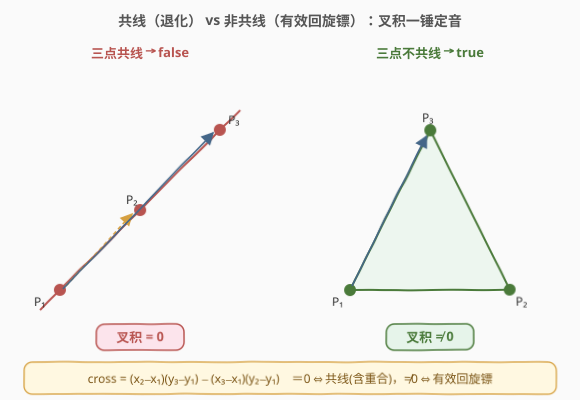
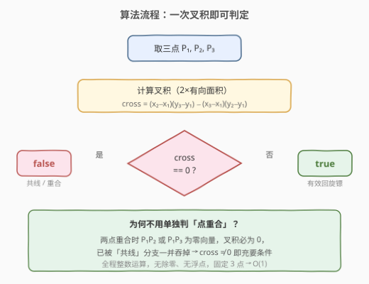
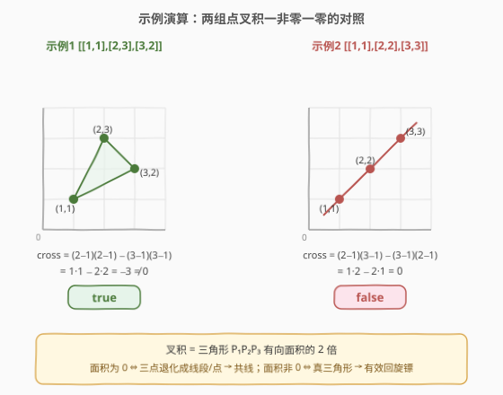

# 有效的回旋镖

- **题目名称**：有效的回旋镖
- **链接**：[1037. 有效的回旋镖](https://leetcode.cn/problems/valid-boomerang/)
- **难度**：简单
- **标签**：几何、数学、数组

## 1. 题目概述

「回旋镖」定义为一组**三个互不相同且不在同一条直线上的点**。给定一个长度为 3 的数组 `points`，其中 `points[i] = [xi, yi]` 表示平面上一个点，判断这三个点能否构成一个有效的回旋镖。

> 💡 **题意拆解**：有效回旋镖需同时满足两个条件——① 三个点**两两不同**（无重合点）；② 三个点**不共线**（能构成一个非退化三角形）。二者缺一不可。

**示例 1**：

```text
输入：points = [[1,1],[2,3],[3,2]]
输出：true
解释：三个点互不相同且不共线，构成有效回旋镖。
```

**示例 2**：

```text
输入：points = [[1,1],[2,2],[3,3]]
输出：false
解释：三个点在同一条直线上（y = x），不能构成回旋镖。
```

**示例 3**：

```text
输入：points = [[0,0],[0,2],[2,1]]
输出：true
解释：三个点互不相同且不共线，构成有效回旋镖。
```

**约束条件**：

- `points.length == 3`
- `points[i].length == 2`
- $0 \leq x_i, y_i \leq 100$

> ⚠️ **坐标范围小**：$x_i, y_i \in [0, 100]$，坐标差至多为 100，叉积至多 $2 \times 100^2 = 20000$，远在 32 位 `int` 范围内，**无需考虑溢出**。

---

## 2. 解题思路

### 2.1 暴力思路：斜率比较

最直观的做法是分别计算 $\overrightarrow{P_1P_2}$ 与 $\overrightarrow{P_1P_3}$ 的斜率，若斜率相等则共线：

$$\frac{y_2 - y_1}{x_2 - x_1} = \frac{y_3 - y_1}{x_3 - x_1}$$

但斜率法有两个坑：

1. **除零**：$x_2 = x_1$（竖直线）时分母为 0，需特判。
2. **浮点精度**：除法引入浮点数，相等比较可能因精度误差误判。

> 💡 暴力法「能做但不优雅」——特判除零、容忍精度，代码绕来绕去。几何题里有个更干净的工具：**叉积**。

### 2.2 核心观察：叉积判共线



把斜率等式 $\frac{y_2 - y_1}{x_2 - x_1} = \frac{y_3 - y_1}{x_3 - x_1}$ 两边**交叉相乘**消去分母，就得到**无除法、无浮点**的判据：

$$\text{cross} = (x_2 - x_1)(y_3 - y_1) - (x_3 - x_1)(y_2 - y_1)$$

这就是向量 $\overrightarrow{P_1P_2}$ 与 $\overrightarrow{P_1P_3}$ 的**叉积**（二维叉积是个标量），几何上等于三角形 $P_1P_2P_3$ **有向面积的 2 倍**：

| cross 值 | 几何含义 | 是否有效回旋镖 |
|----------|---------|---------------|
| $= 0$ | 三点共线（或两点重合→零向量） | ❌ false |
| $\neq 0$ | 三点构成非退化三角形 | ✅ true |

> 💡 **为何叉积 = 0 还能涵盖「点重合」？** 若 $P_1 = P_2$，则 $\overrightarrow{P_1P_2}$ 是零向量，$(x_2-x_1)=(y_2-y_1)=0$，叉积两项均含因子 0，结果必为 0。同理 $P_1=P_3$ 或 $P_2=P_3$ 也使叉积归零。因此「点重合」是「共线」的退化特例，**单用一个 `cross != 0` 就同时卡住了两个条件**，无需再单独判重合。

### 2.3 算法流程图



整体只需三步：取点、套公式、判零。**没有循环、没有分支嵌套**，是名副其实的 $O(1)$ 解法。

### 2.4 示例演算



以示例 1 和示例 2 对照：

- **示例 1** $P_1(1,1), P_2(2,3), P_3(3,2)$：
  $\text{cross} = (2-1)(2-1) - (3-1)(3-1) = 1 - 4 = -3 \neq 0$ → **true**
- **示例 2** $P_1(1,1), P_2(2,2), P_3(3,3)$：
  $\text{cross} = (2-1)(3-1) - (3-1)(2-1) = 2 - 2 = 0$ → **false**

> 💡 **cross 的正负有几何意义**：负值表示 $P_3$ 在 $\overrightarrow{P_1P_2}$ 的右侧（顺时针），正值表示左侧（逆时针）。本题只关心是否为 0，正负无所谓——但理解这一点有助于处理「多边形面积」「凸包方向」等进阶几何题。

---

## 3. 参考代码

### C++

```cpp
class Solution {
  public:
    bool isBoomerang(vector<vector<int>>& points) {
        int x1 = points[0][0], y1 = points[0][1];
        int x2 = points[1][0], y2 = points[1][1];
        int x3 = points[2][0], y3 = points[2][1];
        // 叉积 = 2×有向面积；为 0 当且仅当共线（含重合退化）
        return (x2 - x1) * (y3 - y1) != (x3 - x1) * (y2 - y1);
    }
};
```

### Python

```python
from typing import List

class Solution:
    def isBoomerang(self, points: List[List[int]]) -> bool:
        (x1, y1), (x2, y2), (x3, y3) = points
        # 叉积为 0 当且仅当三点共线（含两点重合的退化情形）
        return (x2 - x1) * (y3 - y1) != (x3 - x1) * (y2 - y1)
```

> ⚠️ **写 `!=` 而非算出 `cross == 0` 再取反**：直接比较两侧乘积是否**不等**，逻辑上等价于 `cross != 0`，但少一次减法，更贴近「斜率交叉相乘」的原始形式，可读性也更好。

---

## 4. 复杂度分析

| 维度 | 复杂度 | 说明 |
|------|--------|------|
| 时间复杂度 | $O(1)$ | 固定 3 个点，仅 2 次乘法 + 1 次比较，与输入规模无关 |
| 空间复杂度 | $O(1)$ | 只用常数个整型变量 |

> 💡 本题规模极小（恒为 3 点），复杂度分析的意义不在性能而在**确认无隐藏代价**——没有循环、没有额外空间、无溢出风险，是一个干净的 $O(1)$ 解。

---

## 5. 扩展：斜率法与精度陷阱

若坚持用斜率比较，必须处理竖直直线（分母为 0）与浮点精度：

```python
def isBoomerang_slope(self, points):
    (x1, y1), (x2, y2), (x3, y3) = points
    if (x1, y1) == (x2, y2) or (x1, y1) == (x3, y3) or (x2, y2) == (x3, y3):
        return False
    # 用乘法代替除法避免除零与浮点
    return (y2 - y1) * (x3 - x1) != (y3 - y1) * (x2 - x1)
```

注意最后一行——它其实**就是叉积判据的变形**！所谓「斜率交叉相乘」与「叉积」殊途同归。这正说明：**只要想避开除零和浮点，最终都会走到叉积**。

| 方案 | 除零风险 | 浮点精度 | 代码量 |
|------|---------|---------|--------|
| 直接算斜率（除法） | ❌ 需特判 | ❌ 需 eps | 多 |
| 斜率交叉相乘 | ✅ 无 | ✅ 整数运算 | 中 |
| **叉积** | ✅ 无 | ✅ 整数运算 | 少 |

---

## 6. 面试要点

1. **为什么用叉积而不是斜率？**

   - 斜率法需除法，引入除零（竖直线）与浮点精度两大坑；叉积用乘法代替除法，全程整数运算，一个表达式同时判共线与重合，干净且无精度问题。

2. **叉积 = 0 为什么能涵盖「两点重合」？**

   - 重合时两向量之一为零向量，其分量全为 0，叉积两项都含因子 0，结果必为 0。因此「重合」是「共线」的退化特例，`cross != 0` 自然排除它。

3. **叉积的几何意义是什么？**

   - 二维叉积 $(x_2-x_1)(y_3-y_1)-(x_3-x_1)(y_2-y_1)$ 等于三角形 $P_1P_2P_3$ 有向面积的 2 倍。值为 0 表示面积为 0（退化为线段或点），非 0 表示是真正的三角形。正负号还编码了点的左右手性（顺/逆时针）。

4. **坐标范围很大（如 $10^9$）会溢出吗？**

   - 本题 $x_i, y_i \leq 100$，叉积最大约 $2\times10^4$，`int` 足够。若坐标放大到 $10^9$，两数相乘达 $10^{18}$，应用 `long long`（C++）或 Python 的任意精度整数。这是几何题的通用溢出意识。

5. **如果题目改成「判断 k 个点是否共线」呢？**

   - 固定第一个点 $P_1$，对每个其它点 $P_i$ 计算与 $P_2$ 的叉积 $(x_i-x_1)(y_2-y_1)-(x_2-x_1)(y_i-y_1)$，全为 0 则共线。本质是把本题的「三点共线」推广到「多点共线」，仍靠叉积。

---

## 7. 同类练习题

- [149. 直线上最多的点数](https://leetcode.cn/problems/max-points-on-a-line/)（[题解](../0101-0200/149_直线上最多的点数.md)）：用叉积/斜率判定多点共线，本题的「多点推广版」——固定点按斜率分组求最大组
- [1232. 缀点成线](https://leetcode.cn/problems/check-if-it-is-a-straight-line/)：判断给定多个点是否共线，本题的直接推广，同样用叉积判零
- [447. 回旋镖的数量](https://leetcode.cn/problems/number-of-boomerangs/)（[题解](../0401-0500/447_回旋镖的数量.md)）：回旋镖的计数版，按距离分组枚举中点，与本题共享「回旋镖」定义但考察排列计数
- [587. 安装栅栏](https://leetcode.cn/problems/erect-the-fence/)：凸包问题，叉积判左右转是其核心操作，理解本题叉积是进阶凸包的基础
