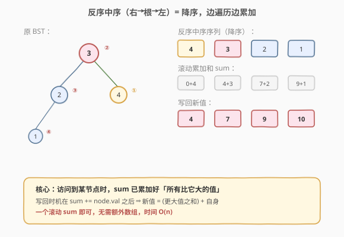
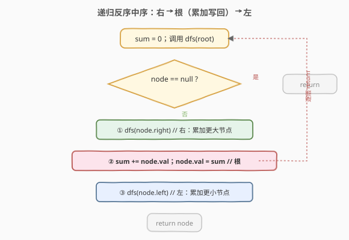
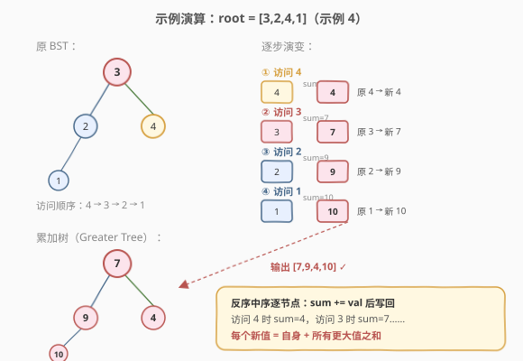

# 从二叉搜索树到更大和树

- **题目名称**：从二叉搜索树到更大和树
- **链接**：[1038. 从二叉搜索树到更大和树](https://leetcode.cn/problems/binary-search-tree-to-greater-sum-tree/)
- **难度**：中等
- **标签**：树、二叉搜索树、深度优先搜索、中序遍历

## 1. 题目概述

给定一棵**二叉搜索树（BST）**的根节点 `root`，请将它的每个节点的值替换成树中**大于或者等于**该节点值的所有节点值之和。

> 💡 提醒：BST 满足「左子树所有值 **严格小于** 根，右子树所有值 **严格大于** 根，左右子树也是 BST」。

**示例 1**：

```text
输入：root = [4,1,6,0,2,5,7,null,null,null,3,null,null,null,8]
输出：[30,36,21,36,35,26,15,null,null,null,33,null,null,null,8]

          4                       30
         / \                     / \
        1   6                   36  21
       / \ / \                 / \  / \
      0  2 5  7               36 35 26 15
          \   \                    \     \
           3   8                    33    8
```

**示例 2**：

```text
输入：root = [0,null,1]
输出：[1,null,1]

    0         1
     \    →     \
      1          1
```

**约束条件**：

- 树中节点数在 `[1, 100]` 范围内
- `0 <= Node.val <= 100`
- 树中所有值**均不重复**

> ⚠️ 本题与 [538. 把二叉搜索树转换为累加树](https://leetcode.cn/problems/convert-bst-to-greater-tree/)（[题解](../0501-0600/538_把二叉搜索树转换为累加树.md)）**完全相同**。由于值互不相同，「大于或等于」=「大于」+「自身」，与 538 的「原值 + 所有大于原值之和」一字不差，代码可直接互用。

---

## 2. 解题思路

### 2.1 暴力思路：逐节点全量累加

对每个节点，再遍历一次整棵树，累加所有大于等于它的值，写回后继续处理下一个节点。时间 `O(n^2)`，`n ≤ 100` 虽能 AC，但完全没利用 BST 的有序性——面试中不可取。

### 2.2 核心观察：反序中序遍历 + 滚动累加



BST 的核心性质：**中序遍历（左→根→右）得到严格递增序列**。把它反过来——**右→根→左**——就得到**严格递减序列**。于是「所有大于等于当前节点的值」恰好就是「在反序中序中、排在当前节点**之前或就是当前节点**访问的所有值」。

维护一个全局累加变量 `sum`（初值 0），按**右→根→左**顺序遍历：

1. 先递归右子树（访问所有更大节点，`sum` 已累加好它们）。
2. 访问根：`sum += node.val`，再令 `node.val = sum`（此时 `sum` = 当前节点 + 所有大于它的值）。
3. 再递归左子树（继续累加更小的节点）。

> 💡 一句话记忆：**反序中序让「比当前大的」都先被访问**，因此一个滚动 `sum` 就够了，无需额外数组。这正是 [98. 验证二叉搜索树](../0001-0100/98_验证二叉搜索树.md) 中「BST 中序 = 排好序的数组」这一性质的直接运用——反过来走就是降序，做后缀和。

### 2.3 算法流程图



### 2.4 示例演算

以示例 1 `root = [4,1,6,0,2,5,7,null,null,null,3,null,null,null,8]` 为例，反序中序访问顺序为降序 `8 → 7 → 6 → 5 → 4 → 3 → 2 → 1 → 0`：

| 步骤 | 访问节点 | 累加和 `sum` | 新值 |
|------|----------|--------------|------|
| ①    | 8        | 0 + 8 = 8    | 8    |
| ②    | 7        | 8 + 7 = 15   | 15   |
| ③    | 6        | 15 + 6 = 21  | 21   |
| ④    | 5        | 21 + 5 = 26  | 26   |
| ⑤    | 4        | 26 + 4 = 30  | 30   |
| ⑥    | 3        | 30 + 3 = 33  | 33   |
| ⑦    | 2        | 33 + 2 = 35  | 35   |
| ⑧    | 1        | 35 + 1 = 36  | 36   |
| ⑨    | 0        | 36 + 0 = 36  | 36   |

转换后的树为 `[30,36,21,36,35,26,15,null,null,null,33,null,null,null,8]`，与官方输出一致。

> 💡 更简洁的演示（`[3,2,4,1]` 四节点树）见下图，原理完全相同：



---

## 3. 参考代码

### C++（递归反序中序）

```cpp
class Solution {
    int sum = 0;
  public:
    TreeNode* bstToGst(TreeNode* root) {
        if (!root) return nullptr;
        bstToGst(root->right);        // 右：先累加所有更大节点
        sum += root->val;             // 根：累加自己
        root->val = sum;              //     写回新值
        bstToGst(root->left);         // 左：继续累加更小节点
        return root;
    }
};
```

### Python（递归反序中序）

```python
class Solution:
    def bstToGst(self, root: Optional[TreeNode]) -> Optional[TreeNode]:
        self.sum = 0

        def dfs(node: Optional[TreeNode]) -> None:
            if not node:
                return
            dfs(node.right)              # 右：先累加所有更大节点
            self.sum += node.val         # 根：累加自己
            node.val = self.sum          #     写回新值
            dfs(node.left)               # 左：继续累加更小节点

        dfs(root)
        return root
```

### C++（迭代反序中序，显式栈）

```cpp
class Solution {
  public:
    TreeNode* bstToGst(TreeNode* root) {
        stack<TreeNode*> st;
        TreeNode* cur = root;
        int sum = 0;
        while (cur || !st.empty()) {
            while (cur) {                // 一路向右压栈
                st.push(cur);
                cur = cur->right;
            }
            cur = st.top(); st.pop();    // 访问根
            sum += cur->val;
            cur->val = sum;
            cur = cur->left;             // 转向左子树
        }
        return root;
    }
};
```

> 💡 迭代版把「右-根-左」用栈模拟：压栈方向从「向左」改成「向右」，弹出即访问根，再转向左子树。与 [230. 第 K 小](https://leetcode.cn/problems/kth-smallest-element-in-a-bst/) 的迭代中序是镜像关系。

---

## 4. 复杂度分析

| 维度 | 复杂度 | 说明 |
|------|--------|------|
| 时间复杂度 | O(n) | 每个节点恰好访问一次（递归/迭代各一次入栈出栈） |
| 空间复杂度（递归） | O(H) | 递归栈深度等于树高；平衡时 `O(log n)`，链状退化为 `O(n)` |
| 空间复杂度（迭代） | O(H) | 显式栈深度同上 |

> ⚠️ `sum` 只占 `O(1)` 额外空间；空间开销完全来自遍历本身的栈。本题 `n ≤ 100`，即使链状树也毫无栈溢出风险。

---

## 5. 扩展：Morris 遍历实现 O(1) 空间

若要求**严格 O(1) 额外空间**（不含递归栈），可用 **Morris 反序中序**：利用空闲的 `left` 指针建立临时线索，在 `O(n)` 时间内、`O(1)` 空间内完成。

```cpp
class Solution {
  public:
    TreeNode* bstToGst(TreeNode* root) {
        TreeNode* cur = root;
        int sum = 0;
        while (cur) {
            if (cur->right == nullptr) {
                sum += cur->val;
                cur->val = sum;
                cur = cur->left;
            } else {
                TreeNode* succ = cur->right;
                while (succ->left && succ->left != cur)
                    succ = succ->left;
                if (succ->left == nullptr) {
                    succ->left = cur;      // 建立线索
                    cur = cur->right;
                } else {
                    succ->left = nullptr;  // 拆除线索
                    sum += cur->val;       // 访问 cur
                    cur->val = sum;
                    cur = cur->left;
                }
            }
        }
        return root;
    }
};
```

> 💡 Morris 的代价是**临时修改树结构**（挂线索再拆除），代码复杂度上升。面试中若没要求 `O(1)` 空间，递归版是更稳的默认选择；能把 Morris 讲清楚则是加分项。详见 [538 题解第 5 节](../0501-0600/538_把二叉搜索树转换为累加树.md)。

---

## 6. 面试要点

1. **为什么反序中序能让一个 `sum` 解决问题？**
   - BST 中序升序 ⇒ 反序中序（右-根-左）降序 ⇒ 访问到某节点时，**之前访问过的都比它大**。于是滚动 `sum` 累加「已访问值」就是「所有大于当前值的和」，访问当前节点时 `sum += cur.val` 再写回即可，无需额外存储。

2. **新值为什么就等于累加后的 `sum`？**
   - 写回时机在 `sum += node.val` **之后**。此时 `sum` = （之前所有更大值之和）+ 当前值 = 题目要求的「大于或等于该节点值的所有节点值之和」，正好是新值。

3. **本题与 538 有什么关系？**
   - 完全相同。538 的描述是「原值 + 所有大于原值之和」，1038 是「大于或等于该节点值的所有节点值之和」。由于 BST 值互不相同，「大于或等于」=「大于」+「自身」，两者数学等价，代码一字不改可互用。面试中若遇到任一表述，直接用反序中序即可。

4. **递归和迭代版怎么选？**
   - 默认递归：代码最短、最不易写错。迭代版（显式栈）适合面试官追问「不用递归怎么做」或担心栈溢出（链状树高 n 时递归栈 `O(n)`）。Morris 则仅在明确要求 `O(1)` 空间时才上。

5. **和 230（第 K 小）、98（验证 BST）有什么共通点？**
   - 都建立在「BST 中序有序」这一性质上。230 用中序找第 k 小（升序第 k 个），98 用中序单调性验证，1038 用反序中序做后缀和。掌握中序这一个模板，能迁移到一整类 BST 题。

> 💡 **一句话总结**：核心是抓住「反序中序 = 降序」这一等价性质——一次右→根→左遍历，维护滚动 `sum`，`sum += node.val` 后写回即可。时间 `O(n)`，空间 `O(H)`。

---

## 7. 同类练习题

- [538. 把二叉搜索树转换为累加树](https://leetcode.cn/problems/convert-bst-to-greater-tree/)（[题解](../0501-0600/538_把二叉搜索树转换为累加树.md)）：与本题完全同构，代码可直接复用
- [230. 二叉搜索树中第 K 小的元素](https://leetcode.cn/problems/kth-smallest-element-in-a-bst/)：中序升序找第 k 个，与本题反序中序互为镜像
- [98. 验证二叉搜索树](https://leetcode.cn/problems/validate-binary-search-tree/)（[题解](../0001-0100/98_验证二叉搜索树.md)）：用中序单调性验证 BST
- [94. 二叉树的中序遍历](https://leetcode.cn/problems/binary-tree-inorder-traversal/)：中序遍历的递归 / 迭代 / Morris 三种写法
- [173. 二叉搜索树迭代器](https://leetcode.cn/problems/binary-search-tree-iterator/)：迭代中序的延迟求值，可改为「降序迭代器」做本题
