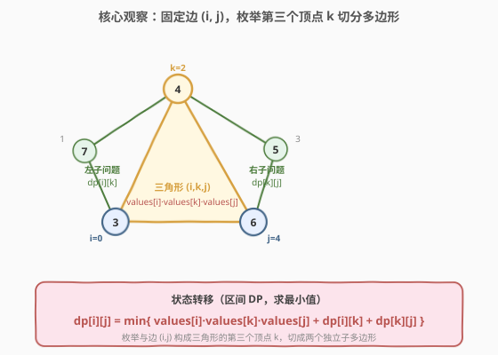
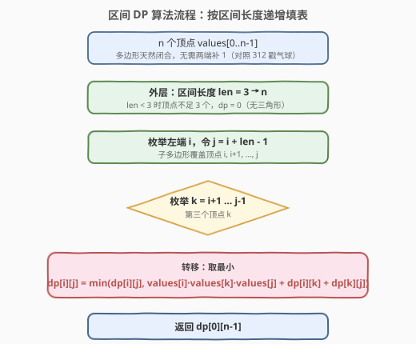

# LeetCode 多边形三角剖分的最低得分 题解

## 1. 题目概述

- **标题 / 题号**：多边形三角剖分的最低得分（#1039，medium）
- **链接**：https://leetcode.cn/problems/minimum-score-triangulation-of-polygon/
- **难度**：中等
- **标签**：数组、动态规划、区间 DP

**题意**：给定一个凸多边形，其顶点按顺时针顺序编号为 `0 ~ n-1`，每个顶点 `i` 上有一个整数值 `values[i]`。所谓**三角剖分**是指用一组**不相交的对角线**把多边形划分成若干个三角形。每个三角形的**得分**等于其三个顶点值之乘积，整个剖分的**得分**等于所有三角形得分之和。返回所有可能三角剖分中得分的**最小值**。

> **三角剖分**：$n$ 边形（$n \geq 3$）的任意一种三角剖分恰好产生 $n - 2$ 个三角形、用到 $n - 3$ 条对角线。

**示例 1**：

```text
输入：values = [1,2,3]
输出：6
解释：三角形只有 1 个（顶点 0、1、2），得分 = 1·2·3 = 6。
```

**示例 2**：

```text
输入：values = [3,7,4,5]
输出：144
解释：四边形有两种剖分：
  剖分 A：对角线 0-2 → 三角形 (0,1,2) 与 (0,2,3)，得分 3·7·4 + 3·4·5 = 84 + 60 = 144
  剖分 B：对角线 1-3 → 三角形 (1,2,3) 与 (0,1,3)，得分 7·4·5 + 3·7·5 = 140 + 105 = 245
  取最小值 144。
```

**约束**：

- $n = \text{values.length}$
- $3 \leq n \leq 50$
- $1 \leq \text{values[i]} \leq 100$

## 2. 解题思路

### 2.1 暴力思路：枚举所有剖分

最直接的做法是枚举所有三角剖分方案。$n$ 边形的三角剖分数目为**卡特兰数** $C_{n-2}$，当 $n = 50$ 时 $C_{48}$ 已是天文数字，必然超时。

困难与 [312. 戳气球](../0301-0400/312_戳气球.md) 如出一辙：一旦画下一条对角线 $(i, k)$，多边形就被切成两半，两半各自继续剖分——这天然是**分治**结构。关键在于如何定义状态，让切分后的子问题彼此独立。

### 2.2 核心观察：固定一条边，枚举第三个顶点 + 区间 DP



破局点在于**聚焦一条边 $(i, j)$**：在任何一种三角剖分中，边 $(i, j)$ 一定恰好属于**某一个三角形**。设该三角形的第三个顶点为 $k$（$i < k < j$），那么这个三角形 $(i, k, j)$ 把原多边形沿对角线 $(i, k)$、$(k, j)$ 切成了三部分：

1. 三角形 $(i, k, j)$ 本身，得分 $\text{values}[i] \cdot \text{values}[k] \cdot \text{values}[j]$；
2. 顶点链 $i, i+1, \ldots, k$ 构成的子多边形（含边 $(i, k)$）；
3. 顶点链 $k, k+1, \ldots, j$ 构成的子多边形（含边 $(k, j)$）。

后两部分**完全独立**（共享顶点 $k$ 但互不干扰），可分别求最小得分。这就得到了区间 DP。

> 💡 **与 312 戳气球的高度同构**：312 是「开区间 $(i,j)$ 内最后戳的气球 $k$，贡献 $\text{val}[i]\text{val}[k]\text{val}[j]$」；本题是「边 $(i,j)$ 所属三角形的第三顶点 $k$，贡献 $\text{values}[i]\text{values}[k]\text{values}[j]$」。骨架几乎一致，只是 312 求最大、两端补 1，本题求最小、无需补 1。

> ⚠️ **为何本题不用两端补 1？** 312 的「越界邻居视为 1」是人为规则，需补 1 统一边界；而凸多边形的边 $(0, n-1)$ 本身就是真实边——顶点 $0$ 与 $n-1$ 天然相邻，无需任何虚拟顶点。状态直接定义为闭区间 $[i, j]$ 即可。

**状态定义**：

$$\text{dp}[i][j] = \text{对顶点 } i, i+1, \ldots, j \text{ 构成的子多边形进行三角剖分的最小得分},\quad 0 \le i < j \le n-1$$

**状态转移**（枚举与边 $(i, j)$ 构成三角形的第三个顶点 $k$）：

$$\text{dp}[i][j] = \min_{i < k < j} \Big\{\, \text{values}[i]\cdot\text{values}[k]\cdot\text{values}[j] + \text{dp}[i][k] + \text{dp}[k][j] \,\Big\}$$

**边界**：当 $j - i < 2$ 时顶点不足 3 个，无法构成三角形，$\text{dp}[i][j] = 0$。

**答案**：$\text{dp}[0][n-1]$（整个多边形，边 $(0, n-1)$ 是其真实边）。

### 2.3 算法流程图



核心是**按区间长度递增**填表：$\text{dp}[i][j]$ 依赖更短的子区间 $[i, k]$ 与 $[k, j]$，二者长度都严格小于 $j - i + 1$。外层按 `len` 从小到大遍历，保证转移时子状态已就绪——这是区间 DP 通用遍历范式。

1. `n` 个顶点 `values[0..n-1]`，无需补 1。
2. 按 `len = 3 … n` 枚举区间长度（`len < 3` 时 `dp = 0`，跳过）。
3. 对每个左端 `i`，令 `j = i + len - 1`。
4. 枚举第三个顶点 `k = i+1 … j-1`。
5. 转移：$\text{dp}[i][j] = \min(\text{dp}[i][j],\ \text{values}[i]\cdot\text{values}[k]\cdot\text{values}[j] + \text{dp}[i][k] + \text{dp}[k][j])$。
6. 返回 $\text{dp}[0][n-1]$。

### 2.4 示例演算

![示例演算：values = [3,7,4,5]](../images/polygon_triangulation_example.svg)

以 `values = [3,7,4,5]`（$n = 4$，四边形）为例。四边形只有两种三角剖分，对应边 $(0, 3)$ 所属三角形的第三顶点 $k = 1$ 或 $k = 2$。按下表填充 `dp`（只列 $j \geq i + 2$ 的有效格）：

| 区间长度 | $(i, j)$ | 枚举 $k$ 的取值 | $\text{dp}[i][j]$ | 选定 $k$ |
|----------|----------|-----------------|-------------------|----------|
| 3 | $(0, 2)$ | $k=1$：$3\cdot7\cdot4 = 84$ | $84$ | $1$ |
| 3 | $(1, 3)$ | $k=2$：$7\cdot4\cdot5 = 140$ | $140$ | $2$ |
| 4 | $(0, 3)$ | $k=1$：$0 + \text{dp}[1][3] + 3\cdot7\cdot5 = 0 + 140 + 105 = 245$；$k=2$：$\text{dp}[0][2] + 0 + 3\cdot4\cdot5 = 84 + 0 + 60 = 144$ | $\mathbf{144}$ | $2$ |

> 💡 **$k=1$ 时**：三角形 $(0,1,3)$ 得分 $3\cdot7\cdot5 = 105$，剩余顶点链 $\{1,2,3\}$ 是子多边形 $[1,3]$，得分 $\text{dp}[1][3] = 140$；链 $\{0,1\}$ 只有 2 个顶点，$\text{dp}[0][1] = 0$。合计 $245$。
>
> **$k=2$ 时**：三角形 $(0,2,3)$ 得分 $3\cdot4\cdot5 = 60$，剩余链 $\{0,1,2\}$ 是子多边形 $[0,2]$，得分 $\text{dp}[0][2] = 84$；链 $\{2,3\}$ 只有 2 个顶点，$\text{dp}[2][3] = 0$。合计 $144$。

取最小值 $\text{dp}[0][3] = 144$，即剖分 A（对角线 $0$-$2$）。

## 3. 参考代码

### C++

```cpp
class Solution {
  public:
    int minScoreTriangulation(vector<int>& values) {
        int n = values.size();
        // dp[i][j]：顶点 i..j 构成的子多边形的最小三角剖分得分
        vector<vector<int>> dp(n, vector<int>(n, 0));
        for (int len = 3; len <= n; ++len) {            // 区间长度
            for (int i = 0; i + len - 1 < n; ++i) {     // 左端
                int j = i + len - 1;                    // 右端
                dp[i][j] = INT_MAX;
                for (int k = i + 1; k < j; ++k) {       // 枚举第三个顶点 k
                    int cur = values[i] * values[k] * values[j]
                             + dp[i][k] + dp[k][j];
                    dp[i][j] = min(dp[i][j], cur);
                }
            }
        }
        return dp[0][n - 1];
    }
};
```

### Python

```python
class Solution:
    def minScoreTriangulation(self, values: List[int]) -> int:
        n = len(values)
        dp = [[0] * n for _ in range(n)]
        for length in range(3, n + 1):          # 区间长度
            for i in range(n - length + 1):     # 左端
                j = i + length - 1              # 右端
                dp[i][j] = min(
                    values[i] * values[k] * values[j] + dp[i][k] + dp[k][j]
                    for k in range(i + 1, j)    # 枚举第三个顶点 k
                )
        return dp[0][n - 1]
```

> ⚠️ **两个易错点**：
> 1. **`dp[i][j]` 初值置大**：C++ 中 `dp` 默认全 0，转移取 `min`，若不先把 `dp[i][j]` 设为 `INT_MAX`，`min` 恒为 0。Python 版用 `min(...)` 生成器表达式天然规避此问题。
> 2. **`len` 从 3 开始**：`len < 3`（即 $j - i < 2$）时顶点不足 3 个，无法构成三角形，`dp` 保持 0。这与 312 的「开区间为空」边界同源。

## 4. 复杂度分析

| 维度 | 复杂度 | 说明 |
|------|--------|------|
| 时间复杂度 | $O(n^3)$ | 三重循环：区间长度 $O(n)$ × 左端 $O(n)$ × 枚举 $k$ $O(n)$ |
| 空间复杂度 | $O(n^2)$ | $n \times n$ 的 DP 表 |

> 💡 $n = 50$ 时 $n^3 \approx 1.25\times10^5$，远低于时间限制，轻松通过。与 [312. 戳气球](../0301-0400/312_戳气球.md) 一样，区间 DP 的转移同时需要 $\text{dp}[i][k]$ 和 $\text{dp}[k][j]$ 两个方向，难以滚动降维，$O(n^2)$ 是此类问题的固有代价。

## 5. 扩展：记忆化搜索（自顶向下）

区间 DP 也可写成**自顶向下的分治 + 记忆化**：`dfs(i, j)` 表示子多边形 $[i, j]$ 的最小剖分得分，枚举第三个顶点 `k`，递归求解 $[i, k]$、$[k, j]$。逻辑与递推等价，且更贴近「边 $(i, j)$ 配第三顶点 $k$」的直觉。

### C++

```cpp
class Solution {
    vector<vector<int>> memo;
    vector<int>* vals;
  public:
    int minScoreTriangulation(vector<int>& values) {
        int n = values.size();
        memo.assign(n, vector<int>(n, -1));
        vals = &values;
        return dfs(0, n - 1);
    }
    int dfs(int i, int j) {
        if (j - i < 2) return 0;                  // 顶点不足 3 个
        if (memo[i][j] != -1) return memo[i][j];
        int best = INT_MAX;
        for (int k = i + 1; k < j; ++k) {
            int cur = (*vals)[i] * (*vals)[k] * (*vals)[j]
                      + dfs(i, k) + dfs(k, j);
            best = min(best, cur);
        }
        return memo[i][j] = best;
    }
};
```

> 💡 **递推 vs 记忆化**：递推无递归栈、常数更小；记忆化更直观、只算真正用到的状态。本题 $n = 50$ 递归深度极浅，两种写法都 AC，面试中**记忆化更易一遍写对**，可先写记忆化再优化为递推。

## 6. 面试要点

1. **为什么聚焦「一条边」而非「一条对角线」？**

   - 任意三角剖分中，多边形的每条**边**一定属于某个三角形（边不能被「跳过」）。而**对角线**是否出现取决于剖分方案。以边 $(i, j)$ 为切入点，能保证「该边必属于某三角形」，从而确定第三顶点 $k$ 并完成切分——状态转移干净无遗漏。

2. **为什么切分后的两个子多边形是独立的？**

   - 三角形 $(i, k, j)$ 的两条边 $(i, k)$、$(k, j)$ 是对角线，把原多边形分成「三角形本身 + 左链 $[i,k]$ + 右链 $[k,j]$」三块。左链与右链只在顶点 $k$ 相接，各自的剖分不会跨越 $k$ 影响对方，满足最优子结构与无后效性。

3. **与 [312. 戳气球](../0301-0400/312_戳气球.md) 有何异同？**

   - **同**：都是区间 DP，转移都是「枚举中间分点 $k$，贡献三元素乘积 + 左右子区间」，都按区间长度递增填表。
   - **异**：312 求最大、两端补 1（虚拟边界）、状态为**开区间**；本题求最小、无需补 1（多边形天然闭合）、状态为**闭区间**。本质都是「在区间内选一个分点，让左右子区间互不干扰」。

4. **`dp[i][j]` 为何取 `min` 而非 `max`？**

   - 题目求**最低得分**。同一子多边形有多种剖分，每种对应不同的 $k$，取所有 $k$ 中的最小得分。这与 312（求最大硬币）方向相反，但 DP 框架完全一致。

5. **能用记忆化搜索吗？和递推如何取舍？**

   - 能。`dfs(i, j)` 枚举 $k$ 递归，加 `memo`。逻辑等价递推，且只算实际用到的状态、更贴近直觉，面试常先写记忆化。递推无栈、常数小，追求性能时再换。$n = 50$ 两者均 AC。

6. **复杂度能优化到 $O(n^2)$ 吗？**

   - 经典区间 DP 为 $O(n^3)$。本题满足**四边形不等式**，最优分点 $k$ 关于区间端点单调，可用 **Knuth 优化**把内层 $k$ 的枚举从 $O(n)$ 摊到 $O(1)$，降到 $O(n^2)$。但证明复杂、面试不要求，掌握 $O(n^3)$ 模板足够。

## 同类练习题

| # | 题目 | 与本题的关联 |
|---|------|-------------|
| 312 | [戳气球](https://leetcode.cn/problems/burst-balloons/)（[题解](../0301-0400/312_戳气球.md)） | 区间 DP 经典，骨架与本题几乎一致——「最后戳的气球 $k$」对应「三角形的第三顶点 $k$」，三元素乘积贡献完全同构，对比求最大 vs 求最小、补 1 vs 不补 1 |
| 877 | [石子游戏](https://leetcode.cn/problems/stone-game/)（[题解](../0801-0900/877_石子游戏.md)） | 博弈型区间 DP，按「两端」而非「中间分点」切分区间，对比两种切分方式 |
| 1000 | [合并石头的最低成本](https://leetcode.cn/problems/minimum-cost-to-merge-stones/) | 区间 DP + 「k 堆合并」，状态需额外记录当前堆数维度，本题的进阶版 |
| 664 | [奇怪的打印机](https://leetcode.cn/problems/strange-printer/) | 区间 DP，按「首字符」分段，转移时讨论两端是否同色 |
| 375 | [猜数字大小 II](https://leetcode.cn/problems/guess-number-higher-or-lower-ii/) | 区间 DP + minimax，求最坏情况下最少代价，转移取 `max(左右)` |
